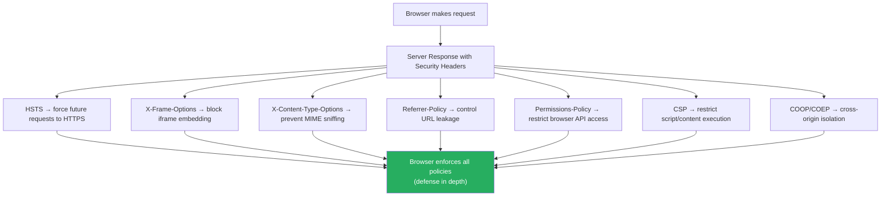

# 107 · Security Headers

> **HTTP security headers are server-side directives that instruct browsers to apply additional security controls to how they handle your application's content. They're a last line of defense — telling the browser "even if my application code makes a mistake, enforce these constraints" — and they're one of the lowest effort, highest impact security improvements available to any Next.js application. A one-time configuration in `next.config.js` can prevent entire categories of attacks: clickjacking, MIME-type sniffing attacks, protocol downgrade attacks, and unauthorized cross-origin embedding. This document covers the full security header stack, what each header does at the protocol level, and the exact Next.js configuration for each.**

Security headers are evaluated by security auditing tools (Mozilla Observatory, SecurityHeaders.com, Lighthouse), increasingly factor into enterprise procurement requirements, and are specifically checked during penetration testing. More importantly, they provide genuine protection: HSTS prevents protocol downgrade attacks that can expose HTTPS sessions, X-Frame-Options prevents clickjacking against your users, and Permissions-Policy restricts what browser APIs third-party scripts can access even if they're compromised.

---

## Table of Contents

- [Security Header Categories](#security-header-categories)
- [Strict-Transport-Security (HSTS)](#strict-transport-security-hsts)
- [X-Frame-Options](#x-frame-options)
- [X-Content-Type-Options](#x-content-type-options)
- [X-XSS-Protection (and why to disable it)](#x-xss-protection-and-why-to-disable-it)
- [Referrer-Policy](#referrer-policy)
- [Permissions-Policy](#permissions-policy)
- [Content-Security-Policy (recap and configuration)](#content-security-policy-recap-and-configuration)
- [Cross-Origin Headers: CORP, COEP, COOP](#cross-origin-headers-corp-coep-coop)
- [Configuring Security Headers in Next.js](#configuring-security-headers-in-nextjs)
- [Security Header Auditing Tools](#security-header-auditing-tools)
- [Headers for API Routes](#headers-for-api-routes)
- [Architecture Diagrams](#architecture-diagrams)
- [Good Practices](#good-practices)
- [Bad Practices](#bad-practices)
- [Mental Model](#mental-model)
- [Common Misconceptions](#common-misconceptions)
- [Exercises](#exercises)
- [Further Reading](#further-reading)

---

## Security Header Categories

```
TRANSPORT SECURITY:
  Strict-Transport-Security (HSTS)
  → Forces HTTPS; prevents protocol downgrade attacks

FRAMING PROTECTION:
  X-Frame-Options
  Content-Security-Policy: frame-ancestors
  → Prevents clickjacking (embedding your site in attacker's iframe)

CONTENT PROTECTION:
  X-Content-Type-Options
  → Prevents MIME-type sniffing attacks

INFORMATION CONTROL:
  Referrer-Policy
  → Controls how much URL info is sent to other sites

API / BROWSER FEATURE CONTROL:
  Permissions-Policy
  → Restricts which browser APIs the page and third-parties can use

CROSS-ORIGIN ISOLATION:
  Cross-Origin-Opener-Policy (COOP)
  Cross-Origin-Embedder-Policy (COEP)
  Cross-Origin-Resource-Policy (CORP)
  → Enables high-precision timers and SharedArrayBuffer;
    isolates your browsing context from cross-origin documents

CONTENT EXECUTION CONTROL:
  Content-Security-Policy (CSP)
  → Covered in depth in doc 104; configuration recap here
```

---

## Strict-Transport-Security (HSTS)

```
WHAT IT PROTECTS AGAINST:
  SSL Stripping / Protocol Downgrade Attacks:
  Without HSTS: a user types "bank.example.com" → browser makes an
  HTTP request (not HTTPS) → a network attacker intercepts this
  HTTP request and can serve a fake page or strip the HTTPS upgrade.

  With HSTS: the FIRST HTTPS response tells the browser "this site
  only works over HTTPS, for the next MAX-AGE seconds, always use
  HTTPS for this domain." Future requests go to HTTPS DIRECTLY
  from the browser, without an initial HTTP request that can be intercepted.

THE HEADER:
  Strict-Transport-Security: max-age=31536000; includeSubDomains; preload

  max-age: how long (in seconds) the browser remembers this policy
    31536000 = 1 year (recommended minimum for production)
    Starting lower (86400 = 1 day) is fine during initial rollout

  includeSubDomains: applies HSTS to ALL subdomains too
    Required if: you serve HTTPS on subdomains (api., admin., etc.)
    Potentially problematic if: a subdomain doesn't support HTTPS yet

  preload: signals intent to be included in browser HSTS preload lists
    Browsers ship with a built-in list of HSTS sites — even the
    FIRST request goes to HTTPS (no initial HTTP request at all).
    Submit at: https://hstspreload.org/
    PERMANENT: removal from the preload list takes months — only
    enable preload if you're committed to HTTPS-only permanently.

REQUIREMENTS FOR HSTS:
  ✅ The site must be reachable via HTTPS
  ✅ HTTPS must have a valid certificate (not self-signed)
  ✅ HTTP requests must redirect to HTTPS (already done by most hosting)
  ✅ All content must be served over HTTPS (no mixed content)
  BEFORE enabling includeSubDomains: verify ALL subdomains support HTTPS
```

---

## X-Frame-Options

```
WHAT IT PROTECTS AGAINST:
  CLICKJACKING: an attacker embeds your site in an invisible iframe
  over their page. The victim thinks they're clicking the attacker's
  UI but is actually clicking your site's buttons (submitting actions,
  enabling permissions, making purchases).

THE HEADER (legacy but still widely supported):
  X-Frame-Options: DENY
  → Your site cannot be embedded in ANY iframe, anywhere

  X-Frame-Options: SAMEORIGIN
  → Can only be embedded by pages on the same origin

  X-Frame-Options: ALLOW-FROM https://trusted.example.com
  → Only allow embedding from a specific origin
  (NOTE: ALLOW-FROM has poor browser support — use CSP frame-ancestors instead)

THE MODERN REPLACEMENT:
  Content-Security-Policy: frame-ancestors 'none';
  → Equivalent to X-Frame-Options: DENY

  Content-Security-Policy: frame-ancestors 'self' https://trusted.example.com;
  → More flexible, better supported in modern browsers

WHAT TO USE:
  Use BOTH X-Frame-Options AND CSP frame-ancestors for maximum compatibility:
  X-Frame-Options: DENY
  Content-Security-Policy: frame-ancestors 'none';
  (modern browsers use frame-ancestors; older browsers use X-Frame-Options)

LEGITIMATE IFRAME USE:
  If your site intentionally provides embeddable content (a widget,
  a checkout iframe, a documentation embed), use frame-ancestors with
  a specific allowlist instead of 'none'.
```

---

## X-Content-Type-Options

```
WHAT IT PROTECTS AGAINST:
  MIME TYPE SNIFFING ATTACKS:
  Browsers can try to "guess" the content type of a response, even
  if the server sends a specific Content-Type header. This behavior
  (called MIME sniffing) can be abused:

  If an attacker can upload a file with content that looks like JavaScript
  (but the server sends Content-Type: image/jpeg), some browsers might
  detect "this looks like JavaScript!" and execute it as a script —
  effectively bypassing upload restrictions.

THE HEADER:
  X-Content-Type-Options: nosniff

  Effect: browsers MUST respect the server's Content-Type header.
  If the server says it's an image, the browser treats it as an image —
  even if the bytes look like JavaScript to the browser's sniffer.

ALWAYS SET THIS HEADER:
  It has no downsides and prevents a class of attacks.
  If your server sends correct Content-Type headers (all frameworks do),
  this header just locks that in and prevents browser override.
```

---

## X-XSS-Protection (and why to disable it)

```
HISTORICAL CONTEXT:
  X-XSS-Protection was a browser (IE/Chrome/Safari) feature that
  attempted to detect and block reflected XSS attacks by scanning
  response content for suspicious patterns.

WHY TO DISABLE IT NOW:
  The XSS filter was found to INTRODUCE vulnerabilities rather than
  prevent them. Attackers could craft URLs that caused the filter to
  REMOVE LEGITIMATE content, creating XSS vulnerabilities that
  didn't exist otherwise. Modern browsers have removed the feature:
  - Chrome removed it in version 78 (2019)
  - Edge removed it in version 16 (2017)
  - Safari still has it but deprecated

THE CORRECT SETTING:
  X-XSS-Protection: 0
  (explicitly DISABLE the broken filter)

  OR simply omit the header — modern browsers ignore it.
  Setting it to "1; mode=block" is ACTIVELY HARMFUL for older browser
  versions that implement the buggy filter.

NOTE: Don't confuse this with CSP's XSS protection — CSP (with proper
nonces) is the correct modern approach to XSS prevention, not this legacy header.
```

---

## Referrer-Policy

```
WHAT IT CONTROLS:
  When a user clicks a link from your site to another site, the browser
  normally sends the Referer (sic) header containing the full URL of
  the page they were on. This leaks information about your URL structure,
  query parameters, and user paths.

  EXAMPLE INFORMATION LEAK:
  User is on: https://app.example.com/patient/12345/records?tab=medications
  User clicks a link to: https://analytics.external.com
  Without Referrer-Policy: the external site receives:
    Referer: https://app.example.com/patient/12345/records?tab=medications
  This leaks patient ID and current view to a third party.

THE HEADER AND VALUES:
  Referrer-Policy: no-referrer
  → Never send any referer information (most restrictive)

  Referrer-Policy: strict-origin-when-cross-origin (RECOMMENDED)
  → Same-origin requests: send the full URL
  → Cross-origin HTTPS→HTTPS: send only the origin (example.com)
  → Cross-origin HTTPS→HTTP: send nothing (downgrade protection)

  Referrer-Policy: same-origin
  → Only send referer for same-origin requests; nothing for cross-origin

  Referrer-Policy: no-referrer-when-downgrade
  → The old default; sends full URL unless HTTPS→HTTP
  → Leaks full URLs to third-party HTTPS sites

RECOMMENDATION: strict-origin-when-cross-origin
  This is the modern browser default for pages without an explicit policy,
  but setting it explicitly ensures consistent behavior across all browsers.
  It preserves referer for same-origin analytics while protecting
  URL details from cross-origin third parties.
```

---

## Permissions-Policy

```
WHAT IT CONTROLS:
  Browser APIs and hardware features that JavaScript can access.
  Without this header: any JavaScript on your page (including third-party
  scripts) can request: camera, microphone, geolocation, payment API,
  Bluetooth, USB, screen capture, etc.

THE HEADER:
  Permissions-Policy: camera=(), microphone=(), geolocation=()
  → Disables these features entirely (empty parentheses = no one can use)

  Permissions-Policy: camera=(self), microphone=()
  → Your own origin can use camera; microphone is disabled entirely

  Permissions-Policy: geolocation=(self "https://maps.example.com")
  → Your origin and a specific trusted origin can use geolocation

RECOMMENDED BASELINE (disable unused features):
  Permissions-Policy:
    accelerometer=(),
    camera=(),
    cross-origin-isolated=(),
    display-capture=(),
    encrypted-media=(),
    fullscreen=(),
    geolocation=(),
    gyroscope=(),
    keyboard-map=(),
    magnetometer=(),
    microphone=(),
    midi=(),
    payment=(),
    picture-in-picture=(),
    publickey-credentials-get=(),
    screen-wake-lock=(),
    sync-xhr=(),
    usb=(),
    xr-spatial-tracking=()

CUSTOMIZE based on what your app actually uses:
  If you use the Geolocation API for your core feature → add: geolocation=(self)
  If you embed a video player that needs fullscreen → add: fullscreen=(self)

WHY THIS MATTERS FOR THIRD-PARTY SCRIPTS:
  A compromised analytics or chat script could request access to the user's
  camera, microphone, or location — users might approve a prompt they don't
  understand. Permissions-Policy prevents the script from even REQUESTING
  these permissions if they're not in the allowlist.
```

---

## Content-Security-Policy (recap and configuration)

```
CSP was covered in depth in doc 104 (XSS & CSP). The configuration
reference for Next.js is here for completeness.

RECOMMENDED STRICT CSP FOR NEXT.JS (with nonces):
  Content-Security-Policy:
    default-src 'self';
    script-src 'nonce-{RANDOM}' 'strict-dynamic';
    style-src 'self' 'unsafe-inline';
    img-src 'self' data: https:;
    font-src 'self';
    connect-src 'self';
    frame-ancestors 'none';
    base-uri 'self';
    form-action 'self';
    upgrade-insecure-requests;
    block-all-mixed-content;

KEY ADDITIONS IN COMBINATION WITH OTHER HEADERS:
  frame-ancestors 'none' → replaces X-Frame-Options: DENY
  upgrade-insecure-requests → upgrades HTTP sub-resources to HTTPS
  block-all-mixed-content → blocks mixed content entirely

For the nonce implementation in Next.js middleware, see doc 104.
```

---

## Cross-Origin Headers: CORP, COEP, COOP

```
THESE THREE HEADERS ENABLE "CROSS-ORIGIN ISOLATION" — required for:
  - SharedArrayBuffer (needed by WASM-based apps, advanced workers)
  - High-resolution timers (performance.now() with full precision)
  - Spectre/Meltdown mitigation (prevents timing side-channel attacks)

CROSS-ORIGIN-OPENER-POLICY (COOP):
  Cross-Origin-Opener-Policy: same-origin

  Isolates your browsing context from cross-origin windows.
  Prevents cross-origin popups from accessing your window object.
  Prevents you from accessing cross-origin popup windows.
  Required for cross-origin isolation.

  Values:
    unsafe-none (default): no isolation
    same-origin-allow-popups: isolated but popups can still interact
    same-origin: full isolation (required for cross-origin isolation)

CROSS-ORIGIN-EMBEDDER-POLICY (COEP):
  Cross-Origin-Embedder-Policy: require-corp

  Requires that any cross-origin resource loaded by your page explicitly
  opts in to being loaded cross-origin (via CORP header).
  Prevents your page from loading resources that haven't opted into
  cross-origin embedding — prevents certain data exfiltration attacks.
  Required for cross-origin isolation.

  Values:
    unsafe-none (default): no requirement
    require-corp: all loaded resources must have CORP or be same-origin
    credentialless: cross-origin resources can be loaded without credentials

CROSS-ORIGIN-RESOURCE-POLICY (CORP):
  Cross-Origin-Resource-Policy: same-origin

  Set on RESOURCES (images, fonts, scripts) you serve.
  Controls which origins can EMBED your resource in their pages.

  Values:
    same-site: only same-site pages can embed this resource
    same-origin: only same-origin pages can embed this resource
    cross-origin: anyone can embed this resource (for public CDN assets)

CROSS-ORIGIN ISOLATION SETUP:
  For your Next.js app to be "cross-origin isolated":
  1. Set COOP: same-origin on all page responses
  2. Set COEP: require-corp on all page responses
  3. Ensure all cross-origin resources your page loads have CORP: cross-origin
     (or serve them from the same origin)

  CHECK: document.crossOriginIsolated === true (in browser console)
  This confirms the page is fully isolated and can use SharedArrayBuffer.
```

---

## Configuring Security Headers in Next.js

```js
// next.config.js — the complete security header configuration

/** @type {import('next').NextConfig} */
const nextConfig = {
  async headers() {
    return [
      {
        // Apply these headers to ALL routes:
        source: "/(.*)",
        headers: [
          // HSTS: HTTPS only, 1 year, include subdomains
          {
            key: "Strict-Transport-Security",
            value: "max-age=31536000; includeSubDomains",
            // Add '; preload' ONLY after verifying all subdomains support HTTPS
            // and submitting to hstspreload.org
          },
          // No MIME type sniffing:
          {
            key: "X-Content-Type-Options",
            value: "nosniff",
          },
          // Disable the broken legacy XSS filter:
          {
            key: "X-XSS-Protection",
            value: "0",
          },
          // Prevent iframe embedding (clickjacking protection):
          {
            key: "X-Frame-Options",
            value: "DENY",
            // Remove if using CSP frame-ancestors (they're redundant)
          },
          // Control referrer information:
          {
            key: "Referrer-Policy",
            value: "strict-origin-when-cross-origin",
          },
          // Restrict browser feature access:
          {
            key: "Permissions-Policy",
            value: [
              "camera=()",
              "microphone=()",
              "geolocation=()",
              "payment=()",
              "usb=()",
              "accelerometer=()",
              "gyroscope=()",
              "magnetometer=()",
              "display-capture=()",
            ].join(", "),
          },
          // Cross-origin opener isolation:
          {
            key: "Cross-Origin-Opener-Policy",
            value: "same-origin",
            // CAUTION: breaks OAuth popups and some third-party auth flows
            // Use 'same-origin-allow-popups' if OAuth popup flows are needed
          },
          // NOTE: CSP is set in middleware.ts (needs dynamic nonces)
          // Static headers() cannot contain nonces — they must be
          // generated per-request in middleware.
        ],
      },
      {
        // Additional headers for API routes:
        source: "/api/(.*)",
        headers: [
          {
            key: "Cache-Control",
            value: "no-store", // API responses shouldn't be cached by default
          },
          {
            key: "Cross-Origin-Resource-Policy",
            value: "same-origin", // API responses are for same-origin only
          },
        ],
      },
      {
        // Public assets (images, fonts) can be cross-origin:
        source: "/_next/static/(.*)",
        headers: [
          {
            key: "Cross-Origin-Resource-Policy",
            value: "cross-origin", // CDN delivery requires cross-origin
          },
          {
            key: "Cache-Control",
            value: "public, max-age=31536000, immutable", // long cache for hashed assets
          },
        ],
      },
    ];
  },
};

module.exports = nextConfig;
```

---

## Security Header Auditing Tools

```
1. MOZILLA OBSERVATORY (https://observatory.mozilla.org)
   - Free, comprehensive security header analysis
   - Grades from A+ to F
   - Specific recommendations for each missing/misconfigured header
   - Test both from the command line and web UI:
     npx observatory example.com

2. SECURITYHEADERS.COM (https://securityheaders.com)
   - Another header-focused scanner
   - Quick visual report of which headers are present/missing
   - Detailed explanation for each header

3. LIGHTHOUSE (Chrome DevTools / CI)
   - Built-in to Chrome DevTools
   - Includes some security checks (CSP, HTTPS)
   - Run via CLI: npx lighthouse https://example.com --only-categories=best-practices

4. OWASP ZAP (https://www.zaproxy.org/)
   - Full security scanner, not just headers
   - Can be integrated into CI/CD for automated security testing
   - Free and open source

5. CHECKING IN CODE:
   // Test that headers are set correctly in your integration tests:
   test('security headers are present', async () => {
     const response = await fetch('http://localhost:3000/');
     expect(response.headers.get('strict-transport-security')).toBeTruthy();
     expect(response.headers.get('x-content-type-options')).toBe('nosniff');
     expect(response.headers.get('x-frame-options')).toBe('DENY');
     expect(response.headers.get('referrer-policy')).toBeTruthy();
   });
```

---

## Headers for API Routes

```tsx
// API Route Handlers can set headers directly:
// app/api/data/route.ts

export async function GET(request: Request) {
  const data = await fetchData();

  return Response.json(data, {
    headers: {
      // Prevent caching of sensitive data:
      "Cache-Control": "no-store, no-cache, must-revalidate",
      // Tell browsers this is JSON, not HTML (prevents injection in some contexts):
      "Content-Type": "application/json",
      // API responses shouldn't be embedded cross-origin:
      "Cross-Origin-Resource-Policy": "same-origin",
      // Rate limiting feedback headers (optional but useful for clients):
      "X-RateLimit-Limit": "100",
      "X-RateLimit-Remaining": "99",
      "X-RateLimit-Reset": String(Math.floor(Date.now() / 1000) + 3600),
    },
  });
}

// WHAT NOT TO EXPOSE IN RESPONSE HEADERS:
// ❌ Server: Next.js 14.2.3    → technology fingerprinting
// ❌ X-Powered-By: Next.js     → same (Next.js removes this by default)
// ❌ X-Debug-Info: {...}        → debug information in production
// ❌ Stack traces in body       → use error monitoring services instead

// REMOVE THE X-POWERED-BY HEADER (Next.js does this automatically, but verify):
// next.config.js:
module.exports = {
  poweredByHeader: false, // removes X-Powered-By: Next.js header
};
```

---

## Architecture Diagrams

### Security header defense layers



---

## Good Practices

### ✅ Good Practice — Comprehensive, phased security header rollout

```js
/**
 * Good: A staged rollout strategy for security headers, starting with
 * lower-risk headers and monitoring for issues before adding stricter ones.
 * This prevents a big-bang rollout that breaks production features.
 */

// PHASE 1 (zero-risk headers — add immediately):
// X-Content-Type-Options: nosniff
// X-XSS-Protection: 0
// Referrer-Policy: strict-origin-when-cross-origin
// Permissions-Policy: camera=(), microphone=(), geolocation=()
// These have essentially no risk of breaking existing functionality.

// PHASE 2 (low-risk, verify subdomains first):
// Strict-Transport-Security: max-age=86400 (1 day)
// → Start with short max-age, increase to 31536000 over time

// PHASE 3 (moderate risk, test OAuth flows first):
// X-Frame-Options: DENY
// Cross-Origin-Opener-Policy: same-origin-allow-popups
// → Same-origin breaks OAuth popups — use allow-popups variant first

// PHASE 4 (requires CSP nonce implementation):
// Content-Security-Policy: [full nonce-based policy]
// → Use Report-Only mode first: Content-Security-Policy-Report-Only
// → Monitor violations for 1-2 weeks before switching to enforcing mode

// PHASE 5 (after full cross-origin isolation validation):
// Cross-Origin-Embedder-Policy: require-corp
// Cross-Origin-Resource-Policy: same-origin (for your resources)
// → Requires all loaded cross-origin resources to have CORP headers

// next.config.js implementing this phased approach:
const securityHeaders = [
  { key: "X-Content-Type-Options", value: "nosniff" },
  { key: "X-XSS-Protection", value: "0" },
  { key: "Referrer-Policy", value: "strict-origin-when-cross-origin" },
  {
    key: "Permissions-Policy",
    value: "camera=(), microphone=(), geolocation=()",
  },
  {
    key: "Strict-Transport-Security",
    // Start at 1 day; increase to 31536000 once confident:
    value: "max-age=86400; includeSubDomains",
  },
  { key: "X-Frame-Options", value: "DENY" },
];

module.exports = {
  async headers() {
    return [{ source: "/(.*)", headers: securityHeaders }];
  },
};
```

---

## Bad Practices

### ⚠️ Bad Practice — Setting `X-Frame-Options: ALLOW-FROM` and assuming COOP compatibility

```js
/**
 * Bad: Using the deprecated ALLOW-FROM value for X-Frame-Options,
 * and blindly setting same-origin COOP without testing OAuth flows.
 */

// ❌ X-Frame-Options: ALLOW-FROM (deprecated, poor browser support)
{
  key: 'X-Frame-Options',
  value: 'ALLOW-FROM https://trusted-embedder.example.com',
}
// Chrome, Edge, and Firefox have dropped ALLOW-FROM support.
// It's ignored in modern browsers — your framing restriction doesn't work.
// ✅ Fix: use CSP frame-ancestors instead:
// Content-Security-Policy: frame-ancestors 'self' https://trusted-embedder.example.com;

// ❌ Setting COOP: same-origin without testing OAuth popup flows:
{
  key: 'Cross-Origin-Opener-Policy',
  value: 'same-origin',
}
// If your app uses OAuth (Google Sign-In, GitHub login, etc.) via POPUP windows,
// COOP: same-origin breaks the popup communication — the popup can no longer
// send a postMessage back to the opener window after the OAuth flow.
// Symptom: OAuth login opens a popup, user authenticates,
// popup closes, but the parent window doesn't receive the auth callback.
// ✅ Fix (if you need OAuth popups):
{
  key: 'Cross-Origin-Opener-Policy',
  value: 'same-origin-allow-popups', // preserves popup communication
}
// Test ALL auth flows before deploying COOP: same-origin.

/**
 * GENERAL BAD PRACTICE: setting security headers without testing.
 * Each header can break specific functionality:
 * - CSP: breaks inline scripts, eval(), some CDN scripts
 * - HSTS: permanently removes ability to serve HTTP (be careful with preload)
 * - COEP: requires all cross-origin resources to have CORP headers
 * - COOP: breaks OAuth popup flows
 * Always test in a staging environment + use Report-Only mode for CSP.
 */
```

---

## Mental Model

> 💡 **The security headers mental model:**
>
> Security headers are like **the rules of your building's security policy posted at every entrance** — they tell visitors and occupants what's allowed before they even step inside. HSTS is the rule that says "this building is only accessible through the verified, secured main entrance — don't use the back door (HTTP) even if someone directs you there." X-Frame-Options is the rule that says "no one else can put a window into this building inside their own building (iframe embedding) — what you see is always our walls." Permissions-Policy is the sign that says "no recording equipment allowed inside, regardless of who you are or who you work for" — even the security company (third-party analytics) can't bring in a camera (camera API access) if the policy says no. The value of security headers isn't that they stop all attacks — it's that they turn what would otherwise be a locksmith's problem (finding the key to exploit a specific vulnerability) into an engineer's problem (working within clearly defined constraints that apply uniformly to everyone, attackers included).

---

## Common Misconceptions

### "Security headers are set once and forgotten"

Security headers require regular review as your application evolves. Adding a new CDN, a new third-party script, or a new OAuth provider can require updating CSP, CORP, or COOP headers. Automated header scanning in CI helps detect regressions.

### "HSTS with max-age=31536000 can be reverted if needed"

Once a browser has received an HSTS header with a long max-age, it will ONLY connect to HTTPS for that duration — you cannot send an HTTP response to change this (the browser won't make an HTTP request). If you need to serve HTTP (e.g., you let your SSL certificate expire), users who received the HSTS header will see a browser error and cannot override it. Start with short max-age values and increase gradually.

### "Setting all security headers to maximum strictness is always best"

Overly strict headers break legitimate functionality. COOP: same-origin breaks OAuth popups. COEP: require-corp breaks loading of cross-origin images without CORP headers. CSP without proper nonces breaks Next.js's inline scripts. Start with sensible defaults and tighten incrementally after testing.

### "X-Frame-Options: SAMEORIGIN prevents all clickjacking"

SAMEORIGIN prevents embedding from OTHER origins but allows embedding from the SAME origin. If your site has a subdomain (attacker.yoursite.com — possible if you allow user subdomains), SAMEORIGIN doesn't protect against embedding from there. For maximum protection, use DENY or CSP `frame-ancestors 'none'`.

### "These headers only matter for public-facing websites"

Internal tools, admin panels, and APIs are equally subject to attacks via stolen credentials or insider threats. Security headers on internal applications protect against: an attacker who has an employee's session cookies (HSTS, CSP), a phishing attack that impersonates the internal tool (X-Frame-Options), and sensitive data leaking to external services (Referrer-Policy).

---

## Exercises

### Exercise 1 — Score your current application

Run your Next.js application through:

1. Mozilla Observatory (https://observatory.mozilla.org)
2. SecurityHeaders.com
3. Document the current score and which headers are missing
4. Set a target score (A or A+) and identify the specific headers needed

### Exercise 2 — Implement the full security header stack

Add all security headers from this document to a Next.js project's `next.config.js`. Verify each:

1. Use browser DevTools → Network tab → click any request → Response Headers
2. Confirm each header is present with the correct value
3. Test for regressions: verify all auth flows still work (especially if using OAuth)
4. Re-run the Observatory scan to verify your score improved

### Exercise 3 — CSP Report-Only → Enforcing migration

1. Add `Content-Security-Policy-Report-Only` with a nonce-based policy
2. Add a reporting endpoint (`/api/csp-report`) that logs violations
3. Monitor for 1 week and fix any legitimate violations (adjust the policy as needed)
4. Switch to enforcing `Content-Security-Policy` once violations are resolved

---

## Further Reading

- [Mozilla Observatory](https://observatory.mozilla.org/) — the most comprehensive free header scanner
- [MDN: HTTP Security Headers](https://developer.mozilla.org/en-US/docs/Web/HTTP/Headers) — MDN reference for every header
- [OWASP: Secure Headers Project](https://owasp.org/www-project-secure-headers/) — recommendations and a complete reference
- [web.dev: Security headers quick reference](https://web.dev/articles/security-headers) — Google's quick reference guide
- [hstspreload.org](https://hstspreload.org/) — HSTS preload list submission
- [Next.js docs: Security Headers](https://nextjs.org/docs/app/api-reference/config/next-config-js/headers) — official Next.js configuration reference
- Related in this handbook: [104 · XSS & CSP](./01-xss-csp.md), [105 · CSRF & Auth](./02-csrf-auth.md), [106 · Dependency Security](./03-dependency-security.md)

---

_Part of the [React + Next.js Engineering Handbook](../../README.md)_
