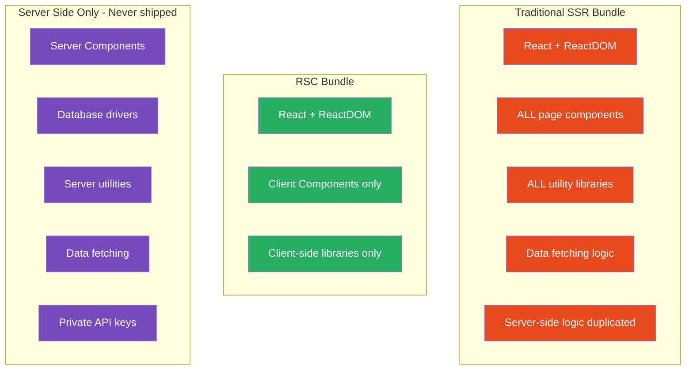
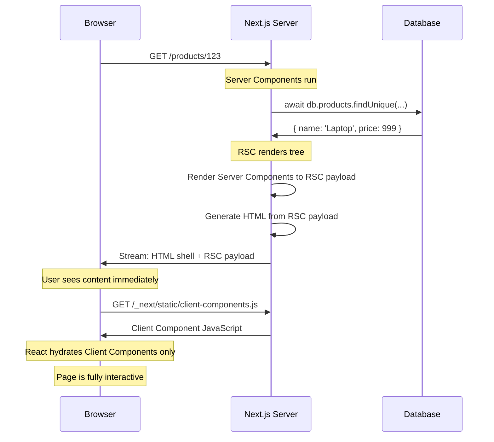

# 45 · What Are React Server Components

> **React Server Components (RSC) are React components that render exclusively on the server and never ship their code to the client. They are not "SSR" — traditional SSR renders components on the server but sends the JavaScript to the client for hydration. Server Components produce output (HTML and the RSC payload) without ever executing in the browser. This distinction makes them the most significant architectural addition to React since Hooks.**

The phrase "Server Components" is misleading to developers who already know Server-Side Rendering. Both terms involve servers and components — but they describe fundamentally different things. Understanding the difference, the architecture that makes RSC possible, and the precise boundary between server and client is the foundation for every other concept in the Next.js App Router.

---

## Table of Contents

- [RSC vs SSR: The Critical Distinction](#rsc-vs-ssr-the-critical-distinction)
- [What Server Components Actually Do](#what-server-components-actually-do)
- [The RSC Wire Format](#the-rsc-wire-format)
- [How the Browser Receives RSC Output](#how-the-browser-receives-rsc-output)
- [The Server/Client Boundary](#the-serverclient-boundary)
- [What Server Components Can and Cannot Do](#what-server-components-can-and-cannot-do)
- [What Client Components Can and Cannot Do](#what-client-components-can-and-cannot-do)
- [The Composition Model](#the-composition-model)
- [When to Use Each Component Type](#when-to-use-each-component-type)
- [Server Components and the Bundle](#server-components-and-the-bundle)
- [Server Components and Data Fetching](#server-components-and-data-fetching)
- [RSC and Hydration](#rsc-and-hydration)
- [The 'use client' Directive](#the-use-client-directive)
- [The 'use server' Directive](#the-use-server-directive)
- [Architecture Diagrams](#architecture-diagrams)
- [Good Practices](#good-practices)
- [Bad Practices](#bad-practices)
- [Mental Model](#mental-model)
- [Common Misconceptions](#common-misconceptions)
- [Exercises](#exercises)
- [Further Reading](#further-reading)

---

## RSC vs SSR: The Critical Distinction

Traditional SSR (Next.js Pages Router, Remix, etc.) and React Server Components solve different problems:

### Traditional SSR

```
Goal: Send HTML to the browser quickly (SEO, FCP)
Process:
  1. Server renders React components to HTML string (renderToString)
  2. HTML sent to browser → user sees content immediately
  3. JavaScript bundle sent to browser (SAME code as server)
  4. React hydrates: re-runs component functions in browser
     → attaches event handlers
     → makes content interactive

Key: The component code runs TWICE (server and browser)
     The JavaScript bundle includes EVERY component's code
```

### React Server Components

```
Goal: Eliminate unnecessary client JavaScript entirely
Process:
  1. Server renders Server Components → produces RSC payload + HTML
  2. HTML sent to browser → user sees content
  3. Client bundle sent (smaller — only Client Components included)
  4. React hydrates ONLY Client Components
     → Server Component code NEVER runs in browser
     → Server Component code is NOT in the bundle

Key: Server Components run ONCE (server only)
     Server Component code NEVER reaches the browser
```

### The code footprint difference

```tsx
// Traditional SSR:
// This component's code is in the bundle even if it only formats data
function PriceDisplay({
  price,
  currency,
}: {
  price: number;
  currency: string;
}) {
  const formatted = new Intl.NumberFormat("en-US", {
    style: "currency",
    currency,
  }).format(price);

  return <span>{formatted}</span>;
}
// The Intl.NumberFormat code, the component code, everything is in the bundle

// RSC (Server Component):
// PriceDisplay is a Server Component — its code NEVER ships to the client
async function PriceDisplay({ productId }: { productId: string }) {
  const { price, currency } = await db.products.findUnique({
    where: { id: productId },
    select: { price: true, currency: true },
  });

  const formatted = new Intl.NumberFormat("en-US", {
    style: "currency",
    currency,
  }).format(price);

  return <span>{formatted}</span>;
}
// Bundle impact: ZERO. This code is never sent to the browser.
// The output is just: <span>$29.99</span>
```

---

## What Server Components Actually Do

A React Server Component is an async function that returns JSX. When it runs on the server:

1. It can access server-side resources (database, file system, environment variables)
2. It renders its JSX output
3. The output is serialized into the RSC wire format
4. That serialized output is sent to the browser
5. The browser's React runtime reconstructs the component tree from the serialized output
6. Server Component code is never included in this process — only the output

```tsx
// Server Component (no 'use client' directive = server by default in App Router)
async function ProductCard({ productId }: { productId: string }) {
  // Step 1: Access server-side resource directly
  const product = await db.products.findUnique({
    where: { id: productId },
    select: { name: true, price: true, imageUrl: true },
  });

  if (!product) return null;

  // Step 2: Render JSX
  return (
    <div className="card">
      
      <h2>{product.name}</h2>
      <span>${product.price}</span>
    </div>
  );
}

// What the server actually sends (the RSC payload, simplified):
// ["$","div",null,{"className":"card","children":[
//   ["$","img",null,{"src":"/img/laptop.jpg","alt":"Laptop"}],
//   ["$","h2",null,{"children":"Laptop"}],
//   ["$","span",null,{"children":"$999"}]
// ]}]

// The database query, the db import, the productId — all server-only
// The browser only receives: <div class="card">...</div>
```

---

## The RSC Wire Format

React Server Components output a serialized format (not raw HTML) that the client React runtime can process:

```
RSC Payload format (conceptual):
  ["$","div",null,{"className":"product","children":[
    ["$","h1",null,{"children":"Laptop Pro"}],
    ["$","span",null,{"children":"$999"}],
    ["$","ClientComponent",{"key":null,"$$typeof":"$Creact.element"},
      {"id":"laptop-123","onAdd":"$$ACTION_0"}
    ]
  ]}]

Where:
  "$" prefix = React element
  "div", "h1", "span" = host elements (DOM)
  "ClientComponent" = a client component reference (not the component itself)
  "$$ACTION_0" = a Server Action reference (callable from client)
```

### Why RSC uses its own format instead of HTML

HTML alone is insufficient because:

1. Client Components need to be re-rendered with React — HTML can't represent their future re-renders
2. Server Actions need to be callable from the client
3. React state (for Client Components) needs to be threaded through
4. Streaming chunks need to be assembled in the correct order

The RSC payload is a React-specific protocol that carries:

- The rendered output of Server Components (as element descriptors)
- References to Client Component bundles (not the code — just references)
- Server Action function references
- Data that Client Components need to hydrate

---

## How the Browser Receives RSC Output

On initial page load, the browser receives two things:

### 1. The HTML shell (for fast initial display)

```html
<!-- Sent immediately via streaming HTTP -->
<!DOCTYPE html>
<html>
  <head>
    <title>Product Page</title>
    <!-- Script tags for client bundles -->
    <script src="/_next/static/chunks/main.js" defer></script>
  </head>
  <body>
    <div id="__NEXT_DATA__" style="display:none"><!-- RSC payload --></div>
    <div id="root">
      <!-- Server-rendered HTML for immediate display -->
      <div class="product">
        
        <h1>Laptop Pro</h1>
        <span>$999</span>
        <button>Add to Cart</button>
        <!-- from Client Component -->
      </div>
    </div>
    <!-- RSC chunks streamed in as Suspense boundaries resolve -->
  </body>
</html>
```

### 2. The RSC payload (for React's tree reconciliation)

```
RSC payload (embedded in HTML as JSON or streamed separately):
  Describes the React component tree
  References client components by chunk ID
  Contains the data needed for hydration
```

### On client-side navigation

After initial load, clicking a Link doesn't re-fetch the full HTML. Instead:

```
User clicks <Link href="/products/456">

Browser:
  1. Fetches RSC payload for /products/456
     (a JSON-like stream, NOT a full HTML page)
  2. React processes the RSC payload
  3. Updates the component tree
  4. Client components re-render where needed
  5. No page reload, no HTML re-parse
```

This is why Next.js navigation feels instant even for server-rendered pages — subsequent navigations fetch lightweight RSC payloads, not full HTML documents.

---

## The Server/Client Boundary

The boundary between Server and Client Components is explicit in Next.js App Router:

```tsx
// No directive = Server Component (default in App Router)
async function ServerComponent() {
  const data = await db.getData();
  return <div>{data.value}</div>;
}

// 'use client' = Client Component
("use client");
function ClientComponent() {
  const [count, setCount] = useState(0);
  return <button onClick={() => setCount((c) => c + 1)}>{count}</button>;
}
```

### The boundary is a compilation boundary, not a runtime boundary

`'use client'` tells the React compiler/bundler:

- "Everything imported into this file is also a Client Component"
- "This file starts a client component subtree"
- "Create a separate JavaScript chunk for this module"

The actual server/client split is made at build time by the bundler — not at runtime by React.

### Propagation rules

```
'use client' propagates DOWN the import tree:

// client-component.tsx
'use client';
import { ChildA } from './child-a'; // ← also becomes client component
import { ChildB } from './child-b'; // ← also becomes client component

// Both ChildA and ChildB are now in the client bundle
// even if they don't have 'use client' themselves
```

```
But: passing Server Components as children to Client Components WORKS

// Server Component can pass Server Component children to Client Components
// via the children prop or other React node props

// server-layout.tsx (Server Component)
async function Layout() {
  return (
    <ClientWrapper>
      <ServerContent /> {/* Server Component as children */}
    </ClientWrapper>
  );
}

// 'use client'
// ClientWrapper.tsx (Client Component)
function ClientWrapper({ children }: { children: React.ReactNode }) {
  const [open, setOpen] = useState(false);
  return (
    <div onClick={() => setOpen(o => !o)}>
      {children} {/* Server Component rendered here — but on SERVER */}
    </div>
  );
}
```

---

## What Server Components Can and Cannot Do

### Can do:

```tsx
// ✅ Async/await (direct database access)
const product = await db.products.findUnique({ where: { id } });

// ✅ Read server environment variables (including secrets)
const apiKey = process.env.PRIVATE_API_KEY; // never exposed to client

// ✅ Access the file system
import { readFile } from "fs/promises";
const content = await readFile("./data.json", "utf8");

// ✅ Import large server-side libraries (not in bundle)
import { parse } from "marked"; // Markdown parser — 0KB in client bundle
const html = parse(markdownContent);

// ✅ Use any Node.js API
import { createHash } from "crypto";
const hash = createHash("sha256").update(data).digest("hex");

// ✅ Perform expensive computation (runs on server, not user's device)
const result = expensiveAlgorithm(largeDataset);

// ✅ Access request headers and cookies (via next/headers)
import { headers, cookies } from "next/headers";
const userAgent = headers().get("user-agent");
const token = cookies().get("session")?.value;
```

### Cannot do:

```tsx
// ❌ useState
const [count, setCount] = useState(0); // Error: Server Components cannot use hooks

// ❌ useEffect
useEffect(() => { /* ... */ }, []); // Error: hooks not available

// ❌ Browser APIs
document.getElementById('element'); // Error: document is not defined
window.localStorage.getItem('key'); // Error: window is not defined

// ❌ Event handlers directly in JSX
return <button onClick={() => {}}> // Error: event handlers not serializable
// (but can pass Server Actions or handlers to Client Components)

// ❌ Context (as consumer — can create and provide context in Client Components)
const theme = useContext(ThemeContext); // Error: cannot call hooks

// ❌ forwardRef, useImperativeHandle
// These are client-side imperative patterns
```

---

## What Client Components Can and Cannot Do

### Can do (everything Server Components can't + more):

```tsx
"use client";

// ✅ All hooks
const [state, setState] = useState(0);
const value = useContext(MyContext);
useEffect(() => {
  /* ... */
}, []);
const ref = useRef(null);

// ✅ Browser APIs
const width = window.innerWidth;
const item = localStorage.getItem("key");

// ✅ Event handlers
<button onClick={() => handleClick()}>Click me</button>;

// ✅ Real-time subscriptions
useEffect(() => {
  const ws = new WebSocket("wss://...");
  ws.onmessage = (e) => setMessages((prev) => [...prev, e.data]);
  return () => ws.close();
}, []);
```

### Cannot do that Server Components can:

```tsx
"use client";

// ❌ Cannot be async
async function ClientComponent() {
  // Error: async Client Components not supported
  const data = await fetchData(); // doesn't work as async component
}

// ❌ Cannot directly access databases
const data = await db.getData(); // db is not available in browser

// ❌ Cannot use server-only environment variables safely
// (they'd be included in the client bundle)
const apiKey = process.env.PRIVATE_API_KEY; // ← exposed to browser!

// ❌ Cannot use 'use server' (Server Actions can be used FROM client components,
// but 'use server' cannot be at the top of a client component file)
```

---

## The Composition Model

The power of RSC is in how Server and Client Components compose:

### Pattern 1: Server Component provides data to Client Component

```tsx
// Server Component (parent): fetches data
async function ProductSection({ productId }: { productId: string }) {
  const product = await db.products.findUnique({ where: { id: productId } });

  return (
    // Client Component (child): handles interactivity
    <AddToCartButton
      productId={product.id}
      productName={product.name}
      price={product.price}
    />
  );
}

// 'use client'
function AddToCartButton({ productId, productName, price }) {
  const [isAdding, setIsAdding] = useState(false);

  const handleAdd = async () => {
    setIsAdding(true);
    await addToCart({ productId, quantity: 1 });
    setIsAdding(false);
  };

  return (
    <button onClick={handleAdd} disabled={isAdding}>
      {isAdding ? "Adding..." : `Add ${productName} ($${price})`}
    </button>
  );
}
```

### Pattern 2: Client Component wrapper with Server Component children

```tsx
// Client Component: provides interactive wrapper
"use client";
function Accordion({
  title,
  children,
}: {
  title: string;
  children: React.ReactNode;
}) {
  const [isOpen, setIsOpen] = useState(false);
  return (
    <div>
      <button onClick={() => setIsOpen((o) => !o)}>{title}</button>
      {isOpen && <div>{children}</div>}
    </div>
  );
}

// Server Component: provides the content
async function FAQSection() {
  const faqs = await db.faqs.findMany();
  return (
    <div>
      {faqs.map((faq) => (
        <Accordion key={faq.id} title={faq.question}>
          {/* This is a Server Component rendered in a Client Component's slot */}
          <AnswerContent faqId={faq.id} />
        </Accordion>
      ))}
    </div>
  );
}

// Another Server Component — passed as children to Client Component
async function AnswerContent({ faqId }: { faqId: string }) {
  const answer = await db.answers.findUnique({ where: { faqId } });
  return <div dangerouslySetInnerHTML={{ __html: answer?.html ?? "" }} />;
}
```

### Pattern 3: Interleaving at any depth

```
Server                    Client           Server
  ↓                          ↓                ↓
Layout                AddToCartButton    SimilarProducts
  ↓                          ↓                ↓
ProductDetails        CartCounter        SimilarProduct (×5)
  ↓
PriceDisplay
```

This tree can be arbitrarily deep. Client component islands can contain Server component children (passed as children/slots). Server components can render Client components by importing them.

---

## When to Use Each Component Type

```
DEFAULT: Server Component
  Use when: showing data, rendering content, no user interaction needed
  Examples: Product details, blog posts, user profiles, data tables

USE CLIENT WHEN:
  ✅ useState or useReducer needed (counter, form state, toggle)
  ✅ useEffect needed (subscriptions, timers, animations)
  ✅ Event handlers needed (click, input, drag)
  ✅ Browser APIs needed (localStorage, geolocation, canvas)
  ✅ Third-party libraries that use React hooks or browser APIs
  ✅ Custom hooks that use any of the above

COMMON PATTERNS:
  Server: Data container        Client: Interactive leaf
  Server: Page layout           Client: Navigation toggle
  Server: Product listing       Client: Add to cart button
  Server: Article content       Client: Like/share buttons
  Server: Comment thread        Client: Comment form
```

---

## Server Components and the Bundle

The bundle impact of Server Components is one of their primary benefits:

```tsx
// Before RSC (Pages Router):
// EVERY component's code is in the client bundle

import { parse } from 'marked';         // 47KB — in bundle
import { highlight } from 'prismjs';    // 200KB — in bundle
import { unified } from 'unified';      // 45KB — in bundle
// Even though these only run for initial HTML rendering
// They're in the bundle for potential client-side re-renders

// After RSC (App Router):
// Server Component — these imports are NOT in the bundle
async function BlogPost({ slug }: { slug: string }) {
  const post = await db.posts.findUnique({ where: { slug } });
  const html = parse(post?.content ?? '');         // marked: 0KB in bundle
  const highlighted = highlight(html, ...);         // prismjs: 0KB in bundle
  return <article dangerouslySetInnerHTML={{ __html: highlighted }} />;
}
// Bundle impact: ZERO for all three libraries
// The HTML is pre-rendered on the server — no need for client re-rendering
```

### Bundle size comparison

```
Pages Router blog post:
  React + ReactDOM:      45KB
  Next.js client:        80KB
  marked (markdown):     47KB
  prismjs (syntax):     200KB
  unified (plugins):     45KB
  Page component:        12KB
  Total:                429KB gzipped

App Router blog post:
  React + ReactDOM:      45KB
  Next.js client:        30KB (smaller — no pages router code)
  marked:                 0KB (server only)
  prismjs:                0KB (server only)
  unified:                0KB (server only)
  Page component:         0KB (server only)
  Client components:      8KB (only interactive parts)
  Total:                 83KB gzipped (81% smaller)
```

---

## Server Components and Data Fetching

Server Components eliminate the client-server data-fetching waterfall:

### Before RSC (client-side data fetching):

```
Browser → GET /products/123 → Server sends HTML (no data)
Browser parses HTML, runs JavaScript
JavaScript → GET /api/products/123 → Server queries DB → returns JSON
JavaScript renders with data
User sees content

Total: 2 network round-trips, 1 DB query on server
Time to content: 500-1500ms
```

### With RSC:

```
Browser → GET /products/123 → Server: React renders, DB query runs
Server: complete HTML with data sent
Browser parses HTML, user sees content

Total: 1 network round-trip, 1 DB query on server
Time to content: 100-300ms
```

The data fetching is co-located with the component that displays it, runs before any HTML reaches the browser, and requires no API endpoint.

---

## RSC and Hydration

Server Components do NOT hydrate. This is the fundamental difference from SSR:

### Traditional SSR hydration

```
Server renders ALL components to HTML
Client receives HTML → displays immediately
Client downloads JS bundle (including ALL component code)
React hydrates: re-runs ALL component functions in browser
  → attaches event listeners to existing DOM nodes
  → marks tree as interactive

Hydration cost: proportional to total component count
```

### RSC hydration

```
Server renders Server Components → HTML
Client receives HTML → displays immediately
Client downloads JS bundle (Client Components ONLY)
React hydrates ONLY Client Components:
  → Server Component DOM nodes: already complete, no hydration needed
  → Client Component DOM nodes: hydrated normally

Hydration cost: proportional to CLIENT component count only
```

For a typical content page with 80% server components and 20% client components, hydration work is reduced by 80%.

---

## The 'use client' Directive

`'use client'` is a build-time directive (not a runtime hint) that tells the bundler where the server/client boundary is:

```tsx
// This line must be at the TOP of the file (before imports)
"use client";

import { useState } from "react";

export function Counter() {
  const [count, setCount] = useState(0);
  return <button onClick={() => setCount((c) => c + 1)}>{count}</button>;
}
```

### What 'use client' does at build time

```
1. Bundler identifies this file as a Client Component module
2. Creates a separate JavaScript chunk for this file and its imports
3. Generates a "module reference" — a pointer from server to client chunk
4. When a Server Component imports this: it gets the module reference,
   not the actual code

5. In the RSC payload: ["$","ClientComponent",{"$$id":"chunk-xyz","$$name":"Counter"}]
   (a reference to the chunk, not the code itself)

6. Client receives the payload → downloads chunk-xyz → hydrates Counter
```

---

## The 'use server' Directive

`'use server'` marks functions as Server Actions — callable from Client Components but executing on the server:

```tsx
// In a Server Component file:
async function ServerComponent() {
  async function handleSubmit(formData: FormData) {
    "use server";
    // This function runs on the server even when called from the client
    await db.form.create({ data: parseFormData(formData) });
    revalidatePath("/forms");
  }

  return (
    <form action={handleSubmit}>
      <input name="text" />
      <button>Submit</button>
    </form>
  );
}

// OR in a separate 'use server' file:
// actions.ts
("use server"); // marks ALL exports as Server Actions

export async function createForm(formData: FormData) {
  await db.form.create({ data: parseFormData(formData) });
  revalidatePath("/forms");
}

// 'use client'
// FormComponent.tsx
import { createForm } from "./actions";
function FormComponent() {
  return <form action={createForm}>...</form>;
}
```

### The relationship between 'use client' and 'use server'

```
'use client': marks the boundary FROM server TO client
  Everything in this file (and its imports) runs on the client

'use server': marks functions that run ON the server even when called from client
  These are the bridges back from client to server
  They cannot be called server-to-server (that's just regular async functions)

The mental model:
  Server World ←─── 'use server' functions ───→ Client World
  Client World ←─── 'use client' boundary ───→ Server World
```

---

## Architecture Diagrams

### RSC vs SSR: what ships to the browser



### RSC request lifecycle



---

## Good Practices

### ✅ Good Practice — Server Components as the default, Client Components as islands

```tsx
/**
 * Good: Server Component tree with minimal Client Component islands.
 * The page renders with real data immediately (no loading states for
 * the core content). Only truly interactive parts are client components.
 * Bundle is minimal — only interactive code ships.
 */

// app/products/[id]/page.tsx — Server Component (default)
async function ProductPage({ params }: { params: { id: string } }) {
  const [product, reviews, related] = await Promise.all([
    db.products.findUnique({ where: { id: params.id } }),
    db.reviews.findMany({ where: { productId: params.id }, take: 5 }),
    db.products.findMany({ where: { category: "electronics" }, take: 4 }),
  ]);

  if (!product) notFound();

  return (
    <div>
      {/* Server: static product info — no client JS */}
      <ProductInfo product={product} />

      {/* Client: requires useState for cart quantity selector */}
      <AddToCartSection
        productId={product.id}
        price={product.price}
        stock={product.stock}
      />

      {/* Server: static review display */}
      <ReviewList reviews={reviews} />

      {/* Client: requires useState for review form */}
      <ReviewForm productId={product.id} />

      {/* Server: related products — no interaction */}
      <RelatedProducts products={related} />
    </div>
  );
}

// Only interactive components need 'use client'
// ProductInfo, ReviewList, RelatedProducts are Server Components
// AddToCartSection, ReviewForm are Client Components
```

---

## Bad Practices

### ⚠️ Bad Practice — Making everything a Client Component

```tsx
/**
 * Bad: Marking entire pages or layouts as 'use client' unnecessarily.
 * This eliminates all RSC benefits:
 * - All data fetching must be client-side (waterfalls)
 * - All component code in the bundle (larger bundle)
 * - All hydration (slower TTI)
 * - No direct DB access (must go through API)
 *
 * Common cause: developer adds 'use client' to fix a hooks error
 * and doesn't realize they've opted out of server-side rendering
 * for the entire subtree.
 */

// ❌ Entire page is a Client Component
'use client';

function ProductPage({ params }: { params: { id: string } }) {
  const [product, setProduct] = useState(null);
  const [loading, setLoading] = useState(true);

  // ❌ Client-side data fetching: adds latency, exposes API
  useEffect(() => {
    fetch(`/api/products/${params.id}`)
      .then(r => r.json())
      .then(data => {
        setProduct(data);
        setLoading(false);
      });
  }, [params.id]);

  if (loading) return <div>Loading...</div>;
  return <div>{product?.name}</div>;
}

/**
 * ✅ Correct: Server Component with targeted Client Component islands
 */
// Server Component — no 'use client'
async function ProductPage({ params }: { params: { id: string } }) {
  const product = await db.products.findUnique({ where: { id: params.id } });
  if (!product) notFound();

  return (
    <div>
      {product.name}           {/* rendered on server, no client JS */}
      <AddToCart               {/* only the interactive part is client */}
        productId={product.id}
      />
    </div>
  );
}
```

**Production impact:** A team migrated from Pages Router to App Router but added `'use client'` to every component that had any interactivity. Their bundle size was identical to before the migration. Their API routes count doubled (because server components couldn't access the DB directly). Their LCP improved by only 100ms instead of the expected 800ms. The fix: audit `'use client'` usage, keep it only at the interactive leaf components, let parent containers be server components.

---

## Mental Model

> 💡 **The RSC mental model:**
>
> Think of React Server Components as a **printing press that produces newspapers**. The press (server) runs the full printing process — sourcing raw data (database), typesetting content (rendering), and printing the final pages (HTML). The printed newspaper (HTML/RSC payload) is delivered to readers (browsers). Readers don't need the printing press in their home — they just read the newspaper. Traditional SSR is like giving readers a photocopy of the printing press manual (the client bundle) "just in case they want to reprint something." RSC is like just delivering the newspaper — readers get the content without any press machinery. Client Components are the parts of the newspaper that readers can interact with — pull-out crossword puzzles (stateful widgets) that they can fill in themselves (useState). The press printed those puzzles too, but designed them to be filled in by the reader.

---

## Common Misconceptions

### "Server Components are the same as SSR"

SSR renders all components on the server once and sends both HTML and JavaScript. RSC renders some components on the server only — their JavaScript never ships. SSR is a rendering strategy; RSC is a component model.

### "Client Components don't render on the server"

Client Components DO render on the server for the initial page load (for SEO and fast FCP). The difference: they also hydrate on the client and can re-render. Server Components render on the server only and never re-render on the client.

### "'use client' makes a component run only on the client"

`'use client'` marks a component to run on BOTH server (for initial render) AND client (for hydration and future re-renders). It doesn't mean "skip server rendering for this component."

### "You can't use hooks in Server Components at all"

You can use server-compatible hooks in Server Components — like React's `cache()`, `use()` with Promises, and `useId()`. The hooks you can't use are the client-only ones: `useState`, `useEffect`, `useReducer`, `useRef` (for DOM), and `useContext` (as consumer).

### "Server Components are slower because they hit the database"

Server Components hit the database during the server render — before any HTML reaches the browser. The user sees data immediately upon HTML parse. Client components that hit an API (via useEffect) require an additional round-trip after the HTML has been displayed. Server Components are typically faster for initial data display.

---

## Exercises

### Exercise 1 — Inspect the RSC payload

```bash
# In any Next.js App Router application:
# 1. Open Chrome DevTools → Network tab
# 2. Navigate to a page (client-side navigation via Link)
# 3. Look for a fetch request to the page URL with Accept: text/x-component
# 4. Inspect the response — this is the RSC payload
# 5. Find the JSON-like structure
# 6. Identify: element descriptors, client component references, data
```

### Exercise 2 — Convert a client component to server component

Take a component that uses `useEffect` for data fetching:

```tsx
"use client";
function ProductList() {
  const [products, setProducts] = useState([]);
  useEffect(() => {
    fetch("/api/products")
      .then((r) => r.json())
      .then(setProducts);
  }, []);
  return (
    <ul>
      {products.map((p) => (
        <li key={p.id}>{p.name}</li>
      ))}
    </ul>
  );
}
```

Convert it to a Server Component:

1. Remove `'use client'`
2. Make it `async`
3. Fetch directly from DB (or keep using fetch if no DB access)
4. Verify: the component no longer appears in the browser's JavaScript

### Exercise 3 — Measure bundle size impact

1. Create a Next.js app with a markdown blog
2. Version A: markdown parser in a Client Component
3. Version B: markdown parser in a Server Component
4. Run `next build` for both
5. Compare bundle sizes in `.next/analyze/` (with `@next/bundle-analyzer`)
6. Calculate how much less JavaScript the user downloads

---

## Further Reading

- [React Server Components RFC](https://github.com/reactjs/rfcs/blob/main/text/0188-server-components.md) — Original design document
- [React Docs: Server Components](https://react.dev/reference/rsc/server-components) — Official reference
- [Next.js docs: Server and Client Components](https://nextjs.org/docs/app/building-your-application/rendering/server-components) — Next.js RSC guide
- [Dan Abramov: React for Two Computers (React Conf 2024)](https://www.youtube.com/watch?v=T8TZQ6k4SLE) — The mental model talk
- [Josh Comeau: Making Sense of React Server Components](https://www.joshwcomeau.com/react/server-components/) — Comprehensive visual guide
- Next in this handbook: [46 · Server vs Client Components](./02-server-vs-client.md)

---

_Part of the [React + Next.js Engineering Handbook](../../README.md)_
