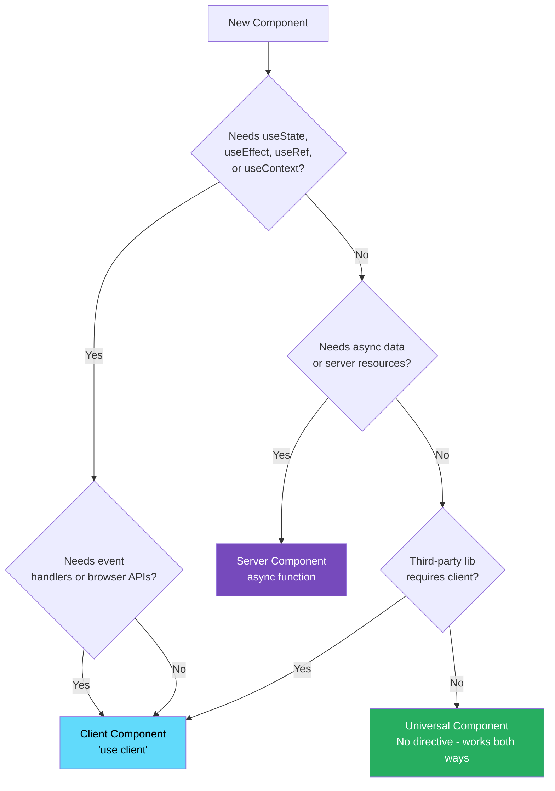
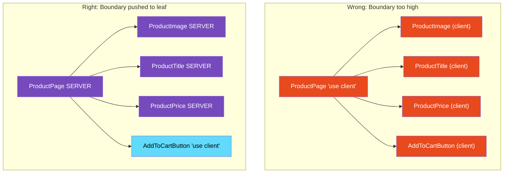

# 46 · Server vs Client Components

> **The server/client component decision is the most consequential architectural choice you make repeatedly in a Next.js App Router application. Get it right and you have fast initial loads, small bundles, and clean data flows. Get it wrong and you recreate the inefficiencies of traditional client-side React — just with more boilerplate. This document provides a precise decision framework, the exact rules for the boundary, and the patterns that emerge at scale.**

Most developers working with the App Router make one of two mistakes: they put `'use client'` too high in the tree (unnecessarily converting entire page sections to client components), or they try to force server behavior into client components (leading to workarounds and complexity). The right mental model is: server components are the default, client components are specifically for interactivity, and the boundary is as low in the tree as possible.

---

## Table of Contents

- [The Decision Framework](#the-decision-framework)
- [Feature Matrix: What Each Can Do](#feature-matrix-what-each-can-do)
- [The Boundary Rule: Push It Down](#the-boundary-rule-push-it-down)
- [The Boundary Propagation Rules](#the-boundary-propagation-rules)
- [Shared Components: Same File, Both Contexts](#shared-components-same-file-both-contexts)
- [Context Providers as Client Components](#context-providers-as-client-components)
- [Third-Party Library Compatibility](#third-party-library-compatibility)
- [The Data Passing Contract](#the-data-passing-contract)
- [What Can Cross the Server/Client Boundary](#what-can-cross-the-serverclient-boundary)
- [Serialization Rules for Props](#serialization-rules-for-props)
- [When Server Components Re-render](#when-server-components-re-render)
- [When Client Components Re-render](#when-client-components-re-render)
- [Avoiding Common Boundary Mistakes](#avoiding-common-boundary-mistakes)
- [Architecture Diagrams](#architecture-diagrams)
- [Good Practices](#good-practices)
- [Bad Practices](#bad-practices)
- [Mental Model](#mental-model)
- [Common Misconceptions](#common-misconceptions)
- [Exercises](#exercises)
- [Further Reading](#further-reading)

---

## The Decision Framework

Start with this question for every component:

```
Does this component need any of the following?
  □ useState or useReducer
  □ useEffect or useLayoutEffect
  □ useContext (as a consumer)
  □ onClick, onChange, or other event handlers
  □ Browser APIs (window, document, localStorage, navigator)
  □ Third-party libraries that use hooks or browser APIs
  □ Custom hooks that use any of the above

If YES to any → Client Component ('use client')
If NO to all → Server Component (default, no directive needed)
```

The most important principle: **when in doubt, try Server Component first**. If you get an error about hooks or browser APIs, add `'use client'`. Don't add it preemptively.

### The secondary question

If you answered YES and need a Client Component: **how far down in the tree can you push the 'use client' boundary?**

```tsx
// ❌ Boundary too high: entire page section is client
"use client";
function ProductSection({ product }) {
  // Uses useState for one tiny feature
  const [isExpanded, setIsExpanded] = useState(false);

  return (
    <div>
      <ProductImage src={product.image} /> {/* Could be server */}
      <ProductTitle title={product.name} /> {/* Could be server */}
      <ProductPrice price={product.price} /> {/* Could be server */}
      <button onClick={() => setIsExpanded((e) => !e)}>
        {isExpanded ? "Less" : "More"}
      </button>
      {isExpanded && <ProductDetails product={product} />}
    </div>
  );
}

// ✅ Boundary pushed down: only the toggle is client
// (ProductSection is Server Component)
async function ProductSection({ productId }) {
  const product = await db.products.findUnique({ where: { id: productId } });
  return (
    <div>
      <ProductImage src={product.image} /> {/* Server Component */}
      <ProductTitle title={product.name} /> {/* Server Component */}
      <ProductPrice price={product.price} /> {/* Server Component */}
      <ExpandableDetails product={product} />{" "}
      {/* Client Component — only toggle */}
    </div>
  );
}

// 'use client' — only on the interactive part
function ExpandableDetails({ product }) {
  const [isExpanded, setIsExpanded] = useState(false);
  return (
    <>
      <button onClick={() => setIsExpanded((e) => !e)}>
        {isExpanded ? "Less" : "More"}
      </button>
      {isExpanded && <div>{product.longDescription}</div>}
    </>
  );
}
```

---

## Feature Matrix: What Each Can Do

| Feature                  | Server Component   | Client Component  |
| ------------------------ | ------------------ | ----------------- |
| `async/await`            | ✅                 | ❌ (as component) |
| Database access          | ✅ (direct)        | ❌ (via API only) |
| File system access       | ✅                 | ❌                |
| Server secrets (env)     | ✅                 | ❌ (exposed!)     |
| `useState`               | ❌                 | ✅                |
| `useEffect`              | ❌                 | ✅                |
| `useContext`             | ❌ (consumer)      | ✅                |
| `useRef` (DOM)           | ❌                 | ✅                |
| `useReducer`             | ❌                 | ✅                |
| Event handlers           | ❌                 | ✅                |
| Browser APIs             | ❌                 | ✅                |
| React hooks (most)       | ❌                 | ✅                |
| `React.cache()`          | ✅                 | N/A               |
| Context Provider         | ❌ (must be in CC) | ✅                |
| Server Actions           | ✅ (define)        | ✅ (call)         |
| `cookies()`, `headers()` | ✅                 | ❌                |
| Renders on server        | ✅                 | ✅ (initial)      |
| Renders on client        | ❌                 | ✅                |
| In client bundle         | ❌                 | ✅                |
| Can import from          | Both               | Client only       |

---

## The Boundary Rule: Push It Down

The architecture principle is: **the `'use client'` boundary should be as close to the interactive leaf as possible**.

```
WRONG: Boundary at route level
  app/dashboard/page.tsx → 'use client'
  All of dashboard: client components
  Effect: entire dashboard in bundle, all data fetched client-side

WRONG: Boundary at feature level
  components/ProductSection.tsx → 'use client'
  Entire product section: client
  Effect: product data fetched client-side, more bundle

RIGHT: Boundary at interaction leaf
  components/AddToCartButton.tsx → 'use client'
  Only the button: client
  Effect: product data stays server, only button code in bundle
```

### Practical example of pushing the boundary down

```tsx
// ❌ Level 1: Too high — everything is client
"use client";
// components/dashboard/analytics.tsx
async function Analytics({ userId }) {
  // Can't be async in client component
  // Must use useEffect + fetch instead
  const [data, setData] = useState(null);
  useEffect(() => {
    fetch(`/api/analytics/${userId}`)
      .then((r) => r.json())
      .then(setData);
  }, [userId]);

  return (
    <div>
      <Chart data={data?.chart} /> {/* always re-renders */}
      <MetricsTable data={data?.metrics} /> {/* always re-renders */}
      <ExportButton /> {/* only thing that needs client */}
    </div>
  );
}

// ✅ Level 3: Only interaction is client
// components/dashboard/analytics.tsx (Server Component)
async function Analytics({ userId }) {
  const [chartData, metricsData] = await Promise.all([
    db.analytics.getChart(userId),
    db.analytics.getMetrics(userId),
  ]);

  return (
    <div>
      <Chart data={chartData} /> {/* Server Component — no interactivity */}
      <MetricsTable data={metricsData} />{" "}
      {/* Server Component — no interactivity */}
      <ExportButton userId={userId} />{" "}
      {/* 'use client' — only interactive part */}
    </div>
  );
}

// 'use client'
// components/dashboard/export-button.tsx
function ExportButton({ userId }) {
  const [isExporting, setIsExporting] = useState(false);
  const handleExport = async () => {
    setIsExporting(true);
    await exportAnalytics(userId); // Server Action
    setIsExporting(false);
  };
  return (
    <button onClick={handleExport} disabled={isExporting}>
      {isExporting ? "Exporting..." : "Export"}
    </button>
  );
}
```

---

## The Boundary Propagation Rules

Understanding exactly how `'use client'` propagates is essential:

### Rule 1: 'use client' propagates to all imports

```tsx
// button.tsx
"use client";
export function Button({ onClick, children }) {
  return <button onClick={onClick}>{children}</button>;
}

// icon.tsx — no 'use client'
export function Icon({ name }) {
  return <span>{name}</span>;
}

// form.tsx — imports both
import { Button } from "./button"; // Button has 'use client'
import { Icon } from "./icon"; // Icon doesn't have 'use client'

// When form.tsx imports from button.tsx (which has 'use client'),
// if form.tsx is imported INTO the 'use client' tree:
// ALL of form.tsx and its imports are client components

// The import DIRECTION determines the boundary:
// Server → 'use client' file: boundary is at the 'use client' file
// 'use client' file → any file: everything in that subtree is client
```

### Rule 2: 'use client' doesn't propagate UPWARD through children prop

```tsx
// layout.tsx (Server Component)
function Layout({ children }) {
  return <main>{children}</main>;
}

// dashboard.tsx (also Server Component — no 'use client')
import { Layout } from "./layout";
import { InteractiveWidget } from "./widget"; // has 'use client'

async function Dashboard() {
  const data = await db.getData();
  return (
    <Layout>
      <h1>Dashboard</h1>
      <InteractiveWidget data={data} /> {/* starts client component subtree */}
    </Layout>
  );
}

// Layout: Server Component ✅
// Dashboard: Server Component ✅
// InteractiveWidget: Client Component (has 'use client')
// h1: renders in Server Component — not a client component
```

### Rule 3: A file is either in the server bundle OR the client bundle, never both

```tsx
// This file will be in the CLIENT bundle:
"use client";
import { heavyLibrary } from "some-library"; // this library is in client bundle

// This file will be in the SERVER bundle only:
// no 'use client'
import { heavyLibrary } from "some-library"; // NOT in client bundle
```

Practically: be careful about which imports you add to `'use client'` files. Every import in a client component becomes part of the client bundle.

---

## Shared Components: Same File, Both Contexts

Some components are "universal" — they don't use any server-only OR client-only features. They can be used in both contexts:

```tsx
// components/card.tsx — NO directive: works in both contexts
interface CardProps {
  title: string;
  children: React.ReactNode;
}

function Card({ title, children }: CardProps) {
  return (
    <div className="card">
      <h2>{title}</h2>
      {children}
    </div>
  );
}

// Can be used from Server Component:
async function ServerPage() {
  return (
    <Card title="Server Card">
      <p>Server content</p>
    </Card>
  );
}

// Can be used from Client Component:
("use client");
function ClientSection() {
  const [count, setCount] = useState(0);
  return (
    <Card title="Client Card">
      <button onClick={() => setCount((c) => c + 1)}>{count}</button>
    </Card>
  );
}
```

When `Card` is imported from a Server Component context, it runs as a Server Component. When imported from a `'use client'` file, it runs as a Client Component. No directive needed — it's context-dependent.

---

## Context Providers as Client Components

React Context requires `'use client'` for providers (they use internal state), but the subtree they wrap can still contain Server Components:

```tsx
// providers/theme-provider.tsx
"use client";
import { createContext, useContext, useState } from "react";

const ThemeContext = createContext<{
  theme: "light" | "dark";
  setTheme: (theme: "light" | "dark") => void;
}>({ theme: "light", setTheme: () => {} });

export function ThemeProvider({ children }: { children: React.ReactNode }) {
  const [theme, setTheme] = useState<"light" | "dark">("light");

  return (
    <ThemeContext.Provider value={{ theme, setTheme }}>
      {children} {/* ← Server Components can be passed here! */}
    </ThemeContext.Provider>
  );
}

export function useTheme() {
  return useContext(ThemeContext);
}

// app/layout.tsx — Server Component
import { ThemeProvider } from "../providers/theme-provider";

export default function RootLayout({ children }) {
  return (
    <html>
      <body>
        <ThemeProvider>
          {children} {/* Server Components inside Client Provider — works! */}
        </ThemeProvider>
      </body>
    </html>
  );
}
```

The Provider is a Client Component (needs useState), but the content it wraps can be Server Components (passed as `children` prop).

### The provider pattern in Next.js

```tsx
// app/providers.tsx — consolidate all client providers
"use client";

import { QueryClient, QueryClientProvider } from "@tanstack/react-query";
import { ThemeProvider } from "./theme-provider";
import { SessionProvider } from "next-auth/react";

export function Providers({ children, session }) {
  const queryClient = new QueryClient();

  return (
    <SessionProvider session={session}>
      <QueryClientProvider client={queryClient}>
        <ThemeProvider>{children}</ThemeProvider>
      </QueryClientProvider>
    </SessionProvider>
  );
}

// app/layout.tsx — Server Component
import { Providers } from "./providers";

export default async function RootLayout({ children }) {
  const session = await getServerSession(); // server-side auth

  return (
    <html>
      <body>
        <Providers session={session}>{children}</Providers>
      </body>
    </html>
  );
}
```

---

## Third-Party Library Compatibility

Not all libraries work as Server Components. Libraries that use hooks, browser APIs, or require rendering context must be used in Client Components:

```tsx
// ❌ Libraries that REQUIRE 'use client':
import { motion } from "framer-motion"; // uses hooks, animations
import { Chart } from "recharts"; // uses hooks, canvas
import { DatePicker } from "react-datepicker"; // uses hooks, DOM
import { useForm } from "react-hook-form"; // hooks
import { Toast } from "react-hot-toast"; // browser APIs

// ✅ Libraries that work in Server Components:
import { marked } from "marked"; // pure computation
import { highlight } from "highlight.js"; // pure computation
import { parse } from "node-html-parser"; // Node.js parser
import { format } from "date-fns"; // pure functions
import { z } from "zod"; // validation schema

// Libraries with 'use client' in their own source (automatically wrapped):
// Many modern libraries add 'use client' to their entry points
// For older libraries that don't: you must wrap them:

// ❌ Old library without 'use client':
// components/chart-wrapper.tsx
("use client");
import { Chart } from "some-old-chart-library"; // no 'use client' in source

export function ChartWrapper(props) {
  return <Chart {...props} />;
}
// Now you can import ChartWrapper from Server Components safely
```

### How to tell if a library needs 'use client'

```bash
# Check if the library has 'use client' in its source:
cat node_modules/framer-motion/dist/esm/index.js | grep "use client"

# Or check package.json for "exports" and "react-server" conditions
cat node_modules/framer-motion/package.json | grep -A5 "react-server"

# Libraries that support React Server Components:
# - Will have "react-server" in their exports
# - Or will explicitly document RSC support
# - Or will have 'use client' at the top of client-side exports
```

---

## The Data Passing Contract

When a Server Component passes data to a Client Component, the data must cross the server/client boundary. This happens via props and has specific rules.

### What CAN cross the boundary

```tsx
// ✅ Primitives: strings, numbers, booleans, null, undefined
<ClientComponent name="Alice" count={42} active={true} data={null} />

// ✅ Plain objects (JSON-serializable)
<ClientComponent config={{ pageSize: 20, sortBy: 'name' }} />

// ✅ Arrays of serializable values
<ClientComponent items={[{ id: 1, name: 'Alpha' }, { id: 2, name: 'Beta' }]} />

// ✅ React elements (JSX) — passed as children
<ClientComponent>
  <ServerComponent />  {/* Server Component passed as children */}
</ClientComponent>

// ✅ Server Actions (special function references)
<ClientComponent onSubmit={serverActionFunction} />
// Server Actions have a special serialization mechanism
```

### What CANNOT cross the boundary

```tsx
// ❌ Regular functions
const serverFn = () => doSomething();
<ClientComponent onClick={serverFn} />
// Error: Functions cannot be passed from Server to Client Components

// ❌ Class instances
const dbConnection = new DatabaseConnection();
<ClientComponent db={dbConnection} />
// Error: Only plain objects can be passed

// ❌ Date objects
const date = new Date();
<ClientComponent date={date} />
// Error: Not JSON-serializable; convert to ISO string first

// ❌ Maps, Sets
const map = new Map([['key', 'value']]);
<ClientComponent data={map} />
// Error: Not JSON-serializable

// ❌ Symbol, BigInt
const sym = Symbol('key');
<ClientComponent key={sym} />
// Error: Not JSON-serializable

// ❌ React components (as values, not JSX)
<ClientComponent Component={ServerComponent} />
// Error: Component references not serializable
// (use children prop instead of component prop)
```

### Fixing serialization issues

```tsx
// Fix: convert non-serializable data before passing

// Date → ISO string
const date = product.createdAt; // Date object
<ClientComponent createdAt={date.toISOString()} />; // ✅ string

// Map → plain object
const categories = new Map(data.categories);
<ClientComponent categories={Object.fromEntries(categories)} />; // ✅ plain object

// Class instance → extract needed data
const user = new User(userData);
<ClientComponent userId={user.id} userName={user.name} />; // ✅ primitives
```

---

## What Can Cross the Server/Client Boundary

A more complete picture of what can be passed as props from Server to Client Components:

```
Passable:
  string                → "hello"
  number                → 42, 3.14
  boolean               → true, false
  null                  → null
  undefined             → undefined (becomes null in JSON)
  Plain object          → { key: value }
  Array                 → [1, 2, 3], [{ id: 1 }]
  React elements (JSX)  → <div />, <ServerComponent />
  Server Actions        → async function with 'use server'
  Promises              → Promise<T> (for use() hook in React 19)

NOT Passable:
  Functions             → () => {} (unless Server Actions)
  Class instances       → new MyClass()
  Date                  → new Date() (use .toISOString())
  Map                   → new Map() (use Object.fromEntries())
  Set                   → new Set() (use Array.from())
  Symbol                → Symbol()
  BigInt                → 9007199254740993n
  Error                 → new Error() (use { message, stack })
  RegExp                → /pattern/ (use string)
  Component references  → MyComponent (pass as children instead)
```

---

## Serialization Rules for Props

React uses a JSON-like serialization for the RSC payload. Understanding the rules prevents runtime errors:

```tsx
// Server Component:
async function Page() {
  const product = await db.products.findUnique({ where: { id: "123" } });

  return (
    <ProductClient
      id={product.id} // ✅ string
      price={product.price} // ✅ number
      name={product.name} // ✅ string
      createdAt={product.createdAt.toISOString()} // ✅ convert Date → string
      tags={product.tags} // ✅ string[] (plain array)
      metadata={JSON.parse(product.metadata)} // ✅ parsed to plain object
      // ❌ onUpdate={updateProduct}    // Error: function not serializable
      onUpdate={serverActionUpdate} // ✅ Server Action is serializable
    />
  );
}
```

---

## When Server Components Re-render

Server Components re-render when:

1. The user navigates to the route (full navigation)
2. A Server Action calls `revalidatePath()` or `revalidateTag()`
3. `router.refresh()` is called from a Client Component

They do NOT re-render:

- When Client Component state changes in the same page
- When context values change in Client Components
- On any client-side interaction (unless router.refresh() is called)

```tsx
// Server Components are "frozen" from the client's perspective
// Client state changes don't cause them to re-render

// To get fresh server data after a mutation:
"use client";
function UpdateForm() {
  const router = useRouter();
  const [isPending, startTransition] = useTransition();

  const handleUpdate = async () => {
    await updateDataServerAction(data);
    // Tell Next.js to re-render Server Components:
    startTransition(() => router.refresh());
    // This refetches the RSC payload for the current route
    // Server Components re-render with fresh data
  };
}
```

---

## When Client Components Re-render

Client Components re-render due to the standard React rules:

1. Their own state changes (`useState`, `useReducer`)
2. Their parent re-renders (with new props)
3. Context they consume changes (`useContext`)
4. Hooks they use return new values (`useSyncExternalStore`)

This is identical to standard React — the RSC model doesn't change client component re-rendering behavior.

---

## Avoiding Common Boundary Mistakes

### Mistake 1: Importing Server Components into Client Components

```tsx
// ❌ Cannot import Server Component directly into Client Component
"use client";
import { ServerComponent } from "./server-component"; // Error!
// Server Component code would be in the client bundle

// ✅ Pass Server Components as props (children):
// From a Server Component parent:
<ClientWrapper>
  <ServerComponent /> {/* passed as children — not imported by ClientWrapper */}
</ClientWrapper>;
```

### Mistake 2: Using server-only in client components

```tsx
"use client";
// ❌ This would expose your secret to the browser bundle:
const API_KEY = process.env.SECRET_API_KEY; // exposed to client!

// ✅ Fetch data in a Server Component and pass only what's needed:
// (no API key in client component)
```

### Mistake 3: Fetching in both server and client

```tsx
// ❌ Double fetching: Server fetches, then Client also fetches
async function Page({ params }) {
  const product = await fetchProduct(params.id); // server fetch

  return (
    <ProductClient
      productId={params.id} // ❌ passes only ID
      initialData={product} // passes initial data
    />
  );
}

("use client");
function ProductClient({ productId, initialData }) {
  const [product, setProduct] = useState(initialData);

  useEffect(() => {
    // ❌ Fetches again! Why? initialData is already there
    fetchProduct(productId).then(setProduct);
  }, [productId]);
}

// ✅ If data doesn't need to update: just pass it, no client fetch
("use client");
function ProductClient({ product }) {
  // receive complete data
  const [isWishlisted, setIsWishlisted] = useState(false);
  return (
    <div>
      <h1>{product.name}</h1> {/* use server-fetched data directly */}
      <button onClick={() => setIsWishlisted((w) => !w)}>
        {isWishlisted ? "❤️" : "🤍"}
      </button>
    </div>
  );
}
```

---

## Architecture Diagrams

### Component type decision tree



### Boundary placement: wrong vs right



---

## Good Practices

### ✅ Good Practice — Context provider wrapping server component tree

```tsx
/**
 * Good: Context providers as thin client shells around server content.
 * The providers are client components (need hooks) but the actual
 * page content is server-rendered inside them.
 * Pattern: Client Provider → Server Content via children prop.
 */

// app/providers.tsx — all client providers consolidated
"use client";
import { ReactQueryDevtools } from "@tanstack/react-query-devtools";
import { QueryClient, QueryClientProvider } from "@tanstack/react-query";
import { useState } from "react";

export function AppProviders({ children }: { children: React.ReactNode }) {
  // useState used here — must be client component
  const [queryClient] = useState(
    () =>
      new QueryClient({
        defaultOptions: {
          queries: { staleTime: 60 * 1000 }, // 1 minute
        },
      }),
  );

  return (
    <QueryClientProvider client={queryClient}>
      {children} {/* ← Server Components can be here */}
      <ReactQueryDevtools initialIsOpen={false} />
    </QueryClientProvider>
  );
}

// app/layout.tsx — Server Component
import { AppProviders } from "./providers";

export default async function RootLayout({ children }) {
  // Server-side work can happen here
  const user = await getCurrentUser();

  return (
    <html lang="en">
      <body>
        <AppProviders>
          {/* Server Components flow through as children */}
          <Navigation user={user} /> {/* Server Component */}
          <main>{children}</main> {/* Server Component pages */}
          <Footer /> {/* Server Component */}
        </AppProviders>
      </body>
    </html>
  );
}
```

**Why this works:** The `AppProviders` Client Component provides React Query context for client components to use throughout the app. But all the actual page content (`Navigation`, `main`, `Footer`) is server-rendered — they just happen to be nested inside a Client Component via the `children` prop. The Client Component doesn't force its imports to be client components — only `AppProviders` itself and its explicit imports (ReactQueryDevtools, QueryClientProvider) are in the client bundle.

---

## Bad Practices

### ⚠️ Bad Practice — Drilling server data through multiple layers unnecessarily

```tsx
/**
 * Bad: Passing server data through multiple component layers as props.
 * This couples components to data they don't use (prop drilling),
 * and prevents independent server component data fetching.
 *
 * Each layer that receives user data cannot be changed independently
 * without modifying every component in the chain.
 */

// ❌ Server Component fetches user — drills through multiple layers
async function Dashboard() {
  const user = await db.users.findUnique({ where: { id: session.userId } });

  return <DashboardLayout user={user} />; // passes user
}

function DashboardLayout({ user }) {
  return (
    <div>
      <Header user={user} /> {/* passes user down */}
      <Content user={user} /> {/* passes user down */}
    </div>
  );
}

function Header({ user }) {
  return (
    <nav>
      <UserAvatar user={user} /> {/* finally USES user */}
    </nav>
  );
}

// ✅ Fix: Each component fetches its own data
// No prop drilling — components are independent
async function Dashboard() {
  return (
    <div>
      <Header /> {/* fetches its own data */}
      <Content /> {/* fetches its own data */}
    </div>
  );
}

async function Header() {
  return (
    <nav>
      <UserAvatar /> {/* fetches its own data */}
    </nav>
  );
}

async function UserAvatar() {
  const user = await db.users.findUnique({ where: { id: session.userId } });
  // Request memoization: if another component also fetches this user,
  // the DB query is deduplicated
  return ;
}
```

**Why this matters:** With prop drilling, adding a new field to `UserAvatar` requires modifying `Dashboard`, `DashboardLayout`, `Header`, and `UserAvatar`. With co-located fetching, only `UserAvatar` changes. Request memoization (`React.cache()`) ensures the DB isn't queried multiple times even if multiple components fetch the same user.

---

## Mental Model

> 💡 **The Server vs Client Component mental model:**
>
> Think of your component tree as a **restaurant with a kitchen and dining room**. Server Components are kitchen staff — they prepare everything (fetch data, transform it, render it) out of sight. Customers never see the kitchen, never know what tools it uses, never receive the recipe. Client Components are waitstaff — they interact directly with customers, take orders (event handlers), carry plates to tables (props), and respond to requests in real-time (state updates). The boundary between kitchen and dining room should be as late in the service pipeline as possible: the chef shouldn't need to go to the dining room to find out what the customer wants (no server-side event handling), and the waiter shouldn't need to go to the supplier warehouse to pick up ingredients (no client-side DB access). `'use client'` is the dining room entrance — everything inside serves customers directly. Everything outside is kitchen operations.

---

## Common Misconceptions

### "Server Components can't have any interactivity"

Server Components can use Server Actions for mutations (form submissions, button clicks that trigger server operations). They just can't use React's client-side state model. Interactivity driven by Server Actions works fine in Server Components.

### "You need to wrap every component with 'use client'"

The vast majority of components in a typical app should be Server Components. Only components that specifically need hooks, event handlers, or browser APIs need `'use client'`. In a well-structured app, fewer than 20% of components need to be client components.

### "Client Components can't contain Server Component content"

Client Components CAN contain Server Component content — passed as `children` or other React node props. The content is rendered on the server and passed as already-rendered output. The Client Component wrapper doesn't prevent server rendering of its content.

### "Passing data from Server to Client Component requires an API endpoint"

No — you pass data directly as props. Props crossing the server/client boundary are serialized in the RSC payload. No API endpoint needed. The restriction is on what types can cross (no functions, class instances, etc.) — not on data volume.

### "Server Components are always faster than Client Components"

Server Components eliminate client-side data fetching waterfalls, which is a significant advantage. But server component performance depends on server/database response time. A client component with cached data can render faster than a server component waiting for a slow database query.

---

## Exercises

### Exercise 1 — Identify component types in an existing app

Take any Next.js page you've built or found in a tutorial. For each component:

1. Does it use hooks? → Client Component required
2. Does it use browser APIs? → Client Component required
3. Does it fetch data? → Server Component preferred
4. Could it be server rendered? → If no client-only features, make it server

Redraw the component tree showing S (server) or C (client) for each component.

### Exercise 2 — Fix a prop drilling chain

Take this component tree and refactor it to eliminate prop drilling:

```tsx
async function Page() {
  const user = await getUser();
  const settings = await getSettings(user.id);
  return <Layout user={user} settings={settings} />;
}

function Layout({ user, settings }) {
  return (
    <>
      <Header user={user} settings={settings} />
      <MainContent />
    </>
  );
}

function Header({ user, settings }) {
  return (
    <nav>
      <Logo theme={settings.theme} />
      <UserMenu user={user} />
    </nav>
  );
}
```

Goal: each component fetches only what it needs, no prop drilling, same visual output.

### Exercise 3 — Audit 'use client' usage

In a Next.js App Router project:

1. Find all files with `'use client'`
2. For each: what feature specifically requires it?
3. Could the 'use client' boundary be pushed lower?
4. Are there any components with `'use client'` that don't actually need it?

Remove unnecessary `'use client'` directives. Run `next build` and compare bundle sizes.

---

## Further Reading

- [Next.js docs: Server and Client Components](https://nextjs.org/docs/app/building-your-application/rendering/server-components) — Official reference
- [Next.js docs: Composition Patterns](https://nextjs.org/docs/app/building-your-application/rendering/composition-patterns) — Common patterns
- [React Docs: Server Components](https://react.dev/reference/rsc/server-components) — React's explanation
- [React Docs: Directives](https://react.dev/reference/rsc/directives) — 'use client' and 'use server'
- [Josh Comeau: RSC Deep Dive](https://www.joshwcomeau.com/react/server-components/) — Visual guide
- Next in this handbook: [47 · Streaming & Suspense with RSC](./03-streaming.md)

---

_Part of the [React + Next.js Engineering Handbook](../../README.md)_
