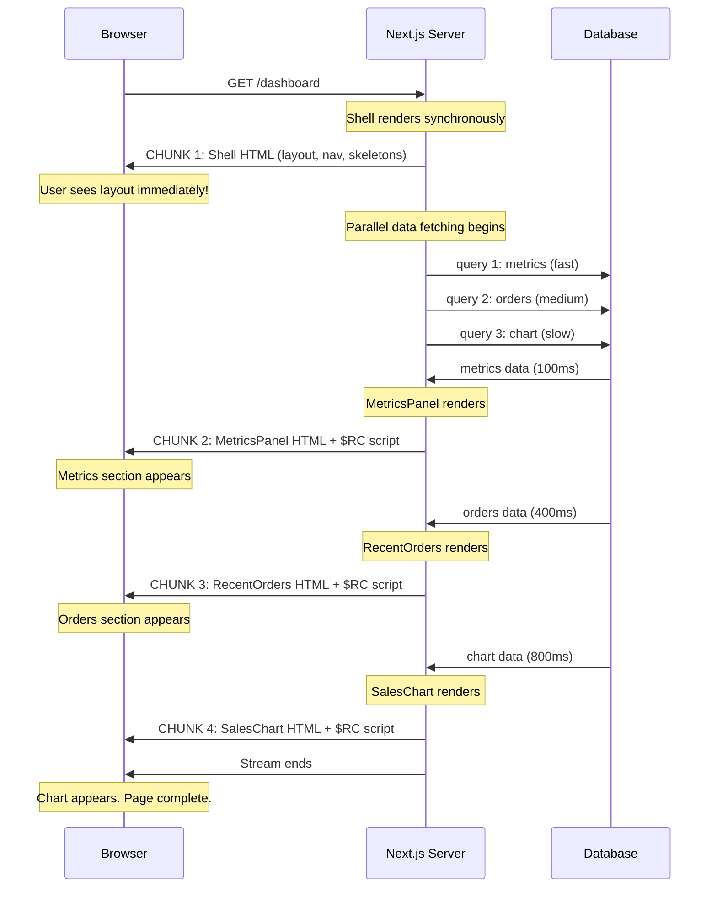
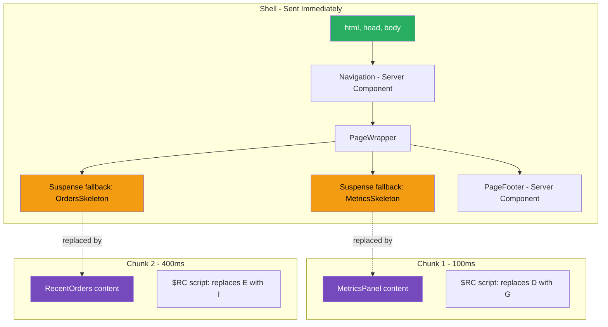

# 47 · Streaming & Suspense with RSC

> **Streaming with React Server Components is the technique of sending HTML to the browser in chunks as it becomes ready, rather than waiting for the entire page to finish rendering before sending anything. Combined with Suspense boundaries, streaming enables pages to be progressively revealed — critical content appears immediately, slower content streams in as its data arrives. This fundamentally changes the user experience from "blank page, then everything" to "shell immediately, then progressive content."**

Streaming is not a new concept — HTTP chunked transfer encoding has existed since HTTP/1.1. What React makes new is the ability to stream React component output with correct component tree semantics: Suspense boundaries define the units of streaming, fallbacks show while sections load, and the browser can hydrate selectively as each chunk arrives.

---

## Table of Contents

- [What Streaming Solves](#what-streaming-solves)
- [How HTTP Streaming Works](#how-http-streaming-works)
- [How React Implements Streaming](#how-react-implements-streaming)
- [Suspense as the Streaming Primitive](#suspense-as-the-streaming-primitive)
- [The Shell and the Chunks](#the-shell-and-the-chunks)
- [The loading.tsx Shortcut](#the-loadingtsx-shortcut)
- [Streaming Architecture Decisions](#streaming-architecture-decisions)
- [Granular Suspense Boundaries](#granular-suspense-boundaries)
- [The Scripts That Insert Streamed Content](#the-scripts-that-insert-streamed-content)
- [Streaming and Hydration](#streaming-and-hydration)
- [Streaming and Error Handling](#streaming-and-error-handling)
- [Streaming and SEO](#streaming-and-seo)
- [Streaming on Vercel vs Self-Hosted](#streaming-on-vercel-vs-self-hosted)
- [Measuring Streaming Performance](#measuring-streaming-performance)
- [Architecture Diagrams](#architecture-diagrams)
- [Good Practices](#good-practices)
- [Bad Practices](#bad-practices)
- [Mental Model](#mental-model)
- [Common Misconceptions](#common-misconceptions)
- [Exercises](#exercises)
- [Further Reading](#further-reading)

---

## What Streaming Solves

Traditional server rendering blocks the entire response until all data is ready:

```
Without streaming:
  t=0ms:   Request arrives
  t=300ms: Database query 1 completes (product details)
  t=800ms: Database query 2 completes (reviews)
  t=1200ms: Database query 3 completes (recommendations)
  t=1250ms: HTML fully generated
  t=1250ms: First byte sent to browser
  t=1300ms: User sees ANY content (after 1.3 seconds)

With streaming:
  t=0ms:   Request arrives
  t=20ms:  Shell (layout, nav, static content) ready → SENT
  t=20ms:  User sees layout immediately (after 20ms!)
  t=300ms: Product details ready → chunk sent → product appears
  t=800ms: Reviews ready → chunk sent → reviews appear
  t=1200ms: Recommendations ready → chunk sent → recommendations appear
```

The user's time to first meaningful content drops from 1.3s to 20ms. The total page completion time is the same (1.2s), but the perceived performance is dramatically better.

---

## How HTTP Streaming Works

HTTP/1.1 supports chunked transfer encoding, which allows a server to send a response in pieces without knowing the total content length upfront:

```http
HTTP/1.1 200 OK
Content-Type: text/html
Transfer-Encoding: chunked

1a\r\n
<!DOCTYPE html><html><head>
\r\n
ff\r\n
<!-- more HTML... -->
\r\n
1e2\r\n
<!-- product content chunk -->
\r\n
0\r\n
\r\n
```

Each chunk starts with its size in hexadecimal, followed by the content, followed by `\r\n`. A final chunk of size `0` signals the end of the stream.

The browser processes each chunk as it arrives — parsing HTML, downloading resources, and rendering visible content — without waiting for the stream to end.

### Node.js streaming with renderToPipeableStream

```js
// How Next.js uses React's streaming API internally:
import { renderToPipeableStream } from "react-dom/server";

app.get("/*", (req, res) => {
  const { pipe, abort } = renderToPipeableStream(<App />, {
    onShellReady() {
      // Shell (content above first Suspense) is ready
      res.setHeader("Content-Type", "text/html");
      res.setHeader("Transfer-Encoding", "chunked");
      pipe(res); // pipe React's output directly to HTTP response
    },
    onShellError(error) {
      // Shell failed — send error page instead
      res.status(500).send("Server Error");
    },
    onAllReady() {
      // All Suspense boundaries resolved
      // Not used with pipe() — only relevant for static generation
    },
    onError(error) {
      console.error(error);
    },
  });

  // Abort after timeout (prevent hanging connections)
  setTimeout(() => abort(), 10000);
});
```

---

## How React Implements Streaming

React's `renderToPipeableStream` renders the component tree and manages Suspense boundaries:

```
1. React starts rendering the component tree

2. When it reaches a Suspense boundary wrapping an async component:
   a. The async component hasn't resolved yet
   b. React renders the fallback (<LoadingSkeleton />)
   c. Marks this Suspense boundary as "pending"
   d. Continues rendering the rest of the tree (doesn't block)

3. The "shell" is everything rendered without hitting any pending Suspense
   → Shell is flushed to the browser immediately

4. For each pending Suspense boundary:
   a. When the async operation completes (DB query done)
   b. React renders the resolved content
   c. Generates a hidden <div> with the content + a <script> tag
   d. The <script> calls $RC() to replace the placeholder with the content
   e. This chunk is sent to the browser

5. Stream ends when all Suspense boundaries have resolved
```

---

## Suspense as the Streaming Primitive

Every Suspense boundary creates a potential streaming insertion point. The key rules:

```tsx
// Rule 1: The shell is everything ABOVE and OUTSIDE Suspense boundaries
function Page() {
  return (
    <div className="page">
      {/* Part of shell — renders immediately */}
      <PageHeader />

      {/* Suspense boundary — this section streams independently */}
      <Suspense fallback={<ProductSkeleton />}>
        <ProductSection /> {/* async — waits for DB */}
      </Suspense>

      {/* Part of shell — renders immediately (doesn't wait for ProductSection) */}
      <PageFooter />

      {/* Another independent Suspense boundary */}
      <Suspense fallback={<ReviewSkeleton />}>
        <ReviewSection /> {/* async — waits for DB */}
      </Suspense>
    </div>
  );
}

// Shell contains: PageHeader, placeholder for ProductSection (via skeleton),
//                 PageFooter, placeholder for ReviewSection
// Shell arrives immediately

// Chunks:
// Chunk 1: ProductSection content (when its DB query completes)
// Chunk 2: ReviewSection content (when its DB query completes)
// These stream independently — faster query arrives first
```

### Nested Suspense boundaries

```tsx
// Nested boundaries: the outer renders first, inner streams later
function ProductPage() {
  return (
    <Suspense fallback={<ProductSkeleton />}>
      {" "}
      {/* outer */}
      <ProductDetails /> {/* fast: 50ms */}
      <Suspense fallback={<ReviewSkeleton />}>
        {" "}
        {/* inner */}
        <Reviews /> {/* slow: 500ms */}
      </Suspense>
    </Suspense>
  );
}

// Timeline:
// t=0:    Shell arrives (no product content — outer Suspense is pending)
// t=50ms: ProductDetails resolves → outer Suspense receives partial content
//         Sends: ProductDetails HTML + skeleton for inner Suspense
//         User sees product details + review skeleton
// t=500ms: Reviews resolves → inner Suspense completes
//          Sends: Reviews HTML
//          User sees full page
```

---

## The Shell and the Chunks

The shell is the most critical concept for streaming:

### What constitutes the shell

```tsx
// The shell = everything that renders synchronously before hitting any
// pending Suspense boundary

function App() {
  return (
    <html>
      {" "}
      {/* ← shell starts here */}
      <head>
        <title>My App</title> {/* ← shell */}
      </head>
      <body>
        <nav>Navigation</nav> {/* ← shell (synchronous) */}
        <Suspense fallback={<Spinner />}>
          <SlowContent /> {/* ← NOT in shell (async) */}
        </Suspense>
        <footer>Footer</footer> {/* ← shell (synchronous) */}
      </body>
    </html>
  );
}

// Shell sent immediately:
// <html><head><title>My App</title>...</head>
// <body><nav>Navigation</nav>
// <!-- placeholder for SlowContent -->
// <footer>Footer</footer>
// </body></html>
// (as a stream, with the placeholder filled in later)
```

### Shell failure vs chunk failure

```
Shell failure (SlowContent is in the shell):
  → No HTML sent until SlowContent resolves (or errors)
  → If SlowContent errors: onShellError fires → send error page
  → User sees nothing until shell completes

Chunk failure (SlowContent is in a Suspense boundary):
  → Shell sent immediately
  → SlowContent error: caught by Error Boundary
  → Error UI sent for that chunk
  → Rest of page unaffected
```

This is why you should wrap slow content in Suspense boundaries — not for the loading state, but to prevent failures from blocking the shell.

---

## The loading.tsx Shortcut

In Next.js App Router, `loading.tsx` automatically wraps `page.tsx` in a Suspense boundary. This is syntactic sugar for a common streaming pattern:

```tsx
// These two are equivalent:

// Option 1: Manual Suspense
async function Layout({ children }) {
  return (
    <div>
      <Navbar />
      <Suspense fallback={<PageSkeleton />}>{children}</Suspense>
    </div>
  );
}

// Option 2: loading.tsx convention
// app/dashboard/layout.tsx
function DashboardLayout({ children }) {
  return (
    <div>
      <Navbar />
      {children} {/* Next.js wraps this in Suspense automatically */}
    </div>
  );
}

// app/dashboard/loading.tsx
function DashboardLoading() {
  return <PageSkeleton />; // This becomes the Suspense fallback
}
```

### loading.tsx scope

The Suspense boundary created by `loading.tsx` wraps only the `page.tsx` in the same directory. Nested pages have their own `loading.tsx` files:

```
app/
  loading.tsx     → Wraps app/page.tsx only
  dashboard/
    loading.tsx   → Wraps app/dashboard/page.tsx only
    analytics/
      loading.tsx → Wraps app/dashboard/analytics/page.tsx only
```

---

## Streaming Architecture Decisions

### Decision 1: What goes in the shell?

```
Put in shell (synchronous, no Suspense):
  ✅ Navigation / header (always visible, should load first)
  ✅ Layout skeleton / grid structure
  ✅ Critical CSS (always needed for layout)
  ✅ Title, meta tags (SEO — need to be in initial response)
  ✅ Static content that doesn't require data

Put in Suspense (streams separately):
  ✅ Any component that fetches data
  ✅ Heavy components that could slow the shell
  ✅ Below-the-fold content
  ✅ Non-critical UI sections
```

### Decision 2: Boundary granularity

```
Too coarse (one big Suspense):
  User sees nothing until ALL data is ready
  Slower perceived load, even if some data is fast

Too fine (Suspense around every element):
  Many small loading states → janky, distracting
  Overhead of many streaming chunks

Just right:
  One boundary per logical section of the page
  Each section has a meaningful fallback skeleton
  User sees progressive content revelation without flash
```

### Decision 3: Fallback design

```tsx
// ❌ Generic spinner — no layout stability
<Suspense fallback={<div className="spinner">Loading...</div>}>
  <ProductGrid />
</Suspense>
// Problem: page layout shifts when content loads
// Spinner is tiny, product grid is large → CLS

// ✅ Skeleton that matches content dimensions
<Suspense fallback={<ProductGridSkeleton />}>
  <ProductGrid />
</Suspense>

// ProductGridSkeleton:
function ProductGridSkeleton() {
  return (
    <div className="product-grid">
      {Array.from({ length: 12 }, (_, i) => (
        <div key={i} className="product-card skeleton">
          <div className="skeleton-image" />    {/* matches product image */}
          <div className="skeleton-title" />    {/* matches product title */}
          <div className="skeleton-price" />    {/* matches product price */}
        </div>
      ))}
    </div>
  );
}
// Grid dimensions are preserved → no CLS when content streams in
```

---

## Granular Suspense Boundaries

The most impactful streaming optimization is placing Suspense boundaries at the right level:

```tsx
// ❌ One Suspense for the entire page content
async function DashboardPage() {
  return (
    <Suspense fallback={<PageSkeleton />}>
      <MetricsPanel /> {/* fast: 100ms */}
      <RecentOrders /> {/* medium: 400ms */}
      <SalesChart /> {/* slow: 800ms */}
      <TopCustomers /> {/* slow: 600ms */}
    </Suspense>
  );
}
// User sees full skeleton for 800ms, then everything at once

// ✅ Independent Suspense for each section
async function DashboardPage() {
  return (
    <div className="dashboard-grid">
      {/* Fast: appears at 100ms */}
      <Suspense fallback={<MetricsSkeleton />}>
        <MetricsPanel />
      </Suspense>

      {/* Medium: appears at 400ms */}
      <Suspense fallback={<OrdersSkeleton />}>
        <RecentOrders />
      </Suspense>

      {/* Slow: appears at 800ms */}
      <Suspense fallback={<ChartSkeleton />}>
        <SalesChart />
      </Suspense>

      {/* Also slow: appears at 600ms */}
      <Suspense fallback={<CustomersSkeleton />}>
        <TopCustomers />
      </Suspense>
    </div>
  );
}
// User sees: skeleton → metrics (100ms) → orders (400ms) → customers (600ms) → chart (800ms)
// Progressive revelation instead of all-or-nothing
```

### Parallel data fetching enables independent streaming

```tsx
// Each component fetches its own data independently
async function MetricsPanel() {
  const metrics = await db.metrics.getLatest(); // 100ms
  return <MetricsDisplay metrics={metrics} />;
}

async function RecentOrders() {
  const orders = await db.orders.getRecent(10); // 400ms
  return <OrderList orders={orders} />;
}

async function SalesChart() {
  const data = await db.analytics.getSalesData(); // 800ms
  return <Chart data={data} />;
}

// These three fetches run in parallel (not sequential)
// because they're initiated by separate server components
// Each streams as it resolves — true parallel streaming
```

---

## The Scripts That Insert Streamed Content

When a streamed chunk arrives, React uses a small inline script to insert it into the page. This is the mechanism that makes streaming work without JavaScript frameworks on the browser:

```html
<!-- After the shell is sent, the browser receives additional chunks: -->

<!-- Hidden div containing the rendered content: -->
<div hidden id="S:0">
  <div class="product-grid">
    <div class="product-card">...</div>
    <!-- more products -->
  </div>
</div>

<!-- Script to insert content into the placeholder: -->
<script>
  $RC = function (b, c, e) {
    // React's client function to replace a Suspense placeholder
    // b = boundary ID, c = content element ID
    c = document.getElementById(c);
    // Remove placeholder, insert content
    b.parentNode.replaceChild(c, b);
    c.removeAttribute("id");
  };
  $RC("B:0", "S:0");
</script>
```

This script executes immediately when the browser receives the chunk — no React JavaScript required for the content insertion. The content appears even if React hasn't hydrated yet.

### Why this matters for performance

```
Content insertion via $RC:
  - Pure DOM manipulation (no React)
  - Executes immediately upon receipt
  - Works before React hydration
  - Content visible within milliseconds of chunk receipt

If React weren't involved:
  - You'd have to wait for JavaScript to load
  - Then parse the HTML
  - Then render it
  - Much slower
```

---

## Streaming and Hydration

Streaming and hydration work together in a specific sequence:

```
1. Shell arrives → Browser parses HTML, renders visible content
   Hydration targets: identified (Client Components in shell)

2. React JavaScript arrives → starts hydrating Client Components in shell
   (Navigation interactive, header interactive, etc.)

3. Chunk 1 arrives (e.g., MetricsPanel) →
   $RC script runs → content inserted into DOM
   React: this is a new section → hydrate any Client Components in it

4. Chunk 2 arrives (e.g., RecentOrders) →
   Same pattern

5. All chunks received → page fully hydrated
```

### Selective hydration with streaming

React 18's selective hydration works especially well with streaming:

```
User interacts with ProductGrid while it's being streamed:
  → React prioritizes hydrating ProductGrid over other sections
  → Click handler attaches before rest of page is hydrated
  → User's interaction is captured and replayed

Without selective hydration:
  → User clicks ProductGrid
  → React isn't done hydrating
  → Click ignored (frustrating)

With selective hydration:
  → User clicks ProductGrid
  → React sees interaction → immediately hydrates ProductGrid
  → Click is processed
  → User gets feedback
```

---

## Streaming and Error Handling

Errors in streamed chunks are handled by Error Boundaries:

```tsx
// error.tsx creates an error boundary around page.tsx
// When a streamed chunk errors:

async function SlowSection() {
  const data = await db.getData(); // might throw
  return <DataDisplay data={data} />;
}

// In page.tsx:
<Suspense fallback={<DataSkeleton />}>
  <ErrorBoundary fallback={<DataError />}>
    <SlowSection />
  </ErrorBoundary>
</Suspense>;

// Timeline when SlowSection throws:
// 1. Shell sent (with skeleton placeholder)
// 2. SlowSection throws during server rendering
// 3. Error caught by Error Boundary
// 4. Error UI chunk sent: <div class="error">Failed to load data</div>
// 5. $RC script replaces skeleton with error UI
// 6. Rest of page unaffected
```

### The error boundary scope for streaming

```tsx
// Without error boundary: error in async component crashes the shell
// With error boundary: error is contained to the Suspense/ErrorBoundary scope

// In Next.js App Router:
// error.tsx at each level automatically creates an ErrorBoundary
// Errors in page.tsx: caught by error.tsx
// Errors in nested async components: caught by nearest error.tsx above them
```

---

## Streaming and SEO

A common concern: does content that streams in get indexed by search engines?

### The answer: it depends on the search engine

```
Google:
  - Renders JavaScript and waits for full page to render
  - Sees streamed content (because it waits for JavaScript execution)
  - BUT: Google has a budget for rendering — very slow pages may time out
  - Best practice: critical SEO content in the shell (not behind Suspense)

Bing, DuckDuckGo, other crawlers:
  - May not execute JavaScript
  - Only see the initial HTML
  - Streamed content IN Suspense fallbacks IS in initial HTML (the skeleton)
  - But the actual content (streamed later) may not be indexed

Recommendation:
  - Critical SEO content (title, description, main content): in the shell
  - Reviews, recommendations, secondary content: can be in Suspense
```

### Making SEO content available in the shell

```tsx
// ✅ Product name and description in shell (not behind Suspense)
async function ProductPage({ params }) {
  const product = await db.products.findUnique({ where: { id: params.id } });

  return (
    <>
      {/* In shell — indexed by search engines */}
      <h1>{product.name}</h1>
      <p>{product.description}</p>

      {/* In Suspense — may not be indexed */}
      <Suspense fallback={<ReviewSkeleton />}>
        <ReviewSection productId={params.id} />
      </Suspense>
    </>
  );
}
```

---

## Streaming on Vercel vs Self-Hosted

Streaming behavior varies by deployment target:

### Vercel (recommended for streaming)

```
Vercel Streaming Features:
  ✅ Automatic streaming support
  ✅ ISR with streaming (stale-while-revalidate)
  ✅ Edge streaming (global distribution)
  ✅ Suspense streaming with Vercel KV/Postgres

Vercel-specific behavior:
  - Streams are edge-cached where possible
  - First chunk (shell) served from CDN
  - Dynamic chunks fetched from serverless function
  - Timeout: 10s default, configurable with maxDuration
```

### Self-hosted Node.js

```
Self-hosted streaming:
  ✅ Full HTTP streaming support
  ✅ Works with nginx (requires proxy_buffering off)
  ✅ Works with most reverse proxies

nginx configuration for streaming:
  proxy_buffering off;   # Required: don't buffer chunks
  proxy_http_version 1.1; # Required for keepalive
  keepalive_timeout 65;

Common issues:
  - Load balancers that buffer responses: disable buffering
  - CDNs that don't support streaming: use cache bypass headers
  - Serverless (Vercel, AWS Lambda): 30s response timeout
```

### Edge Runtime and streaming

```tsx
// Route Handlers can stream from Edge Runtime:
export const runtime = "edge";

export function GET() {
  const stream = new ReadableStream({
    start(controller) {
      controller.enqueue(encoder.encode("<html>"));
      setTimeout(() => {
        controller.enqueue(encoder.encode("<p>Streamed content</p>"));
        controller.close();
      }, 1000);
    },
  });

  return new Response(stream, {
    headers: { "Content-Type": "text/html" },
  });
}
```

---

## Measuring Streaming Performance

### Key metrics to measure

```
Time to First Byte (TTFB):
  When does the browser receive the first byte?
  With streaming: this is when the shell starts
  Target: < 200ms

First Contentful Paint (FCP):
  When does the first content appear?
  With streaming: when the shell's content renders
  Target: < 1.8s

Largest Contentful Paint (LCP):
  When does the largest content element appear?
  With streaming: may be in shell (hero) or a later chunk
  Target: < 2.5s

Time to Interactive (TTI):
  When can the user interact?
  With streaming: progressive — parts become interactive as they hydrate
```

### Measuring streaming in Chrome DevTools

```
1. Open Chrome DevTools → Network tab
2. Reload the page
3. Click the HTML document in Network tab
4. Look at "Timing" tab:
   - "Waiting (TTFB)": when first byte received
   - "Downloading": duration of the entire download
   - Long "Downloading" time = streaming is working
     (content arrives in chunks over time)

5. Look at the Response tab:
   - Scroll to bottom while page loads
   - See chunks arrive in real-time
   - The $RC scripts should be visible between content chunks
```

---

## Architecture Diagrams

### Streaming: shell first, chunks follow



### The Suspense boundary hierarchy



---

## Good Practices

### ✅ Good Practice — Layered Suspense for progressive revelation

```tsx
/**
 * Good: Multiple independent Suspense boundaries with meaningful skeletons.
 * Shell has critical content (product details above fold).
 * Each section streams independently based on its data availability.
 * Skeletons preserve layout — no CLS when content arrives.
 */
async function ProductPage({ params }: { params: { id: string } }) {
  // Fetch critical data at page level (part of shell)
  const product = await db.products.findUnique({
    where: { id: params.id },
    select: { id: true, name: true, price: true, description: true },
  });

  if (!product) notFound();

  return (
    <article>
      {/* Shell: critical content, in initial HTML, fast */}
      <ProductHero
        name={product.name}
        price={product.price}
        description={product.description}
      />

      {/* Independent stream: product images (may be from CDN, fast) */}
      <Suspense fallback={<ImageGallerySkeleton />}>
        <ProductImages productId={product.id} />
      </Suspense>

      {/* Independent stream: inventory (real-time, medium) */}
      <Suspense fallback={<InventorySkeleton />}>
        <InventoryStatus productId={product.id} />
      </Suspense>

      {/* Independent stream: reviews (slow, lots of data) */}
      <Suspense fallback={<ReviewsSkeleton count={5} />}>
        <ProductReviews productId={product.id} />
      </Suspense>

      {/* Independent stream: recommendations (slowest, ML-based) */}
      <Suspense fallback={<RecommendationsSkeleton />}>
        <Recommendations productId={product.id} />
      </Suspense>
    </article>
  );
}
```

**Why this works:** The shell (product name, price, description) arrives in the initial HTML — appearing in under 50ms. The four Suspense sections stream independently based on their data sources' response times. The product hero is SEO-critical and in the shell. The skeleton components have the same dimensions as their content — preventing layout shift. Users get immediate critical information and see the page progressively fill in.

---

## Bad Practices

### ⚠️ Bad Practice — Slow data fetching in the shell

```tsx
/**
 * Bad: Awaiting slow data before returning shell content.
 * User waits for slowest data before seeing ANYTHING.
 * The shell — which should arrive immediately — is blocked
 * by a 1200ms database query.
 *
 * This defeats the entire purpose of streaming.
 */
async function DashboardPage() {
  // ❌ Slow queries in component body (before any return)
  // These block the shell from being sent
  const metrics = await fetchMetrics(); // 300ms — blocks shell
  const orders = await fetchOrders(); // 400ms — blocks shell (sequential!)
  const recommendations = await fetchRecs(); // 500ms — blocks shell (sequential!)
  // Total shell delay: 300 + 400 + 500 = 1200ms

  // User sees NOTHING for 1.2 seconds
  return (
    <div>
      <MetricsPanel metrics={metrics} />
      <OrdersList orders={orders} />
      <Recommendations recs={recommendations} />
    </div>
  );
}

/**
 * ✅ Fix: Move slow fetches into Suspense-wrapped components
 * Shell returns immediately, data loads in parallel
 */
async function DashboardPage() {
  // ✅ No awaiting here — shell returns immediately
  return (
    <div>
      {/* Three sections stream independently and in parallel */}
      <Suspense fallback={<MetricsSkeleton />}>
        <MetricsSection /> {/* fetchMetrics() — 300ms */}
      </Suspense>

      <Suspense fallback={<OrdersSkeleton />}>
        <OrdersSection /> {/* fetchOrders() — 400ms */}
      </Suspense>

      <Suspense fallback={<RecsSkeleton />}>
        <RecommendationsSection /> {/* fetchRecs() — 500ms */}
      </Suspense>
    </div>
  );
}

// Each section fetches its own data
async function MetricsSection() {
  const metrics = await fetchMetrics(); // 300ms — but doesn't block shell
  return <MetricsPanel metrics={metrics} />;
}
```

**Production impact:** A dashboard page was awaiting three sequential database queries before rendering any HTML. Users on mobile connections with 150ms RTT waited 1.35 seconds before seeing ANY content. After moving queries into Suspense-wrapped components, the shell (skeleton layout) arrived in 40ms. Metrics appeared at 340ms, orders at 540ms, recommendations at 690ms. Time to first meaningful content: reduced by 97%. Bounce rate: dropped 23%.

---

## Mental Model

> 💡 **The streaming mental model:**
>
> Streaming is like **a newspaper printed in sections and delivered as each section is ready**, rather than waiting for the entire newspaper to be printed before delivery. The front page (shell — navigation, headlines structure) prints immediately and gets delivered. The sports section (MetricsPanel — fast data) prints soon after and gets slipped into the paper. The classifieds (Recommendations — slow data) take longer and arrive last. Readers don't wait for the classifieds to start reading the front page. The Suspense boundary is the wrapper around each section — it shows a blank placeholder ("Sports: Coming Soon") until the actual sports content arrives, then swaps it in. The `loading.tsx` file is a pre-printed placeholder page that appears immediately for each route section, to be replaced when real content arrives.

---

## Common Misconceptions

### "Streaming makes pages load faster"

Streaming doesn't make the total load time shorter — the same amount of data transfer happens. It makes the perceived load time better by showing content progressively. The user sees something in 20ms instead of waiting 1200ms for all data.

### "Every async component needs a Suspense boundary"

Async components without a Suspense boundary are part of their parent's "shell" — they block the parent's rendering. You only need Suspense when you want to send content before an async operation completes.

### "loading.tsx replaces error.tsx"

They have different roles: `loading.tsx` handles the loading state (Suspense fallback), `error.tsx` handles the error state (Error Boundary fallback). Both can be present for the same route.

### "Streaming only works on Vercel"

Streaming is an HTTP feature (chunked transfer encoding) that works with any HTTP/1.1+ server. It works with Node.js, nginx reverse proxy, AWS ALB, and most CDNs. Some older reverse proxies buffer responses by default — configure `proxy_buffering off` for nginx.

### "Suspense boundaries slow things down because of the fallback render"

Suspense boundaries don't add meaningful overhead. The fallback renders synchronously (it's simple HTML) and the actual work (async data fetching) happens in parallel. The overhead is the streaming mechanism itself, which is negligible.

---

## Exercises

### Exercise 1 — Observe streaming in Chrome DevTools

```tsx
// Build a page with 3 sections:
// - Fast: 100ms delay
// - Medium: 500ms delay
// - Slow: 1200ms delay

async function FastSection() {
  await new Promise((r) => setTimeout(r, 100));
  return <div>Fast content (100ms)</div>;
}

async function SlowSection() {
  await new Promise((r) => setTimeout(r, 1200));
  return <div>Slow content (1200ms)</div>;
}
```

1. Open Chrome DevTools → Network tab
2. Load the page
3. Click on the HTML document request
4. Go to Response tab
5. Watch the response arrive in chunks (click "Raw" to see $RC scripts)
6. Note timestamps: when does each chunk arrive?

### Exercise 2 — Compare shell-blocking vs streamed

Build the same dashboard twice:

1. Version A: All data fetched in the page component (blocks shell)
2. Version B: Data fetched in Suspense-wrapped sections (streams)

Measure using Chrome DevTools Lighthouse:

- First Contentful Paint
- Largest Contentful Paint
- Total Blocking Time

Compare the metrics.

### Exercise 3 — Implement a streaming news feed

Build a page with:

1. Shell: static header, navigation (immediate)
2. Breaking news: Suspense boundary (fast: 200ms, important)
3. Latest articles: Suspense boundary (medium: 600ms)
4. Opinion section: Suspense boundary (slow: 1500ms)
5. Each skeleton should match the dimension of its content (no CLS)

Verify: each section appears independently as its data arrives.

---

## Further Reading

- [React Docs: Suspense](https://react.dev/reference/react/Suspense) — Official Suspense reference
- [React Docs: renderToPipeableStream](https://react.dev/reference/react-dom/server/renderToPipeableStream) — Server streaming API
- [Next.js docs: Loading UI and Streaming](https://nextjs.org/docs/app/building-your-application/routing/loading-ui-and-streaming) — Next.js streaming guide
- [Vercel: Streaming and Suspense](https://vercel.com/blog/streaming-and-suspense-with-react) — Vercel's implementation
- [web.dev: Streaming from Next.js](https://web.dev/case-studies/nextjs-streaming) — Performance case study
- Next in this handbook: [48 · RSC Patterns](./04-rsc-patterns.md)

---

_Part of the [React + Next.js Engineering Handbook](../../README.md)_
