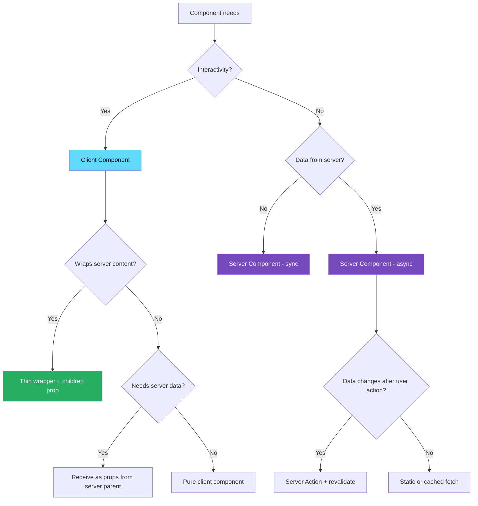
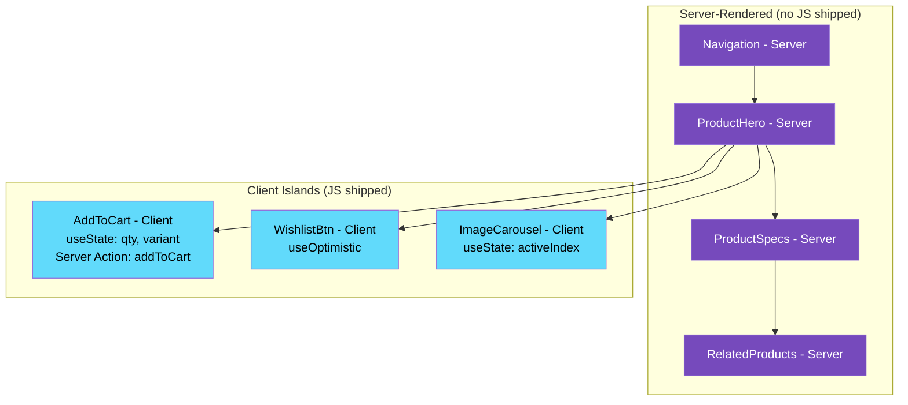

# 48 · RSC Patterns

> **React Server Components unlock architectural patterns that were impossible or impractical with the Pages Router model. These patterns — composing server and client components at any depth, fetching data at the component level, creating thin client islands around rich server content, and threading data through the tree without prop drilling — emerge naturally from the RSC model once you internalize its rules. This document catalogs the most valuable RSC patterns with concrete implementations.**

Patterns in RSC are not arbitrary conventions — each one arises from a specific constraint or capability of the server/client component model. Understanding why each pattern exists helps you recognize when to apply it and how to adapt it to your specific context.

---

## Table of Contents

- [Pattern 1: Co-located Data Fetching](#pattern-1-co-located-data-fetching)
- [Pattern 2: The Client Island Pattern](#pattern-2-the-client-island-pattern)
- [Pattern 3: Server Component as Data Provider](#pattern-3-server-component-as-data-provider)
- [Pattern 4: The Thin Client Wrapper](#pattern-4-the-thin-client-wrapper)
- [Pattern 5: Context in RSC Applications](#pattern-5-context-in-rsc-applications)
- [Pattern 6: Server Actions for Mutations](#pattern-6-server-actions-for-mutations)
- [Pattern 7: Optimistic Updates with Server Actions](#pattern-7-optimistic-updates-with-server-actions)
- [Pattern 8: Interleaved Server and Client Components](#pattern-8-interleaved-server-and-client-components)
- [Pattern 9: The Async Component Pipeline](#pattern-9-the-async-component-pipeline)
- [Pattern 10: Streaming with Priority](#pattern-10-streaming-with-priority)
- [Pattern 11: Server-Side Search and Filtering](#pattern-11-server-side-search-and-filtering)
- [Pattern 12: Authentication in RSC](#pattern-12-authentication-in-rsc)
- [Anti-Patterns to Avoid](#anti-patterns-to-avoid)
- [Architecture Diagrams](#architecture-diagrams)
- [Good Practices](#good-practices)
- [Bad Practices](#bad-practices)
- [Mental Model](#mental-model)
- [Exercises](#exercises)
- [Further Reading](#further-reading)

---

## Pattern 1: Co-located Data Fetching

Each component fetches exactly the data it needs, as close as possible to where it's displayed.

```tsx
// ❌ Old pattern: centralized data fetching + prop drilling
async function Page({ params }) {
  // Fetch everything at the top — then drill it down
  const [user, products, cart, notifications] = await Promise.all([
    fetchUser(session.userId),
    fetchProducts(params.category),
    fetchCart(session.userId),
    fetchNotifications(session.userId),
  ]);

  return (
    <Layout user={user} notifications={notifications}>
      <Header user={user} cartCount={cart.items.length} />
      <ProductGrid products={products} />
      <CartPreview cart={cart} />
    </Layout>
  );
}

// ✅ RSC pattern: each component fetches its own data
async function Page({ params }) {
  // Page fetches only its own data (the category)
  // Each child component is responsible for its own data
  return (
    <Layout>
      <Header /> {/* fetches user, cart count */}
      <ProductGrid category={params.category} /> {/* fetches products */}
      <CartPreview /> {/* fetches cart */}
    </Layout>
  );
}

// Each component is self-contained
async function Header() {
  const [user, cartCount] = await Promise.all([getUser(), getCartCount()]);
  return (
    <nav>
      <UserMenu user={user} />
      <CartIcon count={cartCount} />
    </nav>
  );
}

async function ProductGrid({ category }: { category: string }) {
  const products = await db.products.findMany({
    where: { category },
    take: 20,
  });
  return (
    <div className="grid">
      {products.map((p) => (
        <ProductCard key={p.id} product={p} />
      ))}
    </div>
  );
}
```

### Why this works

Request memoization (`React.cache()` or Next.js's extended `fetch`) ensures that if multiple components fetch the same data, the underlying request is made only once per render cycle. Co-located fetching doesn't cause N+1 queries — it enables independent parallel fetching.

---

## Pattern 2: The Client Island Pattern

Wrap only the interactive parts of a page in Client Components, leaving the surrounding content as Server Components.

```tsx
// The surrounding page is a Server Component
async function ProductPage({ params }: { params: { id: string } }) {
  const product = await db.products.findUnique({ where: { id: params.id } });
  if (!product) notFound();

  return (
    <article className="product-page">
      {/* Server: pure display, no interactivity */}
      <ProductBreadcrumbs category={product.category} />
      <ProductTitle name={product.name} />
      <ProductDescription description={product.description} />
      <ProductSpecifications specs={product.specs} />

      {/* CLIENT ISLAND: interactive commerce section */}
      <AddToCartSection
        productId={product.id}
        price={product.price}
        variants={product.variants}
        stock={product.stock}
      />

      {/* Back to server: related content */}
      <RelatedProducts category={product.category} />
    </article>
  );
}

// The client island — only the interactive commerce piece
("use client");
function AddToCartSection({
  productId,
  price,
  variants,
  stock,
}: AddToCartSectionProps) {
  const [selectedVariant, setSelectedVariant] = useState(variants[0]);
  const [quantity, setQuantity] = useState(1);
  const [isAdding, setIsAdding] = useState(false);

  const handleAddToCart = async () => {
    setIsAdding(true);
    await addToCartAction({
      productId,
      variantId: selectedVariant.id,
      quantity,
    });
    setIsAdding(false);
  };

  return (
    <div className="purchase-box">
      <PriceDisplay price={price} />{" "}
      {/* This also becomes a client component */}
      <VariantSelector
        variants={variants}
        selected={selectedVariant}
        onSelect={setSelectedVariant}
      />
      <QuantityInput value={quantity} onChange={setQuantity} max={stock} />
      <AddToCartButton onClick={handleAddToCart} loading={isAdding} />
    </div>
  );
}
```

### The island analogy

```
Server-rendered ocean:
  ProductBreadcrumbs ████████████████████████████████
  ProductTitle ████████████████████████████████████
  ProductDescription ██████████████████████████████
  ProductSpecifications █████████████████████████████

Client Island:
  ┌─────────────────────────────────────────────────┐
  │  AddToCartSection (React, state, event handlers) │
  └─────────────────────────────────────────────────┘

Server-rendered ocean:
  RelatedProducts ████████████████████████████████
```

Only the island requires React hydration. The ocean is pure HTML — no JavaScript needed.

---

## Pattern 3: Server Component as Data Provider

A Server Component fetches data and distributes it to multiple children — without prop drilling — by passing children as slots.

```tsx
// Pattern: fetch once, provide to multiple children via structure
async function UserDashboard({ userId }: { userId: string }) {
  // One fetch for the user (will be memoized if called elsewhere)
  const user = await db.users.findUnique({
    where: { id: userId },
    include: { preferences: true, subscription: true },
  });

  if (!user) redirect("/login");

  // Provide data to children via the component structure
  // Each child receives exactly what it needs
  return (
    <DashboardLayout>
      <DashboardSidebar
        userName={user.name}
        userAvatar={user.avatar}
        subscription={user.subscription.plan}
      />
      <DashboardContent>
        <WelcomeMessage userName={user.name} />
        <PreferencesPanel preferences={user.preferences} userId={user.id} />
        {/* Some children fetch their own data */}
        <RecentActivityFeed userId={user.id} />
      </DashboardContent>
    </DashboardLayout>
  );
}
```

---

## Pattern 4: The Thin Client Wrapper

A Client Component serves as a minimal interactive shell around rich Server Component content.

```tsx
// Client Component: thin — provides only the interactive behavior
"use client";
function CollapsibleSection({
  title,
  defaultOpen = true,
  children, // ← Server Component content passed in
}: CollapsibleSectionProps) {
  const [isOpen, setIsOpen] = useState(defaultOpen);

  return (
    <section className="collapsible">
      <button
        className="collapsible-toggle"
        onClick={() => setIsOpen((o) => !o)}
        aria-expanded={isOpen}
      >
        {title}
        <ChevronIcon direction={isOpen ? "up" : "down"} />
      </button>
      {isOpen && (
        <div className="collapsible-content">
          {children} {/* Server Component content renders here */}
        </div>
      )}
    </section>
  );
}

// Server Component: uses the thin wrapper
async function FAQPage() {
  const faqs = await db.faqs.findMany({ orderBy: { order: "asc" } });

  return (
    <div className="faq-page">
      {faqs.map((faq) => (
        <CollapsibleSection key={faq.id} title={faq.question}>
          {/* Server Component rendered inside Client Component shell */}
          <FAQAnswer faqId={faq.id} />
        </CollapsibleSection>
      ))}
    </div>
  );
}

// Server Component: fetches rich answer content
async function FAQAnswer({ faqId }: { faqId: string }) {
  const answer = await db.faqAnswers.findUnique({ where: { faqId } });
  return (
    <div
      className="faq-answer"
      dangerouslySetInnerHTML={{ __html: answer?.htmlContent ?? "" }}
    />
  );
}
```

The Client Component (`CollapsibleSection`) never needs to know what its content is. The Server Component (`FAQPage`) controls the structure and data. Zero JavaScript is shipped for `FAQAnswer`.

---

## Pattern 5: Context in RSC Applications

Context providers must be Client Components (they use state), but they can wrap Server Component trees via `children`.

```tsx
// The complete context pattern for RSC:

// 1. Define context + hook in a 'use client' file
// contexts/cart-context.tsx
"use client";
import { createContext, useContext, useState, useCallback } from "react";

interface CartContextValue {
  itemCount: number;
  addItem: (productId: string) => Promise<void>;
  removeItem: (productId: string) => void;
}

const CartContext = createContext<CartContextValue | null>(null);

export function CartProvider({
  children,
  initialCount,
}: {
  children: React.ReactNode;
  initialCount: number;
}) {
  const [itemCount, setItemCount] = useState(initialCount);

  const addItem = useCallback(async (productId: string) => {
    await addToCartAction(productId); // Server Action
    setItemCount((c) => c + 1);
  }, []);

  const removeItem = useCallback((productId: string) => {
    removeFromCartAction(productId); // Server Action
    setItemCount((c) => c - 1);
  }, []);

  return (
    <CartContext.Provider value={{ itemCount, addItem, removeItem }}>
      {children}
    </CartContext.Provider>
  );
}

export function useCart() {
  const ctx = useContext(CartContext);
  if (!ctx) throw new Error("useCart must be used within CartProvider");
  return ctx;
}

// 2. Initialize with server data in layout (Server Component)
// app/shop/layout.tsx
async function ShopLayout({ children }) {
  // Server Component can fetch the initial cart count
  const session = await getSession();
  const cartCount = session
    ? await db.cartItems.count({ where: { userId: session.userId } })
    : 0;

  return (
    // CartProvider is a Client Component wrapping the server tree
    <CartProvider initialCount={cartCount}>
      <ShopNavigation /> {/* Server Component */}
      {children} {/* Server Component pages */}
    </CartProvider>
  );
}

// 3. Consume in Client Components only
// 'use client'
function CartIcon() {
  const { itemCount } = useCart();
  return (
    <div className="cart-icon">
      <ShoppingBagIcon />
      {itemCount > 0 && <span className="badge">{itemCount}</span>}
    </div>
  );
}

// 'use client'
function AddToCartButton({ productId }: { productId: string }) {
  const { addItem } = useCart();
  const [isAdding, setIsAdding] = useState(false);

  const handleClick = async () => {
    setIsAdding(true);
    await addItem(productId);
    setIsAdding(false);
  };

  return (
    <button onClick={handleClick} disabled={isAdding}>
      {isAdding ? "Adding..." : "Add to Cart"}
    </button>
  );
}
```

---

## Pattern 6: Server Actions for Mutations

Server Actions are the RSC way to handle server-side mutations from client components:

```tsx
// actions/product-actions.ts
"use server";

import { revalidatePath, revalidateTag } from "next/cache";
import { redirect } from "next/navigation";

// Simple Server Action
export async function updateProductPrice(productId: string, price: number) {
  if (!isAdmin()) throw new Error("Unauthorized");

  await db.products.update({
    where: { id: productId },
    data: { price },
  });

  revalidateTag(`product-${productId}`);
  revalidatePath("/products");
}

// Server Action with form data
export async function createProduct(formData: FormData) {
  const name = formData.get("name") as string;
  const price = Number(formData.get("price"));
  const description = formData.get("description") as string;

  // Validate
  if (!name || price <= 0) {
    return { error: "Invalid product data" };
  }

  const product = await db.products.create({
    data: { name, price, description },
  });

  revalidatePath("/products");
  redirect(`/products/${product.id}`);
}

// Server Action with optimistic update support
export async function toggleWishlist(productId: string, isWishlisted: boolean) {
  const session = await getSession();
  if (!session) throw new Error("Not authenticated");

  if (isWishlisted) {
    await db.wishlist.delete({
      where: { userId_productId: { userId: session.userId, productId } },
    });
  } else {
    await db.wishlist.create({
      data: { userId: session.userId, productId },
    });
  }

  revalidateTag(`wishlist-${session.userId}`);
  return { wishlisted: !isWishlisted };
}
```

### Using Server Actions from Client Components

```tsx
"use client";
import { createProduct, updateProductPrice } from "@/actions/product-actions";
import { useActionState } from "react";

// Form-based Server Action
function CreateProductForm() {
  const [state, formAction, isPending] = useActionState(createProduct, {
    error: null,
  });

  return (
    <form action={formAction} className="product-form">
      <input name="name" placeholder="Product name" required />
      <input name="price" type="number" step="0.01" required />
      <textarea name="description" rows={4} />
      <button type="submit" disabled={isPending}>
        {isPending ? "Creating..." : "Create Product"}
      </button>
      {state?.error && <p className="error-message">{state.error}</p>}
    </form>
  );
}

// Imperative Server Action call
function PriceEditor({ productId, currentPrice }: PriceEditorProps) {
  const [price, setPrice] = useState(currentPrice);
  const [isPending, startTransition] = useTransition();

  const handleUpdate = () => {
    startTransition(async () => {
      await updateProductPrice(productId, price);
    });
  };

  return (
    <div className="price-editor">
      <input
        type="number"
        value={price}
        onChange={(e) => setPrice(Number(e.target.value))}
      />
      <button onClick={handleUpdate} disabled={isPending}>
        {isPending ? "Updating..." : "Update Price"}
      </button>
    </div>
  );
}
```

---

## Pattern 7: Optimistic Updates with Server Actions

Show immediate UI feedback before the server confirms the mutation:

```tsx
"use client";
import { useOptimistic, useTransition } from "react";
import { toggleWishlist } from "@/actions/product-actions";

function WishlistButton({ productId, initialWishlisted }: WishlistButtonProps) {
  const [isWishlisted, setOptimisticWishlist] = useOptimistic(
    initialWishlisted,
    (_currentState, newState: boolean) => newState,
  );
  const [isPending, startTransition] = useTransition();

  const handleToggle = () => {
    // Optimistic: show new state immediately
    startTransition(async () => {
      setOptimisticWishlist(!isWishlisted); // immediate UI update
      const result = await toggleWishlist(productId, isWishlisted); // server call
      // If server action fails, optimistic state is discarded automatically
    });
  };

  return (
    <button
      onClick={handleToggle}
      disabled={isPending}
      className={`wishlist-btn ${isWishlisted ? "wishlisted" : ""}`}
      aria-label={isWishlisted ? "Remove from wishlist" : "Add to wishlist"}
    >
      {isWishlisted ? "❤️" : "🤍"}
    </button>
  );
}

// Server Component provides initialWishlisted
async function ProductCard({ productId }: { productId: string }) {
  const [product, wishlistEntry] = await Promise.all([
    db.products.findUnique({ where: { id: productId } }),
    db.wishlist.findFirst({
      where: { productId, userId: session.userId },
    }),
  ]);

  return (
    <div className="product-card">
      
      <h3>{product!.name}</h3>
      <WishlistButton
        productId={productId}
        initialWishlisted={!!wishlistEntry}
      />
    </div>
  );
}
```

---

## Pattern 8: Interleaved Server and Client Components

The RSC composition model allows arbitrary interleaving of server and client components:

```tsx
// Any depth of server → client → server → client is valid

// Server: top level
async function Page() {
  return (
    <ClientAccordion>
      {" "}
      {/* Client: provides collapse toggle */}
      <ServerContent /> {/* Server: renders rich content */}
      <ClientSubAccordion>
        {" "}
        {/* Client: nested interactive */}
        <MoreServerContent /> {/* Server: even deeper */}
      </ClientSubAccordion>
    </ClientAccordion>
  );
}

// Client: just the toggle behavior
("use client");
function ClientAccordion({ children }: { children: React.ReactNode }) {
  const [open, setOpen] = useState(true);
  return (
    <div>
      <button onClick={() => setOpen((o) => !o)}>Toggle</button>
      {open && children} {/* Server content renders inside client */}
    </div>
  );
}

// Server: fetches and renders data
async function ServerContent() {
  const data = await db.getData();
  return <div>{data.content}</div>;
}
```

### Why this works (the children are server-rendered)

```
The key: children passed to Client Components are rendered on the SERVER

When React processes ClientAccordion on the server:
  1. ServerContent renders on the server → produces HTML
  2. That HTML is the "children" prop value
  3. ClientAccordion receives pre-rendered HTML as children
  4. On client: ClientAccordion hydrates (toggle works)
  5. children is already HTML — no client re-render needed

This is why: {open && children} works even for Server Component children
The children were already rendered — they're just shown/hidden via CSS
```

---

## Pattern 9: The Async Component Pipeline

Build data transformation pipelines entirely on the server:

```tsx
// Pipeline: fetch → transform → aggregate → render
// All on the server, zero client bundle impact

async function SalesReport({ dateRange }: { dateRange: DateRange }) {
  // Step 1: Fetch raw data
  const rawSales = await db.sales.findMany({
    where: {
      date: { gte: dateRange.start, lte: dateRange.end },
    },
  });

  // Step 2: Transform (could be complex computation)
  const processedSales = rawSales.map((sale) => ({
    ...sale,
    revenue: sale.quantity * sale.unitPrice * (1 - sale.discount),
    period: getPeriod(sale.date, dateRange.granularity),
  }));

  // Step 3: Aggregate
  const aggregated = aggregateSalesByPeriod(processedSales);

  // Step 4: Render (still server side)
  return (
    <ReportView
      totals={aggregated.totals}
      byPeriod={aggregated.byPeriod}
      topProducts={aggregated.topProducts.slice(0, 10)}
    />
  );
}
```

This entire pipeline runs on the server. No API endpoint. No client bundle for the aggregation library. No loading state needed (all synchronous from the browser's perspective).

---

## Pattern 10: Streaming with Priority

Structure Suspense boundaries so the most important content streams first:

```tsx
async function ArticlePage({ params }: { params: { slug: string } }) {
  // Critical: fetch headline data that affects SEO + shell
  const article = await db.articles.findUnique({
    where: { slug: params.slug },
    select: { title: true, author: true, publishedAt: true, excerpt: true },
  });

  if (!article) notFound();

  return (
    <>
      {/* PRIORITY 1: In shell — appears immediately, great for LCP/SEO */}
      <ArticleHeader
        title={article.title}
        author={article.author}
        publishedAt={article.publishedAt}
      />

      {/* PRIORITY 2: Streams quickly — main content */}
      <Suspense fallback={<ArticleBodySkeleton />}>
        <ArticleBody slug={params.slug} />
      </Suspense>

      {/* PRIORITY 3: Streams later — engagement features */}
      <Suspense fallback={<CommentsSkeleton />}>
        <CommentsSection articleId={params.slug} />
      </Suspense>

      {/* PRIORITY 4: Streams last — nice to have */}
      <Suspense fallback={<RelatedArticlesSkeleton />}>
        <RelatedArticles
          category={article.category}
          currentSlug={params.slug}
        />
      </Suspense>
    </>
  );
}
```

### Priority via selective `await`

```tsx
// Fetch critical data eagerly (blocking — waits for it)
const article = await db.articles.findUnique({ where: { slug } });

// Initiate non-critical fetches without awaiting (parallel)
const commentsPromise = db.comments.findMany({ where: { articleId: slug } });
const relatedPromise = db.articles.findMany({
  where: { category: article.category },
});

return (
  <>
    <ArticleHeader article={article} /> {/* immediate */}
    <Suspense fallback={<CommentsSkeleton />}>
      <CommentsFromPromise promise={commentsPromise} />
    </Suspense>
    <Suspense fallback={<RelatedSkeleton />}>
      <RelatedFromPromise promise={relatedPromise} />
    </Suspense>
  </>
);

// React 19: use() reads the promise
async function CommentsFromPromise({
  promise,
}: {
  promise: Promise<Comment[]>;
}) {
  const comments = await promise;
  return <CommentList comments={comments} />;
}
```

---

## Pattern 11: Server-Side Search and Filtering

Keep search and filter state in the URL, process it entirely on the server:

```tsx
// app/products/page.tsx — Server Component
interface SearchParams {
  q?: string;
  category?: string;
  minPrice?: string;
  maxPrice?: string;
  sort?: "price-asc" | "price-desc" | "rating" | "newest";
  page?: string;
}

async function ProductsPage({ searchParams }: { searchParams: SearchParams }) {
  const query = searchParams.q ?? "";
  const category = searchParams.category;
  const minPrice = searchParams.minPrice
    ? Number(searchParams.minPrice)
    : undefined;
  const maxPrice = searchParams.maxPrice
    ? Number(searchParams.maxPrice)
    : undefined;
  const sort = searchParams.sort ?? "newest";
  const page = Number(searchParams.page ?? 1);
  const pageSize = 24;

  const [products, total] = await Promise.all([
    db.products.findMany({
      where: {
        name: query ? { contains: query, mode: "insensitive" } : undefined,
        category: category ?? undefined,
        price: {
          gte: minPrice,
          lte: maxPrice,
        },
      },
      orderBy: {
        "price-asc": { price: "asc" },
        "price-desc": { price: "desc" },
        rating: { rating: "desc" },
        newest: { createdAt: "desc" },
      }[sort],
      skip: (page - 1) * pageSize,
      take: pageSize,
    }),
    db.products.count({
      where: {
        /* same filters */
      },
    }),
  ]);

  return (
    <div className="products-page">
      {/* Client Component: filter UI controls — updates URL params */}
      <ProductFilters
        currentFilters={{ query, category, minPrice, maxPrice, sort }}
      />

      {/* Server Component: renders filtered results */}
      <ProductGrid products={products} />

      {/* Client Component: pagination — updates URL params */}
      <Pagination currentPage={page} totalItems={total} pageSize={pageSize} />
    </div>
  );
}
```

```tsx
// 'use client' — filter controls that update URL (no state, URL is state)
"use client";
import { useRouter, useSearchParams } from "next/navigation";

function ProductFilters({ currentFilters }: FilterProps) {
  const router = useRouter();
  const searchParams = useSearchParams();

  const updateFilter = (key: string, value: string | null) => {
    const params = new URLSearchParams(searchParams.toString());
    if (value) params.set(key, value);
    else params.delete(key);
    params.delete("page"); // reset pagination on filter change
    router.push(`/products?${params.toString()}`);
    // This triggers a Server Component re-render with new searchParams
  };

  return (
    <aside>
      <input
        type="search"
        defaultValue={currentFilters.query}
        onChange={(e) => updateFilter("q", e.target.value)}
        placeholder="Search products..."
      />
      <CategorySelect
        value={currentFilters.category}
        onChange={(v) => updateFilter("category", v)}
      />
      {/* more filters */}
    </aside>
  );
}
```

This pattern keeps filter state in the URL (shareable, bookmarkable, back-button compatible) and processes filtering entirely on the server (no client-side computation, always fresh data).

---

## Pattern 12: Authentication in RSC

Authentication checks at multiple levels with appropriate granularity:

```tsx
// Level 1: Middleware — redirect unauthenticated users (fastest, Edge Runtime)
// middleware.ts
export function middleware(request: NextRequest) {
  if (request.nextUrl.pathname.startsWith("/dashboard")) {
    const token = request.cookies.get("auth-token");
    if (!token) {
      return NextResponse.redirect(new URL("/login", request.url));
    }
  }
}

// Level 2: Layout — verify session, provide user to children
// app/dashboard/layout.tsx
async function DashboardLayout({ children }) {
  const session = await getSession();
  if (!session) redirect("/login"); // additional server-side check

  return <DashboardShell user={session.user}>{children}</DashboardShell>;
}

// Level 3: Server Action — verify permissions before mutation
// actions/admin-actions.ts
("use server");
export async function deleteProduct(productId: string) {
  const session = await getSession();
  if (!session) throw new Error("Unauthenticated");
  if (!session.user.isAdmin) throw new Error("Unauthorized");

  await db.products.delete({ where: { id: productId } });
  revalidatePath("/admin/products");
}

// Level 4: Data access — row-level security
// lib/data-access.ts
export async function getUserOrders(targetUserId: string) {
  const session = await getSession();

  // Users can only access their own orders (unless admin)
  if (!session?.user.isAdmin && session?.userId !== targetUserId) {
    throw new Error("Forbidden");
  }

  return db.orders.findMany({ where: { userId: targetUserId } });
}
```

---

## Anti-Patterns to Avoid

### Anti-Pattern 1: Using state to cache server data in client components

```tsx
// ❌ Client-side caching of server data
"use client";
function ProductCatalog() {
  const [products, setProducts] = useState<Product[]>([]);
  const [lastFetched, setLastFetched] = useState(0);

  useEffect(() => {
    if (Date.now() - lastFetched > 60000) {
      fetch("/api/products")
        .then((r) => r.json())
        .then((data) => {
          setProducts(data);
          setLastFetched(Date.now());
        });
    }
  }, [lastFetched]);

  return <ProductGrid products={products} />;
}
// Issues: manual cache management, stale state risk, client bundle includes caching logic

// ✅ Let Next.js data cache handle it
async function ProductCatalog() {
  const products = await fetch("/api/products", {
    next: { revalidate: 60 },
  }).then((r) => r.json());
  return <ProductGrid products={products} />;
}
// Server-side: automatic caching, no client state, no JavaScript
```

### Anti-Pattern 2: Passing raw DB models to client components

```tsx
// ❌ Entire DB model passed to client (includes sensitive fields)
async function UserProfile({ userId }: { userId: string }) {
  const user = await db.users.findUnique({ where: { id: userId } });

  return (
    <ProfileEditor user={user} /> // passes ALL fields including hashed_password!
  );
}

// ✅ Select only what the client needs
async function UserProfile({ userId }: { userId: string }) {
  const user = await db.users.findUnique({
    where: { id: userId },
    select: {
      id: true,
      name: true,
      email: true,
      avatar: true,
      bio: true,
      // NOT: hashedPassword, secretKey, internalFlags
    },
  });

  return <ProfileEditor user={user} />;
}
```

### Anti-Pattern 3: Server Actions that don't validate auth

```tsx
// ❌ No auth check in Server Action
"use server";
export async function deleteUser(userId: string) {
  // ANYONE can call this — including malicious actors
  await db.users.delete({ where: { id: userId } });
}

// ✅ Always validate in Server Actions
("use server");
export async function deleteUser(userId: string) {
  const session = await getSession();
  if (!session?.user.isAdmin) {
    throw new Error("Unauthorized");
  }
  await db.users.delete({ where: { id: userId } });
}
```

---

## Architecture Diagrams

### Pattern decision tree for RSC



### The client island architecture



---

## Good Practices

### ✅ Good Practice — Complete e-commerce product page with proper RSC patterns

```tsx
/**
 * Good: Full product page using RSC patterns correctly.
 * Server components handle all data fetching.
 * Client islands are minimal and precisely targeted.
 * URL is the source of truth for search/filter state.
 * Server Actions handle mutations with proper auth.
 */

// Server Component: fetches critical data synchronously (in shell)
async function ProductPage({ params }: { params: { id: string } }) {
  const [product, session] = await Promise.all([
    db.products.findUnique({
      where: { id: params.id },
      select: {
        id: true,
        name: true,
        price: true,
        description: true,
        category: true,
        specs: true,
        images: true,
      },
    }),
    getSession(),
  ]);

  if (!product) notFound();

  const isWishlisted = session
    ? !!(await db.wishlist.findFirst({
        where: { userId: session.userId, productId: product.id },
      }))
    : false;

  return (
    <article itemScope itemType="https://schema.org/Product">
      {/* Schema.org + Shell: critical for SEO */}
      <meta itemProp="name" content={product.name} />
      <meta itemProp="price" content={String(product.price)} />

      {/* Server: gallery structure (images loaded via next/image) */}
      <ProductGallery images={product.images} />

      <div className="product-info">
        {/* Server: SEO content in shell */}
        <h1 itemProp="name">{product.name}</h1>
        <ProductPrice price={product.price} />
        <ProductRating productId={product.id} /> {/* async server component */}
        {/* Client Island 1: Purchase interaction */}
        <AddToCartSection
          productId={product.id}
          price={product.price}
          isAuthenticated={!!session}
        />
        {/* Client Island 2: Wishlist toggle */}
        <WishlistButton
          productId={product.id}
          initialWishlisted={isWishlisted}
          isAuthenticated={!!session}
        />
      </div>

      {/* Server: rich description, SEO-important */}
      <ProductDescription
        description={product.description}
        specs={product.specs}
      />

      {/* Suspense: reviews stream independently */}
      <Suspense fallback={<ReviewsSkeleton />}>
        <ProductReviews productId={product.id} userId={session?.userId} />
      </Suspense>

      {/* Suspense: related products stream last */}
      <Suspense fallback={<RelatedSkeleton />}>
        <RelatedProducts category={product.category} excludeId={product.id} />
      </Suspense>
    </article>
  );
}
```

---

## Bad Practices

### ⚠️ Bad Practice — Using 'use client' at the layout level

```tsx
/**
 * Bad: 'use client' at layout level makes everything below it a client component.
 * The original issue: layout needs a toast notification system (requires state).
 * The wrong solution: make the entire layout a client component.
 * The right solution: extract only the toast system as a client component.
 */

// ❌ Entire layout as client component
"use client"; // ← WRONG: this makes the entire page tree client-side
import { useState } from "react";

function RootLayout({ children }: { children: React.ReactNode }) {
  const [toasts, setToasts] = useState<Toast[]>([]);

  // All children are now client components:
  // - Header (now client, was server)
  // - all pages (now client, were server)
  // - Footer (now client, was server)
  // No component in {children} can be a server component anymore

  return (
    <html>
      <body>
        <Header />
        {children}
        <Footer />
        <ToastContainer toasts={toasts} />
      </body>
    </html>
  );
}

/**
 * ✅ Fix: Extract only the toast system as a client component
 * Layout remains a Server Component
 */
// layout.tsx — Server Component (no 'use client')
function RootLayout({ children }: { children: React.ReactNode }) {
  return (
    <html>
      <body>
        <Header /> {/* Server Component */}
        {children} {/* Server Component pages */}
        <Footer /> {/* Server Component */}
        <ToastProvider /> {/* Client Component — but isolated */}
      </body>
    </html>
  );
}

// toast-provider.tsx
("use client");
function ToastProvider() {
  // Toast state isolated in this client component
  const [toasts, setToasts] = useState<Toast[]>([]);
  // ... toast management
  return <ToastContainer toasts={toasts} />;
}
```

**Production impact:** A team discovered their entire Next.js App Router migration had no Server Components because their root layout had `'use client'`. Their bundle was as large as the Pages Router equivalent. All data fetching was client-side. The fix: move the problematic state (UI toast notifications) to a dedicated client component, remove `'use client'` from the layout.

---

## Mental Model

> 💡 **The RSC patterns mental model:**
>
> Think of RSC architecture like a **city's infrastructure**. Server Components are the buildings — they exist on the land (server), have real resources (databases), and stay in place (run once). Client Components are the mobile vehicles — they move (re-render), carry passengers (state), and respond to road conditions (user interactions). Patterns are like city planning rules: traffic lights (client islands) are placed at intersections where roads need coordination, not on every building. Roads (props) only carry passengers who fit in the vehicle (serializable data). Warehouses (databases) are accessed from buildings, not from the road (no DB in Client Components). The goal: buildings where people live and work, vehicles for getting around, infrastructure that connects them efficiently.

---

## Exercises

### Exercise 1 — Refactor a client-heavy page

Take a Next.js page where the entire component is a Client Component:

```tsx
"use client";
function ProductList() {
  const [products, setProducts] = useState([]);
  const [filter, setFilter] = useState("all");
  const [searchQuery, setSearchQuery] = useState("");

  useEffect(() => {
    fetch(`/api/products?filter=${filter}&q=${searchQuery}`)
      .then((r) => r.json())
      .then(setProducts);
  }, [filter, searchQuery]);

  return (
    <>
      <SearchBar query={searchQuery} onSearch={setSearchQuery} />
      <FilterBar filter={filter} onFilter={setFilter} />
      <ProductGrid products={products} />
    </>
  );
}
```

Refactor to:

1. Move filter/search state to URL searchParams
2. Make ProductList a Server Component
3. Keep only SearchBar and FilterBar as Client Components (they update URL)

### Exercise 2 — Implement the complete Server Action flow

Build a comment system:

1. Server Component: display comments (fetch from DB)
2. Client Component: comment form (useState for input)
3. Server Action: create comment (validate, save, revalidate)
4. Optimistic update: new comment appears immediately

Verify: comment appears before server responds, stays if server succeeds, disappears if server fails.

### Exercise 3 — Measure the bundle size impact

Compare two implementations:

1. A data table that uses a Client Component with useEffect for data fetching
2. The same data table as a Server Component with direct DB access

Build both with `next build` and compare:

- `.next/analyze` bundle analysis
- How much JavaScript is in each bundle?
- What is the difference in LCP?

---

## Further Reading

- [Next.js docs: Rendering Patterns](https://nextjs.org/docs/app/building-your-application/rendering/composition-patterns) — Official patterns guide
- [React Docs: Passing Data Deeply Without Prop Drilling](https://react.dev/learn/passing-data-deeply-with-context) — Context patterns in RSC
- [Next.js: Server Actions](https://nextjs.org/docs/app/building-your-application/data-fetching/server-actions-and-mutations) — Complete Server Actions guide
- [Josh Comeau: Making Sense of React Server Components](https://www.joshwcomeau.com/react/server-components/) — Visual pattern guide
- [Leerob: App Router Examples](https://github.com/leerob/next-saas-starter) — Production RSC patterns
- Next in this handbook: [49 · RSC Composition](./05-patterns.md)

---

_Part of the [React + Next.js Engineering Handbook](../../README.md)_
