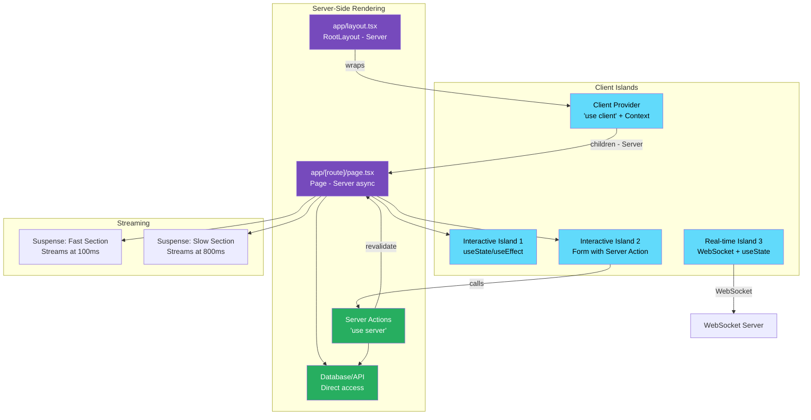

# 49 · RSC Composition

> **RSC composition is the art of combining server and client components into cohesive, performant, and maintainable application architectures. While individual patterns address specific scenarios, composition is about how those patterns combine — how a server-rendered data layer feeds client islands, how streaming boundaries divide the page, how Server Actions close the loop from client mutations back to server state, and how authentication threads through the entire stack. This document addresses the advanced composition scenarios that emerge in production-scale applications.**

The patterns in this document address real problems encountered when building large Next.js App Router applications: dynamic route layouts that maintain state, complex data dependencies across component boundaries, multi-step forms with server validation, and coordinating optimistic updates with cache invalidation. Each pattern is motivated by a concrete problem and demonstrates the RSC-native solution.

---

## Table of Contents

- [Composing Layouts with Dynamic Data](#composing-layouts-with-dynamic-data)
- [The Shared Data Pattern](#the-shared-data-pattern)
- [Multi-Step Form Composition](#multi-step-form-composition)
- [Real-Time Data with RSC](#real-time-data-with-rsc)
- [Complex Navigation with Persistent State](#complex-navigation-with-persistent-state)
- [Role-Based UI Composition](#role-based-ui-composition)
- [Dynamic Component Loading](#dynamic-component-loading)
- [Composing with Third-Party Libraries](#composing-with-third-party-libraries)
- [Error Boundaries and Fallback Composition](#error-boundaries-and-fallback-composition)
- [Infinite Scroll with RSC](#infinite-scroll-with-rsc)
- [Modal Composition with RSC](#modal-composition-with-rsc)
- [Testing RSC Compositions](#testing-rsc-compositions)
- [Architecture Diagrams](#architecture-diagrams)
- [Good Practices](#good-practices)
- [Bad Practices](#bad-practices)
- [Mental Model](#mental-model)
- [Exercises](#exercises)
- [Further Reading](#further-reading)

---

## Composing Layouts with Dynamic Data

Layouts need persistent state (they don't remount on navigation) while also needing fresh data on some navigations. The solution: layouts fetch data that changes rarely, pages fetch data that changes often.

```tsx
// app/workspace/[workspaceId]/layout.tsx
// This layout persists across all /workspace/:id/* routes
async function WorkspaceLayout({
  children,
  params,
}: {
  children: React.ReactNode;
  params: { workspaceId: string };
}) {
  // Layout fetches workspace data — changes rarely, appropriate for layout
  const workspace = await db.workspaces.findUnique({
    where: { id: params.workspaceId },
    include: {
      members: { select: { id: true, name: true, avatar: true, role: true } },
      channels: {
        select: { id: true, name: true, type: true, unreadCount: true },
      },
    },
  });

  if (!workspace) notFound();

  // Verify access
  const session = await getSession();
  const member = workspace.members.find((m) => m.id === session?.userId);
  if (!member) redirect("/unauthorized");

  return (
    <div className="workspace-layout">
      {/* Sidebar: uses workspace data from layout */}
      <WorkspaceSidebar
        workspace={workspace}
        currentUserId={session!.userId}
        currentUserRole={member.role}
      />

      <main className="workspace-content">
        {/* children: page-specific content, loads fresh per navigation */}
        {children}
      </main>
    </div>
  );
}
```

### The layout/page data boundary

```
Layout data (loaded once, persists):
  ✅ Workspace metadata (name, settings)
  ✅ Navigation structure (channels, members)
  ✅ Current user's role and permissions
  ✅ Feature flags

Page data (loaded on each navigation):
  ✅ Content of the current channel
  ✅ Messages in the current thread
  ✅ Current document being edited
  ✅ Any data specific to the current route
```

---

## The Shared Data Pattern

When multiple components at different levels need the same data, avoid redundant fetches using `React.cache()`:

```tsx
// lib/data/user.ts
import { cache } from "react";
import { getSession } from "@/lib/auth";

// cache() creates a per-request memoized function
// All calls to getAuthenticatedUser() with the same args return the same Promise
export const getAuthenticatedUser = cache(async () => {
  const session = await getSession();
  if (!session) return null;

  return db.users.findUnique({
    where: { id: session.userId },
    select: {
      id: true,
      name: true,
      email: true,
      avatar: true,
      role: true,
      preferences: true,
      subscription: true,
    },
  });
});

export const getUserWorkspaces = cache(async (userId: string) => {
  return db.workspaces.findMany({
    where: { members: { some: { userId } } },
    include: { _count: { select: { members: true } } },
  });
});
```

```tsx
// Multiple components call getAuthenticatedUser() — only ONE DB query happens
// This is request memoization: identical function calls return same Promise

// app/layout.tsx
async function RootLayout({ children }) {
  const user = await getAuthenticatedUser(); // DB query #1
  return (
    <html>
      <body>
        <TopNav user={user} /> {/* TopNav also calls getAuthenticatedUser() */}
        {children}
      </body>
    </html>
  );
}

// components/top-nav.tsx
async function TopNav({ user }: { user: User | null }) {
  // This call is deduplicated — returns same Promise as layout's call
  const user = await getAuthenticatedUser(); // no additional DB query!
  const workspaces = await getUserWorkspaces(user.id); // DB query #2

  return (
    <nav>
      <UserMenu user={user} workspaces={workspaces} />
    </nav>
  );
}

// app/dashboard/page.tsx
async function DashboardPage() {
  const user = await getAuthenticatedUser(); // still deduplicated
  const workspaces = await getUserWorkspaces(user.id); // also deduplicated

  return <DashboardContent user={user} workspaces={workspaces} />;
}

// Total DB queries for this render: 2 (user + workspaces)
// Not: 6 (3 × user + 3 × workspaces)
```

---

## Multi-Step Form Composition

Server Actions, optimistic updates, and Suspense compose to create forms that feel native while processing on the server:

```tsx
// A multi-step product creation wizard
// Step state in URL searchParams, each step is a Server Action

// app/products/new/page.tsx
async function NewProductPage({
  searchParams,
}: {
  searchParams: { step?: string };
}) {
  const step = Number(searchParams.step ?? 1);

  // Load saved draft if it exists
  const session = await getSession();
  const draft = await db.productDrafts.findFirst({
    where: { userId: session!.userId, status: "draft" },
    orderBy: { updatedAt: "desc" },
  });

  return (
    <div className="wizard">
      <WizardProgress currentStep={step} totalSteps={4} />

      {step === 1 && <ProductBasicsStep draft={draft} />}
      {step === 2 && <ProductPricingStep draft={draft} />}
      {step === 3 && <ProductImagesStep draft={draft} />}
      {step === 4 && <ProductReviewStep draft={draft} />}
    </div>
  );
}

// Step 1: Basic information
function ProductBasicsStep({ draft }: { draft: ProductDraft | null }) {
  return (
    <form action={saveBasicsAction} className="step-form">
      <input type="hidden" name="draftId" value={draft?.id ?? ""} />
      <input
        name="name"
        defaultValue={draft?.name ?? ""}
        placeholder="Product name"
      />
      <textarea name="description" defaultValue={draft?.description ?? ""} />
      <CategorySelector name="category" defaultValue={draft?.category ?? ""} />
      <button type="submit">Save & Continue</button>
    </form>
  );
}

// Server Action: saves step and advances
// actions/product-wizard.ts
("use server");
export async function saveBasicsAction(formData: FormData) {
  const session = await getSession();
  if (!session) throw new Error("Not authenticated");

  const draftId = formData.get("draftId") as string;
  const name = formData.get("name") as string;
  const description = formData.get("description") as string;
  const category = formData.get("category") as string;

  if (draftId) {
    await db.productDrafts.update({
      where: { id: draftId },
      data: { name, description, category, updatedAt: new Date() },
    });
  } else {
    const draft = await db.productDrafts.create({
      data: {
        userId: session.userId,
        name,
        description,
        category,
        status: "draft",
      },
    });
    // On first step, redirect with new draftId (future URL could encode draft ID)
  }

  redirect("/products/new?step=2"); // advance to next step
}
```

---

## Real-Time Data with RSC

RSC handles initial data loading. For real-time updates, combine with client-side subscriptions:

```tsx
// Server Component: loads initial state
async function ChatRoom({ roomId }: { roomId: string }) {
  const [room, messages] = await Promise.all([
    db.rooms.findUnique({ where: { id: roomId } }),
    db.messages.findMany({
      where: { roomId },
      orderBy: { createdAt: "desc" },
      take: 50,
      include: { author: { select: { id: true, name: true, avatar: true } } },
    }),
  ]);

  if (!room) notFound();

  return (
    <div className="chat-room">
      <RoomHeader room={room} />
      {/* Client Component: manages real-time updates */}
      <LiveMessageFeed
        roomId={roomId}
        initialMessages={messages.reverse()} // chronological order
      />
    </div>
  );
}

// Client Component: initial messages + WebSocket for updates
("use client");
function LiveMessageFeed({
  roomId,
  initialMessages,
}: {
  roomId: string;
  initialMessages: Message[];
}) {
  const [messages, setMessages] = useState(initialMessages);

  useEffect(() => {
    const ws = new WebSocket(`wss://chat.example.com/rooms/${roomId}`);

    ws.onmessage = (event) => {
      const newMessage = JSON.parse(event.data);
      setMessages((prev) => [...prev, newMessage]);
    };

    return () => ws.close();
  }, [roomId]);

  return (
    <div className="message-list">
      {messages.map((msg) => (
        <MessageBubble key={msg.id} message={msg} />
      ))}
      <MessageInput
        onSend={async (text) => {
          await sendMessageAction(roomId, text); // Server Action
        }}
      />
    </div>
  );
}
```

---

## Complex Navigation with Persistent State

The sidebar state (open/closed, selected item) should persist across navigation. The selected item comes from the URL (not local state):

```tsx
// The dashboard shell: persistent sidebar + dynamic content
"use client";
function DashboardShell({
  children,
  navigationItems,
}: {
  children: React.ReactNode;
  navigationItems: NavItem[];
}) {
  const [sidebarCollapsed, setSidebarCollapsed] = useState(false);
  const pathname = usePathname();

  return (
    <div className={`dashboard ${sidebarCollapsed ? "sidebar-collapsed" : ""}`}>
      <aside className="sidebar">
        <button
          className="collapse-btn"
          onClick={() => setSidebarCollapsed((c) => !c)}
        >
          {sidebarCollapsed ? "→" : "←"}
        </button>

        <nav>
          {navigationItems.map((item) => (
            <Link
              key={item.href}
              href={item.href}
              className={pathname === item.href ? "active" : ""}
            >
              <item.icon />
              {!sidebarCollapsed && <span>{item.label}</span>}
            </Link>
          ))}
        </nav>
      </aside>

      <main className="dashboard-content">
        {children} {/* Server Component pages stream in here */}
      </main>
    </div>
  );
}

// app/dashboard/layout.tsx — Server Component
async function DashboardLayout({ children }) {
  const user = await getAuthenticatedUser();
  if (!user) redirect("/login");

  const navItems = getNavItemsForRole(user.role);

  return (
    // Client Component shell (persistent) wrapping Server Component children
    <DashboardShell navigationItems={navItems}>{children}</DashboardShell>
  );
}
```

---

## Role-Based UI Composition

Show different UI based on user role — entirely on the server:

```tsx
// Server Component: role-based rendering
async function AdminPanel({ resourceId }: { resourceId: string }) {
  const [user, resource] = await Promise.all([
    getAuthenticatedUser(),
    db.resources.findUnique({ where: { id: resourceId } }),
  ]);

  if (!resource) notFound();

  return (
    <div className="resource-view">
      {/* All users see basic info */}
      <ResourceInfo resource={resource} />

      {/* Moderators see moderation tools */}
      {(user?.role === "moderator" || user?.role === "admin") && (
        <ModerationTools resourceId={resourceId} />
      )}

      {/* Admins see administrative tools */}
      {user?.role === "admin" && (
        <AdminTools resourceId={resourceId} ownerId={resource.ownerId} />
      )}

      {/* Owner sees ownership controls */}
      {user?.id === resource.ownerId && (
        <OwnerControls resourceId={resourceId} />
      )}
    </div>
  );
}
```

### Why server-side role checks are critical

```tsx
// ❌ Client-side role checks: security theater
// The API endpoint must ALSO check — client check is just UX
"use client";
function DeleteButton({ resourceId, userRole }) {
  if (userRole !== "admin") return null; // Doesn't prevent API calls!

  return <button onClick={() => deleteViaAPI(resourceId)}>Delete</button>;
}

// ✅ Server-side rendering: UI never shown to unauthorized users
// AND Server Actions enforce permissions on every call
async function ServerSideDeleteButton({ resourceId }) {
  const user = await getAuthenticatedUser();
  if (user?.role !== "admin") return null; // Not rendered at all

  return (
    <form
      action={async () => {
        "use server";
        const u = await getAuthenticatedUser();
        if (u?.role !== "admin") throw new Error("Unauthorized"); // Double check
        await db.resources.delete({ where: { id: resourceId } });
      }}
    >
      <button type="submit">Delete</button>
    </form>
  );
}
```

---

## Dynamic Component Loading

Load components conditionally based on server-side logic:

```tsx
// Load different chart implementations based on data size
async function DataChart({ datasetId }: { datasetId: string }) {
  const dataset = await db.datasets.findUnique({
    where: { id: datasetId },
    include: { _count: { select: { dataPoints: true } } },
  });

  const pointCount = dataset!._count.dataPoints;

  if (pointCount > 100000) {
    // Large dataset: use canvas-based chart (better performance)
    const { CanvasChart } = await import("./canvas-chart");
    const data = await db.dataPoints.findMany({
      where: { datasetId },
      select: { x: true, y: true }, // minimal fields for large datasets
    });
    return <CanvasChart data={data} />;
  }

  if (pointCount > 1000) {
    // Medium dataset: use SVG with virtualization
    const { VirtualizedSvgChart } = await import("./virtualized-svg-chart");
    const data = await db.dataPoints.findMany({ where: { datasetId } });
    return <VirtualizedSvgChart data={data} />;
  }

  // Small dataset: full-featured interactive chart
  const { InteractiveChart } = await import("./interactive-chart");
  const data = await db.dataPoints.findMany({
    where: { datasetId },
    include: { metadata: true }, // richer data for small datasets
  });
  return <InteractiveChart data={data} />;
}
```

This dynamic import works at the component level in Server Components — the unused chart implementations don't add to the bundle (and the non-client ones don't even need to be bundled at all).

---

## Composing with Third-Party Libraries

Wrapping libraries that aren't RSC-compatible:

```tsx
// Map component from a library that uses browser APIs
// Must be wrapped in 'use client' and lazy-loaded

// components/map-wrapper.tsx
"use client";
import { useEffect, useRef, useState } from "react";

interface MapProps {
  latitude: number;
  longitude: number;
  zoom?: number;
  markers?: Array<{ lat: number; lng: number; label: string }>;
}

function MapWrapper({
  latitude,
  longitude,
  zoom = 13,
  markers = [],
}: MapProps) {
  const mapRef = useRef<HTMLDivElement>(null);
  const [mapInstance, setMapInstance] = useState<any>(null);

  useEffect(() => {
    // Dynamic import: the map library is only loaded client-side
    import("leaflet").then((L) => {
      if (!mapRef.current || mapInstance) return;

      const map = L.map(mapRef.current).setView([latitude, longitude], zoom);
      L.tileLayer("https://{s}.tile.openstreetmap.org/{z}/{x}/{y}.png").addTo(
        map,
      );

      markers.forEach(({ lat, lng, label }) => {
        L.marker([lat, lng]).addTo(map).bindPopup(label);
      });

      setMapInstance(map);
    });

    return () => {
      mapInstance?.remove();
    };
  }, []); // Initialize once

  return (
    <div ref={mapRef} className="map-container" style={{ height: "400px" }} />
  );
}

// Server Component: uses MapWrapper with server-fetched data
async function LocationPage({ locationId }: { locationId: string }) {
  const location = await db.locations.findUnique({
    where: { id: locationId },
    include: { nearbyPlaces: { take: 10 } },
  });

  return (
    <div>
      <h1>{location!.name}</h1>
      <p>{location!.description}</p>

      {/* Map is lazy-loaded (no SSR for Leaflet — browser APIs only) */}
      <Suspense fallback={<div className="map-skeleton" />}>
        <MapWrapper
          latitude={location!.lat}
          longitude={location!.lng}
          markers={location!.nearbyPlaces.map((p) => ({
            lat: p.lat,
            lng: p.lng,
            label: p.name,
          }))}
        />
      </Suspense>
    </div>
  );
}
```

---

## Error Boundaries and Fallback Composition

Composing error boundaries for graceful degradation:

```tsx
// Layered error boundary strategy
async function ProductPage({ params }: { params: { id: string } }) {
  return (
    <>
      {/* Critical: must succeed or show error for entire page */}
      <ProductHero productId={params.id} />{" "}
      {/* no error boundary — propagates up */}
      {/* Non-critical: failure shows inline fallback */}
      <Suspense fallback={<ReviewsSkeleton />}>
        <ErrorBoundary
          fallback={<ReviewsUnavailable />}
          onError={(error) => logError(error, { productId: params.id })}
        >
          <ProductReviews productId={params.id} />
        </ErrorBoundary>
      </Suspense>
      {/* Very non-critical: failure is silently ignored */}
      <Suspense fallback={null}>
        <ErrorBoundary fallback={null}>
          {" "}
          {/* null = no error UI */}
          <ABTestVariant productId={params.id} />
        </ErrorBoundary>
      </Suspense>
    </>
  );
}

// Client-side error boundary (React class component or use-error-boundary)
("use client");
class ErrorBoundary extends React.Component<
  {
    children: React.ReactNode;
    fallback: React.ReactNode;
    onError?: (error: Error) => void;
  },
  { hasError: boolean }
> {
  state = { hasError: false };

  static getDerivedStateFromError() {
    return { hasError: true };
  }

  componentDidCatch(error: Error, info: React.ErrorInfo) {
    this.props.onError?.(error);
    console.error("Component error:", error, info);
  }

  render() {
    if (this.state.hasError) return this.props.fallback;
    return this.props.children;
  }
}
```

---

## Infinite Scroll with RSC

Combining server-rendered initial content with client-side loading:

```tsx
// Server Component: initial page of results
async function ProductListPage({
  searchParams,
}: {
  searchParams: { cursor?: string };
}) {
  const products = await db.products.findMany({
    take: 24,
    skip: searchParams.cursor ? 1 : 0,
    cursor: searchParams.cursor ? { id: searchParams.cursor } : undefined,
    orderBy: { createdAt: "desc" },
  });

  const nextCursor = products.length === 24 ? products[23].id : null;

  return (
    <div>
      <ProductGrid products={products} />
      {/* Client Component handles infinite scroll */}
      {nextCursor && (
        <InfiniteScrollTrigger
          nextCursor={nextCursor}
          loadMoreUrl={`/api/products`}
        />
      )}
    </div>
  );
}

// Client Component: loads more on scroll
("use client");
function InfiniteScrollTrigger({
  nextCursor,
  loadMoreUrl,
}: {
  nextCursor: string;
  loadMoreUrl: string;
}) {
  const [products, setProducts] = useState<Product[]>([]);
  const [cursor, setCursor] = useState(nextCursor);
  const [isLoading, setIsLoading] = useState(false);
  const [hasMore, setHasMore] = useState(true);
  const triggerRef = useRef<HTMLDivElement>(null);

  useEffect(() => {
    const observer = new IntersectionObserver(async (entries) => {
      if (entries[0].isIntersecting && hasMore && !isLoading) {
        setIsLoading(true);
        const response = await fetch(`${loadMoreUrl}?cursor=${cursor}`);
        const data = await response.json();

        setProducts((prev) => [...prev, ...data.products]);
        setCursor(data.nextCursor);
        setHasMore(!!data.nextCursor);
        setIsLoading(false);
      }
    });

    if (triggerRef.current) observer.observe(triggerRef.current);
    return () => observer.disconnect();
  }, [cursor, hasMore, isLoading]);

  return (
    <>
      {products.map((p) => (
        <ProductCard key={p.id} product={p} />
      ))}
      <div ref={triggerRef} className="scroll-trigger">
        {isLoading && <LoadingSpinner />}
      </div>
    </>
  );
}
```

---

## Modal Composition with RSC

Modals that have their own URLs (shareable, deep-linkable) using parallel routes and intercepting routes:

```tsx
// app/products/page.tsx — The product list (shell)
async function ProductsPage() {
  const products = await db.products.findMany({ take: 20 });
  return (
    <div className="products-grid">
      {products.map((product) => (
        // Link to /products/[id] — intercepted when within /products context
        <Link key={product.id} href={`/products/${product.id}`}>
          <ProductCard product={product} />
        </Link>
      ))}
    </div>
  );
}

// app/products/layout.tsx — Has @modal slot
async function ProductsLayout({
  children,
  modal, // @modal slot
}: {
  children: React.ReactNode;
  modal: React.ReactNode;
}) {
  return (
    <>
      {children}
      {modal} {/* Modal renders here when intercepting route is active */}
    </>
  );
}

// app/products/@modal/default.tsx
export default function ModalDefault() {
  return null; // No modal by default
}

// app/products/@modal/(.)products/[id]/page.tsx — Intercepted modal
async function ProductModal({ params }: { params: { id: string } }) {
  const product = await db.products.findUnique({ where: { id: params.id } });

  return <ProductModalClient product={product!} />;
}

// The modal UI is a Client Component (needs to close on click)
("use client");
function ProductModalClient({ product }: { product: Product }) {
  const router = useRouter();

  return (
    <div className="modal-overlay" onClick={() => router.back()}>
      <div className="modal-content" onClick={(e) => e.stopPropagation()}>
        <button onClick={() => router.back()}>✕</button>
        <h2>{product.name}</h2>
        <p>${product.price}</p>
        <AddToCartButton productId={product.id} price={product.price} />
      </div>
    </div>
  );
}

// app/products/[id]/page.tsx — Full page when accessed directly
async function ProductPage({ params }: { params: { id: string } }) {
  const product = await db.products.findUnique({ where: { id: params.id } });
  // Full page layout — not a modal
  return <FullProductPage product={product!} />;
}
```

---

## Testing RSC Compositions

Testing Server Components requires different approaches than testing Client Components:

```tsx
// Testing Server Components with next-experimental-testing or custom setup

// Test 1: Unit test the data fetching logic separately
// lib/data/products.test.ts
describe("fetchProduct", () => {
  it("returns product with correct fields", async () => {
    const product = await fetchProduct("test-id");
    expect(product).toMatchObject({
      id: "test-id",
      name: expect.any(String),
      price: expect.any(Number),
    });
  });

  it("returns null for non-existent product", async () => {
    const product = await fetchProduct("non-existent");
    expect(product).toBeNull();
  });
});

// Test 2: Integration test using React's test utilities (experimental)
// components/__tests__/product-page.test.tsx
import { render } from "@testing-library/react";
import { ProductPage } from "../product-page";

// For Server Components: render and check output
test("ProductPage renders product name", async () => {
  // Mock the DB call
  vi.mock("@/lib/db", () => ({
    db: {
      products: {
        findUnique: vi.fn().mockResolvedValue({
          id: "123",
          name: "Test Product",
          price: 29.99,
        }),
      },
    },
  }));

  const jsx = await ProductPage({ params: { id: "123" } });
  const { getByText } = render(jsx);

  expect(getByText("Test Product")).toBeInTheDocument();
  expect(getByText("$29.99")).toBeInTheDocument();
});

// Test 3: Client Component tests work normally
// components/__tests__/add-to-cart.test.tsx
import { render, fireEvent } from "@testing-library/react";
import { AddToCartButton } from "../add-to-cart-button";

test("AddToCartButton calls server action on click", async () => {
  const mockAddToCart = vi.fn();
  vi.mock("@/actions/cart-actions", () => ({ addToCart: mockAddToCart }));

  const { getByRole } = render(
    <AddToCartButton productId="123" price={29.99} />,
  );

  fireEvent.click(getByRole("button"));
  await waitFor(() => expect(mockAddToCart).toHaveBeenCalledWith("123", 1));
});
```

---

## Architecture Diagrams

### Complete RSC application architecture



---

## Good Practices

### ✅ Good Practice — Complete RSC composition for a SaaS dashboard

```tsx
/**
 * Good: Full SaaS dashboard using all RSC composition patterns.
 * - Layout: persistent, loads workspace data once
 * - Pages: load route-specific data freshly
 * - Server Actions: handle all mutations with proper auth
 * - Client islands: only for interactive UI
 * - Streaming: critical path fast, secondary content streams
 * - Error handling: graceful degradation at each level
 */

// app/(app)/workspaces/[workspaceId]/layout.tsx
async function WorkspaceLayout({
  children,
  params,
}: {
  children: React.ReactNode;
  params: { workspaceId: string };
}) {
  const [user, workspace] = await Promise.all([
    getAuthenticatedUser(),
    db.workspaces.findUnique({
      where: { id: params.workspaceId },
      include: {
        projects: { select: { id: true, name: true, status: true } },
        members: { where: { userId: user?.id } },
      },
    }),
  ]);

  if (!user || !workspace?.members.length) redirect("/unauthorized");

  return (
    // Client shell: sidebar state persists
    <WorkspaceShell workspace={workspace} user={user}>
      {children}
    </WorkspaceShell>
  );
}

// app/(app)/workspaces/[workspaceId]/projects/[projectId]/page.tsx
async function ProjectPage({
  params,
}: {
  params: { workspaceId: string; projectId: string };
}) {
  const project = await db.projects.findUnique({
    where: { id: params.projectId, workspaceId: params.workspaceId },
    select: {
      id: true,
      name: true,
      description: true,
      status: true,
      dueDate: true,
    },
  });

  if (!project) notFound();

  return (
    <article>
      {/* Shell: critical project info */}
      <ProjectHeader project={project} />
      <ProjectStatus
        projectId={project.id}
        status={project.status}
        dueDate={project.dueDate}
      />

      {/* Client island: inline editing */}
      <ProjectDescriptionEditor
        projectId={project.id}
        initialDescription={project.description}
      />

      {/* Stream: task list (can be large) */}
      <Suspense fallback={<TaskListSkeleton />}>
        <ErrorBoundary fallback={<TaskListError />}>
          <TaskList projectId={project.id} />
        </ErrorBoundary>
      </Suspense>

      {/* Stream: activity feed (secondary) */}
      <Suspense fallback={<ActivitySkeleton />}>
        <ActivityFeed projectId={project.id} />
      </Suspense>
    </article>
  );
}
```

---

## Bad Practices

### ⚠️ Bad Practice — Mixing concerns across the server/client boundary incorrectly

```tsx
/**
 * Bad: Trying to access server resources from client components,
 * or passing non-serializable data across the boundary.
 * These patterns fail at runtime with cryptic errors.
 */

// ❌ Mistake 1: Passing a DB connection to a client component
async function BadServerComponent() {
  const db = new PrismaClient(); // DB connection (not serializable!)
  return <ClientComponent db={db} />; // Runtime error: cannot serialize class instance
}

// ❌ Mistake 2: Passing a function (non-Server Action) to client component
async function AlsoBad() {
  const processData = (data) => data.filter(Boolean); // Regular function
  return <ClientComponent process={processData} />; // Error: functions not serializable
}

// ❌ Mistake 3: Trying to call useSession() in a Server Component
// next-auth hook — requires browser context
async function ServerComponentThatCallsHook() {
  const { data: session } = useSession(); // Error: hooks not available in SC
}

// ✅ Correct patterns for all three:
async function CorrectServerComponent() {
  // 1. Fetch data, pass serializable result
  const products = await db.products.findMany({
    select: { id: true, name: true },
  });
  // Pass plain objects, not DB connection

  // 2. Pass Server Actions (they ARE serializable references)
  return (
    <ClientComponent
      products={products} // ✅ plain array of objects
      onDelete={deleteProductAction} // ✅ Server Action reference
    />
  );
}

// 3. Use server-side session utilities (not hooks)
async function AuthServerComponent() {
  const session = await getServerSession(); // ← server-side, no hooks
  return <ProtectedContent user={session?.user} />;
}
```

---

## Mental Model

> 💡 **The RSC composition mental model:**
>
> RSC composition is like designing a **theater production**. Server Components are the stage and scenery — built by stagehands (server) before the performance, painted with real details (actual data), heavy and not moved during the show. Client Components are the actors — they improvise (state), respond to audience input (events), and move around the stage (re-render). The stage doesn't need to know about the actors' scripts (server components don't need to know what client components do). The actors don't build the stage (client components don't fetch DB data). The audience sees a complete performance (full page) where some parts are fixed (server-rendered) and some parts are live (client hydrated). Streaming is acts of the play delivered as they're ready — the first act begins while the second is still being rehearsed. Server Actions are the call for "action" from the director backstage — the actor (client component) triggers it, but the actual work happens in the wings (server).

---

## Exercises

### Exercise 1 — Compose a complete feature

Build a project management feature:

- Server Component: project list with database access
- Client island: project creation form with optimistic update
- Server Action: create project with validation + revalidation
- Streaming: task counts stream in for each project
- Error handling: graceful fallback if task count fails

### Exercise 2 — Implement shared data with React.cache

```tsx
// Build a page that uses the same user data in 5 different components:
// Header, Sidebar, Profile, Settings, Footer
// Without React.cache: 5 DB queries
// With React.cache: 1 DB query

// Measure: add timing logs to getUser() and count how many times it runs
```

### Exercise 3 — Debug a composition error

Given this code that produces a runtime error, identify and fix the issue:

```tsx
async function BuggyPage() {
  const handler = async (event) => {
    // ← Issue 1
    await saveData(event.target.value);
  };

  const config = {
    onSave: handler,
    timestamp: new Date(), // ← Issue 2
    connection: db, // ← Issue 3
  };

  return <InteractiveForm config={config} />;
}
```

For each issue: why does it fail? How do you fix it while maintaining the same functionality?

---

## Further Reading

- [Next.js: Rendering Patterns](https://nextjs.org/docs/app/building-your-application/rendering/composition-patterns) — Official composition guide
- [Next.js: Parallel and Intercepting Routes](https://nextjs.org/docs/app/building-your-application/routing/parallel-routes) — Advanced routing patterns
- [Next.js: Server Actions and Mutations](https://nextjs.org/docs/app/building-your-application/data-fetching/server-actions-and-mutations) — Action patterns
- [React.cache documentation](https://react.dev/reference/react/cache) — Per-request memoization
- [Leerob: Next.js 15 App Router Reference](https://github.com/leerob/next-saas-starter) — Production patterns
- [Theo: RSC Composition Patterns](https://www.youtube.com/watch?v=Y6KDk5iyrYE) — Video walkthrough
- Next in this handbook: [50 · Hydration Strategies](../nextjs-rendering/01-hydration.md)

---

_Part of the [React + Next.js Engineering Handbook](../../README.md)_
