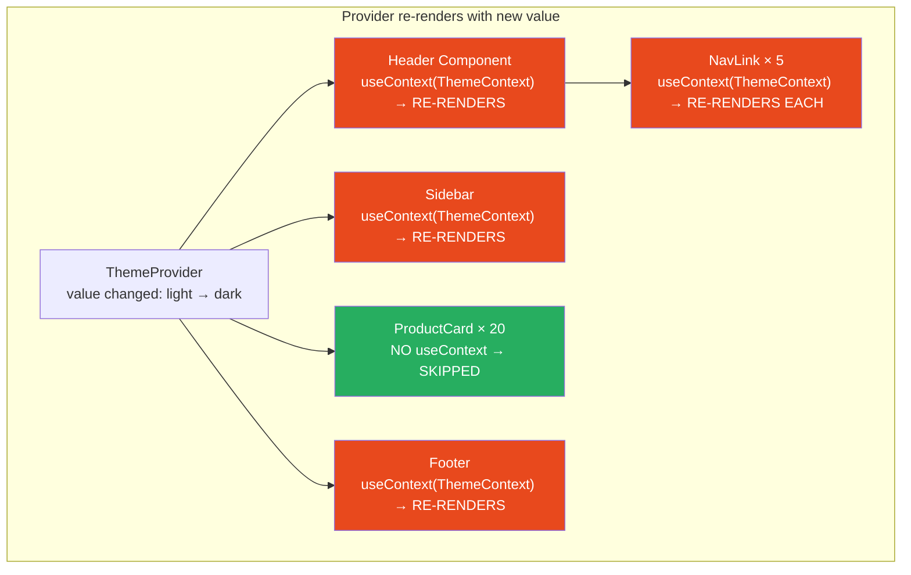
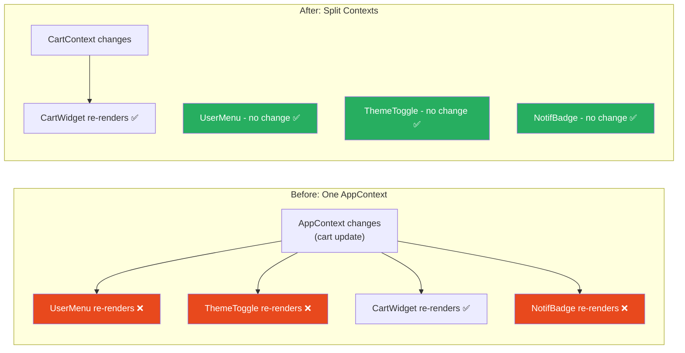

# 79 · Context API Internals

> **React Context is the built-in mechanism for sharing data across a component tree without passing props at every level. But its internal implementation is more nuanced than the documentation suggests: Context propagation is not a pub-sub system, not a global store, and not equivalent to a state management library. It's a tree-scoped value that React re-propagates synchronously whenever the provider's value changes. Understanding this implementation model explains Context's performance characteristics, why splitting contexts matters, and when Context is the right tool vs when a dedicated state library provides better ergonomics.**

The gap between "Context avoids prop drilling" and "Context is correctly used in a large application" is substantial. Context's propagation model causes every consumer to re-render whenever the provider's value changes — regardless of which part of that value the consumer actually uses. This isn't a bug; it's the correct consequence of Context being a synchronous, tree-scoped value broadcaster, not a fine-grained reactive system. Understanding this is prerequisite to using Context well.

---

## Table of Contents

- [What Context Is (and Isn't)](#what-context-is-and-isnt)
- [The Internal Implementation](#the-internal-implementation)
- [Provider Value Changes and Propagation](#provider-value-changes-and-propagation)
- [Why All Consumers Re-render on Value Change](#why-all-consumers-re-render-on-value-change)
- [The Memoization Pattern for Context Values](#the-memoization-pattern-for-context-values)
- [Context Splitting: The Core Performance Strategy](#context-splitting-the-core-performance-strategy)
- [Multiple Contexts vs One Large Context](#multiple-contexts-vs-one-large-context)
- [useContext vs contextType vs Consumer](#usecontext-vs-contexttype-vs-consumer)
- [The Context Selector Pattern](#the-context-selector-pattern)
- [Default Values and Their Purpose](#default-values-and-their-purpose)
- [Context and Server Components](#context-and-server-components)
- [Context vs Zustand vs Redux: When to Use Which](#context-vs-zustand-vs-redux-when-to-use-which)
- [Architecture Diagrams](#architecture-diagrams)
- [Good Practices](#good-practices)
- [Bad Practices](#bad-practices)
- [Mental Model](#mental-model)
- [Common Misconceptions](#common-misconceptions)
- [Exercises](#exercises)
- [Further Reading](#further-reading)

---

## What Context Is (and Isn't)

```
WHAT CONTEXT IS:
  A mechanism to make a value available to any descendant component
  in the tree without passing it explicitly through every intermediate.

  Implementation: a React-internal linked list node in each fiber
  that stores the current context value and propagates it to consumers.

WHAT CONTEXT IS NOT:
  - A state management library (it has no built-in action/reducer system)
  - A pub-sub event system (consumers don't subscribe to specific keys)
  - A global singleton (it's scoped to a Provider's subtree)
  - A reactive system (it doesn't track which values are read)
  - A replacement for Zustand or Redux for complex state

THE CORE LIMITATION:
  When the context value changes, ALL consumers that called useContext()
  for that context re-render — even if the specific piece of value they
  use didn't change.

  Zustand, Jotai, Recoil: solve this with selectors (re-render only
  when the selected slice changes).
  Context: no built-in selector support (hence context splitting).
```

---

## The Internal Implementation

React Context uses a fiber-based propagation mechanism:

```
createContext() creates:
  1. A Context object with:
     - $$typeof: REACT_CONTEXT_TYPE
     - _currentValue: the default value
     - _currentRenderer: a pointer to the current renderer
     - Provider: a special React element type
     - Consumer: a legacy render-prop component

The Context object is a GLOBAL MUTABLE OBJECT during server rendering
(React sets _currentValue when entering a Provider).

During client rendering:
  - Each fiber in the tree has a "dependencies" field
  - useContext() registers the context as a dependency on the current fiber
  - When a Provider re-renders with a new value:
    React traverses the subtree and marks every fiber with this
    context in its dependencies as needing re-render
```

### What createContext returns

```tsx
const MyContext = createContext(defaultValue);

// MyContext is:
{
  $$typeof: Symbol(react.context),
  _currentValue: defaultValue,    // mutable — set during render
  _currentValue2: defaultValue,   // for React's concurrent mode
  Provider: {
    $$typeof: Symbol(react.provider),
    _context: MyContext,          // back-reference
  },
  Consumer: {
    $$typeof: Symbol(react.context),
    _context: MyContext,
  },
  displayName: undefined,         // set this for DevTools clarity
}
```

---

## Provider Value Changes and Propagation

When a Context Provider renders with a new value, React uses `Object.is()` to compare the previous and new values:

```tsx
// Provider re-renders when its PARENT re-renders.
// React compares: Object.is(previousValue, nextValue)

function ThemeProvider({ children }) {
  const [theme, setTheme] = useState("light");

  return (
    // On every ThemeProvider render:
    // React checks: Object.is(prevContextValue, { theme, setTheme })
    // { theme, setTheme } is ALWAYS a new object → always "changed"
    // → ALL useContext(ThemeContext) consumers re-render
    <ThemeContext.Provider value={{ theme, setTheme }}>
      {children}
    </ThemeContext.Provider>
  );
}
```

### The propagation algorithm

```
When Provider renders with a new value:
  1. React starts a "propagation traversal" from the Provider
  2. For each child fiber in the subtree:
     a. Does this fiber have ThemeContext in its dependencies?
        YES → mark this fiber as "needs re-render" (set the work-in-progress lanes)
        NO → check if any of its children might
  3. The traversal continues through the ENTIRE subtree
  4. Optimization: if a subtree has NO context consumers at all,
     the traversal can skip it (tracked via context depth counters)

This traversal is synchronous and happens BEFORE React begins
reconciling the updated tree. It's the "scheduling" step.
```

---

## Why All Consumers Re-render on Value Change

The fundamental reason: React Context tracks consumption at the CONTEXT level, not at the VALUE PROPERTY level:

```
useContext(ThemeContext) in component X means:
  "X depends on ANY change to the ThemeContext value"
  NOT "X depends on theme.color specifically"

There is no built-in mechanism for:
  useContext(ThemeContext, ctx => ctx.theme.color)
  (this would be a "context selector" — not natively supported)

Because Object.is() comparison works at the TOP-LEVEL VALUE:
  - Primitive value: compares by value (string, number, boolean)
  - Object/array: compares by REFERENCE

So:
  // These are the same reference → no re-render
  const value = { theme: 'dark' };
  <Provider value={value} />
  <Provider value={value} />  // same object, no update

  // These are different references → re-render (even if content is same)
  <Provider value={{ theme: 'dark' }} />  // render 1: object A
  <Provider value={{ theme: 'dark' }} />  // render 2: object B → update!
```

---

## The Memoization Pattern for Context Values

The most important performance fix for Context: memoize the value to avoid unnecessary consumer re-renders:

```tsx
// ❌ New object every render → every consumer re-renders every time
function ThemeProvider({ children }) {
  const [theme, setTheme] = useState<"light" | "dark">("light");

  return (
    <ThemeContext.Provider value={{ theme, setTheme }}>
      {children}
    </ThemeContext.Provider>
  );
}

// ✅ Memoized value → consumers only re-render when theme actually changes
function ThemeProvider({ children }) {
  const [theme, setTheme] = useState<"light" | "dark">("light");

  const value = useMemo(
    () => ({ theme, setTheme }),
    [theme], // setTheme is stable (from useState); theme is the reactive dep
  );

  return (
    <ThemeContext.Provider value={value}>{children}</ThemeContext.Provider>
  );
}
```

### Stable dispatch functions

```tsx
// useReducer's dispatch is always stable (same reference across renders)
// useCallback is not needed for dispatch

function CartProvider({ children }) {
  const [state, dispatch] = useReducer(cartReducer, { items: [], total: 0 });

  // dispatch is ALWAYS stable — no useCallback needed
  // state changes on every action, so the context value changes on every action

  // If you want to separate "stable dispatch" from "changing state":
  // Use TWO contexts — one for state, one for dispatch

  const stateValue = useMemo(() => state, [state]);
  // dispatch is already stable; putting it in the same context
  // means subscribers to dispatch also re-render when state changes

  return (
    <CartStateContext.Provider value={stateValue}>
      <CartDispatchContext.Provider value={dispatch}>
        {children}
      </CartDispatchContext.Provider>
    </CartStateContext.Provider>
  );
}
```

---

## Context Splitting: The Core Performance Strategy

When one context contains multiple pieces of state that update at different frequencies, split them into separate contexts:

```tsx
// ❌ ONE context for everything: any change re-renders ALL consumers
const AppContext = createContext({
  user: null, // changes on login/logout
  theme: "light", // changes on toggle (frequent)
  cart: [], // changes on every add/remove (very frequent)
  notifications: [], // changes frequently
});

// Every CartItem, every notification badge, every themed component
// re-renders when the user logs in, when theme changes, when cart changes.
// All 200 consumers re-render on every cart update.

// ✅ SPLIT by update frequency and consumer overlap:

// UserContext: changes on login/logout (rare)
// Consumers: NavBar, Profile, Settings
const UserContext = createContext<User | null>(null);

// ThemeContext: changes on toggle (occasional)
// Consumers: every styled component (many consumers, infrequent updates)
const ThemeContext = createContext<Theme>("light");

// CartContext: changes on every add/remove/update (frequent)
// Consumers: CartWidget, AddToCartButtons (fewer consumers)
const CartStateContext = createContext<CartState>({ items: [], total: 0 });
const CartDispatchContext = createContext<CartDispatch>(() => {});

// NotificationContext: changes often, consumed by badge only
const NotificationContext = createContext<Notification[]>([]);
```

### How to decide what to split

```
SPLIT contexts when:
  ✅ Two pieces of state update at VERY DIFFERENT frequencies
     (cart: every interaction; user: once per session)
  ✅ Different SETS of components consume each piece
     (cart: buttons + widget; user: nav + profile; no overlap)
  ✅ A high-frequency update is causing expensive re-renders
     in components that only consume a different, lower-frequency value

DON'T split when:
  ❌ The values are always used together (reading one requires the other)
  ❌ The values always change together (they're derived from the same source)
  ❌ There's only one consumer (no re-render concern)
```

---

## Multiple Contexts vs One Large Context

The splitting strategy extends to the provider structure:

```tsx
// CONSOLIDATED providers (for simple cases):
// One provider, one consumer hook, simple to reason about
const AppContext = createContext({ user: null, settings: {} });

// SPLIT providers (for performance-critical cases):
// Each context optimized independently
function AppProviders({ children }: { children: React.ReactNode }) {
  return (
    <UserProvider>
      <ThemeProvider>
        <CartProvider>{children}</CartProvider>
      </ThemeProvider>
    </UserProvider>
  );
}

// HYBRID: group by "logical domain" rather than by atomic values
// One context per feature/domain, not per value:
// UserContext: { user, loginStatus, permissions }  (all auth-related)
// UIContext: { theme, sidebarOpen, modalStack }    (all UI state)
// DataContext: { cart, wishlist, recentlyViewed }  (all data state)
```

---

## useContext vs contextType vs Consumer

Three ways to consume context, with different use cases:

```tsx
// 1. useContext hook (modern, recommended)
function MyComponent() {
  const theme = useContext(ThemeContext);
  return <div className={theme}>{/* ... */}</div>;
}
// ✅ Works with function components
// ✅ Can call multiple times for multiple contexts
// ✅ Works inside custom hooks

// 2. contextType (class components, legacy)
class MyClassComponent extends React.Component {
  static contextType = ThemeContext;
  render() {
    const theme = this.context; // ThemeContext value
    return <div className={theme}>{/* ... */}</div>;
  }
}
// ❌ Only works with class components
// ❌ Only one context per class component

// 3. Context.Consumer (render prop, legacy)
function MyComponent() {
  return (
    <ThemeContext.Consumer>
      {(theme) => <div className={theme}>{/* ... */}</div>}
    </ThemeContext.Consumer>
  );
}
// ❌ More verbose than useContext
// ✅ Works anywhere JSX is valid (including class components)
// ✅ Allows reading multiple contexts by nesting Consumers
```

The choice is simple: use `useContext` in function components. `contextType` and `Consumer` are for legacy codebases.

---

## The Context Selector Pattern

React doesn't natively support context selectors (reading only part of a context value), but libraries can implement them:

```tsx
// The problem: reading only 'user.name' from UserContext still
// re-renders when user.cart changes

// Native workaround: split the context
// Library solution: use-context-selector (library)

import { createContext, useContextSelector } from "use-context-selector";

const UserContext = createContext({ name: "", email: "", cart: [] });

function UserName() {
  // Only re-renders when user.name specifically changes
  const name = useContextSelector(UserContext, (ctx) => ctx.name);
  return <span>{name}</span>;
}

function CartCount() {
  // Only re-renders when user.cart changes
  const cartLength = useContextSelector(UserContext, (ctx) => ctx.cart.length);
  return <span>{cartLength}</span>;
}

// How use-context-selector works:
// Uses useRef + useMemo + MutationObserver (or similar) to track
// which part of the value was selected, and only triggers re-render
// when the selected value actually changes (via Object.is comparison
// on the selected slice, not the whole value)
```

---

## Default Values and Their Purpose

```tsx
const ThemeContext = createContext("light"); // default value: 'light'

// The default value is used when:
// A component calls useContext(ThemeContext) but is NOT inside ANY
// ThemeContext.Provider — i.e., there's no Provider in its ancestor chain.

// Use cases for the default value:
// 1. Testing: render a component in isolation without wrapping it in a Provider
// 2. Library components: shipped components that work even without the host
//    app's Provider
// 3. Documentation: show the "bare" component without needing a Provider

// NOT for: your app's default state (use the Provider for that)
// If your app always has a Provider, the default value is never used
// in production — but it's still important for tests and storybook

// Common mistake: providing a "fake" default that hides missing Providers
const UserContext = createContext(null); // ← fine
// vs
const UserContext = createContext({ user: null, login: () => {} });
// The second makes it HARDER to detect missing Provider wrapping
// (no error; the component just uses the stub functions silently)
```

---

## Context and Server Components

Context has important constraints in the Next.js App Router:

```tsx
// Context PROVIDERS must be Client Components:
// They use useState/useReducer internally
"use client";
export function ThemeProvider({ children }) {
  const [theme, setTheme] = useState("light");
  return (
    <ThemeContext.Provider value={{ theme, setTheme }}>
      {children}
    </ThemeContext.Provider>
  );
}

// Context CONSUMERS (useContext) must also be Client Components:
// hooks aren't available in Server Components
("use client");
function ThemeToggle() {
  const { theme, setTheme } = useContext(ThemeContext);
  return (
    <button onClick={() => setTheme((t) => (t === "light" ? "dark" : "light"))}>
      Toggle
    </button>
  );
}

// Server Components CAN receive context-like data via PROPS:
// The Server Component's parent (a Client Component or layout) can
// fetch the data and pass it as props
// → This is the preferred RSC pattern over trying to use Context in SC

// In the App Router: root layout wraps clients in providers
// app/layout.tsx (Server Component)
import { ThemeProvider } from "./providers";
export default function RootLayout({ children }) {
  return (
    <html>
      <body>
        <ThemeProvider>
          {children} {/* Server Components flow through as children */}
        </ThemeProvider>
      </body>
    </html>
  );
}
```

---

## Context vs Zustand vs Redux: When to Use Which

```
USE CONTEXT WHEN:
  ✅ Sharing configuration/settings that rarely change
     (theme, locale, current user — once per session)
  ✅ Small apps with simple state (< 5 pieces of shared state)
  ✅ Sharing values between closely-related components
     (a Form's validation state shared between fields)
  ✅ Values that are ALWAYS needed by ALL consumers
     (no need for selective subscription)
  ✅ You want zero additional dependencies

USE ZUSTAND WHEN:
  ✅ Frequent updates (cart state updated on every user action)
  ✅ Components need to subscribe to SLICES of state
     (only re-render when their specific slice changes)
  ✅ State logic is complex enough to benefit from actions/stores
  ✅ You need state outside of React (accessible from event handlers,
     Web Workers, non-React code)
  ✅ Dev tools (time travel, state snapshots) are valuable

USE REDUX WHEN:
  ✅ Very large application with many developers and complex data flows
  ✅ Strict patterns and developer conventions are valuable
  ✅ Extensive middleware ecosystem is needed (saga, thunk, side effects)
  ✅ Organization-wide standard requires it (existing Redux codebase)

AVOID CONTEXT FOR:
  ❌ State that updates frequently (will cause widespread re-renders)
  ❌ State where different consumers need different slices
  ❌ Complex state transitions that benefit from reducers + actions
```

---

## Architecture Diagrams

### Context propagation on value change



### Context splitting effect



---

## Good Practices

### ✅ Good Practice — Split contexts with stable dispatch patterns

```tsx
/**
 * Good: Cart state is split into two contexts:
 * 1. CartStateContext: the mutable data (re-renders cart-reading consumers)
 * 2. CartDispatchContext: the stable dispatch (NEVER causes re-renders)
 *
 * Buttons that only ADD to cart don't need to know the cart's contents.
 * They subscribe only to CartDispatchContext — which never changes.
 * They never re-render when the cart count changes.
 */

type CartState = { items: CartItem[]; total: number };
type CartAction =
  | { type: "ADD"; payload: CartItem }
  | { type: "REMOVE"; payload: { id: string } }
  | { type: "CLEAR" };

const CartStateContext = createContext<CartState>({ items: [], total: 0 });
const CartDispatchContext = createContext<React.Dispatch<CartAction>>(() => {});

export function CartProvider({ children }: { children: React.ReactNode }) {
  const [state, dispatch] = useReducer(cartReducer, { items: [], total: 0 });

  // State is memoized — only creates new reference when state object changes
  const memoizedState = useMemo(() => state, [state]);
  // dispatch is already stable from useReducer — no useMemo needed

  return (
    <CartDispatchContext.Provider value={dispatch}>
      <CartStateContext.Provider value={memoizedState}>
        {children}
      </CartStateContext.Provider>
    </CartDispatchContext.Provider>
  );
}

// Hook for reading state (re-renders on cart changes):
export function useCartState() {
  return useContext(CartStateContext);
}

// Hook for dispatching (NEVER re-renders — dispatch is stable):
export function useCartDispatch() {
  return useContext(CartDispatchContext);
}

// Usage:
function CartCount() {
  const { items } = useCartState(); // re-renders when cart changes ✅
  return <span>{items.length}</span>;
}

function AddToCartButton({ product }: { product: Product }) {
  const dispatch = useCartDispatch(); // NEVER re-renders ✅
  return (
    <button
      onClick={() =>
        dispatch({ type: "ADD", payload: { ...product, quantity: 1 } })
      }
    >
      Add to Cart
    </button>
  );
}
```

---

## Bad Practices

### ⚠️ Bad Practice — Putting everything in one context, creating a global state bag

```tsx
/**
 * Bad: One AppContext that contains all shared state.
 * Any state change in this context re-renders EVERY consumer —
 * potentially hundreds of components on every cart update,
 * every user action, every notification.
 *
 * This pattern appears in tutorials as "avoiding prop drilling"
 * and works fine for tiny apps, but becomes a serious performance
 * problem as the app grows.
 */
const AppContext = createContext({
  user: null,
  theme: "light",
  cart: { items: [], total: 0 },
  notifications: [],
  sidebarOpen: false,
  currentModal: null,
  searchQuery: "",
  searchResults: [],
  isLoading: false,
});

// 200 components consume AppContext.
// User types in the search box:
//   searchQuery changes → AppContext value changes →
//   ALL 200 components re-render (including CartWidget, UserMenu,
//   ThemeToggle, every notification item, every cart item) on every keystroke.
//
// User adds to cart:
//   cart changes → same 200 components re-render
//
// Notification arrives:
//   notifications changes → same 200 components re-render

/**
 * ✅ Fix: Split by change frequency and consumer set
 */
// UserContext: changes on login/logout only
// ThemeContext: changes on explicit toggle
// CartContext (split state/dispatch): changes on cart operations
// UIContext: sidebar, modal (UI-only, fast changes isolated to UI consumers)
// SearchContext: query + results (only search components subscribe)
// NotificationContext: only notification consumers subscribe
```

**Production impact:** A team reported that their search autocomplete was causing visible lag — every keystroke made the entire app re-render. Investigation: all state lived in a single `AppContext`, and the search query was part of it. Every keystroke triggered re-renders in 300+ components. After splitting `searchQuery` and `searchResults` into their own `SearchContext`, only the search input and results dropdown re-rendered on keystrokes. Lag disappeared completely.

---

## Mental Model

> 💡 **The Context mental model:**
>
> Context is like a **building's PA system** — when the central office makes an announcement (the Provider updates its value), every speaker in the building (every consumer with `useContext`) broadcasts it, waking up everyone in every room (triggering re-renders), regardless of whether the announcement is relevant to them. Splitting contexts is like installing separate PA systems for different wings of the building: the kitchen announcements only wake up the kitchen staff (cart consumers), the HR announcements only reach HR (user consumers), and visitors in the lobby don't hear about the server-room fire alarm. The `useMemo` on the context value is the PA system operator making sure announcements are only broadcast when something actually changed — not on every office hour, just when there's actual news.

---

## Common Misconceptions

### "Context is a state management solution"

Context is a VALUE DISTRIBUTION mechanism — it carries whatever value you give it to descendants without prop-passing. State management (reducers, actions, derived state, effects) must be built on top of it using `useState` or `useReducer`. Libraries like Redux, Zustand, and Jotai provide the state management layer; Context (if used at all) provides the distribution layer.

### "React.memo prevents Context re-renders"

`React.memo` prevents re-renders caused by prop changes from a parent. But `useContext` bypasses `React.memo` — a memoized component that calls `useContext` WILL re-render when the context value changes, even if its props are stable. Context and `React.memo` are independent: memo protects against parent-render propagation, not context propagation.

### "The default value is used for initialization"

The default value is only used when a component is rendered OUTSIDE any matching Provider. If there's a Provider anywhere in the ancestor chain, the Provider's value is used — not the default. The default isn't an "initial state" for the Provider.

### "Passing an object literal as context value is fine for small values"

Even `{ user: currentUser }` as a literal creates a new object on every Provider render, causing all consumers to re-render whenever the Provider's parent renders — even if `currentUser` didn't change. Memoize ALL object/array context values with `useMemo`, regardless of size.

### "Context is always the wrong tool for frequent updates"

Context works acceptably for values that change at a low-to-moderate frequency (a few times per second or less) when the consumer set is small. For very frequent updates (60+ per second, like mouse position) or very large consumer sets (hundreds of components), alternatives like Zustand with selectors provide better performance.

---

## Exercises

### Exercise 1 — Profile context consumer re-renders

```tsx
// Build this and profile clicking the counter button:
const AppContext = createContext({ count: 0, user: { name: "Alice" } });

function App() {
  const [count, setCount] = useState(0);
  return (
    <AppContext.Provider value={{ count, user: { name: "Alice" } }}>
      <Counter />
      <UserDisplay />
      <UnrelatedWidget />
    </AppContext.Provider>
  );
}

function Counter() {
  const { count } = useContext(AppContext);
  return (
    <button onClick={/* increment count? but count is in context... */}>
      Count: {count}
    </button>
  );
}

function UserDisplay() {
  const { user } = useContext(AppContext);
  return <div>{user.name}</div>;
}

function UnrelatedWidget() {
  useContext(AppContext); // consumes but uses neither count nor user
  return <div>Widget</div>;
}
```

1. Profile clicking the button — how many components re-render?
2. Fix by splitting into CountContext and UserContext
3. Profile again — which components still re-render unnecessarily?
4. Fix the unnecessary renders with useMemo on the context value

### Exercise 2 — Implement the state/dispatch split pattern

Implement a `TodoContext` where:

- `TodoStateContext` contains `{ todos: Todo[], filter: string }`
- `TodoDispatchContext` contains the dispatch function
- Adding a todo only re-renders components that consume `TodoStateContext`
- The "Add Todo" button only reads dispatch, never re-renders on state changes

Verify with React DevTools Profiler.

### Exercise 3 — Replace a large AppContext with split contexts

Take a codebase (or create a mock) with one `AppContext` containing 5+ values. Profile a frequently-triggered event (button click, input change). Count how many components re-render. Split the context into 3 smaller contexts. Profile again and count — how many re-renders were eliminated?

---

## Further Reading

- [React Docs: Context](https://react.dev/learn/passing-data-deeply-with-context) — official guide
- [React Docs: useContext](https://react.dev/reference/react/useContext) — API reference
- [Daishi Kato: use-context-selector](https://github.com/dai-shi/use-context-selector) — context selector library
- [Kent C. Dodds: Application State Management with React](https://kentcdodds.com/blog/application-state-management-with-react) — when to use Context
- [Mark Erikson: A (Mostly) Complete Guide to React Rendering Behavior](https://blog.isquaredsoftware.com/2020/05/blogged-answers-a-mostly-complete-guide-to-react-rendering-behavior/) — Context + rendering deep dive
- Next in this handbook: [80 · Redux Architecture](./02-redux.md)

---

_Part of the [React + Next.js Engineering Handbook](../../README.md)_
