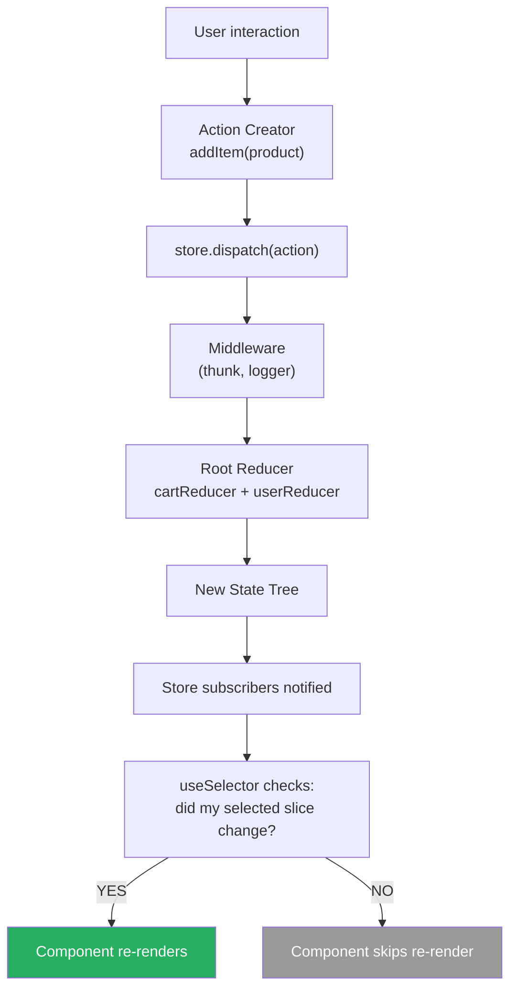
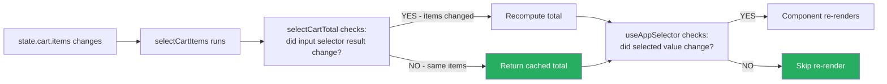

# 80 · Redux Architecture

> **Redux is a predictable state container built on three constraints: a single immutable state tree, actions as the only way to describe state changes, and pure reducer functions as the only way to compute new state. These constraints were radical when introduced in 2015 — they made state changes explicit, trackable, and reproducible. Redux Toolkit eliminated Redux's notorious boilerplate while preserving the architecture's benefits. Understanding Redux at the implementation level reveals why its patterns exist, where it excels over simpler alternatives, and how to integrate it correctly with Next.js's server-side rendering model.**

Redux is frequently introduced as "hard" and dismissed as "unnecessary boilerplate." Both characterizations miss the point. Redux is hard when it's used for simple state that doesn't benefit from its constraints. It's exactly right when you have: complex state machines, state that must be traceable for debugging, state that multiple disconnected parts of the application need to synchronize, or teams that need strict conventions on state mutations. Redux Toolkit makes the mechanical parts easy; understanding the architecture makes the strategic parts correct.

---

## Table of Contents

- [The Three Redux Principles](#the-three-redux-principles)
- [The Redux Data Flow](#the-redux-data-flow)
- [How the Store Works Internally](#how-the-store-works-internally)
- [Redux Toolkit: Why It Exists](#redux-toolkit-why-it-exists)
- [createSlice: The Modern Redux Unit](#createslice-the-modern-redux-unit)
- [createAsyncThunk: Async State Patterns](#createasyncthunk-async-state-patterns)
- [RTK Query: The Data Fetching Layer](#rtk-query-the-data-fetching-layer)
- [Selectors and Reselect](#selectors-and-reselect)
- [Redux DevTools: The Core Value Proposition](#redux-devtools-the-core-value-proposition)
- [Redux in Next.js: The SSR Challenge](#redux-in-nextjs-the-ssr-challenge)
- [Structuring a Redux Store for Scale](#structuring-a-redux-store-for-scale)
- [Redux vs Zustand vs Context: Decision Framework](#redux-vs-zustand-vs-context-decision-framework)
- [Architecture Diagrams](#architecture-diagrams)
- [Good Practices](#good-practices)
- [Bad Practices](#bad-practices)
- [Mental Model](#mental-model)
- [Common Misconceptions](#common-misconceptions)
- [Exercises](#exercises)
- [Further Reading](#further-reading)

---

## The Three Redux Principles

Redux's design is built on three constraints that work together to make state predictable:

```
1. SINGLE SOURCE OF TRUTH
   All application state lives in one object tree (the store).
   Any component can access any piece of state.
   No conflicting local state copies — one version of the truth.

2. STATE IS READ-ONLY
   The only way to change state is to dispatch an action.
   Actions are plain objects describing WHAT happened, not how.
   You cannot mutate state directly — ever.

3. CHANGES ARE MADE WITH PURE FUNCTIONS (REDUCERS)
   Reducers are pure functions: (previousState, action) → nextState
   Given the same inputs, they always return the same output.
   No side effects. No API calls. No randomness.
   This makes state transitions deterministic and reproducible.
```

### Why these constraints matter

```
REPRODUCIBILITY:
  Given a sequence of actions and an initial state, you can ALWAYS
  reproduce any past state by replaying the actions.
  This is why Redux DevTools can do time travel debugging.

DEBUGGABILITY:
  Every state change has an explicit action object describing it.
  You can log, inspect, or replay any state transition.
  "What happened?" is always answerable.

TESTABILITY:
  Reducers are pure functions — they're trivially testable.
  No mocking, no async, no setup: just input/output.
  dispatch(action) → new state — verify the state.

PREDICTABILITY:
  State can only change in ways you explicitly define.
  No hidden mutations, no surprise state changes.
  This discipline becomes more valuable as codebase complexity grows.
```

---

## The Redux Data Flow

```
User interaction OR external event
    │
    ▼
ACTION CREATOR
  { type: 'cart/addItem', payload: { product, quantity } }
    │
    ▼
DISPATCH
  store.dispatch(action)
    │
    ▼
MIDDLEWARE (if any: thunks, sagas, logging)
    │
    ▼
ROOT REDUCER
  calls: cartReducer(currentCartState, action)
         userReducer(currentUserState, action)
         uiReducer(currentUIState, action)
    │
    ▼
NEW STATE
  { cart: newCart, user: sameUser, ui: sameUI }
    │
    ▼
STORE UPDATES
  notifies all subscribers
    │
    ▼
REACT-REDUX
  checks: did the parts of state that this component selected change?
  YES → trigger re-render
  NO  → skip re-render
    │
    ▼
COMPONENT RE-RENDERS with new state
```

---

## How the Store Works Internally

```tsx
// Redux's createStore (simplified):
function createStore(reducer, preloadedState, enhancer) {
  let currentState = preloadedState;
  let currentListeners = [];
  let isDispatching = false;

  function getState() {
    return currentState;
  }

  function subscribe(listener) {
    currentListeners.push(listener);
    return () => {
      currentListeners = currentListeners.filter((l) => l !== listener);
    };
  }

  function dispatch(action) {
    if (isDispatching) throw new Error("Reducers may not dispatch actions");

    isDispatching = true;
    try {
      // Run the reducer to get the new state
      currentState = reducer(currentState, action);
    } finally {
      isDispatching = false;
    }

    // Notify ALL subscribers (React-Redux decides which components re-render)
    currentListeners.forEach((listener) => listener());

    return action;
  }

  // Initialize state by dispatching a special init action
  dispatch({ type: "@@redux/INIT" });

  return { getState, dispatch, subscribe };
}
```

### What `useSelector` does

```tsx
// React-Redux's useSelector (simplified):
function useSelector(selector) {
  const store = useContext(ReduxContext);
  const [, forceRender] = useReducer((s) => s + 1, 0);
  const selectedStateRef = useRef(selector(store.getState()));

  useEffect(() => {
    // Subscribe to store updates
    const unsubscribe = store.subscribe(() => {
      const newSelectedState = selector(store.getState());

      // Only re-render if the SELECTED STATE changed (by reference)
      if (newSelectedState !== selectedStateRef.current) {
        selectedStateRef.current = newSelectedState;
        forceRender();
      }
    });

    return unsubscribe;
  }, [store, selector]);

  return selectedStateRef.current;
}
```

This is why `useSelector` is efficient: components only re-render when the value THEY selected from the store changes — not on every action dispatch.

---

## Redux Toolkit: Why It Exists

Classic Redux required writing: action type constants, action creators, switch-case reducers with spread operators, normalization utilities. For a single feature, this could be 100+ lines. Redux Toolkit reduces this to ~20 lines:

```tsx
// CLASSIC REDUX (before RTK):
// constants/cart.ts
const ADD_ITEM = "cart/ADD_ITEM";
const REMOVE_ITEM = "cart/REMOVE_ITEM";

// actions/cart.ts
const addItem = (product) => ({ type: ADD_ITEM, payload: product });
const removeItem = (id) => ({ type: REMOVE_ITEM, payload: id });

// reducers/cart.ts
function cartReducer(state = { items: [] }, action) {
  switch (action.type) {
    case ADD_ITEM:
      return { ...state, items: [...state.items, action.payload] };
    case REMOVE_ITEM:
      return {
        ...state,
        items: state.items.filter((i) => i.id !== action.payload),
      };
    default:
      return state;
  }
}
// 30+ lines for 2 actions in one slice

// RTK (modern):
const cartSlice = createSlice({
  name: "cart",
  initialState: { items: [] },
  reducers: {
    addItem: (state, action) => {
      state.items.push(action.payload);
    },
    removeItem: (state, action) => {
      state.items = state.items.filter((i) => i.id !== action.payload);
    },
  },
});
// 10 lines for the same 2 actions — and Immer handles immutability
```

### What RTK does automatically

```
createSlice():
  ✅ Generates action creators: cartSlice.actions.addItem
  ✅ Generates action type strings: 'cart/addItem'
  ✅ Wraps reducers with Immer (allows "mutating" syntax that's actually immutable)
  ✅ Handles the default case (returns current state for unknown actions)

configureStore():
  ✅ Combines reducers automatically
  ✅ Sets up Redux DevTools Extension
  ✅ Adds redux-thunk middleware by default
  ✅ Enables serializable state check in development
```

---

## createSlice: The Modern Redux Unit

```tsx
import { createSlice, PayloadAction } from "@reduxjs/toolkit";

interface CartItem {
  id: string;
  name: string;
  price: number;
  quantity: number;
}

interface CartState {
  items: CartItem[];
  status: "idle" | "loading" | "error";
  couponCode: string | null;
}

const initialState: CartState = {
  items: [],
  status: "idle",
  couponCode: null,
};

const cartSlice = createSlice({
  name: "cart",
  initialState,
  reducers: {
    // RTK uses Immer: you can "mutate" draft state directly
    addItem: (state, action: PayloadAction<CartItem>) => {
      const existing = state.items.find((i) => i.id === action.payload.id);
      if (existing) {
        existing.quantity += action.payload.quantity; // direct mutation via Immer
      } else {
        state.items.push(action.payload); // push is safe via Immer
      }
    },

    removeItem: (state, action: PayloadAction<string>) => {
      state.items = state.items.filter((i) => i.id !== action.payload);
    },

    updateQuantity: (
      state,
      action: PayloadAction<{ id: string; quantity: number }>,
    ) => {
      const item = state.items.find((i) => i.id === action.payload.id);
      if (item) {
        item.quantity = action.payload.quantity;
      }
    },

    applyCoupon: (state, action: PayloadAction<string>) => {
      state.couponCode = action.payload;
    },

    clearCart: (state) => {
      state.items = [];
      state.couponCode = null;
    },
  },
  // Handle async thunk states:
  extraReducers: (builder) => {
    builder
      .addCase(fetchCartFromServer.pending, (state) => {
        state.status = "loading";
      })
      .addCase(fetchCartFromServer.fulfilled, (state, action) => {
        state.items = action.payload;
        state.status = "idle";
      })
      .addCase(fetchCartFromServer.rejected, (state) => {
        state.status = "error";
      });
  },
});

// Export action creators (auto-generated):
export const { addItem, removeItem, updateQuantity, applyCoupon, clearCart } =
  cartSlice.actions;

// Export reducer (for configureStore):
export default cartSlice.reducer;
```

---

## createAsyncThunk: Async State Patterns

```tsx
import { createAsyncThunk } from "@reduxjs/toolkit";
import type { RootState } from "../store";

// createAsyncThunk generates 3 action creators:
//   fetchCartFromServer.pending   (dispatched when the thunk starts)
//   fetchCartFromServer.fulfilled (dispatched when the promise resolves)
//   fetchCartFromServer.rejected  (dispatched when the promise rejects)

export const fetchCartFromServer = createAsyncThunk(
  "cart/fetchFromServer",
  async (userId: string, { getState, dispatch, rejectWithValue }) => {
    try {
      const response = await fetch(`/api/cart/${userId}`);
      if (!response.ok) {
        return rejectWithValue({
          message: "Failed to fetch cart",
          status: response.status,
        });
      }
      return (await response.json()) as CartItem[];
    } catch (error) {
      return rejectWithValue({ message: "Network error" });
    }
  },
);

// Using it from a component:
("use client");
function CartLoader({ userId }: { userId: string }) {
  const dispatch = useAppDispatch();
  const status = useAppSelector((state) => state.cart.status);

  useEffect(() => {
    dispatch(fetchCartFromServer(userId));
  }, [userId, dispatch]);

  if (status === "loading") return <CartSkeleton />;
  if (status === "error") return <CartError />;
  return <Cart />;
}
```

---

## RTK Query: The Data Fetching Layer

RTK Query is Redux Toolkit's answer to React Query — a complete data fetching and caching layer built on Redux:

```tsx
import { createApi, fetchBaseQuery } from "@reduxjs/toolkit/query/react";

export const productApi = createApi({
  reducerPath: "productApi",
  baseQuery: fetchBaseQuery({ baseUrl: "/api" }),
  tagTypes: ["Product", "Cart"],

  endpoints: (builder) => ({
    getProducts: builder.query<Product[], { category?: string }>({
      query: ({ category } = {}) => ({
        url: "/products",
        params: category ? { category } : {},
      }),
      providesTags: (result) =>
        result
          ? [
              ...result.map(({ id }) => ({ type: "Product" as const, id })),
              "Product",
            ]
          : ["Product"],
    }),

    getProduct: builder.query<Product, string>({
      query: (id) => `/products/${id}`,
      providesTags: (_, __, id) => [{ type: "Product", id }],
    }),

    updateProduct: builder.mutation<Product, Partial<Product> & { id: string }>(
      {
        query: ({ id, ...patch }) => ({
          url: `/products/${id}`,
          method: "PATCH",
          body: patch,
        }),
        invalidatesTags: (_, __, { id }) => [{ type: "Product", id }],
      },
    ),
  }),
});

// Auto-generated hooks:
export const {
  useGetProductsQuery,
  useGetProductQuery,
  useUpdateProductMutation,
} = productApi;

// Usage:
function ProductList({ category }: { category: string }) {
  const {
    data: products,
    isLoading,
    error,
  } = useGetProductsQuery({ category });

  if (isLoading) return <ProductSkeleton />;
  if (error) return <ProductError />;
  return (
    <>
      {products?.map((p) => (
        <ProductCard key={p.id} product={p} />
      ))}
    </>
  );
}
```

---

## Selectors and Reselect

Selectors are functions that extract and optionally transform state. Memoized selectors prevent unnecessary re-renders when derived data hasn't changed:

```tsx
import { createSelector } from "@reduxjs/toolkit"; // re-exported from reselect

// Simple selectors (no memoization needed — just state access):
const selectCartItems = (state: RootState) => state.cart.items;
const selectCouponCode = (state: RootState) => state.cart.couponCode;

// Memoized selector (computed from simple selectors):
// Only recomputes when selectCartItems or selectCouponCode changes
const selectCartTotal = createSelector(
  [selectCartItems, selectCouponCode],
  (items, couponCode) => {
    const subtotal = items.reduce(
      (sum, item) => sum + item.price * item.quantity,
      0,
    );
    const discount = couponCode === "SAVE10" ? subtotal * 0.1 : 0;
    return subtotal - discount;
  },
);

const selectCartItemCount = createSelector([selectCartItems], (items) =>
  items.reduce((sum, item) => sum + item.quantity, 0),
);

// Parameterized selector (using selectItemById):
const selectItemById = createSelector(
  [selectCartItems, (_: RootState, id: string) => id],
  (items, id) => items.find((item) => item.id === id),
);

// Usage:
function CartTotal() {
  const total = useAppSelector(selectCartTotal); // re-renders only when total changes
  return <span>${total.toFixed(2)}</span>;
}

function CartBadge() {
  const count = useAppSelector(selectCartItemCount); // re-renders only on count change
  return <span>{count}</span>;
}
```

---

## Redux DevTools: The Core Value Proposition

Redux DevTools is the main reason to choose Redux over simpler alternatives in complex applications:

```
FEATURES:
  Action log: every dispatched action with its type and payload
  State diff: what changed in the state for each action
  State snapshot: complete state at any point in time
  Time travel: jump to any past state (replay actions up to that point)
  Action replay: re-dispatch any past action against current state
  State import/export: save and load state for debugging
  Action filtering: filter log by action type to reduce noise

USE CASES WHERE DEVTOOLS IS INVALUABLE:
  "What happened that caused this bug?"
    → Look at the action log, find the unexpected action
  "What was the state when X occurred?"
    → Jump to that point in time, inspect state snapshot
  "Is this bug reproducible?"
    → Export the action log, share with colleague, they import and replay
  "Did this reducer change cause a regression?"
    → State diff shows exactly what changed on each action

THIS IS THE ANSWER to "why Redux over Zustand?":
  Zustand has no built-in action log or time-travel debugging.
  For applications where understanding state change history is critical
  (complex business logic, hard-to-reproduce bugs, audit requirements),
  Redux DevTools pays its price in complexity.
```

---

## Redux in Next.js: The SSR Challenge

Redux's store is a singleton — in a standard app, one store per browser tab. With Next.js SSR, there's one Node.js process serving many users. A single Redux store in server scope means different users share state — a serious bug.

### The solution: per-request store with next-redux-wrapper or manual initialization

```tsx
// app/store.ts — store FACTORY (not a singleton)
import { configureStore } from "@reduxjs/toolkit";
import cartReducer from "./cart/cartSlice";
import userReducer from "./user/userSlice";

export const makeStore = () =>
  configureStore({
    reducer: {
      cart: cartReducer,
      user: userReducer,
    },
  });

// Types:
export type AppStore = ReturnType<typeof makeStore>;
export type RootState = ReturnType<AppStore["getState"]>;
export type AppDispatch = AppStore["dispatch"];
```

```tsx
// app/store-provider.tsx — Client Component
"use client";
import { useRef } from "react";
import { Provider } from "react-redux";
import { makeStore, type AppStore } from "./store";

export function StoreProvider({ children }: { children: React.ReactNode }) {
  // useRef ensures the store is created once per React tree
  // (not recreated on every render)
  const storeRef = useRef<AppStore | null>(null);

  if (!storeRef.current) {
    storeRef.current = makeStore();
  }

  return <Provider store={storeRef.current}>{children}</Provider>;
}
```

```tsx
// app/layout.tsx — Server Component wraps with the store provider
import { StoreProvider } from "./store-provider";

export default function RootLayout({ children }) {
  return (
    <html>
      <body>
        <StoreProvider>{children}</StoreProvider>
      </body>
    </html>
  );
}
```

### Pre-populating store with server-side data

```tsx
// Server Component: fetch data, pass to Client Component for store initialization
async function ProductPageLayout({ children, params }) {
  const initialProducts = await fetchProducts(params.category);

  return (
    <ProductStoreInitializer initialData={initialProducts}>
      {children}
    </ProductStoreInitializer>
  );
}

// Client Component: initializes store with server-fetched data
("use client");
function ProductStoreInitializer({
  children,
  initialData,
}: {
  children: React.ReactNode;
  initialData: Product[];
}) {
  const dispatch = useAppDispatch();
  const initialized = useRef(false);

  if (!initialized.current) {
    // Synchronously initialize before first render
    dispatch(productsLoaded(initialData));
    initialized.current = true;
  }

  return <>{children}</>;
}
```

---

## Structuring a Redux Store for Scale

```
SLICE-BASED ORGANIZATION (recommended for most teams):

store/
  index.ts           ← configureStore, exports RootState, AppDispatch
  hooks.ts           ← typed useAppSelector, useAppDispatch

features/
  cart/
    cartSlice.ts     ← createSlice: state, reducers, actions
    cartSelectors.ts ← createSelector memoized selectors
    cartThunks.ts    ← createAsyncThunk async operations
    cartApi.ts       ← RTK Query endpoints (or separate api.ts)
  user/
    userSlice.ts
    userSelectors.ts
    userThunks.ts
  products/
    productsSlice.ts
    productsSelectors.ts
    productsApi.ts
```

### Typed hooks (essential for TypeScript projects)

```tsx
// store/hooks.ts
import { useDispatch, useSelector } from "react-redux";
import type { RootState, AppDispatch } from "./index";

// Typed versions — use these everywhere, never the untyped originals
export const useAppDispatch = useDispatch.withTypes<AppDispatch>();
export const useAppSelector = useSelector.withTypes<RootState>();
```

---

## Redux vs Zustand vs Context: Decision Framework

```
CHOOSE REDUX WHEN:
  ✅ Complex state machines with many transitions
  ✅ State must be fully inspectable and debuggable (DevTools critical)
  ✅ Large teams with multiple developers touching the same state
  ✅ Audit trails or reproducibility requirements
  ✅ Already using RTK Query for data fetching (keeps one ecosystem)
  ✅ Organization-wide standard already exists

CHOOSE ZUSTAND WHEN:
  ✅ Simpler state with fewer transitions
  ✅ Faster setup and less boilerplate is preferred
  ✅ State slices need selective subscription (Zustand has built-in selectors)
  ✅ State needs to be accessible outside React (stores as singletons work)
  ✅ You want React Query for data fetching (keep state management separate)

CHOOSE CONTEXT WHEN:
  ✅ Shallow, tree-scoped data (theme, locale, current user)
  ✅ State updates are infrequent (not causing widespread re-renders)
  ✅ Zero additional dependencies desired
  ✅ Value is needed by a contiguous subtree, not globally

KEY INSIGHT:
  These aren't mutually exclusive.
  Many production Next.js apps use ALL THREE:
    - Context: theme, locale, auth session
    - Zustand: local feature state (wizard steps, complex forms)
    - Redux + RTK Query: server state cache and complex global state
```

---

## Architecture Diagrams

### Redux data flow



### Reselect memoization flow



---

## Good Practices

### ✅ Good Practice — Well-structured slice with typed selectors

```tsx
/**
 * Good: A complete, well-typed Redux slice with:
 *   - createSlice for actions and reducers
 *   - createAsyncThunk for server sync
 *   - Memoized selectors for derived state
 *   - Typed hooks
 */

// features/cart/cartSlice.ts
import { createSlice, createAsyncThunk, PayloadAction } from "@reduxjs/toolkit";
import { createSelector } from "@reduxjs/toolkit";
import type { RootState } from "../../store";

// Async thunk for server sync
export const syncCartWithServer = createAsyncThunk(
  "cart/syncWithServer",
  async (_, { getState, rejectWithValue }) => {
    const state = getState() as RootState;
    const session = await getSessionFromCookie();
    if (!session) return rejectWithValue("Not authenticated");

    try {
      await fetch("/api/cart/sync", {
        method: "POST",
        body: JSON.stringify(state.cart.items),
        headers: { "Content-Type": "application/json" },
      });
    } catch {
      return rejectWithValue("Sync failed");
    }
  },
);

const cartSlice = createSlice({
  name: "cart",
  initialState: {
    items: [] as CartItem[],
    syncStatus: "idle" as "idle" | "syncing" | "error",
  },
  reducers: {
    addItem: (state, action: PayloadAction<CartItem>) => {
      const existing = state.items.find((i) => i.id === action.payload.id);
      if (existing) {
        existing.quantity += action.payload.quantity;
      } else {
        state.items.push(action.payload);
      }
    },
    removeItem: (state, action: PayloadAction<string>) => {
      state.items = state.items.filter((i) => i.id !== action.payload);
    },
  },
  extraReducers: (builder) => {
    builder
      .addCase(syncCartWithServer.pending, (state) => {
        state.syncStatus = "syncing";
      })
      .addCase(syncCartWithServer.fulfilled, (state) => {
        state.syncStatus = "idle";
      })
      .addCase(syncCartWithServer.rejected, (state) => {
        state.syncStatus = "error";
      });
  },
});

export const { addItem, removeItem } = cartSlice.actions;
export default cartSlice.reducer;

// Memoized selectors:
const selectCartItems = (state: RootState) => state.cart.items;

export const selectCartTotal = createSelector([selectCartItems], (items) =>
  items.reduce((sum, i) => sum + i.price * i.quantity, 0),
);

export const selectCartItemCount = createSelector([selectCartItems], (items) =>
  items.reduce((sum, i) => sum + i.quantity, 0),
);
```

---

## Bad Practices

### ⚠️ Bad Practice — Putting server cache data in Redux

```tsx
/**
 * Bad: Using Redux to cache server data (products, users, etc.)
 * that should be managed by a dedicated data-fetching library.
 * This is one of the most common Redux misuses.
 *
 * Problems with putting server data in Redux:
 *   - Manual cache invalidation (when do you refetch?)
 *   - No built-in stale-while-revalidate behavior
 *   - No request deduplication
 *   - No background refetch on window focus
 *   - You end up re-implementing React Query or RTK Query
 */

// ❌ Redux slice for server-fetched product catalog:
const productsSlice = createSlice({
  name: "products",
  initialState: { items: [], lastFetched: null, isLoading: false, error: null },
  reducers: {
    fetchStart: (state) => {
      state.isLoading = true;
    },
    fetchSuccess: (state, action) => {
      state.items = action.payload;
      state.isLoading = false;
      state.lastFetched = Date.now();
    },
    fetchError: (state, action) => {
      state.error = action.payload;
      state.isLoading = false;
    },
  },
});

// Component:
function ProductList() {
  const dispatch = useAppDispatch();
  const { items, lastFetched, isLoading } = useAppSelector(
    (state) => state.products,
  );

  useEffect(() => {
    // Manual cache check: 5 minutes
    if (!lastFetched || Date.now() - lastFetched > 300000) {
      dispatch(fetchProductsThunk());
    }
  }, [dispatch, lastFetched]);
  // Reinventing React Query with worse ergonomics
}

/**
 * ✅ Fix: Use RTK Query (or React Query/TanStack Query)
 * for server data; Redux for client-only application state
 */
const productApi = createApi({
  reducerPath: "productApi",
  baseQuery: fetchBaseQuery({ baseUrl: "/api" }),
  endpoints: (builder) => ({
    getProducts: builder.query<Product[], void>({
      query: () => "/products",
    }),
  }),
});

const { useGetProductsQuery } = productApi;

function ProductList() {
  const { data: products, isLoading } = useGetProductsQuery();
  // RTK Query handles: loading, caching, refetching, deduplication
  // No manual cache management needed
}
```

---

## Mental Model

> 💡 **The Redux mental model:**
>
> Redux is like a **city's central records office**. Every change to the city's official record (state) must be filed as a formal document (action) describing WHAT changed — "Building permit issued for 123 Main St" — not HOW to change the filing system. A city clerk (the reducer) processes each document following strict rules to update the official records. The filing system (immutable state tree) keeps every historical version. The DevTools time machine is the microfilm archive — you can view the exact state of city records at any date by reviewing all documents filed up to that point. This formal bureaucracy seems excessive for a one-person town (simple app), but for a city with thousands of residents (complex app, large team) it's essential: everyone knows exactly what's in the records, how they got there, and can reproduce any past state precisely.

---

## Common Misconceptions

### "Redux is dead / replaced by React Query"

React Query / TanStack Query replaces Redux for SERVER STATE (data fetched from an API). It doesn't replace Redux for CLIENT STATE (UI state, user preferences, complex state machines). Many large applications use both: React Query for server data, Redux for application state.

### "useReducer is just Redux without a library"

`useReducer` is a React hook for local component state with a reducer function. Redux is a separate, global state container with middleware, devtools, subscribers, and an optimized selector system. `useReducer` + Context can approximate Redux for simple cases, but lacks DevTools, middleware, and optimized subscriptions.

### "Immer in RTK means reducers can have side effects"

Immer makes reducers look like they mutate state (convenient syntax), but they're still pure — Immer creates an entirely new immutable object from the drafted mutations. Reducers must still be side-effect-free. Immer is a syntactic convenience, not a change to Redux's purity requirement.

### "You need to normalize data in Redux"

Normalization (storing entities in flat lookup maps) was more critical in classic Redux where nested data caused performance issues. With RTK Query managing server data and RTK + Immer handling updates, normalization is less often necessary. Use it when you have complex relational data with many cross-references, not by default.

### "Redux's boilerplate problem is solved; it's now as simple as Zustand"

RTK significantly reduces boilerplate, but Redux still requires more setup than Zustand: store configuration, slice files, action/selector exports, Provider wrapping. For simple state, Zustand is still simpler. Redux's additional ceremony is worth it when DevTools, middleware, or strict patterns are genuinely needed.

---

## Exercises

### Exercise 1 — Build a Redux cart from scratch with RTK

Using Redux Toolkit:

1. Create a `cartSlice` with: addItem, removeItem, updateQuantity, clearCart
2. Create memoized selectors: selectCartItems, selectCartTotal, selectCartItemCount
3. Create a `configureStore` with the cart slice
4. Build a product page using `useAppSelector` and `useAppDispatch`
5. Verify with Redux DevTools: inspect the action log after adding items

### Exercise 2 — RTK Query endpoint with cache invalidation

Using RTK Query:

1. Create a `productsApi` with getProducts, getProduct, and updateProduct endpoints
2. Use `providesTags` and `invalidatesTags` so updating a product refetches the list
3. Build a product list and an update form
4. Verify: after saving the form, the list refetches automatically

### Exercise 3 — Time travel debugging

1. Build a multi-step shopping cart (browse → cart → checkout → confirmation)
2. Load it with Redux DevTools open
3. Complete a full purchase flow, adding and removing items along the way
4. Use time travel to go back to the moment before checkout and inspect the cart state
5. Export the action log and import it on another browser to reproduce the exact state

---

## Further Reading

- [Redux Toolkit docs](https://redux-toolkit.js.org/) — official RTK documentation
- [RTK Query docs](https://redux-toolkit.js.org/rtk-query/overview) — data fetching with Redux
- [Redux style guide](https://redux.js.org/style-guide/style-guide) — official best practices
- [Mark Erikson: Redux Fundamentals](https://redux.js.org/tutorials/fundamentals/part-1-overview) — deep dive into Redux internals
- [Next.js with Redux example](https://github.com/vercel/next.js/tree/canary/examples/with-redux) — official Next.js + Redux example
- Related in this handbook: [79 · Context API Internals](./01-context-internals.md)
- Next in this handbook: [81 · Zustand Internals](./03-zustand.md)

---

_Part of the [React + Next.js Engineering Handbook](../../README.md)_
