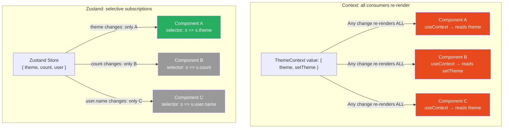
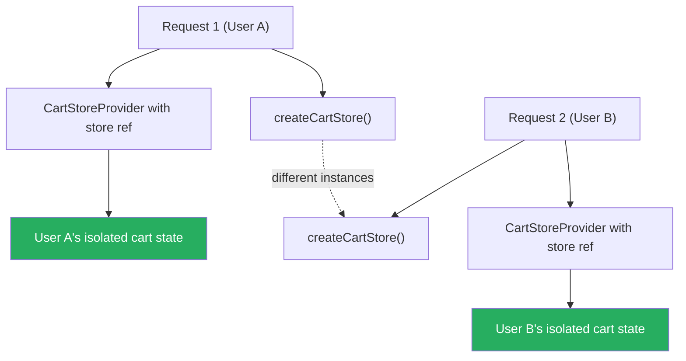

# 81 · Zustand Internals

> **Zustand (German for "state") is a minimal, unopinionated state management library built on a publish-subscribe model. Where Redux requires actions, reducers, and a strict unidirectional data flow, Zustand gives you a store that's just a function returning state and setters — no boilerplate, no ceremony. Where React Context re-renders every consumer when any value changes, Zustand re-renders only the components that subscribed to the specific slice that changed. Where Redux stores are tied to React's render tree, Zustand stores are plain JavaScript objects accessible outside React entirely. Understanding Zustand's internals reveals why this simplicity doesn't sacrifice correctness, and how to use it effectively in production Next.js applications.**

Zustand's source code is famously small (~1KB gzipped). This isn't a limitation — it's a design statement. Zustand does exactly one thing well: stores state and notifies subscribers when it changes, with fine-grained subscriptions that prevent unnecessary re-renders. Everything else — async logic, persistence, DevTools integration — is layered on top with middleware. The minimal core makes Zustand predictable, easy to understand, and straightforward to test.

---

## Table of Contents

- [How Zustand Works Internally](#how-zustand-works-internally)
- [The Subscription Model](#the-subscription-model)
- [Creating a Store](#creating-a-store)
- [Selectors: The Key to Performance](#selectors-the-key-to-performance)
- [Slices Pattern for Large Stores](#slices-pattern-for-large-stores)
- [Async Actions in Zustand](#async-actions-in-zustand)
- [Zustand Middleware](#zustand-middleware)
- [Persisting State with persist Middleware](#persisting-state-with-persist-middleware)
- [Redux DevTools Integration](#redux-devtools-integration)
- [Zustand Outside React](#zustand-outside-react)
- [Zustand in Next.js: The Singleton Problem](#zustand-in-nextjs-the-singleton-problem)
- [Per-Request Stores in Next.js](#per-request-stores-in-nextjs)
- [Immer Middleware for Nested State](#immer-middleware-for-nested-state)
- [Testing Zustand Stores](#testing-zustand-stores)
- [Architecture Diagrams](#architecture-diagrams)
- [Good Practices](#good-practices)
- [Bad Practices](#bad-practices)
- [Mental Model](#mental-model)
- [Common Misconceptions](#common-misconceptions)
- [Exercises](#exercises)
- [Further Reading](#further-reading)

---

## How Zustand Works Internally

Zustand's core is a publish-subscribe store with React hook integration. The entire internal implementation is ~100 lines:

```tsx
// Simplified Zustand internals:
function createStore(createState) {
  let state;
  const listeners = new Set();

  const setState = (partial, replace) => {
    const nextState = typeof partial === "function" ? partial(state) : partial;

    if (nextState !== state) {
      const previousState = state;

      // Either replace the entire state or merge (Object.assign):
      state = replace ? nextState : Object.assign({}, state, nextState);

      // Notify ALL listeners:
      listeners.forEach((listener) => listener(state, previousState));
    }
  };

  const getState = () => state;

  const subscribe = (listener) => {
    listeners.add(listener);
    return () => listeners.delete(listener); // returns unsubscribe function
  };

  // Initialize state by calling the creator function with the API:
  state = createState(setState, getState, { setState, getState, subscribe });

  return { setState, getState, subscribe };
}
```

### The React hook layer

```tsx
// useStore hook (what you get from create()):
function useStore(api, selector, equalityFn = Object.is) {
  // Subscribe to the store, re-render only when selector result changes
  return React.useSyncExternalStore(
    api.subscribe,
    () => selector(api.getState()),
    () => selector(api.getState()), // server snapshot
  );
}
```

The hook uses React's `useSyncExternalStore` (React 18+, or the polyfill) which provides correct, tearing-free state reads in concurrent React. The key: the listener checks if the SELECTED VALUE changed (via `equalityFn`), not if the whole store state changed.

---

## The Subscription Model

This is where Zustand's performance advantage over Context comes from:

```
CONTEXT re-rendering:
  ThemeContext value changes
  → ALL useContext(ThemeContext) consumers re-render
  (no way to subscribe to only part of the context value)

ZUSTAND subscription:
  store state changes
  → listener runs: compare selector(newState) with selector(oldState)
  → Object.is match: SKIP re-render
  → Different value: TRIGGER re-render

Each useStore call has its own selector → its own subscription check.
Two components with different selectors on the same store:
  Only re-render when THEIR specific selected value changes.
```

```tsx
const useCounterStore = create<{ count: number; name: string }>((set) => ({
  count: 0,
  name: "counter",
  increment: () => set((state) => ({ count: state.count + 1 })),
}));

// Component A: subscribes to 'count' only
function CountDisplay() {
  const count = useCounterStore((state) => state.count);
  // Re-renders when count changes
  // Does NOT re-render when name changes
  return <span>{count}</span>;
}

// Component B: subscribes to 'name' only
function NameDisplay() {
  const name = useCounterStore((state) => state.name);
  // Re-renders when name changes
  // Does NOT re-render when count changes
  return <span>{name}</span>;
}
```

---

## Creating a Store

```tsx
import { create } from "zustand";

// TypeScript-first store definition:
interface CartState {
  items: CartItem[];
  isOpen: boolean;

  // Actions are part of the state interface:
  addItem: (item: CartItem) => void;
  removeItem: (id: string) => void;
  updateQuantity: (id: string, quantity: number) => void;
  clearCart: () => void;
  toggleCart: () => void;
}

const useCartStore = create<CartState>((set, get) => ({
  items: [],
  isOpen: false,

  addItem: (item) =>
    set((state) => {
      const existing = state.items.find((i) => i.id === item.id);
      if (existing) {
        return {
          items: state.items.map((i) =>
            i.id === item.id
              ? { ...i, quantity: i.quantity + item.quantity }
              : i,
          ),
        };
      }
      return { items: [...state.items, item] };
    }),

  removeItem: (id) =>
    set((state) => ({
      items: state.items.filter((i) => i.id !== id),
    })),

  updateQuantity: (id, quantity) =>
    set((state) => ({
      items: state.items.map((i) => (i.id === id ? { ...i, quantity } : i)),
    })),

  clearCart: () => set({ items: [] }),

  toggleCart: () => set((state) => ({ isOpen: !state.isOpen })),
}));

// Usage:
function AddToCartButton({ item }: { item: CartItem }) {
  const addItem = useCartStore((state) => state.addItem);
  // addItem is a stable reference — won't cause re-renders
  return <button onClick={() => addItem(item)}>Add to Cart</button>;
}

function CartCount() {
  const itemCount = useCartStore((state) =>
    state.items.reduce((sum, i) => sum + i.quantity, 0),
  );
  return <span>{itemCount}</span>;
}
```

---

## Selectors: The Key to Performance

Selectors in Zustand are inline arrow functions passed to `useStore`. They must return a stable reference for non-primitive values:

```tsx
// ✅ Primitive: stable by value — works correctly
const count = useCartStore((state) => state.items.length);

// ❌ Object created in selector: new reference every render — always re-renders
const cart = useCartStore((state) => ({
  items: state.items, // new object literal every selector call!
  count: state.items.length,
}));

// ✅ Fix option 1: select primitives separately
const items = useCartStore((state) => state.items); // array reference (stable when items don't change)
const count = useCartStore((state) => state.items.length); // primitive

// ✅ Fix option 2: use a shallow comparison for objects
import { shallow } from "zustand/shallow";

const { items, count } = useCartStore(
  (state) => ({ items: state.items, count: state.items.length }),
  shallow, // compares each property individually instead of reference
);
```

### The shallow comparison utility

```tsx
import { shallow } from "zustand/shallow";

// shallow does object or array comparison:
// For objects: each key-value pair is compared with Object.is
// For arrays: each element is compared with Object.is

// Use when selecting multiple values as an object:
const { name, email, avatar } = useUserStore(
  (state) => ({ name: state.name, email: state.email, avatar: state.avatar }),
  shallow, // re-render only when name, email, OR avatar changes (not other user fields)
);

// Or select as array:
const [name, email] = useUserStore(
  (state) => [state.name, state.email],
  shallow,
);
```

---

## Slices Pattern for Large Stores

For large applications, splitting the store into "slices" keeps each domain manageable:

```tsx
// store/cartSlice.ts
interface CartSlice {
  cart: {
    items: CartItem[];
    isOpen: boolean;
  };
  addItem: (item: CartItem) => void;
  clearCart: () => void;
  toggleCart: () => void;
}

export const createCartSlice: StateCreator<
  CartSlice & UserSlice, // combined type for cross-slice access
  [],
  [],
  CartSlice
> = (set, get) => ({
  cart: {
    items: [],
    isOpen: false,
  },
  addItem: (item) =>
    set((state) => ({
      cart: {
        ...state.cart,
        items: [...state.cart.items, item],
      },
    })),
  clearCart: () =>
    set((state) => ({
      cart: { ...state.cart, items: [] },
    })),
  toggleCart: () =>
    set((state) => ({
      cart: { ...state.cart, isOpen: !state.cart.isOpen },
    })),
});

// store/userSlice.ts
interface UserSlice {
  user: User | null;
  login: (user: User) => void;
  logout: () => void;
}

export const createUserSlice: StateCreator<
  CartSlice & UserSlice,
  [],
  [],
  UserSlice
> = (set) => ({
  user: null,
  login: (user) => set({ user }),
  logout: () =>
    set((state) => ({
      user: null,
      cart: { ...state.cart, items: [] }, // clear cart on logout (cross-slice)
    })),
});

// store/index.ts — combine slices
import { create } from "zustand";

type StoreState = CartSlice & UserSlice;

export const useStore = create<StoreState>()((...a) => ({
  ...createCartSlice(...a),
  ...createUserSlice(...a),
}));

// Convenience hooks for each slice:
export const useCart = () => useStore((state) => state.cart);
export const useUser = () => useStore((state) => state.user);
```

---

## Async Actions in Zustand

Zustand doesn't need special handling for async — actions are just functions:

```tsx
interface ProductState {
  products: Product[];
  status: "idle" | "loading" | "error";
  error: string | null;
  fetchProducts: (category: string) => Promise<void>;
}

const useProductStore = create<ProductState>((set) => ({
  products: [],
  status: "idle",
  error: null,

  fetchProducts: async (category: string) => {
    set({ status: "loading", error: null });

    try {
      const response = await fetch(`/api/products?category=${category}`);
      if (!response.ok) throw new Error("Failed to fetch");
      const products = await response.json();
      set({ products, status: "idle" });
    } catch (error) {
      set({ status: "error", error: String(error) });
    }
  },
}));

// Usage:
function ProductList({ category }: { category: string }) {
  const { products, status, fetchProducts } = useProductStore(
    (state) => ({
      products: state.products,
      status: state.status,
      fetchProducts: state.fetchProducts,
    }),
    shallow,
  );

  useEffect(() => {
    fetchProducts(category);
  }, [category, fetchProducts]);

  if (status === "loading") return <Skeleton />;
  if (status === "error") return <Error />;
  return (
    <>
      {products.map((p) => (
        <ProductCard key={p.id} product={p} />
      ))}
    </>
  );
}
```

---

## Zustand Middleware

Middleware wraps the `set` function to add cross-cutting behavior:

```tsx
import { create } from "zustand";
import { devtools, persist, immer } from "zustand/middleware";

// Composing multiple middleware:
const useStore = create<State>()(
  devtools(
    // Redux DevTools integration (outermost)
    persist(
      // localStorage persistence
      immer(
        // Immer for mutating syntax
        (set) => ({
          count: 0,
          increment: () =>
            set((state) => {
              state.count++;
            }), // Immer mutation syntax
        }),
      ),
      { name: "my-store" }, // localStorage key
    ),
    { name: "MyStore" }, // DevTools display name
  ),
);
```

### Custom middleware example: logging

```tsx
import { StateCreator, StoreMutatorIdentifier } from "zustand";

// Middleware type signature:
type Logger = <
  T extends unknown,
  Mps extends [StoreMutatorIdentifier, unknown][] = [],
  Mcs extends [StoreMutatorIdentifier, unknown][] = [],
>(
  f: StateCreator<T, Mps, Mcs>,
  name?: string,
) => StateCreator<T, Mps, Mcs>;

const logger: Logger = (f, name) => (set, get, store) => {
  // Wrap set to log before and after:
  const wrappedSet: typeof set = (...args) => {
    console.group(`[${name ?? "Store"}] state change`);
    console.log("before:", get());
    set(...args);
    console.log("after:", get());
    console.groupEnd();
  };
  return f(wrappedSet, get, store);
};

// Usage:
const useStore = create<State>()(
  logger(
    (set) => ({
      count: 0,
      increment: () => set((s) => ({ count: s.count + 1 })),
    }),
    "CounterStore",
  ),
);
```

---

## Persisting State with persist Middleware

```tsx
import { persist, createJSONStorage } from "zustand/middleware";

interface UserPreferencesState {
  theme: "light" | "dark";
  fontSize: "sm" | "md" | "lg";
  language: string;
  setTheme: (theme: "light" | "dark") => void;
  setFontSize: (size: "sm" | "md" | "lg") => void;
}

const usePreferencesStore = create<UserPreferencesState>()(
  persist(
    (set) => ({
      theme: "light",
      fontSize: "md",
      language: "en",
      setTheme: (theme) => set({ theme }),
      setFontSize: (fontSize) => set({ fontSize }),
    }),
    {
      name: "user-preferences", // localStorage key
      storage: createJSONStorage(() => localStorage),

      // Only persist specific fields (not actions):
      partialize: (state) => ({
        theme: state.theme,
        fontSize: state.fontSize,
        language: state.language,
      }),

      // Migration for schema changes:
      version: 2,
      migrate: (persistedState: any, version: number) => {
        if (version === 1) {
          // v1 didn't have language field
          return { ...persistedState, language: "en" };
        }
        return persistedState;
      },
    },
  ),
);
```

### Handling SSR hydration with persist

```tsx
// The hydration problem: localStorage doesn't exist on the server.
// persist middleware handles this with a rehydration flag.

function ThemeToggle() {
  // zustand's persist adds _hasHydrated state:
  const hasHydrated = usePreferencesStore.persist.hasHydrated();
  const theme = usePreferencesStore((state) => state.theme);

  if (!hasHydrated) {
    // Server-render a default state, then hydrate from localStorage
    return <div className="theme-toggle theme--light" />;
  }

  return (
    <div className={`theme-toggle theme--${theme}`}>
      {theme === "light" ? "☀️" : "🌙"}
    </div>
  );
}
```

---

## Redux DevTools Integration

```tsx
import { create } from "zustand";
import { devtools } from "zustand/middleware";

const useCartStore = create<CartState>()(
  devtools(
    (set) => ({
      items: [],
      addItem: (item) =>
        set(
          (state) => ({ items: [...state.items, item] }),
          false, // false = merge (not replace)
          "cart/addItem", // action name shown in DevTools
        ),
      removeItem: (id) =>
        set(
          (state) => ({ items: state.items.filter((i) => i.id !== id) }),
          false,
          "cart/removeItem",
        ),
    }),
    {
      name: "Cart Store", // display name in DevTools
      enabled: process.env.NODE_ENV === "development",
    },
  ),
);
```

The third argument to `set` is the action name for Redux DevTools — without it, all updates show as `anonymous`. Always name your state updates for debuggability.

---

## Zustand Outside React

One of Zustand's key features: the store can be accessed and mutated without React components:

```tsx
// Access state outside React (e.g., in event handlers, Web Workers, utilities):
const { items, addItem } = useCartStore.getState();

// Subscribe to changes outside React:
const unsubscribe = useCartStore.subscribe(
  (state) => state.items,
  (items, previousItems) => {
    // Called whenever items changes
    console.log("Cart changed:", items.length);
  },
);

// Example: sync Zustand with an analytics library
useCartStore.subscribe(
  (state) => state.items,
  (items) => {
    analytics.track("cart_updated", { itemCount: items.length });
  },
);

// Example: update store from a WebSocket event
websocket.onmessage = (event) => {
  const { type, payload } = JSON.parse(event.data);
  if (type === "INVENTORY_UPDATE") {
    useCartStore.setState((state) => ({
      items: state.items.map((item) =>
        item.id === payload.productId
          ? { ...item, inStock: payload.inStock }
          : item,
      ),
    }));
  }
};

// Cleanup (important to prevent memory leaks):
unsubscribe();
```

---

## Zustand in Next.js: The Singleton Problem

The most important Next.js-specific concern with Zustand: stores are JavaScript module singletons.

```
On the SERVER (Next.js SSR):
  Node.js module system: modules are cached per process.
  A Zustand store created at module level is shared across ALL requests.
  User A's cart data is visible in User B's render — a serious bug.

On the CLIENT:
  Each browser tab is a separate JavaScript context.
  Zustand stores are correctly isolated per user.
  No problem here.

THE BUG SCENARIO:
  // This store is a module-level singleton on the SERVER:
  const useCartStore = create(...)

  Request 1 (User A): stores 3 cart items in the Zustand store
  Request 2 (User B, milliseconds later): reads the Zustand store
    → Sees User A's 3 cart items! (shared module singleton)

  This is a server-side data leak between users.
```

---

## Per-Request Stores in Next.js

The solution: create stores per-request on the server, per-tab on the client.

```tsx
// store/cart-store.ts — store FACTORY, not a singleton
import { create } from "zustand";

export type CartStore = ReturnType<typeof createCartStore>;

export const createCartStore = (initState?: Partial<CartState>) => {
  return create<CartState>()((set) => ({
    items: initState?.items ?? [],
    isOpen: false,
    addItem: (item) => set((state) => ({ items: [...state.items, item] })),
    clearCart: () => set({ items: [] }),
    toggleCart: () => set((state) => ({ isOpen: !state.isOpen })),
  }));
};

// context/cart-context.tsx — provides one store per React tree
("use client");
import { createContext, useContext, useRef } from "react";
import { useStore } from "zustand";
import { createCartStore, CartStore } from "@/store/cart-store";

const CartStoreContext = createContext<CartStore | null>(null);

export function CartStoreProvider({
  children,
  initialCart,
}: {
  children: React.ReactNode;
  initialCart?: Partial<CartState>;
}) {
  // useRef ensures the store is created once per React tree render
  const storeRef = useRef<CartStore | null>(null);

  if (!storeRef.current) {
    storeRef.current = createCartStore(initialCart);
  }

  return (
    <CartStoreContext.Provider value={storeRef.current}>
      {children}
    </CartStoreContext.Provider>
  );
}

// Hook for consuming the per-request store:
export function useCartStore<T>(selector: (state: CartState) => T): T {
  const store = useContext(CartStoreContext);
  if (!store) throw new Error("Missing CartStoreProvider");
  return useStore(store, selector);
}

// app/layout.tsx — wraps the app with the per-request store
export default async function RootLayout({ children }) {
  // Server can pre-load cart data to pass as initialCart:
  const session = await getSession();
  const initialCart = session ? await fetchUserCart(session.userId) : undefined;

  return (
    <html>
      <body>
        <CartStoreProvider initialCart={initialCart}>
          {children}
        </CartStoreProvider>
      </body>
    </html>
  );
}
```

---

## Immer Middleware for Nested State

For deeply nested state, Immer's mutation syntax is cleaner than spread operators:

```tsx
import { create } from "zustand";
import { immer } from "zustand/middleware/immer";

interface NestedState {
  user: {
    profile: {
      name: string;
      address: {
        city: string;
        country: string;
      };
    };
    settings: {
      notifications: boolean;
      theme: "light" | "dark";
    };
  };
  updateCity: (city: string) => void;
  toggleNotifications: () => void;
}

const useUserStore = create<NestedState>()(
  immer((set) => ({
    user: {
      profile: {
        name: "Alice",
        address: { city: "London", country: "UK" },
      },
      settings: {
        notifications: true,
        theme: "light",
      },
    },

    // With Immer: direct mutation (no spread operators needed)
    updateCity: (city) =>
      set((state) => {
        state.user.profile.address.city = city; // direct mutation — Immer handles immutability
      }),

    toggleNotifications: () =>
      set((state) => {
        state.user.settings.notifications = !state.user.settings.notifications;
      }),

    // Without Immer equivalent (much more verbose):
    // updateCity: (city) => set(state => ({
    //   user: {
    //     ...state.user,
    //     profile: {
    //       ...state.user.profile,
    //       address: { ...state.user.profile.address, city },
    //     },
    //   },
    // })),
  })),
);
```

---

## Testing Zustand Stores

```tsx
// Reset store state between tests to prevent test pollution:
import { useCartStore } from "./cart-store";

// Option 1: reset the entire store in beforeEach
beforeEach(() => {
  useCartStore.setState({
    items: [],
    isOpen: false,
  });
});

// Option 2: use the store factory pattern (create fresh store per test)
import { createCartStore } from "./cart-store";

test("addItem adds item to empty cart", () => {
  const store = createCartStore();

  store.getState().addItem({ id: "1", name: "Widget", price: 10, quantity: 1 });

  expect(store.getState().items).toHaveLength(1);
  expect(store.getState().items[0].name).toBe("Widget");
});

test("addItem increments quantity for existing item", () => {
  const store = createCartStore({
    items: [{ id: "1", name: "Widget", price: 10, quantity: 2 }],
  });

  store.getState().addItem({ id: "1", name: "Widget", price: 10, quantity: 3 });

  expect(store.getState().items).toHaveLength(1);
  expect(store.getState().items[0].quantity).toBe(5);
});

// Testing React components with Zustand:
import { render, fireEvent } from "@testing-library/react";
import { CartStoreProvider } from "./cart-context";
import { AddToCartButton } from "./AddToCartButton";

test("AddToCartButton adds item to cart", () => {
  const store = createCartStore();

  const { getByText } = render(
    <CartStoreProvider store={store}>
      <AddToCartButton
        item={{ id: "1", name: "Widget", price: 10, quantity: 1 }}
      />
    </CartStoreProvider>,
  );

  fireEvent.click(getByText("Add to Cart"));
  expect(store.getState().items).toHaveLength(1);
});
```

---

## Architecture Diagrams

### Zustand vs Context subscription model



### Per-request store pattern in Next.js



---

## Good Practices

### ✅ Good Practice — Well-typed store with named actions and stable selectors

```tsx
/**
 * Good: A production Zustand store with:
 *   - TypeScript types for all state and actions
 *   - Actions grouped with state (not separate)
 *   - Named updates for DevTools (third arg to set)
 *   - Custom hook with typed selector
 *   - shallow for multi-value selections
 */
import { create } from "zustand";
import { devtools } from "zustand/middleware";
import { shallow } from "zustand/shallow";

interface UIState {
  sidebarOpen: boolean;
  activeModal: string | null;
  notifications: Array<{ id: string; message: string; type: "info" | "error" }>;
  // Actions:
  toggleSidebar: () => void;
  openModal: (id: string) => void;
  closeModal: () => void;
  addNotification: (message: string, type?: "info" | "error") => void;
  dismissNotification: (id: string) => void;
}

const useUIStore = create<UIState>()(
  devtools(
    (set) => ({
      sidebarOpen: false,
      activeModal: null,
      notifications: [],

      toggleSidebar: () =>
        set(
          (state) => ({ sidebarOpen: !state.sidebarOpen }),
          false,
          "ui/toggleSidebar",
        ),

      openModal: (id) => set({ activeModal: id }, false, "ui/openModal"),

      closeModal: () => set({ activeModal: null }, false, "ui/closeModal"),

      addNotification: (message, type = "info") =>
        set(
          (state) => ({
            notifications: [
              ...state.notifications,
              { id: crypto.randomUUID(), message, type },
            ],
          }),
          false,
          "ui/addNotification",
        ),

      dismissNotification: (id) =>
        set(
          (state) => ({
            notifications: state.notifications.filter((n) => n.id !== id),
          }),
          false,
          "ui/dismissNotification",
        ),
    }),
    { name: "UI Store", enabled: process.env.NODE_ENV === "development" },
  ),
);

// Typed convenience hooks:
export const useSidebarOpen = () => useUIStore((state) => state.sidebarOpen);
export const useActiveModal = () => useUIStore((state) => state.activeModal);
export const useNotifications = () =>
  useUIStore((state) => state.notifications);
export const useUIActions = () =>
  useUIStore(
    (state) => ({
      toggleSidebar: state.toggleSidebar,
      openModal: state.openModal,
      closeModal: state.closeModal,
      addNotification: state.addNotification,
      dismissNotification: state.dismissNotification,
    }),
    shallow, // actions are stable, but shallow ensures no re-renders from unrelated state
  );
```

---

## Bad Practices

### ⚠️ Bad Practice — Module-level singleton in a Next.js SSR context

```tsx
/**
 * Bad: Creating the Zustand store at module level.
 * In a Next.js SSR environment, this creates a SERVER-WIDE singleton
 * shared across all user requests — a data leak between users.
 *
 * Even in a purely client-rendered app, a module-level singleton means:
 *   - State persists between tests (test pollution)
 *   - State persists between navigations in SPA mode
 *   - Hard to initialize with server-fetched data
 */

// ❌ Module-level singleton: shared across all requests on the server
export const useCartStore = create<CartState>()((set) => ({
  items: [],
  addItem: (item) => set((state) => ({ items: [...state.items, item] })),
}));

// User A adds items to their cart via SSR rendering
// User B's SSR request runs in the same Node.js process
// User B's cart now contains User A's items — data leak!

/**
 * ✅ Fix: Use the store factory + Context pattern described above
 * so each React tree (each request) gets its own store instance
 */
// store/cart-store.ts — factory, not singleton
export const createCartStore = (initState?: Partial<CartState>) =>
  create<CartState>()((set) => ({
    items: initState?.items ?? [],
    addItem: (item) => set((state) => ({ items: [...state.items, item] })),
  }));

// context/cart-context.tsx — provides per-request store
("use client");
export function CartStoreProvider({ children, initialCart }) {
  const storeRef = useRef<ReturnType<typeof createCartStore> | null>(null);
  if (!storeRef.current) storeRef.current = createCartStore(initialCart);
  return (
    <CartStoreContext.Provider value={storeRef.current}>
      {children}
    </CartStoreContext.Provider>
  );
}
```

---

## Mental Model

> 💡 **The Zustand mental model:**
>
> Zustand is like a **shared whiteboard in an office** — any team member (any component or non-React code) can read or write to it directly, no forms to fill out, no middleman required. Each team member who needs to know about changes in a specific section of the whiteboard can stand nearby and watch (subscribe with a selector) — they notice changes only to the section they're watching, not to the entire whiteboard. When someone (an action) makes a change to the whiteboard, only the watchers of that specific section turn around to look (selective re-renders via selectors). The SSR danger is like putting this whiteboard in a hallway instead of a private office — suddenly everyone walking by (all server requests) shares it. The fix: give each meeting (each request/React tree) their own private whiteboard (store factory + Context), while still using the shared-office metaphor for the client.

---

## Common Misconceptions

### "Zustand is just useState at module scope"

Zustand uses `useSyncExternalStore` for tearing-free reads in concurrent React, has a subscription/notification system that's more efficient than Context propagation, supports middleware (devtools, persist, immer), can be accessed outside React, and handles multiple subscribers with different selectors. `useState` is per-component and can't do any of this.

### "Zustand can replace React Query / TanStack Query for server data"

Zustand can STORE server-fetched data, but it doesn't handle the complexities of server state management: automatic background refetching, cache invalidation on window focus, deduplication of concurrent requests, stale-while-revalidate behavior, or pagination/infinite scroll. Zustand stores what you put in it; React Query manages the full lifecycle of server data.

### "Selectors in Zustand are automatic (like computed values)"

Selectors in Zustand are plain functions called on every state update. They don't memoize automatically — if the selector creates a new object, the component re-renders on every state change. Use `shallow` for multi-value selections or memoize expensive computations explicitly.

### "Zustand is always faster than Context"

Zustand's selective subscription model IS more efficient than Context's broadcast model — when multiple components consume the same context but react to different parts of the value. For a single consumer, or for values that are genuinely consumed entirely by all consumers, the difference is negligible. Measure before assuming.

### "You need one Zustand store per feature"

The slices pattern allows one large store with logically separated sections. How many stores to create is an architectural decision: one global store (easier to share state across slices) vs multiple stores (clearer domain isolation, easier testing). Both are valid. Start with one store and split if the file becomes unwieldy.

---

## Exercises

### Exercise 1 — Build a multi-slice store

Create a Zustand store with two slices:

1. `authSlice`: `{ user, login, logout }` — user login state
2. `uiSlice`: `{ sidebarOpen, toggleSidebar, theme, setTheme }` — UI preferences

Make `logout` in `authSlice` also reset `uiSlice`'s state (cross-slice action).

### Exercise 2 — Per-request store in Next.js

Convert a module-level Zustand singleton to a per-request store:

1. Create a store factory function (`createMyStore`)
2. Create a Context + Provider that uses `useRef` for the store
3. Wrap the root layout with the Provider
4. Convert all `useMyStore()` calls to use the Context-based hook

Verify: each Playwright/Playwright test gets an isolated store (no shared state between tests).

### Exercise 3 — Persist preferences with migration

Implement a user preferences store with:

1. `persist` middleware saving to localStorage
2. `partialize` to exclude function properties from storage
3. A version number (v1) that only stores `theme`
4. A migration to v2 that adds `fontSize: 'md'` as a default
5. Verify: old v1 localStorage data correctly migrates to v2 on page load

---

## Further Reading

- [Zustand docs](https://zustand-demo.pmnd.rs/) — official documentation
- [Zustand GitHub](https://github.com/pmndrs/zustand) — source code (very readable)
- [Zustand + TypeScript](https://zustand.docs.pmnd.rs/guides/typescript) — TypeScript patterns
- [Daishi Kato: Zustand vs Jotai vs Valtio](https://blog.axlight.com/posts/when-i-use-valtio-and-when-i-use-zustand/) — comparison from the author
- [Next.js docs: Zustand](https://zustand.docs.pmnd.rs/guides/nextjs) — Next.js integration guide
- Related in this handbook: [79 · Context API Internals](./01-context-internals.md), [80 · Redux Architecture](./02-redux.md)
- Next in this handbook: [82 · TanStack Query Internals](./04-tanstack-query.md)

---

_Part of the [React + Next.js Engineering Handbook](../../README.md)_
