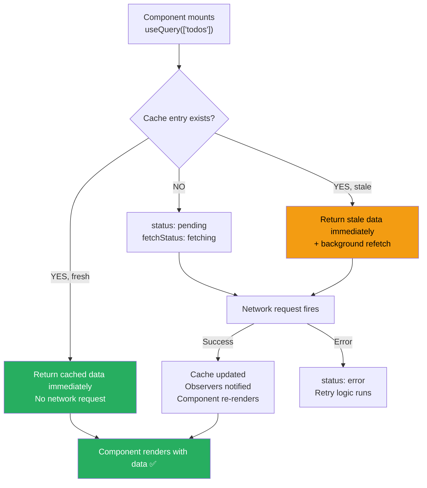
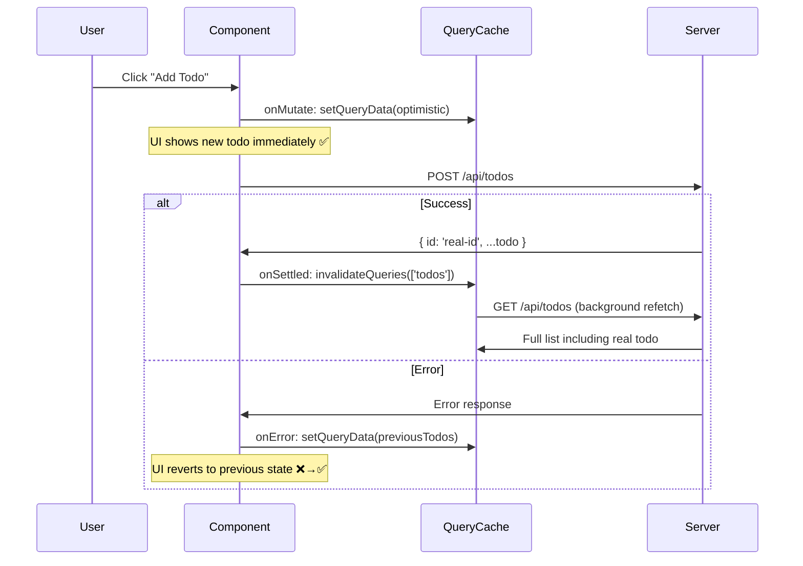

# 82 · TanStack Query Internals

> **TanStack Query (formerly React Query) is a server state management library — a category distinct from client state management. Where Zustand and Redux store and update application state you create, TanStack Query manages the lifecycle of data fetched from external sources: caching, background refetching, stale-while-revalidate behavior, deduplication of concurrent requests, pagination, and optimistic updates. It solves the problem that useEffect + useState solves badly: fetching, caching, and synchronizing server data in React components without manual plumbing. Understanding its internal cache model reveals why it produces fewer loading states, fewer unnecessary fetches, and more responsive UIs than hand-rolled data fetching.**

The mental shift TanStack Query requires is recognizing that "server state" and "client state" are fundamentally different beasts. Client state (a modal being open, a form field's value) is synchronous, wholly owned by your code, and always in sync. Server state (the current list of todos, a user's profile) is asynchronous, shared between clients, can become stale, and needs to be fetched, cached, and synchronized. Solving server state problems with client state tools (useState, Zustand) produces constant manual cache management. TanStack Query makes server state as ergonomic as client state.

---

## Table of Contents

- [The Query Cache: The Central Data Structure](#the-query-cache-the-central-data-structure)
- [Query Keys: The Cache Key System](#query-keys-the-cache-key-system)
- [The Query Lifecycle and State Machine](#the-query-lifecycle-and-state-machine)
- [Stale Time and Cache Time](#stale-time-and-cache-time)
- [Background Refetching Triggers](#background-refetching-triggers)
- [Query Deduplication](#query-deduplication)
- [useQuery in Depth](#usequery-in-depth)
- [useMutation: Mutations and Cache Invalidation](#usemutation-mutations-and-cache-invalidation)
- [Optimistic Updates with useMutation](#optimistic-updates-with-usemutation)
- [Dependent Queries](#dependent-queries)
- [Parallel Queries with useQueries](#parallel-queries-with-usequeries)
- [Infinite Queries for Pagination](#infinite-queries-for-pagination)
- [Prefetching for Performance](#prefetching-for-performance)
- [TanStack Query in Next.js App Router](#tanstack-query-in-nextjs-app-router)
- [Hydrating Server Data into the Client Cache](#hydrating-server-data-into-the-client-cache)
- [Architecture Diagrams](#architecture-diagrams)
- [Good Practices](#good-practices)
- [Bad Practices](#bad-practices)
- [Mental Model](#mental-model)
- [Common Misconceptions](#common-misconceptions)
- [Exercises](#exercises)
- [Further Reading](#further-reading)

---

## The Query Cache: The Central Data Structure

TanStack Query's core is a `QueryCache` — a Map-like data structure that stores query results, keyed by a serialized form of the query key:

```
QueryCache internals:
  queries: Map<string, Query>
    key: hash of the query key array
    value: Query object

Query object:
  {
    queryKey: ['todos', { status: 'active', userId: 42 }],
    queryHash: "['todos',{'status':'active','userId':42}]",
    state: {
      data: [...],      // the cached data
      status: 'success' | 'loading' | 'error',
      fetchStatus: 'fetching' | 'idle' | 'paused',
      error: null | Error,
      dataUpdatedAt: 1706789012000,  // timestamp of last successful fetch
      errorUpdatedAt: null,
    },
    observers: Set<QueryObserver>,  // useQuery hooks observing this query
    options: {
      queryFn: async () => fetch('/api/todos?status=active&userId=42'),
      staleTime: 30000,
      gcTime: 300000,  // formerly cacheTime
    },
  }
```

### The QueryClient

```tsx
// The QueryClient owns the QueryCache and provides the API:
import { QueryClient } from "@tanstack/react-query";

const queryClient = new QueryClient({
  defaultOptions: {
    queries: {
      staleTime: 1000 * 60 * 5, // 5 minutes: queries are fresh for 5 min
      gcTime: 1000 * 60 * 10, // 10 minutes: garbage collect after 10 min inactive
      retry: 3, // retry failed queries 3 times
      refetchOnWindowFocus: true, // refetch when tab regains focus
    },
    mutations: {
      retry: 0, // don't retry mutations by default
    },
  },
});
```

---

## Query Keys: The Cache Key System

Query keys are arrays that uniquely identify a query. They determine:

1. Which cache entry a query uses (cache lookup)
2. When a query should be considered "the same" (for deduplication)
3. Which cached data to invalidate (for cache invalidation)

```tsx
// Primitive key: always the same query
useQuery({ queryKey: ["todos"] });

// Key with parameters: different cache entry per parameter value
useQuery({ queryKey: ["todos", { status: "active" }] });
useQuery({ queryKey: ["todos", { status: "done" }] }); // DIFFERENT cache entry

// Hierarchical keys: useful for partial invalidation
useQuery({ queryKey: ["todos"] }); // all todos
useQuery({ queryKey: ["todos", "active"] }); // active todos
useQuery({ queryKey: ["todos", userId] }); // user's todos
useQuery({ queryKey: ["todos", userId, "active"] }); // user's active todos

// Invalidating a parent key invalidates all children:
queryClient.invalidateQueries({ queryKey: ["todos"] });
// Invalidates ALL four queries above (any key starting with 'todos')

queryClient.invalidateQueries({ queryKey: ["todos", userId] });
// Only invalidates the last two (keys containing userId)

// Exact match invalidation:
queryClient.invalidateQueries({ queryKey: ["todos"], exact: true });
// Only invalidates the EXACT ['todos'] key
```

### Query key conventions

```tsx
// Common pattern: factory functions for consistent key structure
const todoKeys = {
  all: ["todos"] as const,
  lists: () => [...todoKeys.all, "list"] as const,
  list: (filters: TodoFilters) => [...todoKeys.lists(), filters] as const,
  details: () => [...todoKeys.all, "detail"] as const,
  detail: (id: string) => [...todoKeys.details(), id] as const,
};

// Usage:
useQuery({ queryKey: todoKeys.list({ status: "active" }) });
useQuery({ queryKey: todoKeys.detail("todo-123") });

// Invalidate all todo queries:
queryClient.invalidateQueries({ queryKey: todoKeys.all });

// Invalidate only lists (not details):
queryClient.invalidateQueries({ queryKey: todoKeys.lists() });
```

---

## The Query Lifecycle and State Machine

Each Query has two status dimensions:

```
STATUS (data availability):
  'pending'  → no data yet (first fetch or error after no data)
  'success'  → data available (last fetch succeeded)
  'error'    → error state (last fetch failed, no valid cached data)

FETCH STATUS (current network activity):
  'idle'     → not currently fetching
  'fetching' → a fetch is in progress
  'paused'   → a fetch was requested but paused (offline, no network)

The combination tells the full story:
  status: 'success', fetchStatus: 'idle'     → fresh/stale data, no activity
  status: 'success', fetchStatus: 'fetching' → has stale data, background refetch
  status: 'pending', fetchStatus: 'fetching' → first fetch in progress (loading)
  status: 'error', fetchStatus: 'idle'       → fetch failed, no cached data
  status: 'error', fetchStatus: 'fetching'   → retrying after error

Helper booleans (computed from status + fetchStatus):
  isLoading    = status === 'pending' && fetchStatus === 'fetching'
  isFetching   = fetchStatus === 'fetching'
  isRefetching = isFetching && status !== 'pending'
  isPending    = status === 'pending'
  isSuccess    = status === 'success'
  isError      = status === 'error'
```

---

## Stale Time and Cache Time

Two of the most important configuration values, frequently confused:

```
STALE TIME (staleTime):
  How long the data is considered "fresh" after a successful fetch.
  While fresh: the query WON'T refetch even if a new observer subscribes.
  After stale: the query WILL refetch when triggered (window focus, etc.)

  Default: 0 (immediately stale)
  Example:
    staleTime: 1000 * 60 * 5  // data is fresh for 5 minutes
    → Navigating to a page that uses this query within 5 minutes of last fetch:
      data served immediately from cache (no refetch)
    → After 5 minutes: next trigger causes a background refetch

GC TIME / CACHE TIME (gcTime, formerly cacheTime):
  How long the cached data is kept in memory after ALL observers unmount.
  After this window: the cache entry is garbage collected (deleted).

  Default: 1000 * 60 * 5 (5 minutes)
  Example:
    gcTime: 1000 * 60 * 10  // keep in cache for 10 minutes after last use
    → If the user navigates away (component unmounts):
      data kept for 10 minutes. If they navigate back within 10 min:
      data is available immediately (possibly stale → background refetch)
    → After 10 minutes unmounted: entry deleted from cache

THE RELATIONSHIP:
  staleTime ≤ gcTime typically (keeps data available as long as it's fresh)
  staleTime > 0: reduces refetch frequency (data served from cache more)
  staleTime = Infinity: "static" data — fetch once, never refetch
  gcTime = 0: don't cache at all — every mount fetches fresh
```

---

## Background Refetching Triggers

TanStack Query refetches stale queries automatically when:

```tsx
const queryClient = new QueryClient({
  defaultOptions: {
    queries: {
      // Configure refetch triggers:
      refetchOnMount: true, // refetch when a component mounts (if stale)
      refetchOnWindowFocus: true, // refetch when browser tab regains focus
      refetchOnReconnect: true, // refetch when network reconnects
      refetchInterval: false, // polling interval in ms (false = no polling)
      refetchIntervalInBackground: false, // poll even when tab is in background
    },
  },
});

// Per-query override:
useQuery({
  queryKey: ["live-scores"],
  queryFn: fetchLiveScores,
  refetchInterval: 5000, // refetch every 5 seconds
  refetchIntervalInBackground: true, // continue polling in background tab
  staleTime: 0, // always stale (every refetch gets fresh data)
});
```

### The refetchOnWindowFocus behavior

```
User has your app in tab 1, and a data dashboard.
User opens Reddit in tab 2 for 10 minutes (data goes stale).
User switches back to tab 1.

WITHOUT refetchOnWindowFocus:
  User sees 10-minute-old data. May not realize it's stale.

WITH refetchOnWindowFocus (default):
  React Query detects the focus event.
  Checks: is this query stale? (staleness = now - dataUpdatedAt > staleTime)
  YES → triggers background refetch.
  User sees the cached data IMMEDIATELY (no loading flash).
  A moment later: fresh data arrives, component re-renders with updates.
  Result: always-fresh data on tab return, zero loading state.
```

---

## Query Deduplication

If multiple components mount simultaneously and each calls `useQuery` with the same key, TanStack Query fires only ONE network request:

```tsx
// Three components mount at the same time, each subscribing to ['user', userId]:
function Header({ userId }) {
  const { data: user } = useQuery({
    queryKey: ["user", userId],
    queryFn: () => fetchUser(userId),
  });
  return <UserAvatar user={user} />;
}

function Sidebar({ userId }) {
  const { data: user } = useQuery({
    queryKey: ["user", userId], // SAME key
    queryFn: () => fetchUser(userId),
  });
  return <UserName user={user} />;
}

function Profile({ userId }) {
  const { data: user } = useQuery({
    queryKey: ["user", userId], // SAME key
    queryFn: () => fetchUser(userId),
  });
  return <UserProfile user={user} />;
}
```

```
What happens internally:
  1. Header mounts → QueryObserver added to ['user', 42] query
     No existing query → starts fetch (status: pending, fetchStatus: fetching)

  2. Sidebar mounts → QueryObserver added to ['user', 42] query
     Query EXISTS and is fetching → observes existing query
     No new fetch triggered

  3. Profile mounts → QueryObserver added to ['user', 42] query
     Same query, same observers. No new fetch.

  4. Fetch completes → all three observers notified simultaneously
     Header, Sidebar, Profile all re-render with the same data

Result: ONE HTTP request for THREE components needing the same data.
```

---

## useQuery in Depth

```tsx
const {
  data, // the resolved data (undefined until first success)
  error, // the error (if any)
  isLoading, // true during the FIRST fetch (no cached data)
  isFetching, // true during ANY fetch (including background refetches)
  isSuccess, // true when data is available
  isError, // true when in error state
  isStale, // true when data is past staleTime
  isPending, // true when status === 'pending' (before any data)
  status, // 'pending' | 'success' | 'error'
  fetchStatus, // 'fetching' | 'idle' | 'paused'
  dataUpdatedAt, // timestamp of last successful fetch
  refetch, // function to manually trigger a refetch
} = useQuery({
  queryKey: ["todos", { userId, status: filter }],
  queryFn: async () => {
    const response = await fetch(
      `/api/todos?userId=${userId}&status=${filter}`,
    );
    if (!response.ok) throw new Error(`HTTP ${response.status}`);
    return response.json();
  },
  enabled: !!userId, // only fetch when userId is defined
  staleTime: 1000 * 60, // 1 minute
  gcTime: 1000 * 60 * 5, // 5 minutes
  select: (data) => data.todos.filter((t) => !t.archived), // transform data before returning
  placeholderData: keepPreviousData, // show old data while new data loads (for filter/sort)
  retry: (failureCount, error) => {
    if (error instanceof AuthError) return false; // don't retry auth errors
    return failureCount < 3;
  },
});
```

### The `enabled` option for conditional queries

```tsx
// Common pattern: dependent queries using 'enabled'
function UserPosts({ username }: { username: string }) {
  // Step 1: fetch user by username
  const { data: user } = useQuery({
    queryKey: ["user", username],
    queryFn: () => fetchUserByUsername(username),
  });

  // Step 2: fetch posts only when we have the user's ID
  const { data: posts } = useQuery({
    queryKey: ["posts", user?.id],
    queryFn: () => fetchPostsByUserId(user!.id),
    enabled: !!user?.id, // skip until user is loaded
  });

  if (!posts) return <Loading />;
  return <PostList posts={posts} />;
}
```

---

## useMutation: Mutations and Cache Invalidation

```tsx
const mutation = useMutation({
  mutationFn: async (newTodo: CreateTodoInput) => {
    const response = await fetch("/api/todos", {
      method: "POST",
      headers: { "Content-Type": "application/json" },
      body: JSON.stringify(newTodo),
    });
    if (!response.ok) throw new Error("Failed to create todo");
    return response.json() as Promise<Todo>;
  },

  // After successful mutation: invalidate related queries
  onSuccess: (newTodo, variables, context) => {
    // Invalidate todos list — will refetch on next render
    queryClient.invalidateQueries({ queryKey: ["todos"] });

    // OR: manually update the cache (faster — no network request)
    queryClient.setQueryData<Todo[]>(["todos"], (old = []) => [
      ...old,
      newTodo,
    ]);
  },

  onError: (error, variables, context) => {
    toast.error("Failed to create todo: " + error.message);
  },

  onSettled: (data, error, variables, context) => {
    // Runs whether success or error — good for cleanup
    queryClient.invalidateQueries({ queryKey: ["todos"] });
  },
});

// Usage:
async function handleSubmit(e: React.FormEvent) {
  e.preventDefault();
  mutation.mutate(
    { text: inputValue, userId: currentUser.id },
    {
      // Per-mutation callbacks (override the above):
      onSuccess: () => {
        setInputValue("");
      },
    },
  );
}

// State:
mutation.isPending; // true while the mutation is in flight
mutation.isSuccess; // true after success
mutation.isError; // true after error
mutation.error; // the error object
mutation.data; // the resolved data
mutation.reset(); // reset mutation to idle state
```

---

## Optimistic Updates with useMutation

```tsx
const queryClient = useQueryClient();

const addTodoMutation = useMutation({
  mutationFn: (newTodo: CreateTodoInput) =>
    fetch("/api/todos", { method: "POST", body: JSON.stringify(newTodo) }).then(
      (r) => r.json(),
    ),

  onMutate: async (newTodo) => {
    // 1. Cancel any outgoing refetches (avoid overwriting optimistic update)
    await queryClient.cancelQueries({ queryKey: ["todos"] });

    // 2. Snapshot the previous value
    const previousTodos = queryClient.getQueryData<Todo[]>(["todos"]);

    // 3. Optimistically update to the new value
    queryClient.setQueryData<Todo[]>(["todos"], (old = []) => [
      ...old,
      {
        id: "temp-" + Date.now(), // temporary ID
        text: newTodo.text,
        completed: false,
        userId: newTodo.userId,
      },
    ]);

    // 4. Return snapshot for rollback
    return { previousTodos };
  },

  onError: (err, newTodo, context) => {
    // 5. On error: roll back to previous value
    queryClient.setQueryData<Todo[]>(["todos"], context?.previousTodos);
    toast.error("Failed to add todo");
  },

  onSettled: () => {
    // 6. Always refetch after error or success (sync with server truth)
    queryClient.invalidateQueries({ queryKey: ["todos"] });
  },
});
```

---

## Dependent Queries

```tsx
// Multiple queries that depend on each other's results:
function UserOrdersPage({ userId }: { userId: string }) {
  // Query 1: fetch user
  const { data: user, isSuccess: userLoaded } = useQuery({
    queryKey: ["user", userId],
    queryFn: () => fetchUser(userId),
  });

  // Query 2: depends on user's organizationId (only available after user loads)
  const { data: orgDetails } = useQuery({
    queryKey: ["organization", user?.organizationId],
    queryFn: () => fetchOrganization(user!.organizationId),
    enabled: userLoaded && !!user?.organizationId,
  });

  // Query 3: depends on BOTH user and org
  const { data: orders } = useQuery({
    queryKey: ["orders", { userId, orgId: orgDetails?.id }],
    queryFn: () => fetchOrders({ userId, orgId: orgDetails!.id }),
    enabled: !!user && !!orgDetails,
  });

  // Loading states cascade:
  if (!user) return <LoadingUser />;
  if (!orgDetails) return <LoadingOrg />;
  if (!orders) return <LoadingOrders />;
  return <OrdersList orders={orders} user={user} org={orgDetails} />;
}
```

---

## Parallel Queries with useQueries

```tsx
import { useQueries } from "@tanstack/react-query";

// Fetch multiple resources in parallel:
function ProductComparison({ productIds }: { productIds: string[] }) {
  const productQueries = useQueries({
    queries: productIds.map((id) => ({
      queryKey: ["product", id],
      queryFn: () => fetchProduct(id),
    })),
    combine: (results) => ({
      products: results.map((r) => r.data).filter(Boolean),
      isLoading: results.some((r) => r.isPending),
      isError: results.some((r) => r.isError),
    }),
  });

  if (productQueries.isLoading)
    return <ComparisonSkeleton count={productIds.length} />;
  if (productQueries.isError) return <ErrorState />;

  return <ProductComparisonTable products={productQueries.products} />;
}
```

---

## Infinite Queries for Pagination

```tsx
import { useInfiniteQuery } from "@tanstack/react-query";

function InfiniteProductList({ category }: { category: string }) {
  const {
    data, // { pages: [...], pageParams: [...] }
    fetchNextPage, // function to fetch the next page
    hasNextPage, // boolean: is there a next page?
    isFetchingNextPage, // boolean: currently fetching next page?
    status,
  } = useInfiniteQuery({
    queryKey: ["products", category],
    queryFn: async ({ pageParam }) => {
      const response = await fetch(
        `/api/products?category=${category}&cursor=${pageParam}&limit=20`,
      );
      return response.json() as Promise<{
        products: Product[];
        nextCursor: string | null;
      }>;
    },
    initialPageParam: "", // the initial cursor
    getNextPageParam: (lastPage) => lastPage.nextCursor ?? undefined,
    // undefined = no more pages
  });

  // Flatten all pages into one array:
  const products = data?.pages.flatMap((page) => page.products) ?? [];

  return (
    <div>
      {products.map((p) => (
        <ProductCard key={p.id} product={p} />
      ))}
      {hasNextPage && (
        <button onClick={() => fetchNextPage()} disabled={isFetchingNextPage}>
          {isFetchingNextPage ? "Loading..." : "Load More"}
        </button>
      )}
    </div>
  );
}
```

---

## Prefetching for Performance

```tsx
// Prefetch on hover — load data before the user clicks:
function ProductCard({ product }: { product: ProductSummary }) {
  const queryClient = useQueryClient();

  const prefetchProduct = useCallback(() => {
    queryClient.prefetchQuery({
      queryKey: ["product", product.id],
      queryFn: () => fetchProductDetails(product.id),
      staleTime: 1000 * 60, // don't prefetch if already fresh
    });
  }, [product.id, queryClient]);

  return (
    <div onMouseEnter={prefetchProduct}>
      <Link href={`/products/${product.id}`}>
        <h3>{product.name}</h3>
      </Link>
    </div>
  );
}

// Server-side prefetch for Next.js (see next section)
```

---

## TanStack Query in Next.js App Router

The App Router's Server Components can fetch data directly — but for data that's also needed client-side (with caching, refetching), TanStack Query bridges the server/client boundary:

```tsx
// app/providers.tsx — Client Component wrapping with QueryClient
"use client";
import { QueryClient, QueryClientProvider } from "@tanstack/react-query";
import { useState } from "react";

export function QueryProvider({ children }: { children: React.ReactNode }) {
  // useState ensures a new QueryClient per React tree (important for SSR)
  const [queryClient] = useState(
    () =>
      new QueryClient({
        defaultOptions: {
          queries: {
            staleTime: 60 * 1000, // 1 minute
          },
        },
      }),
  );

  return (
    <QueryClientProvider client={queryClient}>{children}</QueryClientProvider>
  );
}

// app/layout.tsx — Server Component
import { QueryProvider } from "./providers";

export default function RootLayout({ children }) {
  return (
    <html>
      <body>
        <QueryProvider>{children}</QueryProvider>
      </body>
    </html>
  );
}
```

---

## Hydrating Server Data into the Client Cache

To avoid the "loading flash" on pages where Server Components already have the data, prefetch on the server and dehydrate into the page:

```tsx
// app/products/page.tsx — Server Component
import {
  dehydrate,
  HydrationBoundary,
  QueryClient,
} from "@tanstack/react-query";
import { Products } from "./products-client";

export default async function ProductsPage() {
  const queryClient = new QueryClient();

  // Prefetch on the server:
  await queryClient.prefetchQuery({
    queryKey: ["products"],
    queryFn: () => fetchProducts(), // direct server function call
  });

  return (
    // Serialize the prefetched data into the HTML:
    <HydrationBoundary state={dehydrate(queryClient)}>
      <Products />
    </HydrationBoundary>
  );
}
```

```tsx
// products-client.tsx — Client Component
"use client";
import { useQuery } from "@tanstack/react-query";

export function Products() {
  const { data: products } = useQuery({
    queryKey: ["products"],
    queryFn: () => fetch("/api/products").then((r) => r.json()),
    // On first render: data is immediately available from the hydrated cache!
    // No loading state — the Server Component pre-populated it.
    // After staleTime: will refetch in the background on next trigger.
  });

  return <ProductGrid products={products ?? []} />;
}
```

### What dehydrate/HydrationBoundary do internally

```
Server:
  queryClient.prefetchQuery() → executes queryFn → stores result in QueryCache
  dehydrate(queryClient) → serializes the QueryCache to a plain JSON object
  <HydrationBoundary state={dehydratedState}> → embeds JSON in the page HTML
  → Browser receives the page with the pre-fetched data embedded

Client:
  <HydrationBoundary> → takes the embedded JSON
  → Calls queryClient.setQueryData() for each dehydrated query
  → QueryCache now has the server-fetched data BEFORE any component renders
  → useQuery() finds data in cache immediately → no loading state
  → After staleTime: normal refetch behavior resumes
```

---

## Architecture Diagrams

### Query cache lifecycle



### Optimistic update flow



---

## Good Practices

### ✅ Good Practice — Complete data fetching setup with server prefetch and optimistic updates

```tsx
/**
 * Good: Server prefetches data → hydrates client cache → no loading flash.
 * Client mutations use optimistic updates → instant UI feedback.
 * Cache invalidation is precise — only affected queries invalidated.
 */

// Server: prefetch
async function TodosPage() {
  const queryClient = new QueryClient();
  await queryClient.prefetchQuery({
    queryKey: todoKeys.list({}),
    queryFn: () => db.todos.findMany(), // direct DB call on server
  });

  return (
    <HydrationBoundary state={dehydrate(queryClient)}>
      <TodoList />
    </HydrationBoundary>
  );
}

// Client: uses prefetched data + optimistic updates
("use client");
function TodoList() {
  const queryClient = useQueryClient();
  const { data: todos = [] } = useQuery({
    queryKey: todoKeys.list({}),
    queryFn: () => fetch("/api/todos").then((r) => r.json()),
    // Data immediately available from server prefetch — no loading state!
  });

  const addTodo = useMutation({
    mutationFn: (text: string) =>
      fetch("/api/todos", {
        method: "POST",
        body: JSON.stringify({ text }),
      }).then((r) => r.json()),

    onMutate: async (text) => {
      await queryClient.cancelQueries({ queryKey: todoKeys.list({}) });
      const prev = queryClient.getQueryData<Todo[]>(todoKeys.list({}));
      queryClient.setQueryData<Todo[]>(todoKeys.list({}), (old) => [
        ...(old ?? []),
        { id: `temp-${Date.now()}`, text, completed: false },
      ]);
      return { prev };
    },
    onError: (_, __, ctx) => {
      queryClient.setQueryData(todoKeys.list({}), ctx?.prev);
    },
    onSettled: () => {
      queryClient.invalidateQueries({ queryKey: todoKeys.list({}) });
    },
  });

  return (
    <>
      {todos.map((todo) => (
        <TodoItem key={todo.id} todo={todo} />
      ))}
      <AddTodoForm onAdd={(text) => addTodo.mutate(text)} />
    </>
  );
}
```

---

## Bad Practices

### ⚠️ Bad Practice — Using useState + useEffect to replicate what useQuery does

```tsx
/**
 * Bad: Manual data fetching with useState + useEffect is the
 * pattern TanStack Query was designed to replace. It lacks:
 *   - Caching (every mount re-fetches)
 *   - Deduplication (multiple mounts = multiple requests)
 *   - Background refetching (stale data on tab focus)
 *   - Request cancellation (memory leaks on unmount)
 *   - Retry logic (transient errors show as permanent)
 *   - Loading state granularity (no "stale data + refetching" state)
 */
function TodoList({ userId }: { userId: string }) {
  const [todos, setTodos] = useState<Todo[]>([]);
  const [isLoading, setIsLoading] = useState(false);
  const [error, setError] = useState<Error | null>(null);

  useEffect(() => {
    let cancelled = false; // manual cancellation tracking
    setIsLoading(true);
    setError(null);

    fetch(`/api/todos?userId=${userId}`)
      .then((r) => r.json())
      .then((data) => {
        if (!cancelled) {
          setTodos(data);
          setIsLoading(false);
        }
      })
      .catch((err) => {
        if (!cancelled) {
          setError(err);
          setIsLoading(false);
        }
      });

    return () => {
      cancelled = true;
    };
  }, [userId]); // re-fetches every time userId changes — but also on EVERY MOUNT

  // No caching: navigating away and back always re-fetches
  // No deduplication: 3 components = 3 requests
  // No background refetch on window focus
  // No retry on transient errors
  // No stale-while-revalidate

  if (isLoading) return <Loading />;
  if (error) return <Error />;
  return (
    <>
      {todos.map((t) => (
        <TodoItem key={t.id} todo={t} />
      ))}
    </>
  );
}

/**
 * ✅ Fix: useQuery handles ALL of the above automatically
 */
function TodoList({ userId }: { userId: string }) {
  const {
    data: todos,
    isLoading,
    error,
  } = useQuery({
    queryKey: ["todos", userId],
    queryFn: () => fetch(`/api/todos?userId=${userId}`).then((r) => r.json()),
    // ✅ Cached between mounts
    // ✅ Deduplicated across components
    // ✅ Background refetch on focus
    // ✅ Automatic retry (3x)
    // ✅ Proper stale-while-revalidate
    // ✅ Request cancellation via AbortController
  });

  if (isLoading) return <Loading />;
  if (error) return <Error />;
  return (
    <>
      {(todos ?? []).map((t) => (
        <TodoItem key={t.id} todo={t} />
      ))}
    </>
  );
}
```

---

## Mental Model

> 💡 **The TanStack Query mental model:**
>
> TanStack Query is like a **smart newspaper subscription service** for your server data. Each query key is a newspaper title ("todos" or "products/electronics"). When you subscribe (mount a `useQuery` component), the service checks if a fresh copy of today's paper is on your desk (cache hit within staleTime). If yes: handed over immediately. If the paper is slightly old (stale): you get today's copy immediately while a fresh one is ordered in the background (stale-while-revalidate). If there's no copy at all: a delivery is ordered and you wait (loading state). When multiple subscribers want the same paper simultaneously, one copy is ordered for everyone (deduplication). When the newspaper's content changes (you edit a todo), the delivery service is told to mark that paper title as "needs fresh edition" (invalidateQueries), and the next subscriber request triggers a reprint (refetch). The dehydrate/hydrate system is the newspaper pre-printed and packaged in the morning (server-side) so subscribers in the evening (client-side) receive it instantly without waiting for the printing press.

---

## Common Misconceptions

### "TanStack Query is a replacement for all state management"

TanStack Query manages SERVER STATE — data that lives on a server and is fetched asynchronously. It doesn't replace tools for CLIENT STATE — things like a modal being open, a form wizard's current step, a user's selected theme. Use TanStack Query for data from APIs; use Zustand or Context for purely client-side state.

### "invalidateQueries immediately triggers a refetch"

`invalidateQueries` marks queries as stale. A refetch is triggered when a component is observing the query (has `useQuery` mounted). If no component is currently subscribed to the invalidated query, the refetch happens when the next component subscribes. "Invalidate" means "mark stale," not "refetch now."

### "staleTime: 0 means data is always fresh"

`staleTime: 0` (the default) means data is considered stale IMMEDIATELY after fetching. This means: any refetch trigger (window focus, mount) will initiate a background refetch. It doesn't mean every render causes a refetch — it means the data is always eligible for background refetching when a trigger occurs.

### "gcTime and staleTime are the same thing"

`staleTime`: freshness duration (how long before data is eligible for background refetch). `gcTime`: garbage collection duration (how long to keep data in cache after all subscribers unmount). Both default to different values (0 and 5 minutes respectively) and serve entirely different purposes.

### "You should always use setQueryData instead of invalidateQueries for faster UX"

`setQueryData` (manual cache update) gives immediate UI feedback but risks displaying stale data if the server's true state differs. `invalidateQueries` ensures eventual consistency with the server. The combination of both (optimistic update + post-mutation invalidation) is the correct pattern for most mutations.

---

## Exercises

### Exercise 1 — Observe the cache in action

1. Set up React Query DevTools (`import { ReactQueryDevtools }`)
2. Navigate to a page with a `useQuery` call
3. Watch the DevTools: observe the query go from "loading" → "success"
4. Navigate away and back: does it show "stale" and refetch, or serve from cache?
5. Experiment with different `staleTime` values: 0, 5000, Infinity

### Exercise 2 — Implement optimistic updates for a todo toggle

Build a todo list where:

1. Clicking a checkbox immediately toggles the visual state (optimistic)
2. The actual PATCH request runs in the background
3. If the request fails: the checkbox reverts to its previous state
4. If the request succeeds: the query is invalidated to confirm server state

### Exercise 3 — Server prefetch to eliminate loading state

Take a page that shows a loading skeleton on every visit:

1. Move the data fetching to a Server Component using `prefetchQuery` + `HydrationBoundary`
2. Verify: the page now renders with data immediately (no loading skeleton on first paint)
3. Check the Network tab: confirm the API is NOT called on the client on initial render

---

## Further Reading

- [TanStack Query docs](https://tanstack.com/query/latest) — comprehensive official docs
- [TanStack Query: Caching](https://tanstack.com/query/latest/docs/framework/react/guides/caching) — cache internals explained
- [TanStack Query: Next.js App Router integration](https://tanstack.com/query/latest/docs/framework/react/guides/advanced-ssr) — SSR patterns
- [Tanner Linsley: Why I Built React Query](https://www.youtube.com/watch?v=seU46c6Jz7E) — the motivation and design philosophy
- [TanStack Query DevTools](https://tanstack.com/query/latest/docs/framework/react/devtools) — debugging tools
- Next in this handbook: [83 · Server State vs Client State](./05-server-vs-client-state.md)

---

_Part of the [React + Next.js Engineering Handbook](../../README.md)_
