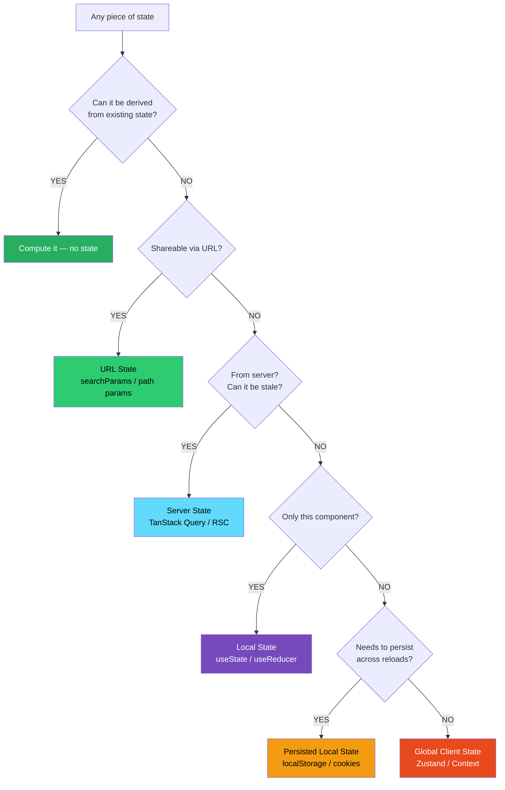
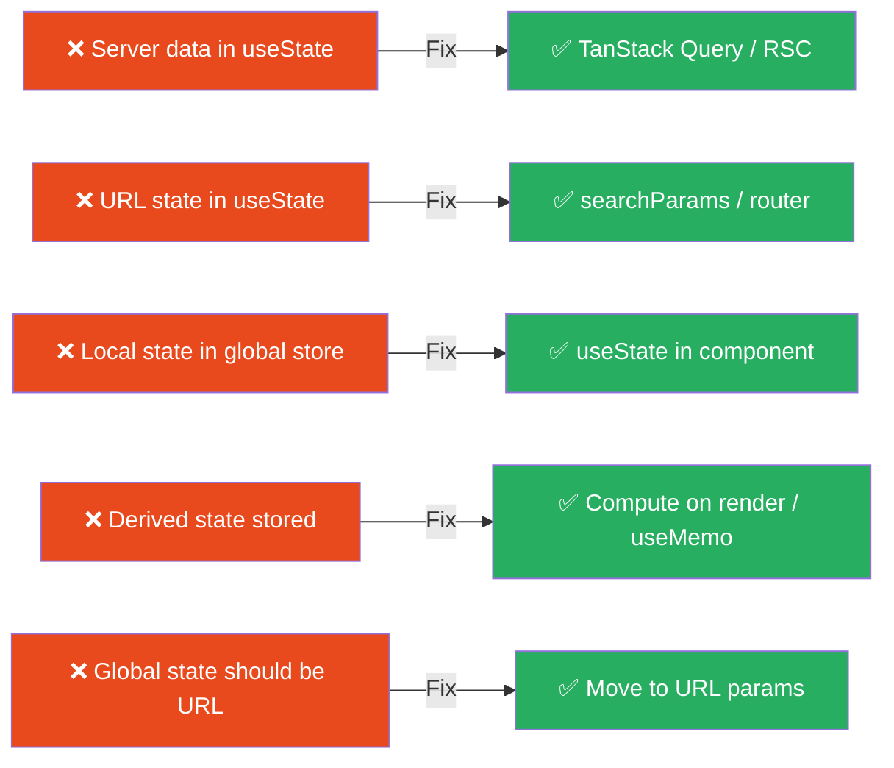

# 83 · Server State vs Client State

> **The most consequential architectural decision in a React application is not which state management library to use — it's correctly classifying whether each piece of state is "server state" or "client state" and placing it accordingly. Server state (data that originates on a server, can be stale, is shared between users) needs fetching, caching, and synchronization. Client state (data created by the user's interaction, exists only in this session, is always current) needs simple storage and updates. Mixing the two categories — managing server data with client state tools, or over-fetching server data that should live in URL state — is the root cause of most state management complexity and the bugs that follow.**

The taxonomy of state in a React/Next.js application is broader than server vs client. There are actually five distinct categories, each with its own correct "home": URL state, server state, local component state, global client state, and local persisted state. Placing state in the wrong category forces workarounds. Placing it correctly eliminates entire classes of bugs and simplifies the codebase.

---

## Table of Contents

- [The Five Categories of State](#the-five-categories-of-state)
- [URL State: The Most Underused Category](#url-state-the-most-underused-category)
- [Server State: Data You Don't Own](#server-state-data-you-dont-own)
- [Local Component State: The Default](#local-component-state-the-default)
- [Global Client State: The Last Resort](#global-client-state-the-last-resort)
- [Persisted Local State: Browser Storage](#persisted-local-state-browser-storage)
- [The State Classification Framework](#the-state-classification-framework)
- [Common Misplacements and Their Costs](#common-misplacements-and-their-costs)
- [State Colocation: Where State Lives Matters](#state-colocation-where-state-lives-matters)
- [Derived State: Don't Store What You Can Compute](#derived-state-dont-store-what-you-can-compute)
- [The RSC Model's Effect on State Architecture](#the-rsc-models-effect-on-state-architecture)
- [Architecture Diagrams](#architecture-diagrams)
- [Good Practices](#good-practices)
- [Bad Practices](#bad-practices)
- [Mental Model](#mental-model)
- [Common Misconceptions](#common-misconceptions)
- [Exercises](#exercises)
- [Further Reading](#further-reading)

---

## The Five Categories of State

```
┌─────────────────────────────────────────────────────────────────────┐
│ CATEGORY          │ HOME          │ TOOL                   │ STALE? │
├───────────────────┼───────────────┼────────────────────────┼────────┤
│ URL State         │ URL / Route   │ Next.js router/params  │ No     │
│ Server State      │ Server / DB   │ TanStack Query / RSC   │ Yes    │
│ Local Component   │ Component     │ useState / useReducer  │ No     │
│ Global Client     │ App memory    │ Zustand / Context      │ No     │
│ Persisted Local   │ Browser       │ localStorage / cookies │ No     │
└─────────────────────────────────────────────────────────────────────┘
```

Each category has distinct characteristics:

```
URL State:
  - Shareable: copy the URL and someone else sees the same thing
  - Bookmarkable: reload gives the same result
  - Serializable: always a string (or serializable to string)
  - Examples: current page, filter, sort order, search query, selected tab

Server State:
  - Owned by the server: you're a reader/writer, not the owner
  - Can be stale: changes without your app knowing
  - Shared across clients: another user can change it
  - Async: requires a network request to read
  - Examples: user profile, product catalog, todos, orders

Local Component State:
  - Ephemeral: lost when the component unmounts
  - Not shared: only this component cares about it
  - Synchronous: immediately available
  - Examples: form input values, dropdown open/closed, tooltip hover

Global Client State:
  - Shared across components: multiple disconnected components need it
  - Not on the server: created by user interaction in this session
  - In-memory: lost on page reload
  - Examples: cart (before checkout), user preferences this session,
              notification toasts, modal stack

Persisted Local State:
  - Survives reload: stored in browser storage or cookies
  - Per-device: not synced to server (unless explicitly done)
  - Serialized: must be serializable (no functions, no class instances)
  - Examples: theme preference, recently viewed items, dismissed banners
```

---

## URL State: The Most Underused Category

URL state is the most powerful and most underutilized state category. Any state that should survive a page refresh, be shareable via a link, or be navigable with the back button belongs in the URL.

```
CANDIDATES FOR URL STATE:
  Search query: ?q=laptop
  Current page: ?page=3
  Filter: ?status=active&category=electronics
  Sort: ?sort=price&dir=asc
  Selected item: /products/laptop-pro (path param) or ?selected=laptop-pro
  Active tab: ?tab=reviews
  Modal (shareable): /products/123 with intercepting route (see doc 66)
  Expanded sections: ?expand=specifications,reviews

NOT CANDIDATES FOR URL STATE:
  Hover state (too ephemeral, not meaningful to share)
  Loading state (transient, shouldn't be serialized)
  User-specific context without meaning to others (auth-dependent views)
```

```tsx
// ❌ useState for state that should be in the URL:
function ProductList() {
  const [filter, setFilter] = useState("all");
  const [page, setPage] = useState(1);
  const [sort, setSort] = useState("newest");
  // User cannot share their filtered view with a colleague
  // Refreshing loses filter state
  // Back button doesn't return to previous filter
}

// ✅ URL state via searchParams and router:
// In Next.js App Router, searchParams is a Server Component prop:
async function ProductList({ searchParams }) {
  const filter = searchParams.status ?? "all";
  const page = Number(searchParams.page ?? "1");
  const sort = searchParams.sort ?? "newest";
  // Shareable ✅, bookmarkable ✅, back button works ✅, SSR-friendly ✅
}

// Client Component to UPDATE the URL state:
("use client");
function ProductFilters({ currentFilters }) {
  const router = useRouter();
  const searchParams = useSearchParams();

  const setFilter = (key: string, value: string) => {
    const params = new URLSearchParams(searchParams.toString());
    params.set(key, value);
    params.set("page", "1"); // reset page on filter change
    router.push(`/products?${params.toString()}`);
  };

  return (
    <select
      value={currentFilters.status}
      onChange={(e) => setFilter("status", e.target.value)}
    >
      <option value="all">All</option>
      <option value="active">Active</option>
    </select>
  );
}
```

---

## Server State: Data You Don't Own

Server state has unique properties that make it unsuitable for client state management tools:

```
SERVER STATE CHARACTERISTICS:
  1. STALENESS: the data on the server can change without your app
     knowing. A product's price might have changed since you fetched it.

  2. SHARED OWNERSHIP: multiple users read and write to the same data.
     Two users can update the same record simultaneously.

  3. ASYNCHRONOUS: you can't read it synchronously — a network request
     (or server render) is always required.

  4. UNKNOWN TRUTH: the client's copy may be out of date. The server
     is the source of truth, not your React state.

WHY CLIENT STATE TOOLS ARE WRONG FOR SERVER DATA:
  useState: doesn't know when to refetch, can't deduplicate requests,
            provides no cache mechanism
  Zustand: same — it's a storage mechanism, not a cache manager
  Redux: can store server data but manually managing cache validity,
         stale detection, and background refetch is reinventing TanStack Query

WHY SERVER STATE TOOLS (TanStack Query, RSC) ARE RIGHT:
  - Automatic staleness tracking
  - Background refetching when stale
  - Deduplication of concurrent requests
  - Cache with configurable lifetime
  - Loading, error, and success states built-in
  - Optimistic update patterns
  - Invalidation when mutations succeed
```

### Server state in the App Router

```tsx
// The App Router's RSC model changes the calculus:
// For data that's ONLY needed at initial render (no client-side updates):
async function ProductPage({ params }) {
  // Direct server fetch — no TanStack Query needed
  const product = await db.products.findUnique({ where: { id: params.id } });
  return <ProductView product={product} />;
}
// TanStack Query not needed here: Server Component handles
// the fetch, caching (via Data Cache), and freshness (via revalidate)

// For data that needs REAL-TIME UPDATES or CLIENT-SIDE INTERACTIONS:
("use client");
function LiveProductPrice({ productId }) {
  const { data: product } = useQuery({
    queryKey: ["product", productId],
    queryFn: () => fetch(`/api/products/${productId}`).then((r) => r.json()),
    refetchInterval: 30000, // price polls every 30s
  });
  return <span>{product?.price}</span>;
}
// TanStack Query IS needed here: client-side polling, cache management
```

---

## Local Component State: The Default

Local component state is the correct default for any state that:

- Only this component (and its immediate children) uses
- Doesn't need to survive unmounting
- Doesn't need to be shared across the component tree

```tsx
// These belong in useState:
const [isExpanded, setIsExpanded] = useState(false); // UI toggle
const [inputValue, setInputValue] = useState(""); // form input
const [activeTab, setActiveTab] = useState("info"); // tabbed UI

// The "lift state up only when you have to" rule:
// Start with local state. Lift to parent only when a SIBLING needs it.
// Lift to global only when DISTANT components need it.

// ❌ Pre-emptively putting everything in global state:
// useStore().set({ isDropdownOpen: true })
// This couples unrelated components to each other's UI state.

// ✅ Start local:
function Dropdown({ options }) {
  const [isOpen, setIsOpen] = useState(false); // local — only this component cares
  return (
    <div>
      <button onClick={() => setIsOpen((o) => !o)}>Select</button>
      {isOpen && <OptionList options={options} />}
    </div>
  );
}
```

### useReducer for complex local state

```tsx
// When local state has multiple sub-values that update together:
type FormState = {
  name: string;
  email: string;
  message: string;
  errors: Record<string, string>;
  isSubmitting: boolean;
};

type FormAction =
  | { type: "FIELD_CHANGE"; field: keyof FormState; value: string }
  | { type: "SUBMIT_START" }
  | { type: "SUBMIT_SUCCESS" }
  | { type: "SUBMIT_ERROR"; errors: Record<string, string> };

function ContactForm() {
  const [state, dispatch] = useReducer(formReducer, initialFormState);

  // All form state is local — no global state needed
  // useReducer gives structure without the overhead of a global store
}
```

---

## Global Client State: The Last Resort

Global client state (Zustand, Redux, Context) should be the last resort — used only when state genuinely needs to be:

1. Accessible from many places in the component tree, AND
2. Not derivable from the URL or server state, AND
3. Not just parent-child prop passing

```
LEGITIMATE USES OF GLOBAL CLIENT STATE:
  Shopping cart (before checkout): user adds items across multiple pages,
  needs to persist during session, affects header count AND checkout page.

  Auth state: authenticated user's session data needed throughout the app
  (though in Next.js, reading it from a server action/cookie per-request
  is often cleaner).

  Toast notifications: any component can trigger a toast, the toast
  manager component reads them — classic pub-sub that benefits from
  global state.

  Multi-step wizard: form state spanning multiple "pages" in the same
  session, discarded when the wizard completes or the user leaves.

  Theme: user's selected theme needed by every component (though CSS
  variables are often a better solution than JS global state for this).

NOT LEGITIMATE (should be URL, server, or local state):
  ❌ Current page/filter/sort → URL state
  ❌ Product list data → server state (TanStack Query)
  ❌ Modal open/closed → local state (or URL state if shareable)
  ❌ Form input values → local state
  ❌ User profile → server state
  ❌ Recently viewed items (temporary) → consider localStorage
```

---

## Persisted Local State: Browser Storage

For state that needs to survive page refreshes but doesn't need server synchronization:

```tsx
// When to use localStorage vs sessionStorage vs cookies:

localStorage:
  - Persists across sessions (until explicitly cleared)
  - Not sent to server (client-only)
  - 5-10MB limit
  - Use for: theme preference, dismissed banners, draft saves,
            recently viewed (non-auth'd)

sessionStorage:
  - Persists only for the current browser tab/session
  - Not sent to server
  - 5-10MB limit
  - Use for: multi-step form data that shouldn't persist across tabs

cookies:
  - Sent to server on every request (can be read by Server Components)
  - Configurable expiry (session or persistent)
  - Small size limit (~4KB)
  - Use for: auth tokens, user preferences that affect SSR (theme for
            dark mode SSR, locale for i18n)

// In Next.js: if the preference affects the SERVER RENDER, it must be
// in a cookie (readable by Server Components via cookies() from next/headers).
// If it only affects CLIENT RENDER, localStorage is fine.
```

```tsx
// Pattern: Zustand + persist middleware for localStorage:
const usePreferencesStore = create<PreferencesState>()(
  persist(
    (set) => ({
      theme: "system",
      fontSize: "medium",
      setTheme: (theme) => set({ theme }),
    }),
    {
      name: "user-preferences",
      // Only persist specific keys:
      partialize: (state) => ({ theme: state.theme, fontSize: state.fontSize }),
    },
  ),
);
```

---

## The State Classification Framework

A decision tree for classifying any piece of state:

```
For any piece of state, ask in order:

1. Can it be derived from existing state or props?
   YES → Don't store it. Compute it on render.
   NO  → Continue.

2. Should it be shareable via URL / bookmarkable?
   YES → URL state (searchParams, path params, router)
   NO  → Continue.

3. Does it come from a server / can it become stale?
   YES → Server state (TanStack Query / RSC + Data Cache)
   NO  → Continue.

4. Is it ephemeral to this component / no siblings need it?
   YES → Local state (useState / useReducer)
   NO  → Continue.

5. Does it need to persist across page reloads (client-side)?
   YES → Persisted local state (localStorage / cookies via Zustand persist)
   NO  → Continue.

6. Do many disconnected components need it?
   YES → Global client state (Zustand / Context)
   → But ask: can it be URL state instead? (filters, selections)
   → And ask: can it be server state instead? (data from backend)

MOST STATE should be answered in steps 1-4.
Steps 5-6 should be the exception, not the rule.
```

---

## Common Misplacements and Their Costs

### Misplacement 1: Server data in useState

```tsx
// ❌ Problem: useState for server data
function ProductList() {
  const [products, setProducts] = useState([]);
  const [loading, setLoading] = useState(true);

  useEffect(() => {
    fetch("/api/products")
      .then((r) => r.json())
      .then((data) => {
        setProducts(data);
        setLoading(false);
      });
  }, []);
  // Cost: no caching, refetches on every mount, no deduplication,
  //       no stale detection, manual loading state, no error handling
}

// ✅ Server state in TanStack Query (or RSC):
const { data: products, isLoading } = useQuery({
  queryKey: ["products"],
  queryFn: () => fetch("/api/products").then((r) => r.json()),
});
// Benefit: automatic caching, deduplication, refetch on focus,
//          proper loading/error/success states
```

### Misplacement 2: URL state in useState

```tsx
// ❌ Problem: filter in useState — can't share, can't bookmark
function SearchResults() {
  const [query, setQuery] = useState("");
  const [filter, setFilter] = useState("all");
  // User searches "laptop" with filter "in-stock"
  // Shares page URL with colleague → colleague sees empty search
  // User refreshes → search is gone
}

// ✅ URL state — shareable, bookmarkable, back-button aware
async function SearchResults({ searchParams }) {
  const query = searchParams.q ?? "";
  const filter = searchParams.filter ?? "all";
  const results = await searchProducts({ query, filter });
  return <ResultsList results={results} />;
}
```

### Misplacement 3: Local state in global store

```tsx
// ❌ Problem: tooltip hover state in global store
// (This is real code found in production codebases)
const useTooltipStore = create((set) => ({
  activeTooltipId: null,
  showTooltip: (id) => set({ activeTooltipId: id }),
  hideTooltip: () => set({ activeTooltipId: null }),
}));

// Multiple tooltip instances → all connected to global store
// → Every tooltip change causes ALL subscribers to re-render
// → Global store has knowledge of ephemeral UI state it shouldn't

// ✅ Local state — tooltips don't need global state
function Tooltip({ content, children }) {
  const [isVisible, setIsVisible] = useState(false); // local
  return (
    <div
      onMouseEnter={() => setIsVisible(true)}
      onMouseLeave={() => setIsVisible(false)}
    >
      {children}
      {isVisible && <TooltipPopup>{content}</TooltipPopup>}
    </div>
  );
}
```

---

## State Colocation: Where State Lives Matters

Colocate state as close as possible to where it's used. This reduces unnecessary re-renders and makes the codebase easier to reason about:

```tsx
// ❌ State at the root level, passed down everywhere (too high):
function App() {
  const [isDropdownOpen, setIsDropdownOpen] = useState(false);
  // isDropdownOpen only matters to UserMenu > Dropdown
  // But it's in App → passed through Header → NavBar → UserMenu → Dropdown
  return (
    <Header
      isDropdownOpen={isDropdownOpen}
      setIsDropdownOpen={setIsDropdownOpen}
    />
  );
}

// ✅ State colocated where it's used:
function UserMenu() {
  const [isDropdownOpen, setIsDropdownOpen] = useState(false);
  // State starts and ends here — nothing else knows or cares
  return (
    <div>
      <button onClick={() => setIsDropdownOpen((o) => !o)}>User Menu</button>
      {isDropdownOpen && <Dropdown />}
    </div>
  );
}
```

### The colocation rule

```
State should live in the LOWEST ancestor component that:
  1. Needs to read the state, OR
  2. Needs to update the state, OR
  3. Is the common ancestor of components that need #1 or #2

Lift state UP only when:
  - A sibling component needs the same state
  - A parent needs to control the child's state

Never lift state HIGHER than necessary.
```

---

## Derived State: Don't Store What You Can Compute

One of the most common state bugs is storing derived values as state:

```tsx
// ❌ Storing derived state:
const [items, setItems] = useState<Item[]>([]);
const [totalCount, setTotalCount] = useState(0); // DERIVED from items!
const [totalPrice, setTotalPrice] = useState(0); // DERIVED from items!

// Problem: items and totals can get out of sync.
// Every time items change, you must remember to update totals too.
// Multiple setState calls in one handler → async state inconsistencies.

// ✅ Compute derived values directly:
const [items, setItems] = useState<Item[]>([]);
const totalCount = items.length; // computed on render
const totalPrice = items.reduce(
  (sum, item) => sum + item.price * item.quantity,
  0,
);

// If expensive (>1ms): useMemo:
const totalPrice = useMemo(
  () => items.reduce((sum, item) => sum + item.price * item.quantity, 0),
  [items],
);

// These are NEVER out of sync because they're computed FROM items.
// One source of truth: items array.
```

### The "single source of truth" rule

```
For any fact about your application, there should be EXACTLY ONE
place in state that stores it. All other representations of that
fact should be derived (computed, not stored).

Examples of derived facts that should NOT be stored:
  - Shopping cart total (derived from cart items)
  - Number of unread notifications (derived from notification list)
  - Whether a form is valid (derived from form field values + validation rules)
  - Filtered/sorted list (derived from full list + filter/sort criteria)
  - Whether a user is logged in (derived from auth token existence/validity)
```

---

## The RSC Model's Effect on State Architecture

The Next.js App Router's Server Components model changes where state decisions need to be made:

```
Before RSC (Pages Router / SPA):
  Most "server state" was fetched client-side:
    - useState for loading/data/error
    - useEffect to trigger the fetch
    - Or TanStack Query to manage the lifecycle

  The question was: "HOW do I fetch and cache this?"

With RSC:
  Server-only state can bypass the client entirely:
    - Server Component fetches, renders, and sends HTML
    - No JavaScript for the data or the fetch reaches the browser
    - The browser sees a rendered result, not raw data + a fetch promise

  New question: "SHOULD this data ever live on the client?"

The RSC decision tree for server state:
  1. Is this data ONLY needed at initial render, same for all users?
     → Server Component: async/await directly in the component
     → No TanStack Query, no useState, no useEffect

  2. Is this data needed for CLIENT-SIDE UPDATES (refetch, optimistic,
     real-time, pagination)?
     → TanStack Query with server prefetch for initial data

  3. Is this data USER-SPECIFIC and changes per-request?
     → SSR Server Component (reads cookies/headers)
     → OR: client fetch after initial render

The impact: far less state needs to exist on the client in RSC apps.
State that would have been in useState + useEffect in Pages Router
is simply "rendered on the server" in App Router.
```

---

## Architecture Diagrams

### The five state categories mapped to tools



### State placement anti-patterns and their fixes



---

## Good Practices

### ✅ Good Practice — Correct state placement for a product listing page

```tsx
/**
 * Good: Each type of state is in its correct category.
 * - Filter/sort/page: URL state (shareable, bookmarkable)
 * - Product data: Server Component (RSC) for initial render
 * - Cart: Global client state (Zustand — cross-page, session-scoped)
 * - Expanded product: Local state (only this card cares)
 * - User preference (grid/list view): Persisted local state
 */

// URL state: filter, sort, page
// app/products/page.tsx (Server Component)
async function ProductsPage({ searchParams }) {
  const filter = searchParams.category ?? "all";
  const sort = searchParams.sort ?? "newest";
  const page = Number(searchParams.page ?? "1");

  // Server state: product data via RSC (not useState + useEffect)
  const products = await db.products.findMany({
    where: filter !== "all" ? { category: filter } : {},
    orderBy: sort === "price" ? { price: "asc" } : { createdAt: "desc" },
    skip: (page - 1) * 20,
    take: 20,
  });

  return (
    <>
      {/* URL state controls (Client Component for interactivity) */}
      <FilterBar currentFilter={filter} currentSort={sort} />
      <ProductGrid products={products} />
      <Pagination currentPage={page} />
    </>
  );
}

// Local state: expanded product card details
function ProductCard({ product }) {
  const [isExpanded, setIsExpanded] = useState(false); // local, ephemeral
  return (
    <div>
      <h3>{product.name}</h3>
      <button onClick={() => setIsExpanded((e) => !e)}>Details</button>
      {isExpanded && <ProductDetails product={product} />}
    </div>
  );
}

// Global client state: cart (used in header count AND checkout page)
function AddToCartButton({ product }) {
  const addItem = useCartStore((state) => state.addItem); // Zustand
  return <button onClick={() => addItem(product)}>Add to Cart</button>;
}

// Persisted local state: grid vs list view preference
function ViewToggle() {
  // Stored in localStorage via Zustand persist middleware
  const { viewMode, setViewMode } = usePreferencesStore();
  return (
    <button
      onClick={() => setViewMode((m) => (m === "grid" ? "list" : "grid"))}
    >
      {viewMode === "grid" ? "☰" : "⊞"}
    </button>
  );
}
```

---

## Bad Practices

### ⚠️ Bad Practice — Using global state for everything "because it's easier"

```tsx
/**
 * Bad: A god-store containing all state, regardless of category.
 * The developer chose "Zustand for everything" to avoid thinking
 * about state categories. The consequences:
 *
 * 1. Filter state in Zustand → not shareable via URL, back button broken
 * 2. Product data in Zustand → no stale detection, manual refetch, no caching
 * 3. Tooltip in Zustand → global store knows about ephemeral UI microstate
 * 4. Cart total stored as state → can get out of sync with cart items
 */
const useAppStore = create((set) => ({
  // ❌ URL state misplaced in global store:
  productFilter: "all",
  setFilter: (f) => set({ productFilter: f }),
  currentPage: 1,
  setPage: (p) => set({ currentPage: p }),

  // ❌ Server state misplaced in global store:
  products: [],
  isLoadingProducts: false,
  fetchProducts: async () => {
    set({ isLoadingProducts: true });
    const data = await fetch("/api/products").then((r) => r.json());
    set({ products: data, isLoadingProducts: false });
    // No caching, no deduplication, no stale detection
  },

  // ❌ Local UI state misplaced in global store:
  activeTooltipId: null,
  showTooltip: (id) => set({ activeTooltipId: id }),
  hideTooltip: () => set({ activeTooltipId: null }),

  // ❌ Derived state stored instead of computed:
  cartItems: [],
  cartTotal: 0, // This will get out of sync with cartItems
  addToCart: (item) =>
    set((state) => ({
      cartItems: [...state.cartItems, item],
      cartTotal: state.cartTotal + item.price, // manual sync — fragile
    })),
}));

/**
 * ✅ Fix: use the correct category for each piece of state
 */
// Filter/page → URL state (searchParams)
// Products → Server Component (RSC) or TanStack Query
// Tooltip → local useState in Tooltip component
// Cart items → Zustand (correct for global client state)
// Cart total → derived: items.reduce((sum, i) => sum + i.price, 0)
```

---

## Mental Model

> 💡 **The server vs client state mental model:**
>
> Think of state in a React app like different kinds of information in an office building. **URL state** is the building directory at the entrance — anyone with the address can find the same room, it's shareable and bookmarkable. **Server state** is the document storage in the records department — managed by the records team (the server), can be updated by anyone, may be out of date if you haven't checked recently, and requires a formal request (network call) to access. **Local component state** is a sticky note on your personal desk — relevant only to you, disposed of when you leave the building (unmount). **Global client state** is the whiteboard in the shared conference room — everyone in the building can see and update it, but it resets every Monday morning (page reload). **Persisted local state** is information in your desk drawer that survives the weekend — personal to you, not shared with others, still there when you return. The mistake most teams make is using the conference whiteboard for everything — including information that should be in the directory, the records department, or on individual sticky notes.

---

## Common Misconceptions

### "More global state = cleaner architecture"

More global state means more coupling between unrelated components, harder debugging, and more re-renders. The goal is MINIMAL global state — only what genuinely needs to be shared across distant parts of the tree. Local state is the correct default.

### "Server state and client state are the same because they're both in React"

The distinction is about OWNERSHIP and SYNCHRONIZATION, not technology. You OWN client state — you created it, you control it, it's always current. Server state is OWNED by the server — you have a copy that may be stale. This fundamental difference drives the need for caching, refetching, and invalidation that client state tools don't provide.

### "URL state is hard and only for complex apps"

URL state is just reading `searchParams` and writing to the router. Next.js makes this straightforward. The benefit — shareable, bookmarkable, back-button-friendly state — is valuable at any app size. The question "should the user be able to share this URL and show the same thing?" should be asked for every filter, sort, and selection.

### "I should store everything in the most powerful store available"

The most powerful store (Redux, Zustand) carries the most overhead: more boilerplate, more re-render considerations, more complexity. Using `useState` for ephemeral UI state and `useQuery` for server data keeps the powerful stores for the cases that genuinely justify them.

### "Derived state should be memoized in a state management library"

Derived state belongs in a computation (`useMemo`, `createSelector`, or just a function call), not in a state store. Storing derived values in state introduces synchronization risk. Compute it fresh from the canonical source each time (memoize if expensive).

---

## Exercises

### Exercise 1 — Classify state in an existing app

Take any React application. For every piece of state (`useState`, `useContext`, global store), classify it:

- What category should it be in?
- Is it currently in the correct category?
- If not: what's the cost of the misplacement?
- What would be needed to move it to the correct category?

### Exercise 2 — Convert useState filter to URL state

```tsx
// Convert this to URL state:
function ProductList() {
  const [category, setCategory] = useState("all");
  const [sort, setSort] = useState("newest");
  const [page, setPage] = useState(1);

  useEffect(() => {
    fetchProducts({ category, sort, page }).then(setProducts);
  }, [category, sort, page]);
  // ...
}
```

After conversion: verify that the URL updates when filters change, the page can be shared, and the browser back button restores the previous filter state.

### Exercise 3 — Remove derived state

Find all instances of this pattern in any codebase:

```tsx
const [total, setTotal] = useState(0);
// And somewhere: setTotal(items.reduce(...))
```

Remove `total` from state and compute it directly. Verify no bugs result. Measure if `useMemo` is needed (profile first).

---

## Further Reading

- [Kent C. Dodds: Application State Management with React](https://kentcdodds.com/blog/application-state-management-with-react) — the colocation and state category foundation
- [TanStack Query: Does this replace X?](https://tanstack.com/query/latest/docs/framework/react/comparison) — comparison with Redux, SWR, Apollo
- [Mark Erikson: The Tao of Redux](https://blog.isquaredsoftware.com/2017/05/idiomatic-redux-tao-of-redux-part-1/) — when Redux is the right choice
- [Dan Abramov: You Might Not Need Redux](https://medium.com/@dan_abramov/you-might-not-need-redux-be46360cf367) — local vs global state
- Related in this handbook: [79 · Context API Internals](./01-context-internals.md), [82 · TanStack Query](./04-tanstack-query.md)
- Next in this handbook: [84 · Optimistic Updates](./06-optimistic-updates.md)

---

_Part of the [React + Next.js Engineering Handbook](../../README.md)_
