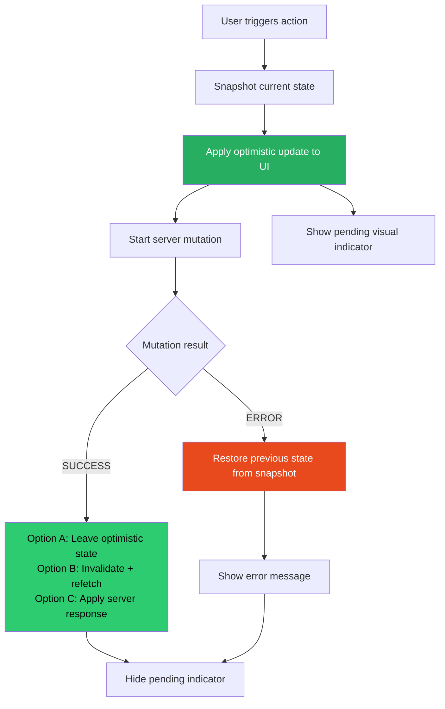
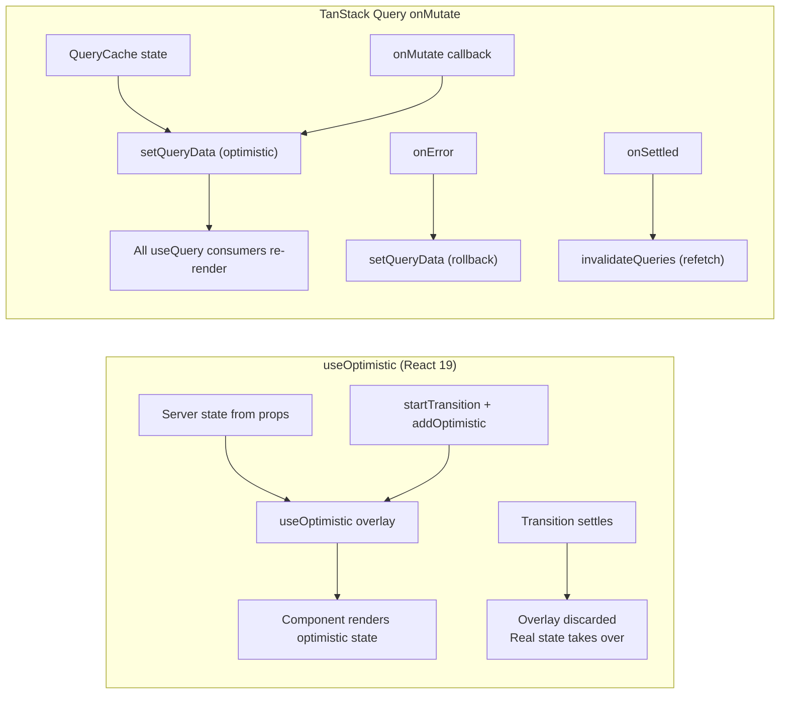

# 84 · Optimistic Updates

> **An optimistic update is a UI pattern where the interface reflects the expected result of a mutation BEFORE the server confirms it, then reconciles with the server's actual response. The user clicks "Like" and the heart fills immediately — the actual API call happens in the background. If the call succeeds, nothing changes (the optimistic state was correct). If it fails, the UI reverts. This gives the illusion of instant interactions in an inherently asynchronous world. The challenge is implementing it correctly: rollbacks on failure, handling concurrent mutations, race conditions between optimistic state and real server responses, and knowing when optimism is appropriate versus dangerous.**

Optimistic updates are a UX contract: "I'm confident enough in the success of this operation to show you the result before it's confirmed." That confidence should be calibrated. Liking a post: highly confident (low-risk operation, easily reversible) — optimistic update appropriate. Deleting an account: not confident (irreversible, high-stakes) — require confirmation, don't optimize. The engineering is straightforward once the product decision is correct.

---

## Table of Contents

- [The Optimistic Update Pattern](#the-optimistic-update-pattern)
- [When to Use Optimistic Updates](#when-to-use-optimistic-updates)
- [The Three Implementation Approaches](#the-three-implementation-approaches)
- [useOptimistic: React 19's Native Primitive](#useoptimistic-react-19s-native-primitive)
- [TanStack Query: Optimistic Updates with useMutation](#tanstack-query-optimistic-updates-with-usemutation)
- [Zustand: Optimistic Updates in a Global Store](#zustand-optimistic-updates-in-a-global-store)
- [The Rollback Problem](#the-rollback-problem)
- [Handling Concurrent Mutations](#handling-concurrent-mutations)
- [Race Conditions Between Optimistic State and Server Data](#race-conditions-between-optimistic-state-and-server-data)
- [Temporary IDs and ID Reconciliation](#temporary-ids-and-id-reconciliation)
- [Server Actions with useOptimistic (Next.js)](#server-actions-with-useoptimistic-nextjs)
- [Offline-First Optimistic Updates](#offline-first-optimistic-updates)
- [Architecture Diagrams](#architecture-diagrams)
- [Good Practices](#good-practices)
- [Bad Practices](#bad-practices)
- [Mental Model](#mental-model)
- [Common Misconceptions](#common-misconceptions)
- [Exercises](#exercises)
- [Further Reading](#further-reading)

---

## The Optimistic Update Pattern

The full lifecycle of an optimistic update:

```
1. USER ACTION: user clicks "Like"

2. OPTIMISTIC UPDATE (synchronous):
   a. Store previous state (for rollback)
   b. Apply the expected result to the UI immediately
   c. Start the mutation (API call) in the background

3A. SUCCESS PATH:
   Server confirms → optimistic state matches reality
   Options:
     a. Leave the optimistic state in place (if you trust the server agrees)
     b. Invalidate the cache and re-fetch (to get the server's authoritative response)
     c. Manually update the cache with the server's response (most precise)

3B. FAILURE PATH:
   Server rejects → optimistic state was wrong
   a. Revert to the stored previous state
   b. Show an error message
   c. Optionally: offer retry
```

---

## When to Use Optimistic Updates

```
APPROPRIATE FOR OPTIMISTIC UPDATES:
  ✅ Low-risk toggles: like, bookmark, follow, upvote
  ✅ Incremental operations: adding to a list, incrementing a count
  ✅ User-content updates: editing their own profile, their own posts
  ✅ Operations with clear rollback semantics: the failure path is obvious
  ✅ High-confidence operations: the server almost never rejects these
  ✅ Latency-sensitive paths: where 200-300ms of perceived delay matters

NOT APPROPRIATE FOR OPTIMISTIC UPDATES:
  ❌ Irreversible operations: deleting data, sending emails, financial transactions
  ❌ Conflict-prone operations: concurrent editing, race conditions expected
  ❌ Complex validation: server may reject for non-obvious reasons the client can't predict
  ❌ Authentication/authorization: server decision may be unpredictable
  ❌ Low-frequency, high-stakes: where the rollback is confusing or jarring
  ❌ Operations where "wrong state shown briefly then reverted" damages trust
```

---

## The Three Implementation Approaches

Different tools provide different optimistic update mechanisms:

```
1. REACT 19's useOptimistic (+ Server Actions)
   Best for: App Router + Server Actions, co-located mutations
   How: special hook that overlays optimistic state on real state,
        automatically reverts when server responds

2. TANSTACK QUERY useMutation (onMutate / onError / onSettled)
   Best for: client-side mutations in components using React Query
   How: onMutate applies optimistic state to the query cache;
        onError rolls back; onSettled re-validates

3. MANUAL (Zustand / Redux with custom logic)
   Best for: mutations in global stores without a data-fetching library
   How: manual optimistic state management in store actions
```

---

## useOptimistic: React 19's Native Primitive

`useOptimistic` is React 19's built-in hook for optimistic updates, designed to work with Server Actions:

```tsx
import { useOptimistic } from "react";

// Basic signature:
const [optimisticState, addOptimistic] = useOptimistic(
  state, // the "real" state (from server/parent)
  updateFn, // (currentState, optimisticValue) => newOptimisticState
);
```

### How useOptimistic works internally

```
useOptimistic maintains two state values internally:
  1. "Real" state: synchronized with the passed-in `state` prop
  2. "Optimistic" overlay: applied when a transition is in flight

When addOptimistic(value) is called (inside a transition):
  → updateFn(currentRealState, value) → produces the optimistic state
  → Component re-renders with optimisticState = result of updateFn

When the transition settles (Server Action completes):
  → If the parent state updated (via revalidation): real state wins
  → The optimistic overlay is discarded
  → Component re-renders with the final real state

AUTOMATIC ROLLBACK:
  If the transition fails (Server Action throws):
  → The optimistic overlay is discarded
  → Component re-renders with the original real state
  → React surfaces the error to the nearest error boundary
```

### Complete useOptimistic example

```tsx
"use client";
import { useOptimistic, useTransition } from "react";
import { toggleLike } from "./actions"; // Server Action

type LikeButtonProps = {
  postId: string;
  initialLiked: boolean;
  initialCount: number;
};

function LikeButton({ postId, initialLiked, initialCount }: LikeButtonProps) {
  const [isPending, startTransition] = useTransition();

  // The "real" state: what the server says is true
  const [liked, setLiked] = useState(initialLiked);
  const [count, setCount] = useState(initialCount);

  // Optimistic overlay: what we show while the mutation is in flight
  const [optimisticLiked, setOptimisticLiked] = useOptimistic(
    liked,
    (currentLiked, isNowLiked: boolean) => isNowLiked,
  );

  const [optimisticCount, setOptimisticCount] = useOptimistic(
    count,
    (currentCount, delta: number) => currentCount + delta,
  );

  const handleToggle = () => {
    const nowLiking = !optimisticLiked;

    startTransition(async () => {
      // Apply optimistic state immediately (within the transition):
      setOptimisticLiked(nowLiking);
      setOptimisticCount(nowLiking ? 1 : -1);

      try {
        const result = await toggleLike(postId); // Server Action
        // Server Action's revalidatePath will update the server state
        // and React will reconcile with real state automatically
        setLiked(result.liked); // update real state from server response
        setCount(result.count);
      } catch {
        // useOptimistic auto-reverts on error — but we also update real state
        // (it stays unchanged since catch here means server rejected)
      }
    });
  };

  return (
    <button
      onClick={handleToggle}
      disabled={isPending}
      aria-pressed={optimisticLiked}
      className={optimisticLiked ? "liked" : "unliked"}
    >
      ❤️ {optimisticCount}
    </button>
  );
}
```

### useOptimistic with a list (add item pattern)

```tsx
"use client";
import { useOptimistic, useTransition } from "react";
import { addComment } from "./actions";

function CommentSection({
  comments,
  postId,
}: {
  comments: Comment[];
  postId: string;
}) {
  const [isPending, startTransition] = useTransition();
  const [text, setText] = useState("");

  const [optimisticComments, addOptimisticComment] = useOptimistic(
    comments,
    (currentComments: Comment[], newComment: Comment) => [
      ...currentComments,
      newComment,
    ],
  );

  const handleSubmit = (e: React.FormEvent) => {
    e.preventDefault();
    const commentText = text;
    setText(""); // clear input immediately

    startTransition(async () => {
      // Optimistic: add the comment to the list immediately
      addOptimisticComment({
        id: `temp-${Date.now()}`, // temporary ID
        text: commentText,
        author: "You",
        createdAt: new Date().toISOString(),
        isPending: true, // visual indicator
      });

      await addComment(postId, commentText); // Server Action
      // revalidatePath in Server Action updates the real comments list
    });
  };

  return (
    <div>
      <ul>
        {optimisticComments.map((comment) => (
          <li key={comment.id} style={{ opacity: comment.isPending ? 0.7 : 1 }}>
            <span>
              {comment.author}: {comment.text}
            </span>
            {comment.isPending && <Spinner />}
          </li>
        ))}
      </ul>
      <form onSubmit={handleSubmit}>
        <input
          value={text}
          onChange={(e) => setText(e.target.value)}
          placeholder="Add a comment..."
          disabled={isPending}
        />
        <button type="submit" disabled={isPending || !text.trim()}>
          {isPending ? "Posting..." : "Post"}
        </button>
      </form>
    </div>
  );
}
```

---

## TanStack Query: Optimistic Updates with useMutation

```tsx
import { useMutation, useQueryClient } from "@tanstack/react-query";

function TodoItem({ todo }: { todo: Todo }) {
  const queryClient = useQueryClient();

  const toggleTodo = useMutation({
    mutationFn: (id: string) =>
      fetch(`/api/todos/${id}/toggle`, { method: "POST" }).then((r) =>
        r.json(),
      ),

    onMutate: async (id) => {
      // 1. Cancel any outgoing refetches to avoid overwriting optimistic update
      await queryClient.cancelQueries({ queryKey: ["todos"] });

      // 2. Snapshot previous value for rollback
      const previousTodos = queryClient.getQueryData<Todo[]>(["todos"]);

      // 3. Optimistically update the cache
      queryClient.setQueryData<Todo[]>(["todos"], (old) =>
        old?.map((t) => (t.id === id ? { ...t, completed: !t.completed } : t)),
      );

      // 4. Return snapshot (available in onError as context)
      return { previousTodos };
    },

    onError: (error, id, context) => {
      // 5. Rollback to snapshot
      if (context?.previousTodos) {
        queryClient.setQueryData(["todos"], context.previousTodos);
      }
      toast.error("Failed to update todo");
    },

    onSettled: () => {
      // 6. Always sync with server (whether success or error)
      queryClient.invalidateQueries({ queryKey: ["todos"] });
    },
  });

  return (
    <li
      onClick={() => toggleTodo.mutate(todo.id)}
      style={{ opacity: toggleTodo.isPending ? 0.6 : 1 }}
    >
      <input type="checkbox" checked={todo.completed} readOnly />
      <span
        style={{ textDecoration: todo.completed ? "line-through" : "none" }}
      >
        {todo.text}
      </span>
    </li>
  );
}
```

---

## Zustand: Optimistic Updates in a Global Store

```tsx
import { create } from "zustand";

interface CartStore {
  items: CartItem[];
  addItem: (item: CartItem) => Promise<void>;
  removeItem: (id: string) => Promise<void>;
}

const useCartStore = create<CartStore>((set, get) => ({
  items: [],

  addItem: async (item: CartItem) => {
    // 1. Optimistically add to local state
    set((state) => ({ items: [...state.items, { ...item, isPending: true }] }));

    try {
      // 2. Send to server
      const serverItem = await fetch("/api/cart", {
        method: "POST",
        body: JSON.stringify(item),
      }).then((r) => r.json());

      // 3. Replace optimistic item with server-confirmed version
      set((state) => ({
        items: state.items.map((i) =>
          i.id === item.id
            ? { ...serverItem, isPending: false } // real server data
            : i,
        ),
      }));
    } catch (error) {
      // 4. Rollback: remove the optimistic item
      set((state) => ({
        items: state.items.filter((i) => i.id !== item.id),
      }));
      throw error; // re-throw for error handling at the call site
    }
  },

  removeItem: async (id: string) => {
    // 1. Snapshot for rollback
    const previousItems = get().items;

    // 2. Optimistically remove
    set((state) => ({ items: state.items.filter((i) => i.id !== id) }));

    try {
      await fetch(`/api/cart/${id}`, { method: "DELETE" });
    } catch (error) {
      // 3. Rollback on failure
      set({ items: previousItems });
      throw error;
    }
  },
}));
```

---

## The Rollback Problem

Rollback seems simple — restore the previous state — but has edge cases:

### Edge case 1: Multiple mutations in flight

```
User rapidly toggles "Like" 3 times:
  t=0: Click Like. Optimistic: liked=true. Mutation 1 starts.
  t=50ms: Click Unlike. Optimistic: liked=false. Mutation 2 starts.
  t=100ms: Click Like. Optimistic: liked=true. Mutation 3 starts.

  Mutation 1 fails at t=300ms:
    WRONG rollback: restores liked=false (the state before Mutation 1)
    But Mutations 2 and 3 have since applied. The "pre-Mutation 1" state is stale.
    CORRECT rollback: cancel or supersede the remaining mutations,
                      then revert to the last known server state.

Solution approaches:
  1. Debounce the mutations — only fire one when the user stops clicking
  2. Queue mutations and process them serially (no concurrency)
  3. Abort all pending mutations on new click, start fresh
  4. Track mutation version numbers — only apply rollbacks for the latest mutation
```

### Edge case 2: Stale closure capturing old state

```tsx
// ❌ Stale closure: context captured at mutation start becomes stale
const handleToggle = () => {
  const previousItems = items; // captured at click time

  startTransition(async () => {
    addOptimisticItem(newItem);
    try {
      await saveItem(newItem);
    } catch {
      // BUG: items may have changed since handleToggle was called!
      // Other mutations may have updated the list.
      setItems(previousItems); // restores stale state!
    }
  });
};

// ✅ Use a ref or functional update to always work with current state
const previousItemsRef = useRef(items);
previousItemsRef.current = items; // always points to latest

const handleToggle = () => {
  startTransition(async () => {
    addOptimisticItem(newItem);
    try {
      await saveItem(newItem);
    } catch {
      setItems(previousItemsRef.current); // current state, not stale closure
    }
  });
};
```

---

## Handling Concurrent Mutations

For operations where order matters (like a counter), concurrent mutations need explicit handling:

```tsx
// Pattern: request queue to serialize mutations
function useSerializedMutation<T>(mutationFn: (value: T) => Promise<void>) {
  const queueRef = useRef<Promise<void>>(Promise.resolve());

  return useCallback(
    (value: T) => {
      queueRef.current = queueRef.current
        .catch(() => {}) // don't let one failure break the queue
        .then(() => mutationFn(value));

      return queueRef.current;
    },
    [mutationFn],
  );
}

// Usage: serial like toggling
const toggleLike = useSerializedMutation(async (postId: string) => {
  await fetch(`/api/posts/${postId}/like`, { method: "POST" });
});

// User clicks rapidly: mutations run one at a time, in order
// No race conditions, correct final state
```

---

## Race Conditions Between Optimistic State and Server Data

When background refetches complete during an optimistic update, they can overwrite the optimistic state:

```tsx
// The problem:
// 1. User toggles like (optimistic: liked=true)
// 2. Background refetch completes (server says: liked=false, because mutation
//    hasn't landed yet)
// 3. Optimistic state is overwritten by the stale server response
// 4. Mutation completes → server says liked=true, but state is now liked=false

// TanStack Query's solution: cancelQueries in onMutate
onMutate: async (id) => {
  // CANCEL any in-flight refetches before applying optimistic state
  await queryClient.cancelQueries({ queryKey: ["post", id] });
  // Now no background refetch will overwrite our optimistic state
};

// useOptimistic's solution: the transition model
// useOptimistic's overlay persists until the transition settles
// The "real" state updates don't affect the optimistic overlay
// while the transition is in progress
```

---

## Temporary IDs and ID Reconciliation

When adding new items optimistically, you need a temporary ID (the server hasn't assigned a real one yet):

```tsx
// PATTERN: temporary ID → reconcile with server ID after mutation

type OptimisticTodo = Todo & { tempId?: string; isPending?: boolean };

function useTodoStore() {
  const [todos, setTodos] = useState<OptimisticTodo[]>([]);

  const addTodo = async (text: string) => {
    const tempId = `temp-${crypto.randomUUID()}`;

    // 1. Add with temporary ID:
    setTodos((prev) => [
      ...prev,
      { id: tempId, text, completed: false, tempId, isPending: true },
    ]);

    try {
      // 2. Server creates the todo and returns the real ID:
      const serverTodo = await fetch("/api/todos", {
        method: "POST",
        body: JSON.stringify({ text }),
      }).then((r) => r.json() as Promise<Todo>);

      // 3. Reconcile: replace the temp entry with the real one
      setTodos((prev) =>
        prev.map((t) =>
          t.tempId === tempId
            ? { ...serverTodo, isPending: false } // real todo, real ID
            : t,
        ),
      );
    } catch {
      // 4. Rollback: remove the temp entry
      setTodos((prev) => prev.filter((t) => t.tempId !== tempId));
    }
  };

  return { todos, addTodo };
}
```

### Key considerations for temporary IDs

```
1. The temp ID must be UNIQUE within the current list:
   crypto.randomUUID() or Date.now() + Math.random() work well.

2. Use the temp ID for React's key (not the eventually-undefined server ID):
   <li key={todo.tempId ?? todo.id}>
   This prevents the item from remounting when the real ID arrives.

3. Visual indicator during pending state:
   opacity: 0.7, a spinner, or "Saving..." text
   Lets users know the item isn't fully saved yet.

4. Consider what happens if the user acts on a temp-ID item:
   Can they delete a pending item? Complete it?
   These interactions need special handling.
```

---

## Server Actions with useOptimistic (Next.js)

The canonical pattern for Next.js App Router:

```tsx
// actions/todo-actions.ts
"use server";
import { revalidatePath } from "next/cache";

export async function addTodoAction(text: string): Promise<Todo> {
  const todo = await db.todos.create({ data: { text, completed: false } });
  revalidatePath("/todos");
  return todo;
}

export async function toggleTodoAction(id: string): Promise<void> {
  const todo = await db.todos.findUnique({ where: { id } });
  await db.todos.update({
    where: { id },
    data: { completed: !todo?.completed },
  });
  revalidatePath("/todos");
}

// components/todo-list.tsx
("use client");
import { useOptimistic, useTransition, useState } from "react";
import { addTodoAction, toggleTodoAction } from "../actions/todo-actions";

export function TodoList({ initialTodos }: { initialTodos: Todo[] }) {
  const [isPending, startTransition] = useTransition();
  const [inputValue, setInputValue] = useState("");

  // useOptimistic: overlay optimistic state on top of server state
  const [optimisticTodos, applyOptimisticUpdate] = useOptimistic(
    initialTodos,
    (
      current: Todo[],
      action: { type: "add"; todo: Todo } | { type: "toggle"; id: string },
    ) => {
      if (action.type === "add") {
        return [...current, { ...action.todo, isPending: true }];
      }
      if (action.type === "toggle") {
        return current.map((t) =>
          t.id === action.id
            ? { ...t, completed: !t.completed, isPending: true }
            : t,
        );
      }
      return current;
    },
  );

  const handleAdd = () => {
    const text = inputValue;
    setInputValue("");

    startTransition(async () => {
      applyOptimisticUpdate({
        type: "add",
        todo: { id: `temp-${Date.now()}`, text, completed: false },
      });
      await addTodoAction(text);
    });
  };

  const handleToggle = (id: string) => {
    startTransition(async () => {
      applyOptimisticUpdate({ type: "toggle", id });
      await toggleTodoAction(id);
    });
  };

  return (
    <div>
      <ul>
        {optimisticTodos.map((todo) => (
          <li
            key={todo.id}
            style={{ opacity: todo.isPending ? 0.7 : 1 }}
            onClick={() => handleToggle(todo.id)}
          >
            <input type="checkbox" checked={todo.completed} readOnly />
            {todo.text}
          </li>
        ))}
      </ul>
      <div>
        <input
          value={inputValue}
          onChange={(e) => setInputValue(e.target.value)}
          placeholder="New todo..."
        />
        <button onClick={handleAdd} disabled={isPending || !inputValue.trim()}>
          Add
        </button>
      </div>
    </div>
  );
}
```

---

## Offline-First Optimistic Updates

For applications that need to work offline, optimistic updates can be paired with a local queue:

```tsx
// Simplified offline-first pattern:
function useOfflineOptimisticMutation<T>(
  mutationFn: (value: T) => Promise<void>,
  applyLocally: (value: T) => void,
  rollback: () => void,
) {
  const [isOnline, setIsOnline] = useState(navigator.onLine);
  const pendingQueueRef = useRef<T[]>([]);

  useEffect(() => {
    const goOnline = async () => {
      setIsOnline(true);
      // Flush the queue when back online:
      const queue = [...pendingQueueRef.current];
      pendingQueueRef.current = [];
      for (const item of queue) {
        try {
          await mutationFn(item);
        } catch {
          rollback(); // if any fail, rollback
          break;
        }
      }
    };

    window.addEventListener("online", goOnline);
    window.addEventListener("offline", () => setIsOnline(false));
    return () => {
      window.removeEventListener("online", goOnline);
      window.removeEventListener("offline", () => setIsOnline(false));
    };
  }, [mutationFn, rollback]);

  return async (value: T) => {
    applyLocally(value); // always apply locally immediately

    if (isOnline) {
      await mutationFn(value);
    } else {
      pendingQueueRef.current.push(value); // queue for when online
    }
  };
}
```

---

## Architecture Diagrams

### Optimistic update state machine



### useOptimistic vs TanStack Query onMutate comparison



---

## Good Practices

### ✅ Good Practice — Optimistic like button with visual feedback states

```tsx
/**
 * Good: A like button with three visual states:
 *   1. Idle (not liked)
 *   2. Optimistically liked (pending server confirmation)
 *   3. Confirmed liked (server confirmed)
 *
 * The visual distinction between optimistic and confirmed prevents
 * users from being confused by the brief pending state.
 * Rollback on failure is automatic via useOptimistic.
 */
"use client";
import { useOptimistic, useTransition } from "react";
import { togglePostLike } from "./actions";

interface LikeButtonProps {
  postId: string;
  liked: boolean;
  likeCount: number;
}

function LikeButton({ postId, liked, likeCount }: LikeButtonProps) {
  const [isPending, startTransition] = useTransition();

  // useOptimistic: overlay for liked state
  const [optimisticLiked, setOptimisticLiked] = useOptimistic(
    liked,
    (_, newLiked: boolean) => newLiked,
  );

  // Optimistic count (simple delta)
  const [optimisticCount, setOptimisticCount] = useOptimistic(
    likeCount,
    (current, delta: number) => current + delta,
  );

  const handleLike = () => {
    const nowLiking = !optimisticLiked;

    startTransition(async () => {
      setOptimisticLiked(nowLiking);
      setOptimisticCount(nowLiking ? 1 : -1);
      await togglePostLike(postId);
      // revalidatePath in Server Action updates props → useOptimistic reconciles
    });
  };

  return (
    <button
      onClick={handleLike}
      disabled={isPending}
      aria-label={optimisticLiked ? "Unlike this post" : "Like this post"}
      aria-pressed={optimisticLiked}
      className={[
        "like-button",
        optimisticLiked ? "liked" : "",
        isPending ? "pending" : "",
      ].join(" ")}
    >
      <HeartIcon filled={optimisticLiked} />
      <span>{optimisticCount}</span>
      {isPending && <span className="sr-only">(saving...)</span>}
    </button>
  );
}
```

---

## Bad Practices

### ⚠️ Bad Practice — Optimistic updates for irreversible or high-stakes operations

```tsx
/**
 * Bad: Applying optimistic updates to operations where the rollback
 * causes user confusion or data loss.
 *
 * Scenario: Optimistic delete with rollback
 * User clicks "Delete Account"
 * Account disappears from UI optimistically
 * Server returns error (auth verification failed)
 * Account "reappears"
 * User is confused — "Did I delete it? Is it back?"
 *
 * For destructive or irreversible operations, confirm first.
 * Show a loading state during the operation.
 * Only remove from UI when confirmed.
 */
function DeleteAccountButton({ userId }: { userId: string }) {
  const [optimisticDeleted, setOptimisticDeleted] = useOptimistic(
    false,
    (_, deleted: boolean) => deleted,
  );

  const handleDelete = () => {
    startTransition(async () => {
      setOptimisticDeleted(true); // ❌ UI shows account as deleted
      try {
        await deleteAccount(userId); // if this fails...
      } catch {
        // ❌ Account "reappears" — deeply confusing UX
        // User doesn't know if the delete happened or not
      }
    });
  };
}

/**
 * ✅ Correct: Confirm dialog + loading state, no optimistic update
 */
function DeleteAccountButton({ userId }: { userId: string }) {
  const [isDeleting, setIsDeleting] = useState(false);
  const [showConfirm, setShowConfirm] = useState(false);

  const handleConfirmedDelete = async () => {
    setIsDeleting(true);
    try {
      await deleteAccount(userId);
      router.push("/goodbye");
    } catch (error) {
      setIsDeleting(false);
      toast.error(
        "Failed to delete account. Please try again or contact support.",
      );
    }
  };

  return (
    <>
      <button onClick={() => setShowConfirm(true)} disabled={isDeleting}>
        Delete Account
      </button>
      {showConfirm && (
        <ConfirmDialog
          title="Delete Account?"
          message="This cannot be undone. All your data will be permanently deleted."
          onConfirm={handleConfirmedDelete}
          onCancel={() => setShowConfirm(false)}
          isLoading={isDeleting}
        />
      )}
    </>
  );
}
```

---

## Mental Model

> 💡 **The optimistic update mental model:**
>
> Optimistic updates are like a **restaurant that immediately marks a dish as "RESERVED" on the menu board when you order it**, rather than waiting for the kitchen to confirm availability. You ordered the lobster, you see RESERVED, you feel confident. If the kitchen confirms (mutation succeeds) — nothing changes, you were right. If the kitchen says they're out (mutation fails) — the RESERVED marker is removed, you see the lobster back on the menu, and the waiter apologizes and offers alternatives. The key judgment: this works well for common, low-stakes items ("RESERVED" flipping back is understandable). It breaks trust for final, high-stakes actions ("Your account has been deleted" flipping back to "Your account is active" is alarming). The sophistication is in knowing which operations are lobster-like and which are high-stakes enough that you must wait for kitchen confirmation before telling the customer anything.

---

## Common Misconceptions

### "Optimistic updates eliminate loading states"

Optimistic updates eliminate the PERCEIVED waiting time for the mutation's outcome — the user doesn't wait to see their action reflected. They don't eliminate loading states for INITIAL DATA FETCH (where you have no existing value to be optimistic with). The initial page load still shows a skeleton/loading state.

### "useOptimistic automatically handles everything"

`useOptimistic` provides the state overlay and automatic reversion on error, but you still need to handle: the server action's response, any cache updates, and the transition management (`startTransition`). It simplifies rollback but doesn't automate the full optimistic update lifecycle.

### "Rollback is always safe"

Rollback reverts to the snapshot taken before the mutation started. If OTHER mutations happened during the in-flight period, the snapshot is stale, and rolling back to it overwrites those other changes. In high-concurrency scenarios, naive rollback can cause data loss. Queue mutations serially or use version numbers for correctness.

### "onMutate in TanStack Query is optional for optimistic updates"

Without `onMutate`, you can't apply the optimistic state BEFORE the mutation's network request completes — you'd have to wait for the server response to update the UI. `onMutate` IS the optimistic update step; the rest of the `useMutation` lifecycle (onError for rollback, onSettled for re-validation) is the cleanup.

### "The optimistic state and the server state will always eventually match"

They should, but network errors, server-side validation rejections, and concurrent user edits can leave them diverged. This is why `onSettled` always invalidates the query (or `revalidatePath` always fires in the Server Action): to guarantee eventual consistency by fetching the server's authoritative state after every mutation, successful or not.

---

## Exercises

### Exercise 1 — Implement a "follow user" optimistic button

Build a "Follow" button where:

1. Clicking immediately shows "Following" (optimistic)
2. The button is visually distinct during the pending state
3. On server error: reverts to "Follow" and shows a toast
4. On success: stays as "Following" (confirmed)
5. Clicking again during pending state: no-ops (prevent duplicate requests)

### Exercise 2 — Add an item to a list with temporary ID reconciliation

Build a todo list where:

1. Pressing Enter adds the todo optimistically with a temporary ID
2. The optimistic item shows a spinner indicator
3. When the server responds, the temp ID is replaced with the real ID seamlessly (no unmount/remount)
4. If the server fails, the item is removed and an error is shown

Verify by inspecting the DOM: the key shouldn't change between optimistic and confirmed state.

### Exercise 3 — Handle concurrent rapid toggles

Build a like button where users can click rapidly:

1. Naive implementation: click 5 times fast — observe inconsistent state
2. Fixed implementation: debounce OR serialize mutations in a queue
3. Measure: what is the final state after 5 rapid clicks with the fixed version?

---

## Further Reading

- [React Docs: useOptimistic](https://react.dev/reference/react/useOptimistic) — official API reference
- [TanStack Query: Optimistic Updates](https://tanstack.com/query/latest/docs/framework/react/guides/optimistic-updates) — onMutate/onError patterns
- [Next.js: useOptimistic with Server Actions](https://nextjs.org/docs/app/building-your-application/data-fetching/server-actions-and-mutations#optimistic-updates) — Next.js guide
- [UXPA: Optimistic UI Patterns](https://uxdesign.cc/optimistic-ui-patterns-to-improve-ux-79e2c45a20e5) — when and how from a UX perspective
- Related in this handbook: [65 · Server Actions Deep Dive](../nextjs-core/09-server-actions.md), [82 · TanStack Query](./04-tanstack-query.md)

---

_Part of the [React + Next.js Engineering Handbook](../../README.md)_
