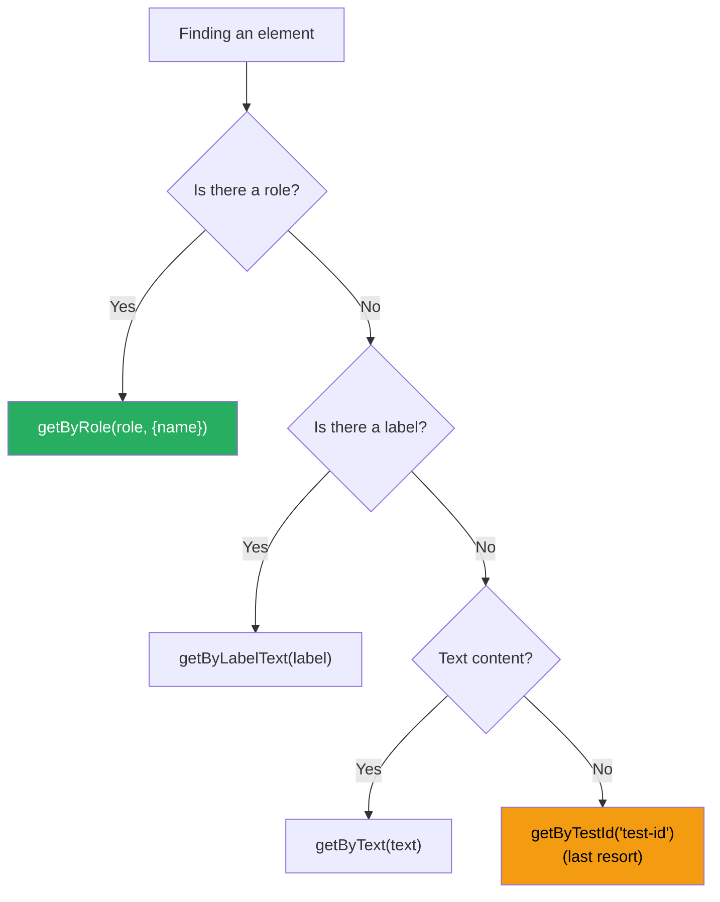

# 108 · Unit Testing with React Testing Library

> **Unit testing React components is fundamentally about testing behavior, not implementation. React Testing Library (RTL) enforces this philosophy through its API design: you interact with your components the way a user would — finding elements by accessible role, label, or text rather than by CSS selector or component name — making tests resilient to internal refactoring while catching real regressions in user-visible behavior. Vitest has emerged as the modern test runner for React/Next.js projects, offering Jest-compatible APIs with significantly faster execution, native ESM support, and seamless TypeScript integration. This document covers the architecture of a production-grade testing setup, the most important RTL patterns, and the specific challenges of testing Next.js components (Server Components, Server Actions, routing hooks).**

The most common mistake in React component testing is testing React's internals rather than user behavior: asserting that state changed, verifying that a lifecycle method was called, or checking that a specific child component was rendered. RTL's "queries" API makes this hard to do by accident — the queries correspond to what users see and interact with, not what developers put in code.

---

## Table of Contents

- [Vitest Setup for Next.js](#vitest-setup-for-nextjs)
- [React Testing Library Core Concepts](#react-testing-library-core-concepts)
- [The Query Priority Hierarchy](#the-query-priority-hierarchy)
- [User Events: userEvent vs fireEvent](#user-events-userevent-vs-fireevent)
- [Async Testing Patterns](#async-testing-patterns)
- [Mocking in Vitest](#mocking-in-vitest)
- [Testing Custom Hooks with renderHook](#testing-custom-hooks-with-renderhook)
- [Testing Next.js Specific Patterns](#testing-nextjs-specific-patterns)
- [Testing Server Actions](#testing-server-actions)
- [Component Test Patterns by Category](#component-test-patterns-by-category)
- [Test Organization and Coverage Strategy](#test-organization-and-coverage-strategy)
- [Architecture Diagrams](#architecture-diagrams)
- [Good Practices](#good-practices)
- [Bad Practices](#bad-practices)
- [Mental Model](#mental-model)
- [Common Misconceptions](#common-misconceptions)
- [Exercises](#exercises)
- [Further Reading](#further-reading)

---

## Vitest Setup for Next.js

```bash
npm install -D vitest @vitejs/plugin-react jsdom @testing-library/react @testing-library/user-event @testing-library/jest-dom
```

```ts
// vitest.config.ts
import { defineConfig } from "vitest/config";
import react from "@vitejs/plugin-react";
import path from "path";

export default defineConfig({
  plugins: [react()],
  test: {
    environment: "jsdom", // simulate browser DOM
    globals: true, // no need to import describe/it/expect
    setupFiles: ["./vitest.setup.ts"],
    alias: {
      "@": path.resolve(__dirname, "./src"),
    },
    coverage: {
      provider: "v8",
      reporter: ["text", "html", "lcov"],
      exclude: ["node_modules/", "src/**/*.stories.tsx", "src/**/*.d.ts"],
    },
  },
});
```

```ts
// vitest.setup.ts
import '@testing-library/jest-dom'; // extends expect with .toBeInTheDocument(), .toHaveClass(), etc.
import { cleanup } from '@testing-library/react';
import { afterEach, vi } from 'vitest';

// Clean up rendered components after each test:
afterEach(() => {
  cleanup();
});

// Mock Next.js navigation hooks globally:
vi.mock('next/navigation', () => ({
  useRouter: () => ({
    push: vi.fn(),
    replace: vi.fn(),
    back: vi.fn(),
    prefetch: vi.fn(),
    pathname: '/',
    query: {},
  }),
  usePathname: () => '/',
  useSearchParams: () => new URLSearchParams(),
  redirect: vi.fn(),
  notFound: vi.fn(),
}));

// Mock Next.js image (avoids SSR-related issues in tests):
vi.mock('next/image', () => ({
  default: ({ src, alt, ...props }: { src: string; alt: string }) => (
    // eslint-disable-next-line @next/next/no-img-element
    
  ),
}));
```

```json
// package.json scripts
{
  "scripts": {
    "test": "vitest",
    "test:run": "vitest run", // single run (for CI)
    "test:coverage": "vitest run --coverage",
    "test:ui": "vitest --ui" // visual UI for test exploration
  }
}
```

---

## React Testing Library Core Concepts

```tsx
import { render, screen } from "@testing-library/react";
import { LoginForm } from "./LoginForm";

test("renders the login form with email and password fields", () => {
  render(<LoginForm onSubmit={vi.fn()} />);

  // screen.getBy*: throws if element not found — use for elements you EXPECT to exist
  expect(screen.getByRole("heading", { name: /sign in/i })).toBeInTheDocument();
  expect(screen.getByLabelText(/email/i)).toBeInTheDocument();
  expect(screen.getByLabelText(/password/i)).toBeInTheDocument();
  expect(screen.getByRole("button", { name: /sign in/i })).toBeInTheDocument();
});

// THE RENDER RESULT:
const { container, rerender, unmount } = render(<Component />);
// container: the DOM node the component is rendered into
// rerender: re-render with different props
// unmount: remove from DOM

// SCREEN: a global-ish object providing access to queries
// Always prefer screen.getBy* over destructuring from render()
// screen queries always access the current state of the DOM

// WITHIN: scope queries to a specific element
import { within } from "@testing-library/react";
const table = screen.getByRole("table");
const rows = within(table).getAllByRole("row");
expect(rows).toHaveLength(5); // table has 5 rows
```

---

## The Query Priority Hierarchy

RTL's queries, in priority order (highest to lowest — use the highest applicable):

```tsx
// TIER 1: ACCESSIBLE TO EVERYONE (visual users, screen reader users, keyboard users)
// These queries match what assistive technologies see:

screen.getByRole("button", { name: /submit/i });
// → finds: <button>Submit</button>, <button aria-label="Submit" />, etc.
// → role options: button, link, heading, textbox, checkbox, radio,
//                 combobox, listbox, option, tab, tabpanel, dialog, etc.

screen.getByLabelText(/email address/i);
// → finds: <input> associated with <label>Email address</label>
// → via: htmlFor/id, aria-label, aria-labelledby, wrapping label

screen.getByPlaceholderText(/search products/i);
// → finds: <input placeholder="Search products..." />
// Lower priority than getByLabelText — placeholders aren't accessible labels

screen.getByText(/welcome back/i);
// → finds any element with matching text content

screen.getByDisplayValue("john@example.com");
// → finds input/select/textarea with current value

// TIER 2: SEMANTIC QUERIES
screen.getByAltText(/profile picture/i); // → 
screen.getByTitle(/close dialog/i); // → any element with title attribute

// TIER 3: TEST IDs (last resort — not accessible-equivalent)
screen.getByTestId("product-card");
// → finds: data-testid="product-card"
// Use ONLY when no accessible query is possible.
// These create coupling to implementation details.

// QUERY VARIANTS:
// getBy*   → throws if 0 or >1 elements found (use when element must exist)
// queryBy* → returns null if not found (use when checking element DOESN'T exist)
// findBy*  → async, waits for element to appear (use for async rendering)
// getAllBy* → returns array, throws if empty
// queryAllBy* → returns array, empty if none found
// findAllBy*  → async array version
```

---

## User Events: userEvent vs fireEvent

```tsx
import userEvent from "@testing-library/user-event";

// userEvent simulates REAL user interactions (fires the full event sequence
// that browsers generate: pointer down, focus, pointer up, click, etc.)
// ALWAYS prefer userEvent over fireEvent for user actions:

const user = userEvent.setup(); // creates a user instance

test("user can fill and submit the login form", async () => {
  const onSubmit = vi.fn();
  render(<LoginForm onSubmit={onSubmit} />);

  // Type into the email field (fires: click, focus, keydown, keypress, keyup for each char):
  await user.type(screen.getByLabelText(/email/i), "alice@example.com");

  // Type into password:
  await user.type(screen.getByLabelText(/password/i), "secret123");

  // Click the submit button (fires: mouseenter, mousedown, mouseup, click):
  await user.click(screen.getByRole("button", { name: /sign in/i }));

  expect(onSubmit).toHaveBeenCalledWith({
    email: "alice@example.com",
    password: "secret123",
  });
});

// OTHER userEvent METHODS:
await user.keyboard("{Tab}"); // keyboard navigation
await user.keyboard("{Enter}"); // enter key
await user.selectOptions(selectEl, "value"); // select dropdown option
await user.clear(inputEl); // clear an input
await user.hover(element); // mouse hover
await user.unhover(element); // remove hover

// fireEvent: use for edge cases where userEvent doesn't support
// the interaction, or when you need precise control over one event:
import { fireEvent } from "@testing-library/react";
fireEvent.scroll(window, { target: { scrollY: 200 } }); // scroll events
fireEvent.resize(window, { target: { innerWidth: 500 } }); // window resize
```

---

## Async Testing Patterns

```tsx
// For components that render loading states and then real content:
test("loads and displays products", async () => {
  // Mock the API call:
  vi.mocked(fetchProducts).mockResolvedValue([
    { id: "1", name: "Widget A", price: 9.99 },
    { id: "2", name: "Widget B", price: 19.99 },
  ]);

  render(<ProductList />);

  // Initial state: loading spinner
  expect(screen.getByRole("status", { name: /loading/i })).toBeInTheDocument();

  // Wait for the products to appear (findBy* waits up to 1000ms by default):
  expect(await screen.findByText("Widget A")).toBeInTheDocument();
  expect(screen.getByText("Widget B")).toBeInTheDocument();

  // Loading spinner should be gone:
  expect(screen.queryByRole("status")).not.toBeInTheDocument();
});

// waitFor: wait for an assertion to pass (use when findBy* isn't precise enough):
import { waitFor } from "@testing-library/react";

await waitFor(
  () => {
    expect(screen.getByText("Success")).toBeInTheDocument();
  },
  { timeout: 2000 },
); // custom timeout

// waitForElementToBeRemoved: wait for something to disappear:
await waitForElementToBeRemoved(() => screen.queryByRole("progressbar"));

// Testing error states:
test("shows error when fetch fails", async () => {
  vi.mocked(fetchProducts).mockRejectedValue(new Error("Network error"));

  render(<ProductList />);

  expect(await screen.findByRole("alert")).toHaveTextContent(/failed to load/i);
});
```

---

## Mocking in Vitest

```ts
// MODULE MOCKING:
vi.mock("./api/products", () => ({
  fetchProducts: vi.fn(),
  createProduct: vi.fn(),
}));

// Typed mock with auto-complete:
import { fetchProducts } from "./api/products";
vi.mock("./api/products");
const mockFetchProducts = vi.mocked(fetchProducts);

// Per-test setup:
beforeEach(() => {
  mockFetchProducts.mockResolvedValue([]);
});

afterEach(() => {
  vi.clearAllMocks(); // reset call counts
});

// SPYING (wrap real implementation):
const consoleSpy = vi.spyOn(console, "error").mockImplementation(() => {});
// After test: consoleSpy.mockRestore();

// TIMER MOCKING:
vi.useFakeTimers();
vi.advanceTimersByTime(1000); // advance by 1 second
vi.runAllTimers(); // run all pending timers
vi.useRealTimers(); // restore real timers

// TEST EACH (parameterized tests):
test.each([
  ["admin", true],
  ["user", false],
  ["guest", false],
])('user with role "%s" can access admin: %s', (role, expected) => {
  const { result } = renderHook(() => usePermissions({ role }));
  expect(result.current.canAccessAdmin).toBe(expected);
});
```

---

## Testing Custom Hooks with renderHook

```tsx
import { renderHook, act } from "@testing-library/react";
import { useCounter } from "./useCounter";

test("useCounter increments and decrements", () => {
  const { result } = renderHook(() => useCounter({ initial: 0 }));

  expect(result.current.count).toBe(0);

  // Wrap state updates in act():
  act(() => {
    result.current.increment();
  });
  expect(result.current.count).toBe(1);

  act(() => {
    result.current.decrement();
  });
  expect(result.current.count).toBe(0);
});

// Testing hooks that need context providers:
const wrapper = ({ children }: { children: React.ReactNode }) => (
  <ThemeProvider theme="dark">
    <AuthProvider user={mockUser}>{children}</AuthProvider>
  </ThemeProvider>
);

const { result } = renderHook(() => useTheme(), { wrapper });
```

---

## Testing Next.js Specific Patterns

```tsx
// Testing a Client Component that uses Next.js navigation:
// (useRouter, usePathname, useSearchParams are mocked in vitest.setup.ts)

import { render, screen } from "@testing-library/react";
import userEvent from "@testing-library/user-event";
import { useRouter } from "next/navigation";
import { SearchBar } from "./SearchBar";

test("SearchBar navigates to search results on submit", async () => {
  const user = userEvent.setup();
  const mockPush = vi.fn();
  vi.mocked(useRouter).mockReturnValue({
    push: mockPush,
    replace: vi.fn(),
    back: vi.fn(),
    prefetch: vi.fn(),
  } as ReturnType<typeof useRouter>);

  render(<SearchBar />);

  await user.type(screen.getByRole("searchbox"), "red widgets");
  await user.keyboard("{Enter}");

  expect(mockPush).toHaveBeenCalledWith("/search?q=red+widgets");
});

// Testing with a custom render wrapper that includes providers:
// test-utils.tsx (shared across test files)
import { render, RenderOptions } from "@testing-library/react";
import { ReactElement } from "react";

function AllProviders({ children }: { children: React.ReactNode }) {
  return (
    <QueryClientProvider
      client={
        new QueryClient({ defaultOptions: { queries: { retry: false } } })
      }
    >
      <SessionProvider session={mockSession}>{children}</SessionProvider>
    </QueryClientProvider>
  );
}

function customRender(
  ui: ReactElement,
  options?: Omit<RenderOptions, "wrapper">,
) {
  return render(ui, { wrapper: AllProviders, ...options });
}

export * from "@testing-library/react";
export { customRender as render };
```

---

## Testing Server Actions

```tsx
// Server Actions are async functions — test them directly (no React rendering needed):

// actions/createPost.ts
"use server";
export async function createPost(formData: FormData) {
  const title = formData.get("title") as string;
  if (!title?.trim()) {
    return { error: "Title is required" };
  }
  const post = await db.posts.create({ data: { title } });
  return { success: true, postId: post.id };
}

// actions/createPost.test.ts
import { createPost } from "./createPost";
import { db } from "@/lib/db";

vi.mock("@/lib/db", () => ({
  db: {
    posts: {
      create: vi.fn(),
    },
  },
}));

// Mock Next.js server-only modules:
vi.mock("next/headers", () => ({
  cookies: () => ({ get: vi.fn(), set: vi.fn() }),
  headers: () => ({ get: vi.fn() }),
}));

vi.mock("next/cache", () => ({
  revalidatePath: vi.fn(),
  revalidateTag: vi.fn(),
}));

test("createPost returns error for empty title", async () => {
  const formData = new FormData();
  formData.set("title", "");

  const result = await createPost(formData);
  expect(result).toEqual({ error: "Title is required" });
  expect(vi.mocked(db.posts.create)).not.toHaveBeenCalled();
});

test("createPost creates and returns the new post id", async () => {
  vi.mocked(db.posts.create).mockResolvedValue({
    id: "post-123",
    title: "Hello",
  });

  const formData = new FormData();
  formData.set("title", "Hello World");

  const result = await createPost(formData);
  expect(result).toEqual({ success: true, postId: "post-123" });
  expect(vi.mocked(db.posts.create)).toHaveBeenCalledWith({
    data: { title: "Hello World" },
  });
});
```

---

## Component Test Patterns by Category

```tsx
// PATTERN 1: Testing form validation
test("shows validation errors on submit without required fields", async () => {
  const user = userEvent.setup();
  render(<ContactForm onSubmit={vi.fn()} />);

  await user.click(screen.getByRole("button", { name: /submit/i }));

  expect(
    screen.getByRole("alert", { name: /name is required/i }),
  ).toBeInTheDocument();
  expect(
    screen.getByRole("alert", { name: /email is required/i }),
  ).toBeInTheDocument();
});

// PATTERN 2: Testing conditional rendering
test("shows admin controls only for admin users", () => {
  render(<Dashboard user={{ role: "admin", name: "Alice" }} />);
  expect(
    screen.getByRole("button", { name: /manage users/i }),
  ).toBeInTheDocument();
});

test("hides admin controls for regular users", () => {
  render(<Dashboard user={{ role: "user", name: "Bob" }} />);
  expect(
    screen.queryByRole("button", { name: /manage users/i }),
  ).not.toBeInTheDocument();
});

// PATTERN 3: Testing modal/dialog behavior
test("modal opens on trigger click and closes on Escape", async () => {
  const user = userEvent.setup();
  render(<ProductWithModal product={mockProduct} />);

  expect(screen.queryByRole("dialog")).not.toBeInTheDocument();

  await user.click(screen.getByRole("button", { name: /view details/i }));
  expect(screen.getByRole("dialog")).toBeInTheDocument();
  expect(screen.getByRole("dialog")).toHaveAccessibleName(/product details/i);

  await user.keyboard("{Escape}");
  expect(screen.queryByRole("dialog")).not.toBeInTheDocument();
});

// PATTERN 4: Testing list rendering
test("renders all products in the grid", () => {
  const products = [
    { id: "1", name: "Widget A" },
    { id: "2", name: "Widget B" },
    { id: "3", name: "Widget C" },
  ];
  render(<ProductGrid products={products} />);

  const productCards = screen.getAllByRole("article");
  expect(productCards).toHaveLength(3);
  expect(screen.getByText("Widget A")).toBeInTheDocument();
});

// PATTERN 5: Testing keyboard navigation
test("dropdown is navigable via arrow keys", async () => {
  const user = userEvent.setup();
  render(<SelectMenu options={["Apple", "Banana", "Cherry"]} />);

  await user.click(screen.getByRole("combobox"));
  expect(screen.getByRole("listbox")).toBeInTheDocument();

  await user.keyboard("{ArrowDown}");
  expect(screen.getByRole("option", { name: "Apple" })).toHaveAttribute(
    "aria-selected",
    "true",
  );

  await user.keyboard("{ArrowDown}");
  expect(screen.getByRole("option", { name: "Banana" })).toHaveAttribute(
    "aria-selected",
    "true",
  );
});
```

---

## Test Organization and Coverage Strategy

```
WHAT TO TEST (behavior that matters to users):
  ✅ Component renders correctly in each meaningful state
     (loading, success, error, empty, edge cases)
  ✅ User interactions trigger correct outcomes
     (form submission, button clicks, keyboard navigation)
  ✅ Conditional rendering based on props/state
  ✅ Error boundaries catch and display errors gracefully
  ✅ Accessibility properties (roles, labels, ARIA states)
  ✅ Integration between related components (form + validation)

WHAT NOT TO TEST:
  ❌ Implementation details (internal state, private methods)
  ❌ CSS class names (break on any refactor)
  ❌ Child component rendering (that's the child's test to write)
  ❌ Third-party library internals (trust that they work)
  ❌ Things that are visually verified (screenshot/visual tests instead)

COVERAGE STRATEGY:
  Don't chase 100% code coverage — it produces tests that test
  implementation, not behavior. Target:
  80%+ line coverage for critical business logic
  60-70% overall (lower is fine for simple UI components)
  0% for generated code, type definitions, constants

FILE ORGANIZATION:
  Option A: colocated tests
    src/
      components/
        Button/
          Button.tsx
          Button.test.tsx  ← next to the component

  Option B: separate __tests__ directory
    src/
      __tests__/
        components/
          Button.test.tsx

  RECOMMENDATION: colocated tests are easier to maintain and more
  visible to developers working on the component.
```

---

## Architecture Diagrams

### RTL query selection decision tree



---

## Good Practices

### ✅ Good Practice — Testing behavior, not implementation

```tsx
/**
 * Good: Tests verify what users experience (text, roles, interactions)
 * not how the component achieves it internally.
 */

// The component under test:
function PasswordInput({ label }: { label: string }) {
  const [visible, setVisible] = useState(false);
  return (
    <div>
      <label htmlFor="password">{label}</label>
      <input
        id="password"
        type={visible ? "text" : "password"}
        aria-describedby="password-toggle-hint"
      />
      <button
        onClick={() => setVisible((v) => !v)}
        aria-label={visible ? "Hide password" : "Show password"}
      >
        {visible ? "🙈" : "👁"}
      </button>
    </div>
  );
}

// Tests focus on user-visible behavior:
describe("PasswordInput", () => {
  it("masks password by default", () => {
    render(<PasswordInput label="Password" />);
    expect(screen.getByLabelText(/password/i)).toHaveAttribute(
      "type",
      "password",
    );
  });

  it("reveals password when show button is clicked", async () => {
    const user = userEvent.setup();
    render(<PasswordInput label="Password" />);

    await user.click(screen.getByRole("button", { name: /show password/i }));

    expect(screen.getByLabelText(/password/i)).toHaveAttribute("type", "text");
    expect(
      screen.getByRole("button", { name: /hide password/i }),
    ).toBeInTheDocument();
  });
});
// ← These tests would pass even if `visible` state was refactored to a URL param,
//   a ref, or an external store — the tests only care about what users see.
```

---

## Bad Practices

### ⚠️ Bad Practice — Testing implementation details

```tsx
/**
 * Bad: Tests that access internal state, check component instance methods,
 * or verify implementation rather than behavior. These tests break on
 * any internal refactor even when user behavior is unchanged.
 */

// ❌ BAD: Testing internal state (with enzyme-style APIs)
test("toggle state changes correctly", () => {
  const wrapper = shallow(<PasswordInput />);
  expect(wrapper.state("visible")).toBe(false); // testing private state
  wrapper.instance().toggleVisibility(); // calling internal method
  expect(wrapper.state("visible")).toBe(true); // testing private state again
});
// This test breaks if:
// - `visible` is renamed to `isRevealed`
// - State is moved to a custom hook
// - State is replaced with a ref
// None of these changes affect user experience.

// ❌ BAD: Asserting on CSS classes
test("button has active class when clicked", async () => {
  const user = userEvent.setup();
  render(<ToggleButton />);
  await user.click(screen.getByRole("button"));
  expect(screen.getByRole("button")).toHaveClass("button--active"); // CSS class
});
// This test breaks if the class is renamed to `button--on` or replaced with
// a data attribute — even though the button visually still shows as "active".

// ❌ BAD: Testing that a child component was rendered
test("renders the Spinner component while loading", () => {
  render(<ProductList />);
  // Testing which component is rendered, not what the user sees:
  expect(document.querySelector(".spinner")).toBeInTheDocument();
  // → The test knows about the Spinner implementation.
  // → If Spinner's class changes, the test breaks.
});

// ✅ Fix: test what the user sees, not how it's built:
test("shows loading indicator while fetching", () => {
  render(<ProductList />);
  // The user sees "loading" — we don't care if it's Spinner or a skeleton:
  expect(screen.getByRole("status", { name: /loading/i })).toBeInTheDocument();
});
```

---

## Mental Model

> 💡 **The RTL testing mental model:**
>
> Testing with RTL is like being a **QA engineer who doesn't have access to the source code** — you only have the running application in front of you, and you can only interact with it the way a real user can: reading text, clicking buttons, filling forms, observing what appears on screen. This constraint is the methodology's strength: if a test can only be written by knowing internal implementation details, that test is likely testing the wrong thing. The "user" in "user event" is literal — when you write `await user.click(getByRole('button', {name: /submit/}))`, you're asking: "can a user find a button labeled 'Submit' and click it?" — which is the actual requirement. The test passes if and only if that requirement is met, regardless of whether the button is implemented with a `<button>`, a `<div role="button">`, a custom component, or whether its internal state management uses useState, useReducer, or a state machine.

---

## Common Misconceptions

### "Higher test coverage means better tests"

100% code coverage can be achieved with tests that test nothing meaningful (they execute every line but make no assertions). Coverage is a metric for finding UNTESTED areas, not a goal in itself. A 70% coverage suite testing meaningful user behavior is more valuable than a 100% coverage suite testing implementation details.

### "findBy* queries are always better than getBy* for async components"

`findBy*` polls until the element appears (or times out). For elements that are present from the first render, `getBy*` is faster and more explicit. Use `findBy*` specifically when an element appears AFTER an async operation; use `getBy*` when the element should be present immediately.

### "Mocking makes tests less valuable"

Selective mocking (of external dependencies like API calls, databases) makes tests FASTER, MORE DETERMINISTIC, and more focused on the component's behavior. The alternative — making real API calls in unit tests — creates flaky, slow tests that fail when the API is down. The correct level of mocking is: mock at the boundary (the API call), not inside (the business logic you're testing).

### "Testing Library can test Server Components"

React Testing Library renders components in a JSDOM environment (a browser simulation). React Server Components require a server runtime and cannot be rendered in JSDOM. Server Component testing requires either: integration tests with actual Next.js server, or testing the server component's DATA FETCHING logic separately from its rendering. The `render()` function in RTL is for Client Components.

### "You should test every component"

Simple presentational components (a Badge that displays text with a color) often have more value as Storybook stories than as unit tests — the "test" is visual. Prioritize unit tests for: components with significant logic (forms, interactive widgets), hooks with complex state, Server Actions with business rules. Don't write tests for completeness; write them for confidence.

---

## Exercises

### Exercise 1 — Write tests for a multi-step form

Implement tests for a 3-step checkout form (Shipping → Payment → Review):

1. Test that the first step is shown initially and subsequent steps are hidden
2. Test that clicking "Next" without filling required fields shows validation errors
3. Test that valid form submission proceeds to the next step
4. Test that clicking "Back" returns to the previous step
5. Test that the final submission calls the `onComplete` callback with all form data

### Exercise 2 — Test a custom hook with complex state

Write tests for a `useShoppingCart` hook that:

1. Starts empty (`items: []`)
2. `addItem(product)` adds a product (and increments quantity if already present)
3. `removeItem(productId)` removes a product
4. `clearCart()` empties the cart
5. `total` is correctly calculated based on items and quantities

### Exercise 3 — Identify and fix bad tests

Given this test suite (artificially bad):

```tsx
test("LoginForm works", () => {
  const { container } = render(<LoginForm />);
  expect(container.querySelector(".login-form__email")).toBeTruthy();
  expect(container.querySelector(".login-form__password")).toBeTruthy();
  const button = container.querySelector(".login-form__submit");
  fireEvent.click(button!);
});
```

Identify every problem and rewrite using RTL best practices.

---

## Further Reading

- [Testing Library documentation](https://testing-library.com/docs/) — the authoritative RTL guide
- [Kent C. Dodds: Common mistakes with React Testing Library](https://kentcdodds.com/blog/common-mistakes-with-react-testing-library) — the definitive "how to avoid bad tests" post
- [Vitest documentation](https://vitest.dev/) — the Vitest API reference
- [Which query should I use?](https://testing-library.com/docs/queries/about/#priority) — RTL's official query priority guide
- [Testing Library: User Events](https://testing-library.com/docs/user-event/intro) — userEvent API reference
- Next in this handbook: [109 · Integration Testing](./02-integration-testing.md)

---

_Part of the [React + Next.js Engineering Handbook](../../README.md)_
