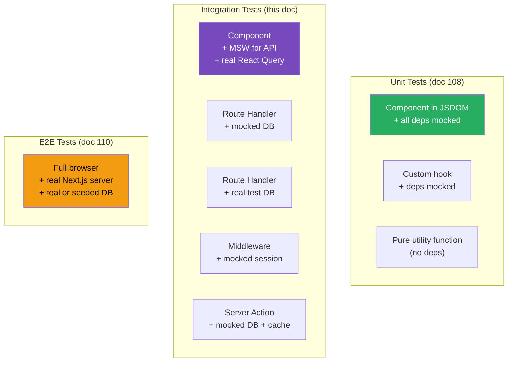

# 109 · Integration Testing

> **Integration tests verify that multiple units of your application work correctly together — components + API calls, Route Handlers + database queries, form submissions + Server Actions + cache invalidation. Where unit tests isolate a single component in a JSDOM environment with mocked dependencies, integration tests use real (or realistic) implementations of adjacent layers, catching the class of bugs that unit tests specifically can't: incorrect API response shape assumptions, cache invalidation not triggering, middleware not applying to the right routes, authentication checks missing from specific endpoints. In Next.js, integration testing spans several distinct surfaces: API Route Handlers, Middleware, full page rendering with real data fetching, and server-client interaction via Server Actions.**

The testing pyramid traditionally places integration tests between unit tests (many, fast) and end-to-end tests (few, slow). For Next.js specifically, integration tests are disproportionately valuable because the framework's routing, caching, middleware, and server/client boundary create many integration points that unit tests can't cover and that E2E tests are too expensive to cover exhaustively.

---

## Table of Contents

- [The Integration Test Scope](#the-integration-test-scope)
- [Mock Service Worker: Realistic API Mocking](#mock-service-worker-realistic-api-mocking)
- [MSW Setup for Next.js](#msw-setup-for-nextjs)
- [Testing Route Handlers Directly](#testing-route-handlers-directly)
- [Testing Middleware](#testing-middleware)
- [Database Integration Tests with Prisma](#database-integration-tests-with-prisma)
- [Testing Full Pages with next-test-api-route-handler](#testing-full-pages-with-next-test-api-route-handler)
- [Testing Auth Flows](#testing-auth-flows)
- [Testing Cache Invalidation](#testing-cache-invalidation)
- [Contract Testing with Zod](#contract-testing-with-zod)
- [Architecture Diagrams](#architecture-diagrams)
- [Good Practices](#good-practices)
- [Bad Practices](#bad-practices)
- [Mental Model](#mental-model)
- [Common Misconceptions](#common-misconceptions)
- [Exercises](#exercises)
- [Further Reading](#further-reading)

---

## The Integration Test Scope

```
UNIT TESTS COVER:
  A single component in isolation, with all dependencies mocked.
  A single function/hook with mocked external calls.
  Fast (milliseconds per test).
  Many of them.

INTEGRATION TESTS COVER (the focus of this document):
  A component + its data fetching layer (API calls, TanStack Query)
  A Route Handler + its business logic + database interaction
  Middleware + route protection + session validation
  Server Action + validation + database write + cache invalidation
  A form component + submission + server-side handling
  Fast-to-moderate (seconds per test, not tens of seconds)
  Moderate number.

END-TO-END TESTS COVER (doc 110):
  A full user workflow in a real browser (Next.js server running)
  Login → navigate → perform action → verify result
  Slow (tens of seconds per test)
  Fewer of them.

THE INTEGRATION TEST SWEET SPOT:
  "Does this Route Handler correctly authenticate, validate input,
   query the database, and return the right shape?" — integration test
  "Does clicking the Add to Cart button update the cart in the database
   and show the correct cart count?" — integration test with real DB
  "Does the entire checkout user journey work?" — E2E test
```

---

## Mock Service Worker: Realistic API Mocking

MSW (Mock Service Worker) intercepts HTTP requests at the network level — unlike module-level mocking, it works even when the request is made by a third-party library or deep within your fetch chain:

```bash
npm install -D msw
npx msw init public/ --save
```

```ts
// src/mocks/handlers.ts — define what requests to intercept and how to respond
import { http, HttpResponse } from "msw";

export const handlers = [
  // Intercept GET /api/products:
  http.get("/api/products", ({ request }) => {
    const url = new URL(request.url);
    const category = url.searchParams.get("category");

    if (category === "electronics") {
      return HttpResponse.json([
        { id: "1", name: "Laptop", price: 999, category: "electronics" },
        { id: "2", name: "Phone", price: 599, category: "electronics" },
      ]);
    }

    return HttpResponse.json([
      { id: "1", name: "Laptop", price: 999, category: "electronics" },
      { id: "3", name: "Book", price: 29, category: "books" },
    ]);
  }),

  // Intercept POST /api/orders:
  http.post("/api/orders", async ({ request }) => {
    const body = (await request.json()) as { items: unknown[] };

    if (!body.items?.length) {
      return HttpResponse.json(
        { error: "Cart cannot be empty" },
        { status: 400 },
      );
    }

    return HttpResponse.json(
      { orderId: "order-123", status: "confirmed" },
      { status: 201 },
    );
  }),

  // Intercept third-party API calls (works for any URL!):
  http.get("https://api.stripe.com/v1/payment_intents/:id", ({ params }) => {
    return HttpResponse.json({
      id: params.id,
      status: "succeeded",
      amount: 9900,
    });
  }),
];
```

---

## MSW Setup for Next.js

```ts
// src/mocks/server.ts — Node.js server for Vitest/Jest
import { setupServer } from "msw/node";
import { handlers } from "./handlers";

export const server = setupServer(...handlers);

// vitest.setup.ts — integrate MSW with Vitest
import { server } from "./src/mocks/server";
import { beforeAll, afterEach, afterAll } from "vitest";

beforeAll(() => server.listen({ onUnhandledRequest: "error" }));
// 'error': tests fail if they make a request with no matching handler
// This catches unintended real network calls in tests

afterEach(() => server.resetHandlers());
// Reset any per-test handler overrides

afterAll(() => server.close());
```

```tsx
// Using MSW in an integration test:
import { render, screen } from "@testing-library/react";
import { server } from "@/mocks/server";
import { http, HttpResponse } from "msw";
import { ProductList } from "./ProductList";

test("renders electronics products correctly", async () => {
  render(<ProductList category="electronics" />);

  // The component fetches /api/products?category=electronics
  // MSW intercepts this and returns our mock data:
  expect(await screen.findByText("Laptop")).toBeInTheDocument();
  expect(screen.getByText("Phone")).toBeInTheDocument();
  expect(screen.queryByText("Book")).not.toBeInTheDocument();
});

test("shows error when product fetch fails", async () => {
  // Override the handler for THIS test only:
  server.use(
    http.get("/api/products", () => {
      return HttpResponse.json(
        { error: "Internal server error" },
        { status: 500 },
      );
    }),
  );

  render(<ProductList category="electronics" />);

  expect(await screen.findByRole("alert")).toHaveTextContent(/failed to load/i);
});
// After this test, server.resetHandlers() restores the original handlers
```

---

## Testing Route Handlers Directly

Route Handlers can be tested by instantiating them directly — no HTTP server needed:

```ts
// app/api/products/route.ts
import { NextRequest } from "next/server";

export async function GET(request: NextRequest) {
  const category = request.nextUrl.searchParams.get("category");
  const products = await db.products.findMany({
    where: category ? { category } : undefined,
    orderBy: { name: "asc" },
  });
  return Response.json(products);
}

// app/api/products/route.test.ts
import { GET } from "./route";
import { db } from "@/lib/db";

vi.mock("@/lib/db", () => ({
  db: {
    products: {
      findMany: vi.fn(),
    },
  },
}));

function createRequest(url: string, init?: RequestInit): Request {
  return new Request(`http://localhost${url}`, init);
}

test("GET /api/products returns all products", async () => {
  const mockProducts = [
    { id: "1", name: "Alpha", category: "tools" },
    { id: "2", name: "Beta", category: "books" },
  ];
  vi.mocked(db.products.findMany).mockResolvedValue(mockProducts);

  const request = createRequest("/api/products");
  const response = await GET(request as any);
  const data = await response.json();

  expect(response.status).toBe(200);
  expect(data).toEqual(mockProducts);
  expect(vi.mocked(db.products.findMany)).toHaveBeenCalledWith({
    where: undefined,
    orderBy: { name: "asc" },
  });
});

test("GET /api/products?category=books filters by category", async () => {
  vi.mocked(db.products.findMany).mockResolvedValue([]);

  const request = createRequest("/api/products?category=books");
  await GET(request as any);

  expect(vi.mocked(db.products.findMany)).toHaveBeenCalledWith({
    where: { category: "books" },
    orderBy: { name: "asc" },
  });
});

// Testing auth-protected routes:
vi.mock("@/lib/auth/session", () => ({
  getSession: vi.fn(),
}));

test("returns 401 for unauthenticated requests", async () => {
  vi.mocked(getSession).mockResolvedValue(null);

  const request = createRequest("/api/admin/users");
  const response = await GET(request as any);

  expect(response.status).toBe(401);
});
```

---

## Testing Middleware

```ts
// middleware.ts
import { NextResponse } from "next/server";
import type { NextRequest } from "next/server";
import { verifySessionToken } from "@/lib/auth/session";

export async function middleware(request: NextRequest) {
  const isProtectedRoute = request.nextUrl.pathname.startsWith("/dashboard");
  const isApiRoute = request.nextUrl.pathname.startsWith("/api/protected");

  if (isProtectedRoute || isApiRoute) {
    const token = request.cookies.get("session")?.value;
    const session = token ? await verifySessionToken(token) : null;

    if (!session) {
      if (isApiRoute) {
        return NextResponse.json({ error: "Unauthorized" }, { status: 401 });
      }
      return NextResponse.redirect(new URL("/login", request.url));
    }
  }

  return NextResponse.next();
}

// middleware.test.ts
import { middleware } from "./middleware";
import { verifySessionToken } from "@/lib/auth/session";

vi.mock("@/lib/auth/session", () => ({
  verifySessionToken: vi.fn(),
}));

function createMiddlewareRequest(
  pathname: string,
  { cookies = {} }: { cookies?: Record<string, string> } = {},
): NextRequest {
  const url = `http://localhost${pathname}`;
  const request = new Request(url) as unknown as NextRequest;

  // Simulate cookies:
  const cookieHeader = Object.entries(cookies)
    .map(([k, v]) => `${k}=${v}`)
    .join("; ");

  Object.defineProperty(request, "cookies", {
    value: {
      get: (name: string) => ({ value: cookies[name] }),
    },
  });

  Object.defineProperty(request, "nextUrl", {
    value: new URL(url),
  });

  return request;
}

test("redirects unauthenticated users from /dashboard to /login", async () => {
  vi.mocked(verifySessionToken).mockResolvedValue(null);

  const request = createMiddlewareRequest("/dashboard/analytics", {
    cookies: {},
  });
  const response = await middleware(request);

  expect(response.status).toBe(307); // temporary redirect
  expect(response.headers.get("location")).toBe("http://localhost/login");
});

test("allows authenticated users to access /dashboard", async () => {
  vi.mocked(verifySessionToken).mockResolvedValue({
    userId: "user-123",
    role: "user",
  });

  const request = createMiddlewareRequest("/dashboard/analytics", {
    cookies: { session: "valid-token" },
  });
  const response = await middleware(request);

  // NextResponse.next() returns a response that passes through:
  expect(response.headers.get("x-middleware-rewrite")).toBeNull(); // not redirected
});

test("returns 401 JSON for unauthenticated API requests", async () => {
  vi.mocked(verifySessionToken).mockResolvedValue(null);

  const request = createMiddlewareRequest("/api/protected/data");
  const response = await middleware(request);

  expect(response.status).toBe(401);
  const data = await response.json();
  expect(data).toEqual({ error: "Unauthorized" });
});
```

---

## Database Integration Tests with Prisma

```ts
// For tests that need a real database interaction, use a test database
// (separate from production and development databases):

// vitest.config.ts — use test environment variables
process.env.DATABASE_URL = process.env.TEST_DATABASE_URL;

// test-utils/db.ts — test database setup helpers
import { PrismaClient } from "@prisma/client";

const prisma = new PrismaClient({
  datasources: {
    db: { url: process.env.TEST_DATABASE_URL },
  },
});

export async function resetDatabase() {
  // Delete in reverse dependency order (children before parents):
  await prisma.orderItem.deleteMany();
  await prisma.order.deleteMany();
  await prisma.product.deleteMany();
  await prisma.user.deleteMany();
}

export async function seedTestData() {
  const user = await prisma.user.create({
    data: { email: "test@example.com", name: "Test User", role: "user" },
  });
  const product = await prisma.product.create({
    data: { name: "Widget", price: 9.99, stock: 100 },
  });
  return { user, product };
}

export { prisma };

// Example integration test with real DB:
import { resetDatabase, seedTestData, prisma } from "@/test-utils/db";
import { createOrder } from "@/lib/orders/create-order";

describe("createOrder", () => {
  beforeEach(async () => {
    await resetDatabase();
  });

  afterAll(async () => {
    await prisma.$disconnect();
  });

  test("creates order and decrements product stock", async () => {
    const { user, product } = await seedTestData();

    const order = await createOrder({
      userId: user.id,
      items: [{ productId: product.id, quantity: 3 }],
    });

    expect(order.id).toBeDefined();
    expect(order.status).toBe("pending");
    expect(order.items).toHaveLength(1);
    expect(order.items[0].quantity).toBe(3);

    // Verify stock was decremented in the database:
    const updatedProduct = await prisma.product.findUnique({
      where: { id: product.id },
    });
    expect(updatedProduct?.stock).toBe(97); // 100 - 3
  });

  test("throws when product is out of stock", async () => {
    const { user, product } = await seedTestData();
    await prisma.product.update({
      where: { id: product.id },
      data: { stock: 0 },
    });

    await expect(
      createOrder({
        userId: user.id,
        items: [{ productId: product.id, quantity: 1 }],
      }),
    ).rejects.toThrow("Insufficient stock");
  });
});
```

---

## Testing Full Pages with next-test-api-route-handler

```bash
npm install -D next-test-api-route-handler
```

```ts
// A utility that starts Next.js's API layer without a full server,
// allowing realistic fetch-based Route Handler testing:

import { testApiHandler } from "next-test-api-route-handler";
import * as handler from "@/app/api/products/route";
import { db } from "@/lib/db";

vi.mock("@/lib/db");

test("GET /api/products returns 200 with correct structure", async () => {
  vi.mocked(db.products.findMany).mockResolvedValue([
    { id: "1", name: "Widget", price: 9.99, createdAt: new Date() },
  ]);

  await testApiHandler({
    appHandler: handler,
    test: async ({ fetch }) => {
      const res = await fetch({ method: "GET" });
      expect(res.status).toBe(200);

      const data = await res.json();
      expect(data).toMatchObject([
        expect.objectContaining({ id: "1", name: "Widget" }),
      ]);
    },
  });
});

test("POST /api/products validates request body", async () => {
  await testApiHandler({
    appHandler: handler,
    test: async ({ fetch }) => {
      const res = await fetch({
        method: "POST",
        headers: { "Content-Type": "application/json" },
        body: JSON.stringify({ name: "" }), // invalid: empty name
      });
      expect(res.status).toBe(400);

      const data = await res.json();
      expect(data.error).toMatch(/name is required/i);
    },
  });
});
```

---

## Testing Auth Flows

```tsx
// Integration test for a protected page + auth redirect flow:
import { render, screen } from "@testing-library/react";
import userEvent from "@testing-library/user-event";
import { server } from "@/mocks/server";
import { http, HttpResponse } from "msw";

// The LoginPage component makes a POST to /api/auth/login:
import { LoginPage } from "@/app/(auth)/login/page";

test("successful login redirects to dashboard", async () => {
  const user = userEvent.setup();
  const mockPush = vi.fn();
  vi.mocked(useRouter).mockReturnValue({ push: mockPush } as any);

  server.use(
    http.post("/api/auth/login", async ({ request }) => {
      const body = (await request.json()) as {
        email: string;
        password: string;
      };
      if (body.email === "alice@example.com" && body.password === "correct") {
        return HttpResponse.json(
          { user: { id: "1", email: "alice@example.com" } },
          {
            headers: {
              "Set-Cookie": "session=valid-token; HttpOnly; Path=/",
            },
          },
        );
      }
      return HttpResponse.json(
        { error: "Invalid credentials" },
        { status: 401 },
      );
    }),
  );

  render(<LoginPage />);

  await user.type(screen.getByLabelText(/email/i), "alice@example.com");
  await user.type(screen.getByLabelText(/password/i), "correct");
  await user.click(screen.getByRole("button", { name: /sign in/i }));

  await waitFor(() => {
    expect(mockPush).toHaveBeenCalledWith("/dashboard");
  });
});

test("wrong credentials shows error message", async () => {
  const user = userEvent.setup();

  server.use(
    http.post("/api/auth/login", () =>
      HttpResponse.json({ error: "Invalid credentials" }, { status: 401 }),
    ),
  );

  render(<LoginPage />);

  await user.type(screen.getByLabelText(/email/i), "wrong@example.com");
  await user.type(screen.getByLabelText(/password/i), "wrong");
  await user.click(screen.getByRole("button", { name: /sign in/i }));

  expect(await screen.findByRole("alert")).toHaveTextContent(
    /invalid credentials/i,
  );
  expect(vi.mocked(useRouter)().push).not.toHaveBeenCalled();
});
```

---

## Testing Cache Invalidation

```ts
// Server Action with cache invalidation — a critical integration point:
"use server";
import { revalidatePath, revalidateTag } from "next/cache";
import { db } from "@/lib/db";
import { getSession } from "@/lib/auth/session";

export async function updateProductPrice(productId: string, newPrice: number) {
  const session = await getSession();
  if (!session || session.role !== "admin") throw new Error("Unauthorized");

  await db.products.update({
    where: { id: productId },
    data: { price: newPrice },
  });

  // Invalidate cached product data:
  revalidatePath("/products");
  revalidatePath(`/products/${productId}`);
  revalidateTag(`product-${productId}`);

  return { success: true };
}

// Testing the cache invalidation behavior:
import { updateProductPrice } from "./actions";
import { revalidatePath, revalidateTag } from "next/cache";
import { getSession } from "@/lib/auth/session";
import { db } from "@/lib/db";

vi.mock("next/cache");
vi.mock("@/lib/auth/session");
vi.mock("@/lib/db");

test("updateProductPrice invalidates correct cache paths", async () => {
  vi.mocked(getSession).mockResolvedValue({ userId: "u1", role: "admin" });
  vi.mocked(db.products.update).mockResolvedValue({
    id: "p1",
    price: 19.99,
  } as any);

  await updateProductPrice("p1", 19.99);

  expect(vi.mocked(revalidatePath)).toHaveBeenCalledWith("/products");
  expect(vi.mocked(revalidatePath)).toHaveBeenCalledWith("/products/p1");
  expect(vi.mocked(revalidateTag)).toHaveBeenCalledWith("product-p1");
});

test("updateProductPrice rejects non-admin users", async () => {
  vi.mocked(getSession).mockResolvedValue({ userId: "u1", role: "user" });

  await expect(updateProductPrice("p1", 19.99)).rejects.toThrow("Unauthorized");
  expect(vi.mocked(db.products.update)).not.toHaveBeenCalled();
  expect(vi.mocked(revalidatePath)).not.toHaveBeenCalled();
});
```

---

## Contract Testing with Zod

```ts
// Contract tests: verify that API responses match your Zod schemas
// This catches API drift (when the backend changes its response shape
// without updating your frontend schemas)

import { z } from "zod";
import { server } from "@/mocks/server";
import { http, HttpResponse } from "msw";

const ProductSchema = z.object({
  id: z.string(),
  name: z.string().min(1),
  price: z.number().positive(),
  category: z.string(),
  inStock: z.boolean(),
  createdAt: z.string().datetime(),
});

const ProductsResponseSchema = z.array(ProductSchema);

test("GET /api/products response matches ProductSchema", async () => {
  // Use the actual API response (from MSW mock or real test API):
  const response = await fetch("/api/products");
  const data = await response.json();

  // Validate the response shape matches what our frontend expects:
  const parseResult = ProductsResponseSchema.safeParse(data);

  if (!parseResult.success) {
    // Format the validation errors for a clear test failure message:
    const errors = parseResult.error.issues
      .map((i) => `${i.path.join(".")}: ${i.message}`)
      .join("\n");
    throw new Error(`API response doesn't match expected schema:\n${errors}`);
  }
});

// This pattern is especially useful when:
// 1. Your API is external (third-party) and might change
// 2. Your backend and frontend teams work independently
// 3. You want to catch breaking changes before they reach production
```

---

## Architecture Diagrams

### Integration test coverage vs unit tests vs E2E



---

## Good Practices

### ✅ Good Practice — MSW handler organization with realistic error simulation

```ts
/**
 * Good: Organized MSW handlers that simulate realistic backend behavior
 * including authentication, validation errors, and network delays —
 * enabling integration tests that catch real-world failure scenarios.
 */

// src/mocks/handlers/products.ts
import { http, HttpResponse, delay } from "msw";

export const productHandlers = [
  http.get("/api/products", async ({ request }) => {
    const token = request.headers.get("authorization");
    if (!token) {
      return HttpResponse.json({ error: "Unauthorized" }, { status: 401 });
    }

    // Simulate realistic network latency:
    await delay(150);

    return HttpResponse.json([
      { id: "1", name: "Widget A", price: 9.99, inStock: true },
      { id: "2", name: "Widget B", price: 19.99, inStock: false },
    ]);
  }),

  http.post("/api/products", async ({ request }) => {
    const body = (await request.json()) as { name?: string; price?: number };

    const errors: Record<string, string> = {};
    if (!body.name?.trim()) errors.name = "Name is required";
    if (!body.price || body.price <= 0) errors.price = "Price must be positive";

    if (Object.keys(errors).length > 0) {
      return HttpResponse.json({ errors }, { status: 422 });
    }

    return HttpResponse.json(
      { id: "new-id", ...body, inStock: true },
      { status: 201 },
    );
  }),
];

// src/mocks/handlers/index.ts — centralized handler export
import { productHandlers } from "./products";
import { authHandlers } from "./auth";
import { orderHandlers } from "./orders";

export const handlers = [...productHandlers, ...authHandlers, ...orderHandlers];
```

---

## Bad Practices

### ⚠️ Bad Practice — Mocking at too low a level, defeating integration test purpose

```tsx
/**
 * Bad: An "integration test" that mocks so deeply it's effectively a unit test
 * — the test doesn't verify that the component correctly uses the query library,
 * handles loading states, or processes the API response shape correctly.
 * It only verifies what the component renders given pre-constructed data.
 */

// ❌ Mocking TanStack Query directly — over-mocking in an integration test
vi.mock("@tanstack/react-query", () => ({
  useQuery: vi.fn().mockReturnValue({
    data: [{ id: "1", name: "Widget" }],
    isLoading: false,
    error: null,
  }),
}));

test("ProductList renders products", () => {
  render(<ProductList />);
  expect(screen.getByText("Widget")).toBeInTheDocument();
});
// This test proves nothing about:
// - Whether the actual API URL is correct
// - Whether the query key is correct (would be broken after refactor)
// - Whether the response shape matches what the component expects
// - Whether loading states render correctly
// It's a very brittle unit test wearing integration test clothing.

/**
 * ✅ Fix: use MSW to mock at the HTTP level — let TanStack Query actually run:
 */
// MSW handler returns the response; TanStack Query fetches it; component renders it.
// Now the test also verifies:
// ✅ The fetch URL is correct (MSW only intercepts the exact path)
// ✅ The loading state renders (component shows spinner while TanStack Query fetches)
// ✅ The response shape is processed correctly by the component
// ✅ Error states work (server can return error; TanStack Query handles it)
```

---

## Mental Model

> 💡 **The integration testing mental model:**
>
> Unit tests check that each **brick is correctly shaped** — the component renders what it should, the function returns what it should. Integration tests check that **the bricks fit together and form a wall** — the component correctly calls the API, correctly interprets the response, correctly handles errors, and correctly triggers side effects. MSW is a **realistic protocol simulator**: instead of handing the component pre-made data (which bypasses the entire data fetching layer), MSW intercepts the actual HTTP request the component makes — verifying the URL is correct, the headers are right, the request body is valid — and returns a realistic response, forcing the component to process it through all its actual parsing and transformation logic. The integration test catches the brick-fitting problems that unit tests, each focused on one brick in isolation, structurally cannot see.

---

## Common Misconceptions

### "Integration tests are just slower unit tests"

Integration tests verify a fundamentally different property — that multiple units work TOGETHER correctly. A unit test can verify a component renders "Loading..." when `isLoading: true` is passed. An integration test verifies that `isLoading: true` actually occurs during a real fetch, that it transitions to the data state when the fetch succeeds, and that the component correctly processes the real response shape. These aren't slower versions of the same test; they're tests of different properties.

### "MSW only works in the browser"

MSW supports both browser environments (via Service Worker) and Node.js environments (via Node.js interceptors). For testing with Vitest/Jest in Node.js, use `msw/node`'s `setupServer`. The same handler definitions work in both environments, enabling consistent mocking across unit tests (Node.js) and browser-based testing (Storybook, Cypress component tests).

### "You need a real database for integration tests to be meaningful"

Many integration tests can use a fast in-memory mock (via `vi.mock`) at the database layer while still providing significant value — they verify the Route Handler's auth checks, input validation, business logic, and response shape without the overhead of a real database. Reserve real-database integration tests for testing database-specific behavior (transactions, unique constraints, complex queries).

### "Integration tests should cover every code path"

Integration tests are most valuable for the CONNECTIONS between units and the happy/common-error paths. Exhaustive edge case coverage belongs in unit tests (faster, more isolated). A typical integration test suite covers: the main success path, the main error path (auth failure, validation failure, external service failure), and critical business rule violations.

---

## Exercises

### Exercise 1 — Set up MSW for an existing project

1. Install and configure MSW for a Next.js project with Vitest
2. Create handlers for your application's main API endpoints
3. Write integration tests for a component that fetches data, verifying: loading state, success state, and error state
4. Add a test that overrides a handler for a specific error scenario (e.g., 500 server error)

### Exercise 2 — Test a Route Handler with auth and validation

Write integration tests for a `POST /api/comments` Route Handler that:

1. Returns 401 if the request has no valid session cookie
2. Returns 422 if `content` is missing or empty
3. Returns 422 if `content` exceeds 1000 characters
4. Returns 201 with the created comment on success
5. The comment's `authorId` comes from the session, not the request body

### Exercise 3 — Contract test your API responses

1. Define Zod schemas for all your API responses
2. Write contract tests that fetch from your API (via `testApiHandler` or MSW) and validate the response against the schema
3. Intentionally break one field (change a type from `string` to `number`) and verify the contract test catches it

---

## Further Reading

- [Mock Service Worker documentation](https://mswjs.io/docs/) — the authoritative MSW guide
- [next-test-api-route-handler](https://github.com/Xunnamius/next-test-api-route-handler) — testing Next.js Route Handlers
- [Zod documentation](https://zod.dev/) — runtime type validation for contract testing
- [Kent C. Dodds: The Testing Trophy](https://kentcdodds.com/blog/the-testing-trophy-and-testing-classifications) — the philosophy of integration-test-heavy strategies
- [MSW: Recipes](https://mswjs.io/docs/recipes) — common MSW patterns
- Related in this handbook: [108 · Unit Testing](./01-unit-testing.md), [82 · TanStack Query](../state-management/04-tanstack-query.md)
- Next in this handbook: [110 · E2E Testing with Playwright](./03-e2e-playwright.md)

---

_Part of the [React + Next.js Engineering Handbook](../../README.md)_
