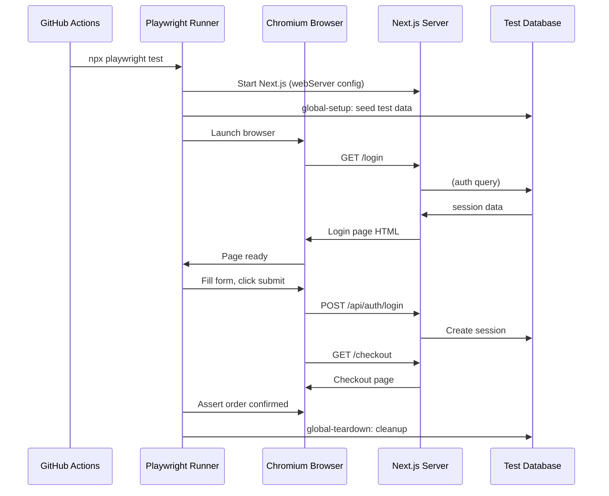

# 110 · E2E Testing with Playwright

> **End-to-end (E2E) tests run your entire application — Next.js server, database, browser — and simulate real user workflows from start to finish. Where unit and integration tests verify isolated behaviors in controlled environments, E2E tests verify that the whole system works together for the scenarios that matter most: a user can sign up and complete their first purchase, an admin can approve a submitted application, a user gets an error message when the payment fails and their order is not created. Playwright is the modern standard for E2E testing, offering browser automation across Chromium, Firefox, and WebKit, a powerful assertion library, and first-class TypeScript support — with specific integrations for Next.js via the `@playwright/test` runner.**

E2E tests are expensive: they're slower than any other test type (seconds to minutes per test), require a running server and often a seeded database, and are more brittle than unit or integration tests because they depend on the complete system. The engineering judgment required is knowing which workflows DESERVE E2E coverage — the critical paths where a regression would be catastrophic — versus which are adequately covered by integration tests at a fraction of the cost.

---

## Table of Contents

- [Playwright Setup for Next.js](#playwright-setup-for-nextjs)
- [The Page Object Model](#the-page-object-model)
- [Locators: Playwright's Element Selection API](#locators-playwrights-element-selection-api)
- [Authentication in E2E Tests](#authentication-in-e2e-tests)
- [Test Fixtures: Sharing Setup Across Tests](#test-fixtures-sharing-setup-across-tests)
- [Database Seeding for E2E Tests](#database-seeding-for-e2e-tests)
- [Network Interception with route()](#network-interception-with-route)
- [Testing Full User Workflows](#testing-full-user-workflows)
- [Visual Regression Testing](#visual-regression-testing)
- [Accessibility Testing with axe-core](#accessibility-testing-with-axe-core)
- [Parallel Execution and CI Configuration](#parallel-execution-and-ci-configuration)
- [Debugging Playwright Tests](#debugging-playwright-tests)
- [Architecture Diagrams](#architecture-diagrams)
- [Good Practices](#good-practices)
- [Bad Practices](#bad-practices)
- [Mental Model](#mental-model)
- [Common Misconceptions](#common-misconceptions)
- [Exercises](#exercises)
- [Further Reading](#further-reading)

---

## Playwright Setup for Next.js

```bash
npm init playwright@latest
# Installs: @playwright/test, Chromium/Firefox/WebKit browsers
# Creates: playwright.config.ts, tests/example.spec.ts

# Or manually:
npm install -D @playwright/test
npx playwright install # download browser binaries
```

```ts
// playwright.config.ts
import { defineConfig, devices } from "@playwright/test";

export default defineConfig({
  testDir: "./e2e", // separate directory from unit tests
  fullyParallel: true, // run test files in parallel
  forbidOnly: !!process.env.CI, // fail if test.only is committed
  retries: process.env.CI ? 2 : 0, // retry failed tests in CI
  workers: process.env.CI ? 1 : undefined, // limit parallelism in CI
  reporter: [
    ["html"], // HTML report at playwright-report/
    ["list"], // console output during run
    process.env.CI ? ["github"] : ["dot"], // GitHub Actions annotations in CI
  ],
  use: {
    baseURL: "http://localhost:3000", // base URL for all navigate() calls
    trace: "on-first-retry", // capture trace on failure (for debugging)
    screenshot: "only-on-failure", // screenshot on failure
    video: "retain-on-failure", // video on failure
  },
  projects: [
    {
      name: "chromium",
      use: { ...devices["Desktop Chrome"] },
    },
    {
      name: "firefox",
      use: { ...devices["Desktop Firefox"] },
    },
    {
      name: "mobile-chrome",
      use: { ...devices["Pixel 5"] },
    },
    // Run against Safari/WebKit only for critical paths:
    // { name: 'webkit', use: { ...devices['Desktop Safari'] } },
  ],
  // Start the Next.js dev server before running tests:
  webServer: {
    command: "npm run build && npm run start",
    url: "http://localhost:3000",
    reuseExistingServer: !process.env.CI, // reuse in dev, always start fresh in CI
    timeout: 120_000, // 2 minutes for build + start
    env: {
      DATABASE_URL: process.env.TEST_DATABASE_URL!,
      NEXTAUTH_SECRET: "test-secret-for-e2e",
    },
  },
});
```

```json
// package.json
{
  "scripts": {
    "e2e": "playwright test",
    "e2e:ui": "playwright test --ui", // interactive UI mode
    "e2e:debug": "playwright test --debug", // pause on each step
    "e2e:headed": "playwright test --headed", // watch browser run
    "e2e:codegen": "playwright codegen localhost:3000" // record test from actions
  }
}
```

---

## The Page Object Model

The Page Object Model (POM) encapsulates page-specific selectors and actions, reducing duplication and making tests more readable:

```ts
// e2e/pages/login-page.ts
import { Page, Locator, expect } from "@playwright/test";

export class LoginPage {
  readonly page: Page;
  readonly emailInput: Locator;
  readonly passwordInput: Locator;
  readonly submitButton: Locator;
  readonly errorMessage: Locator;

  constructor(page: Page) {
    this.page = page;
    this.emailInput = page.getByLabel(/email/i);
    this.passwordInput = page.getByLabel(/password/i);
    this.submitButton = page.getByRole("button", { name: /sign in/i });
    this.errorMessage = page.getByRole("alert");
  }

  async goto() {
    await this.page.goto("/login");
    await expect(this.page).toHaveTitle(/sign in/i);
  }

  async login(email: string, password: string) {
    await this.emailInput.fill(email);
    await this.passwordInput.fill(password);
    await this.submitButton.click();
  }

  async loginAndWait(email: string, password: string) {
    await this.login(email, password);
    // Wait for navigation to complete after successful login:
    await this.page.waitForURL("/dashboard");
  }
}

// e2e/pages/product-page.ts
export class ProductPage {
  readonly page: Page;

  constructor(page: Page) {
    this.page = page;
  }

  async goto(productId: string) {
    await this.page.goto(`/products/${productId}`);
  }

  async addToCart() {
    await this.page.getByRole("button", { name: /add to cart/i }).click();
    // Wait for cart count to update:
    await expect(this.page.getByTestId("cart-count")).not.toHaveText("0");
  }

  async getCartCount(): Promise<number> {
    const text = await this.page.getByTestId("cart-count").innerText();
    return parseInt(text, 10);
  }
}

// Using page objects in tests:
import { test, expect } from "@playwright/test";
import { LoginPage } from "./pages/login-page";
import { ProductPage } from "./pages/product-page";

test("user can add a product to cart after login", async ({ page }) => {
  const loginPage = new LoginPage(page);
  const productPage = new ProductPage(page);

  await loginPage.goto();
  await loginPage.loginAndWait("alice@example.com", "password123");

  await productPage.goto("product-1");
  const initialCount = await productPage.getCartCount();

  await productPage.addToCart();

  await expect(async () => {
    const newCount = await productPage.getCartCount();
    expect(newCount).toBe(initialCount + 1);
  }).toPass();
});
```

---

## Locators: Playwright's Element Selection API

```ts
// Playwright's locator API — similar to RTL's queries, prioritizing accessible selectors:

// ROLE-BASED (preferred — matches what users and AT see):
page.getByRole("button", { name: /submit/i });
page.getByRole("heading", { name: /product details/i });
page.getByRole("link", { name: /view details/i });
page.getByRole("checkbox", { name: /accept terms/i });
page.getByRole("textbox", { name: /email/i });

// LABEL-BASED:
page.getByLabel(/email address/i);

// TEXT-BASED:
page.getByText(/welcome back/i);
page.getByText("Exact text match");

// PLACEHOLDER:
page.getByPlaceholder("Search products...");

// ALT TEXT:
page.getByAltText(/profile photo/i);

// TEST ID (last resort):
page.getByTestId("cart-summary");

// CHAINING (scope to a parent):
const dialog = page.getByRole("dialog");
const submitButton = dialog.getByRole("button", { name: /confirm/i });

// FILTERING:
page.getByRole("listitem").filter({ hasText: "Widget A" });

// NTH ELEMENT:
page.getByRole("listitem").nth(0); // first matching element
page.getByRole("listitem").last(); // last matching element

// ASSERTIONS (locator-based — auto-retry until passing or timeout):
await expect(page.getByRole("heading")).toHaveText("Dashboard");
await expect(page.getByRole("button")).toBeEnabled();
await expect(page.getByRole("checkbox")).toBeChecked();
await expect(page.getByRole("alert")).toBeVisible();
await expect(page.getByTestId("cart-count")).toHaveText("3");
await expect(page).toHaveURL("/checkout");
await expect(page).toHaveTitle(/checkout/i);
```

---

## Authentication in E2E Tests

```ts
// Strategy 1: UI-based login (simplest but slow — performs actual login UI)
test.beforeEach(async ({ page }) => {
  await page.goto("/login");
  await page.getByLabel(/email/i).fill("alice@example.com");
  await page.getByLabel(/password/i).fill("password123");
  await page.getByRole("button", { name: /sign in/i }).click();
  await page.waitForURL("/dashboard");
});

// Strategy 2: Storage state (recommended — fast, reuses logged-in state)
// Step 1: create the auth state once and save it:
// e2e/auth/auth.setup.ts
import { test as setup } from "@playwright/test";
const authFile = "e2e/auth/user.json";

setup("authenticate as regular user", async ({ page }) => {
  await page.goto("/login");
  await page.getByLabel(/email/i).fill("alice@example.com");
  await page.getByLabel(/password/i).fill("password123");
  await page.getByRole("button", { name: /sign in/i }).click();
  await page.waitForURL("/dashboard");

  // Save the browser's storage state (cookies, localStorage):
  await page.context().storageState({ path: authFile });
});

// playwright.config.ts — configure projects to reuse auth state:
projects: [
  // Run auth setup first:
  {
    name: "setup",
    testMatch: /.*\.setup\.ts/,
  },
  // Run tests with the saved auth state:
  {
    name: "authenticated",
    testDir: "./e2e/tests",
    dependencies: ["setup"],
    use: {
      storageState: "e2e/auth/user.json", // reuses the saved cookies
    },
  },
];

// Strategy 3: Bypass UI login via direct cookie injection (fastest)
// Useful when login is not what you're testing and speed matters:
test.beforeEach(async ({ page, context }) => {
  // Set the session cookie directly, bypassing the login UI:
  await context.addCookies([
    {
      name: "session",
      value: await generateTestSessionToken({ userId: testUser.id }),
      domain: "localhost",
      path: "/",
      httpOnly: true,
      secure: false, // false for localhost
      sameSite: "Lax",
    },
  ]);
});
```

---

## Test Fixtures: Sharing Setup Across Tests

```ts
// e2e/fixtures.ts — custom Playwright fixtures for shared context
import { test as base, expect } from "@playwright/test";
import { LoginPage } from "./pages/login-page";
import { DashboardPage } from "./pages/dashboard-page";
import { db } from "@/lib/db";

// Define fixture types:
type TestFixtures = {
  loginPage: LoginPage;
  dashboardPage: DashboardPage;
  authenticatedUser: { id: string; email: string };
};

// Create a test function with custom fixtures:
export const test = base.extend<TestFixtures>({
  loginPage: async ({ page }, use) => {
    await use(new LoginPage(page));
  },

  dashboardPage: async ({ page }, use) => {
    await use(new DashboardPage(page));
  },

  authenticatedUser: async ({ page, context }, use) => {
    // Create and seed a unique user for this test:
    const user = await db.users.create({
      data: {
        email: `test-${Date.now()}@example.com`,
        name: "Test User",
        role: "user",
      },
    });

    // Set up their session:
    await context.addCookies([
      {
        name: "session",
        value: await generateTestSessionToken({ userId: user.id }),
        domain: "localhost",
        path: "/",
      },
    ]);

    await use(user);

    // Cleanup after the test:
    await db.users.delete({ where: { id: user.id } });
  },
});

export { expect } from "@playwright/test";

// Using custom fixtures in tests:
import { test, expect } from "../fixtures";

test("authenticated user can view their profile", async ({
  page,
  authenticatedUser,
}) => {
  await page.goto("/profile");
  await expect(page.getByText(authenticatedUser.email)).toBeVisible();
});
```

---

## Database Seeding for E2E Tests

```ts
// e2e/helpers/seed.ts — test data seeding helpers
import { db } from "@/lib/db";

export async function seedProductCatalog() {
  return db.product.createMany({
    data: [
      { id: "e2e-product-1", name: "E2E Widget A", price: 9.99, stock: 100 },
      { id: "e2e-product-2", name: "E2E Widget B", price: 19.99, stock: 50 },
      { id: "e2e-product-3", name: "E2E Widget C", price: 29.99, stock: 0 },
    ],
    skipDuplicates: true,
  });
}

export async function cleanupE2EData() {
  // Clean up test data by prefix convention:
  await db.orderItem.deleteMany({
    where: { product: { id: { startsWith: "e2e-" } } },
  });
  await db.order.deleteMany({
    where: { user: { email: { endsWith: "@e2e-test.com" } } },
  });
  await db.product.deleteMany({ where: { id: { startsWith: "e2e-" } } });
  await db.user.deleteMany({ where: { email: { endsWith: "@e2e-test.com" } } });
}

// In playwright.config.ts — global setup/teardown:
export default defineConfig({
  globalSetup: "./e2e/global-setup.ts",
  globalTeardown: "./e2e/global-teardown.ts",
});

// e2e/global-setup.ts:
import { seedProductCatalog } from "./helpers/seed";
export default async function globalSetup() {
  await seedProductCatalog();
}

// e2e/global-teardown.ts:
import { cleanupE2EData } from "./helpers/seed";
export default async function globalTeardown() {
  await cleanupE2EData();
}
```

---

## Network Interception with route()

```ts
// Mock network requests without a separate MSW setup:
// Useful for: simulating external API failures, testing edge cases,
// preventing actual charges/emails during E2E tests

test("shows error when payment processor is unavailable", async ({ page }) => {
  // Intercept Stripe API calls and simulate failure:
  await page.route("https://api.stripe.com/**", (route) => {
    route.fulfill({
      status: 500,
      body: JSON.stringify({ error: { message: "Service unavailable" } }),
    });
  });

  await page.goto("/checkout");
  // ... fill checkout form ...
  await page.getByRole("button", { name: /place order/i }).click();

  await expect(
    page.getByRole("alert", { name: /payment failed/i }),
  ).toBeVisible();
});

// ABORT specific requests (e.g., analytics — faster tests):
await page.route("https://analytics.google.com/**", (route) => route.abort());
await page.route("**/sentry.io/**", (route) => route.abort());

// MODIFY responses:
await page.route("/api/feature-flags", async (route) => {
  const response = await route.fetch(); // fetch the real response
  const json = await response.json();
  // Override a specific flag for this test:
  await route.fulfill({
    response,
    json: { ...json, "new-checkout": true }, // enable a feature flag
  });
});
```

---

## Testing Full User Workflows

```ts
// The complete checkout workflow — a classic E2E test case:
test("user completes a purchase end-to-end", async ({ page }) => {
  // 1. Log in:
  await page.goto("/login");
  await page.getByLabel(/email/i).fill("alice@e2e-test.com");
  await page.getByLabel(/password/i).fill("password123");
  await page.getByRole("button", { name: /sign in/i }).click();
  await page.waitForURL("/dashboard");

  // 2. Browse to a product:
  await page.goto("/products/e2e-product-1");
  await expect(
    page.getByRole("heading", { name: "E2E Widget A" }),
  ).toBeVisible();

  // 3. Add to cart:
  await page.getByRole("button", { name: /add to cart/i }).click();
  await expect(page.getByTestId("cart-count")).toHaveText("1");

  // 4. Proceed to checkout:
  await page.getByRole("link", { name: /view cart/i }).click();
  await expect(page).toHaveURL("/cart");
  await page.getByRole("button", { name: /checkout/i }).click();
  await expect(page).toHaveURL("/checkout/shipping");

  // 5. Fill shipping:
  await page.getByLabel(/full name/i).fill("Alice Smith");
  await page.getByLabel(/address/i).fill("123 Main St");
  await page.getByLabel(/city/i).fill("Springfield");
  await page.getByLabel(/postal code/i).fill("12345");
  await page.getByRole("button", { name: /continue to payment/i }).click();
  await expect(page).toHaveURL("/checkout/payment");

  // 6. Fill payment (using test card in Stripe test mode):
  await page
    .frameLocator('[data-testid="stripe-frame"]')
    .getByLabel(/card number/i)
    .fill("4242 4242 4242 4242");
  await page
    .frameLocator('[data-testid="stripe-frame"]')
    .getByLabel(/expiry/i)
    .fill("12/25");
  await page
    .frameLocator('[data-testid="stripe-frame"]')
    .getByLabel(/cvc/i)
    .fill("123");

  // 7. Submit order:
  await page.getByRole("button", { name: /place order/i }).click();

  // 8. Verify confirmation:
  await expect(page).toHaveURL(/\/order-confirmation\/.+/);
  await expect(
    page.getByRole("heading", { name: /order confirmed/i }),
  ).toBeVisible();
  await expect(page.getByText(/e2e widget a/i)).toBeVisible();

  // 9. Verify order in database (optional, for completeness):
  const orderId = page.url().split("/").pop();
  const order = await db.orders.findUnique({ where: { id: orderId } });
  expect(order?.status).toBe("confirmed");
});
```

---

## Visual Regression Testing

```ts
// Playwright supports screenshot comparison for visual regression testing:
test("product card renders correctly", async ({ page }) => {
  await page.goto("/products/e2e-product-1");

  // Take a screenshot and compare to the baseline:
  await expect(page.getByTestId("product-card")).toHaveScreenshot(
    "product-card.png",
    {
      maxDiffPixelRatio: 0.01, // allow 1% pixel difference (for antialiasing)
    },
  );
});

// For full-page screenshots:
await expect(page).toHaveScreenshot("checkout-page.png", {
  fullPage: true,
  mask: [
    page.getByTestId("dynamic-price"), // mask elements that change between runs
    page.getByTestId("timestamp"),
  ],
});

// WORKFLOW:
// 1. First run: no baseline → test fails (expected)
// 2. Accept the screenshot: npx playwright test --update-snapshots
// 3. Subsequent runs: compare to accepted baseline → test passes if unchanged
// 4. Visual change: test fails → developer reviews diff → accepts or fixes

// ALTERNATIVES TO PLAYWRIGHT SCREENSHOTS:
// Chromatic (Storybook-based): better for component-level visual testing
// Percy (BrowserStack): cloud-based, good for cross-browser visual comparison
// For most Next.js projects: use Playwright screenshots for full-page
// critical-path pages; use Chromatic for individual components
```

---

## Accessibility Testing with axe-core

```bash
npm install -D @axe-core/playwright
```

```ts
import AxeBuilder from "@axe-core/playwright";
import { test, expect } from "@playwright/test";

test("checkout page has no WCAG 2.1 AA violations", async ({ page }) => {
  await page.goto("/checkout");

  const results = await new AxeBuilder({ page })
    .withTags(["wcag2a", "wcag2aa", "wcag21aa"])
    .exclude("#stripe-payment-element") // third-party widget — can't control its a11y
    .analyze();

  expect(results.violations).toEqual([]);
});

// Run axe against every critical page:
const criticalPages = [
  "/",
  "/login",
  "/products",
  "/cart",
  "/checkout/shipping",
  "/checkout/payment",
  "/dashboard",
];

for (const path of criticalPages) {
  test(`${path} has no accessibility violations`, async ({ page }) => {
    await page.goto(path);
    const results = await new AxeBuilder({ page })
      .withTags(["wcag2a", "wcag2aa"])
      .analyze();
    expect(results.violations).toEqual([]);
  });
}
```

---

## Parallel Execution and CI Configuration

```yaml
# .github/workflows/e2e.yml
name: E2E Tests

on:
  push:
    branches: [main]
  pull_request:
    branches: [main]

jobs:
  e2e:
    runs-on: ubuntu-latest
    strategy:
      matrix:
        shard: [1, 2, 3, 4] # run 4 parallel shards
    steps:
      - uses: actions/checkout@v4

      - uses: actions/setup-node@v4
        with:
          node-version: "20"
          cache: "npm"

      - run: npm ci

      - name: Install Playwright browsers
        run: npx playwright install --with-deps chromium

      - name: Setup test database
        run: npx prisma migrate deploy
        env:
          DATABASE_URL: ${{ secrets.TEST_DATABASE_URL }}

      - name: Run E2E tests (shard ${{ matrix.shard }}/4)
        run: npx playwright test --shard=${{ matrix.shard }}/4
        env:
          DATABASE_URL: ${{ secrets.TEST_DATABASE_URL }}
          NEXTAUTH_SECRET: ${{ secrets.E2E_NEXTAUTH_SECRET }}

      - name: Upload test results
        uses: actions/upload-artifact@v4
        if: always()
        with:
          name: playwright-report-${{ matrix.shard }}
          path: playwright-report/
          retention-days: 7

  merge-reports:
    needs: [e2e]
    runs-on: ubuntu-latest
    if: always()
    steps:
      - uses: actions/checkout@v4
      - uses: actions/setup-node@v4
      - run: npm ci
      - name: Download all shard reports
        uses: actions/download-artifact@v4
        with:
          path: all-blob-reports
          pattern: playwright-report-*
      - name: Merge reports
        run: npx playwright merge-reports --reporter html ./all-blob-reports
      - name: Upload merged report
        uses: actions/upload-artifact@v4
        with:
          name: playwright-merged-report
          path: playwright-report
```

---

## Debugging Playwright Tests

```ts
// 1. PAUSE MID-TEST (interactive debugging):
test('debug this test', async ({ page }) => {
  await page.goto('/checkout');
  await page.pause(); // browser opens, you can inspect and interact
  // Continue execution manually via the Playwright Inspector UI
});

// 2. SLOW DOWN EXECUTION:
// playwright.config.ts:
use: {
  launchOptions: {
    slowMo: 500, // ms between each action (watch what's happening)
  },
},

// 3. HEADED MODE (watch the browser):
// npx playwright test --headed

// 4. PLAYWRIGHT UI MODE (best DX for debugging):
// npx playwright test --ui
// → Opens interactive UI showing test tree, time-travel trace, screenshots

// 5. TRACE VIEWER (post-failure investigation):
// playwright.config.ts: trace: 'on-first-retry'
// After a failed test: npx playwright show-trace trace.zip
// Shows: action timeline, network requests, console logs, screenshots per step

// 6. VIDEO RECORDING:
// playwright.config.ts: video: 'retain-on-failure'
// View the recording in the HTML report after a failure

// 7. VERBOSE CONSOLE OUTPUT:
// npx playwright test --project=chromium --reporter=line

// 8. GENERATING LOCATORS:
// npx playwright codegen http://localhost:3000
// → Opens a browser where your clicks/types are recorded as Playwright code
```

---

## Architecture Diagrams

### E2E test execution flow



---

## Good Practices

### ✅ Good Practice — Isolated, deterministic test data with cleanup

```ts
/**
 * Good: Each test creates its own unique data, doesn't depend on
 * shared state, and cleans up after itself — enabling parallel
 * execution and preventing test pollution.
 */

const test = base.extend<{ testUser: User; testProduct: Product }>({
  testUser: async ({}, use) => {
    // Create a unique user for this specific test:
    const user = await db.users.create({
      data: {
        email: `test-${crypto.randomUUID()}@e2e-test.com`,
        name: "E2E Test User",
        role: "user",
        password: await hash("testpassword"),
      },
    });

    await use(user);

    // Always clean up, even if the test fails:
    await db.orders.deleteMany({ where: { userId: user.id } });
    await db.users.delete({ where: { id: user.id } });
  },

  testProduct: async ({}, use) => {
    const product = await db.products.create({
      data: {
        id: `e2e-${crypto.randomUUID()}`,
        name: "E2E Test Widget",
        price: 9.99,
        stock: 10,
      },
    });

    await use(product);

    await db.orderItems.deleteMany({ where: { productId: product.id } });
    await db.products.delete({ where: { id: product.id } });
  },
});

test("user can purchase a product", async ({ page, testUser, testProduct }) => {
  // This test is fully isolated — unique user, unique product, unique orders.
  // Can run in parallel with 100 other tests without conflicts.
  await loginAs(page, testUser);
  await page.goto(`/products/${testProduct.id}`);
  await page.getByRole("button", { name: /add to cart/i }).click();
  // ... rest of the test
});
```

---

## Bad Practices

### ⚠️ Bad Practice — E2E tests for things that should be integration tests

```ts
/**
 * Bad: Using E2E tests for scenarios that don't need a full browser
 * and a running server. E2E tests are 10-100x more expensive than
 * integration tests — overusing them creates a slow, flaky test suite.
 */

// ❌ E2E test for form validation (should be a unit/integration test):
test("login form shows error for empty email", async ({ page }) => {
  await page.goto("/login");
  await page.getByRole("button", { name: /sign in/i }).click();
  await expect(page.getByText(/email is required/i)).toBeVisible();
});
// This test:
// - Requires launching a full browser (Chromium)
// - Requires a running Next.js server
// - Takes 3-10 seconds
// - Could be tested in RTL in 50ms with zero server needed

// ✅ E2E should cover: what requires a full browser AND a full server:
test("user completes checkout with Stripe payment", async ({ page }) => {
  // This genuinely needs: a browser (for Stripe iframe), a Next.js server,
  // real payment processing (test mode), and database writes.
  // Nothing less is sufficient for this critical path.
});

// THE DECISION RULE:
// Before writing an E2E test, ask:
// "Can this be adequately tested with RTL + MSW?" → YES → write unit/integration test
// "Does this require a real browser, real server, real DB?" → YES → E2E
// "Is this a critical path where a regression would be catastrophic?" → YES → E2E
// E2E tests should be THIN: covering workflows, not edge cases.
// Edge cases belong in unit/integration tests.
```

---

## Mental Model

> 💡 **The E2E testing mental model:**
>
> E2E tests are like **hiring a secret shopper** — a real person who goes through your store from parking lot to checkout, using only what's available to any customer, verifying the complete experience works. They don't open the stockroom, inspect the inventory system, or review the supplier contracts — those are what integration and unit tests do. The secret shopper only sees and does what a real customer can. Playwright IS that secret shopper: it drives a real browser, makes real HTTP requests, and exercises your entire system as if a human were using it. The expense (time, flakiness risk) is justified only for the workflows that matter most — the critical path where failure means lost revenue or compromised trust. Using a secret shopper to test whether each individual product description is spelled correctly would be wasteful; automated spell-checking (unit tests) handles that for a fraction of the cost.

---

## Common Misconceptions

### "More E2E tests means better test confidence"

More E2E tests usually means a SLOWER, MORE FLAKY test suite. The sweet spot is covering critical workflows (checkout, signup, key admin actions) with E2E and moving everything else to integration or unit tests. A test suite where E2E takes 30 minutes per run discourages developers from running tests locally — which is worse than having fewer E2E tests.

### "E2E tests replace unit and integration tests"

E2E tests test the wrong abstraction level for most bugs. If a form validation rule changes, an E2E test might catch it — but it requires a full browser, a server, and a database. An integration test catches the same bug in 500ms without any of that infrastructure. E2E tests are specifically for cross-cutting concerns that other test types can't cover.

### "Playwright is only for Chrome"

Playwright supports Chromium (Chrome/Edge), Firefox, and WebKit (Safari). Running all three is useful for ensuring cross-browser compatibility. In CI, most teams run Chromium only for speed, with Firefox and WebKit running on a reduced schedule (nightly or per-release) to balance cost and coverage.

### "Test flakiness is inherent to E2E tests and must be accepted"

Flakiness in E2E tests almost always has a root cause: race conditions (test doesn't wait for an element before interacting), shared test state (tests depend on data left by previous tests), external service variability (real APIs returning different responses). Playwright's locator auto-retry, `waitForURL`, `waitForLoadState`, and explicit assertion waits address most flakiness — but require correct usage.

### "Playwright codegen is sufficient for writing production E2E tests"

Playwright codegen (recording clicks as test code) is useful for DISCOVERING locators and understanding interaction sequences — but generated code uses CSS selectors and positional locators that are fragile and not accessible-first. Generated tests need manual revision to use `getByRole`, `getByLabel`, and page object patterns before they're maintainable.

---

## Exercises

### Exercise 1 — Set up Playwright for a Next.js project

1. Install and configure Playwright with the `webServer` option pointing to your Next.js app
2. Write one E2E test for your most critical user workflow (login + one key action)
3. Run `npx playwright test --ui` and observe the interactive test runner
4. Make the test fail intentionally and use the trace viewer to understand the failure

### Exercise 2 — Implement the Page Object Model

Refactor a set of E2E tests to use Page Objects:

1. Create a `LoginPage` class with locators and `login(email, password)` method
2. Create a `CheckoutPage` with locators for each form field and a `fillShipping()` method
3. Rewrite your tests using these page objects
4. Verify that when a locator changes (e.g., a label is renamed), you only need to update one place

### Exercise 3 — Add axe accessibility scanning to your E2E suite

1. Install `@axe-core/playwright`
2. Add an accessibility test for your 3 most important pages
3. Fix any violations found (there will be some!)
4. Add the accessibility check to your CI pipeline so violations block merges

---

## Further Reading

- [Playwright documentation](https://playwright.dev/docs/intro) — comprehensive official documentation
- [Playwright: Best Practices](https://playwright.dev/docs/best-practices) — official guidance on test organization, locators, authentication
- [Playwright: Page Object Model](https://playwright.dev/docs/pom) — official POM documentation
- [axe-core/playwright](https://github.com/dequelabs/axe-core-npm/tree/develop/packages/playwright) — accessibility testing integration
- [Playwright: Authentication](https://playwright.dev/docs/auth) — auth strategies and storage state
- Related in this handbook: [108 · Unit Testing](./01-unit-testing.md), [109 · Integration Testing](./02-integration-testing.md), [103 · Accessibility Engineering](../design-systems/03-accessibility.md)
- Next in this handbook: [111 · Performance Testing](./04-performance-testing.md)

---

_Part of the [React + Next.js Engineering Handbook](../../README.md)_
