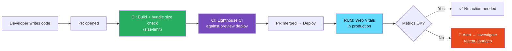

# 111 · Performance Testing

> **Performance testing ensures that the optimizations you build — code splitting, lazy loading, Server Components, caching strategies — are actually working, and that new changes don't silently degrade the metrics that matter to users. Performance regressions are insidious: they're not detected by functional tests, they accumulate gradually (each PR adds 2KB to the bundle, harmless individually but catastrophic collectively), and they compound (a 300ms LCP becomes 800ms after three months of "minor" changes). Performance testing makes these regressions visible and automatable — blocking merges when bundle size exceeds a threshold, failing CI when Lighthouse scores drop, and alerting when production Core Web Vitals degrade below acceptable levels.**

Performance testing spans three surfaces: build-time analysis (bundle size, composition), automated lab measurement (Lighthouse CI, synthetic benchmarks), and production real-user measurement (Core Web Vitals via Next.js analytics or third-party RUM). Each catches different categories of regression and operates at different points in the development cycle.

---

## Table of Contents

- [The Three Performance Testing Surfaces](#the-three-performance-testing-surfaces)
- [Bundle Size Analysis with bundlesize and size-limit](#bundle-size-analysis-with-bundlesize-and-size-limit)
- [Next.js Bundle Analyzer](#nextjs-bundle-analyzer)
- [Lighthouse CI: Automated Lab Performance](#lighthouse-ci-automated-lab-performance)
- [Web Vitals in Next.js](#web-vitals-in-nextjs)
- [Custom Performance Timing with the Performance API](#custom-performance-timing-with-the-performance-api)
- [Playwright Performance Metrics](#playwright-performance-metrics)
- [React Profiler in Tests](#react-profiler-in-tests)
- [Server Response Time Testing](#server-response-time-testing)
- [Performance Budgets and Alerting](#performance-budgets-and-alerting)
- [Architecture Diagrams](#architecture-diagrams)
- [Good Practices](#good-practices)
- [Bad Practices](#bad-practices)
- [Mental Model](#mental-model)
- [Common Misconceptions](#common-misconceptions)
- [Exercises](#exercises)
- [Further Reading](#further-reading)

---

## The Three Performance Testing Surfaces

```
SURFACE 1: BUILD-TIME ANALYSIS (fastest feedback, catches bundle regressions)
  WHEN: during CI, every pull request
  WHAT: total JS/CSS bundle sizes, chunk sizes, dependency sizes
  HOW: bundle analyzer, size-limit, bundlesize
  LATENCY: seconds (part of the build step)
  CATCHES: "we accidentally imported lodash instead of lodash-es,
            tripling the utility bundle size"

SURFACE 2: SYNTHETIC/LAB MEASUREMENT (controlled environment, Lighthouse)
  WHEN: during CI, against a preview deployment
  WHAT: Core Web Vitals (LCP, CLS, FID/INP), accessibility score,
        best practices score — measured in a controlled browser
  HOW: Lighthouse CI, WebPageTest
  LATENCY: minutes (requires a running server, browser simulation)
  CATCHES: "the new hero image increased LCP from 800ms to 2.4s"

SURFACE 3: REAL USER MONITORING (field data, production truth)
  WHEN: continuously in production
  WHAT: actual user Core Web Vitals, by device, connection type, geography
  HOW: Next.js Analytics, Vercel Speed Insights, Datadog RUM, Google CrUX
  LATENCY: hours to days (real user data aggregation)
  CATCHES: "our LCP is 3s on 4G Android but 800ms in our synthetic tests —
            our server-side rendering is slow for mobile users"

ALL THREE ARE NECESSARY:
  Build-time: prevents bundle bloat before it reaches users
  Synthetic: catches rendering performance regressions in CI
  RUM: reveals the actual user experience in production
  No single surface is sufficient.
```

---

## Bundle Size Analysis with bundlesize and size-limit

```bash
# size-limit: the modern choice for bundle size gates
npm install -D @size-limit/preset-big-lib
# or for Next.js apps:
npm install -D size-limit @size-limit/webpack-why
```

```json
// package.json — size-limit configuration
{
  "scripts": {
    "size": "size-limit",
    "size:why": "size-limit --why" // shows which modules contribute to size
  },
  "size-limit": [
    {
      "name": "Main bundle (initial JS)",
      "path": ".next/static/chunks/pages/index-*.js",
      "limit": "120 kB", // gzipped size limit
      "webpack": false // don't re-bundle; analyze Next.js output
    },
    {
      "name": "Shared vendor bundle",
      "path": ".next/static/chunks/framework-*.js",
      "limit": "80 kB"
    },
    {
      "name": "Total initial JS",
      "path": [
        ".next/static/chunks/main-*.js",
        ".next/static/chunks/framework-*.js",
        ".next/static/chunks/pages/index-*.js"
      ],
      "limit": "250 kB"
    }
  ]
}
```

```yaml
# GitHub Actions: size-limit in CI with PR comments
- name: Build Next.js app
  run: npm run build

- name: Run size-limit checks
  uses: andresz1/size-limit-action@v1
  with:
    github_token: ${{ secrets.GITHUB_TOKEN }}
    # This action:
    # 1. Runs size-limit on the current branch
    # 2. Runs size-limit on the base branch
    # 3. Comments on the PR showing the size diff:
    #    | Bundle      | Base    | Current | Diff  |
    #    | Main bundle | 115 kB  | 128 kB  | +13kB ⚠️ |
    # 4. Fails if any limit is exceeded
```

---

## Next.js Bundle Analyzer

```bash
npm install -D @next/bundle-analyzer
```

```js
// next.config.js
const withBundleAnalyzer = require("@next/bundle-analyzer")({
  enabled: process.env.ANALYZE === "true",
  openAnalyzer: true, // automatically open the report in browser
});

module.exports = withBundleAnalyzer({
  // ... rest of next config
});
```

```bash
# Run bundle analysis:
ANALYZE=true npm run build
# → Opens two HTML files:
#   client.html: treemap of all client-side bundles
#   server.html: treemap of all server-side bundles

# WHAT TO LOOK FOR:
# Large unexpected boxes: a module that shouldn't be included at that size
#   e.g., moment.js (300KB) instead of date-fns (5KB for just what you need)
# Duplicate modules: the same module appearing in multiple chunks
#   (often a sign of tree-shaking failure or missing deduplication)
# Large vendor chunks: a single dependency dominating the bundle
# Code-splitting opportunities: large modules that could be lazy-loaded
```

```ts
// Automated bundle composition test — check for known expensive imports:
// scripts/check-bundle.ts
import { execSync } from "child_process";
import * as fs from "fs";

const stats = JSON.parse(
  execSync("ANALYZE=true next build --json 2>/dev/null")
    .toString()
    .split("\n")
    .filter((line) => line.startsWith("{"))
    .join(""),
);

// Check for known expensive modules that shouldn't be in the client bundle:
const BANNED_CLIENT_MODULES = ["moment", "lodash", "@aws-sdk"];

for (const moduleName of BANNED_CLIENT_MODULES) {
  const found = stats.chunks.some((chunk: any) =>
    chunk.modules?.some(
      (m: any) => m.name?.includes(moduleName) && chunk.initial,
    ),
  );

  if (found) {
    console.error(`❌ ${moduleName} found in initial client bundle!`);
    process.exit(1);
  }
}
```

---

## Lighthouse CI: Automated Lab Performance

```bash
npm install -D @lhci/cli
```

```json
// lighthouserc.json — Lighthouse CI configuration
{
  "ci": {
    "collect": {
      "url": [
        "http://localhost:3000/",
        "http://localhost:3000/products",
        "http://localhost:3000/checkout"
      ],
      "numberOfRuns": 3, // run 3 times and take median (reduces variance)
      "settings": {
        "preset": "desktop",
        "formFactor": "desktop",
        "screenEmulation": {
          "mobile": false,
          "width": 1350,
          "height": 940,
          "deviceScaleFactor": 1
        }
      }
    },
    "assert": {
      "preset": "lighthouse:recommended",
      "assertions": {
        // Core Web Vitals:
        "largest-contentful-paint": ["error", { "maxNumericValue": 2500 }],
        "cumulative-layout-shift": ["error", { "maxNumericValue": 0.1 }],
        "total-blocking-time": ["warn", { "maxNumericValue": 300 }],
        "first-contentful-paint": ["warn", { "maxNumericValue": 1800 }],

        // Performance budget:
        "uses-optimized-images": "warn",
        "uses-rel-preconnect": "warn",
        "render-blocking-resources": "error",

        // Accessibility (also caught by axe in E2E — belt and suspenders):
        "color-contrast": "error",
        "image-alt": "error",

        // Best practices:
        "uses-https": "off", // off for localhost testing

        // Override recommended preset for specific audits:
        "bootup-time": ["warn", { "maxNumericValue": 2000 }],
        "interactive": ["warn", { "maxNumericValue": 5000 }]
      }
    },
    "upload": {
      "target": "lhci",
      "serverBaseUrl": "https://your-lhci-server.example.com"
      // OR upload to temporary public storage:
      // "target": "temporary-public-storage"
    }
  }
}
```

```yaml
# GitHub Actions: Lighthouse CI
- name: Build and start Next.js
  run: |
    npm run build
    npm run start &
    npx wait-on http://localhost:3000 --timeout 60000

- name: Run Lighthouse CI
  run: npx lhci autorun
  env:
    LHCI_GITHUB_APP_TOKEN: ${{ secrets.LHCI_GITHUB_APP_TOKEN }}
    # GitHub app token enables PR comments with Lighthouse scores
```

---

## Web Vitals in Next.js

```tsx
// app/layout.tsx — capture Core Web Vitals for analysis
// Next.js has built-in support via next/speed-insights (Vercel)
// or you can use the web-vitals library for custom RUM:

import { SpeedInsights } from "@vercel/speed-insights/next";

export default function RootLayout({
  children,
}: {
  children: React.ReactNode;
}) {
  return (
    <html lang="en">
      <body>
        {children}
        <SpeedInsights /> {/* Vercel's RUM — sends to Vercel Analytics */}
      </body>
    </html>
  );
}
```

```ts
// Custom Web Vitals collection (sends to your own analytics endpoint):
// app/components/WebVitals.tsx
"use client";
import { useReportWebVitals } from "next/web-vitals";

export function WebVitals() {
  useReportWebVitals((metric) => {
    const body = JSON.stringify({
      name: metric.name, // LCP, CLS, FID, TTFB, FCP, INP
      value: metric.value, // the measured value
      id: metric.id, // unique ID for deduplication
      delta: metric.delta, // change from previous report (for updates)
      rating: metric.rating, // 'good' | 'needs-improvement' | 'poor'
      navigationType: metric.navigationType, // 'navigate', 'reload', 'back-forward'
    });

    // Send to your analytics endpoint:
    if (navigator.sendBeacon) {
      navigator.sendBeacon("/api/vitals", body);
    } else {
      fetch("/api/vitals", { method: "POST", body, keepalive: true });
    }
  });

  return null;
}

// app/api/vitals/route.ts — collect and store Web Vitals data:
export async function POST(request: Request) {
  const metric = await request.json();

  // Store in your analytics backend (Datadog, Grafana, custom DB, etc.):
  await analytics.track("web_vital", {
    metric_name: metric.name,
    value: metric.value,
    rating: metric.rating,
    url: request.headers.get("referer"),
    user_agent: request.headers.get("user-agent"),
    timestamp: new Date().toISOString(),
  });

  return new Response(null, { status: 204 });
}
```

---

## Custom Performance Timing with the Performance API

```ts
// Mark and measure specific sections of your application's performance:

// In a React component (client-side):
function ProductGrid({ products }: { products: Product[] }) {
  useEffect(() => {
    // Mark the start of the render:
    performance.mark('product-grid-start');

    return () => {
      // Mark the end (component unmounts or re-renders):
      performance.mark('product-grid-end');
      performance.measure(
        'product-grid-render',
        'product-grid-start',
        'product-grid-end'
      );

      // Log the measurement:
      const [measure] = performance.getEntriesByName('product-grid-render');
      if (measure.duration > 100) {
        console.warn(`ProductGrid render took ${measure.duration.toFixed(1)}ms`);
      }
    };
  }, [products]);

  return <div>{/* ... */}</div>;
}

// In Playwright E2E tests — capture performance marks:
test('product grid renders within 100ms', async ({ page }) => {
  await page.goto('/products');

  // Inject a performance mark BEFORE the action:
  await page.evaluate(() => performance.mark('render-start'));

  // Wait for all products to be visible:
  await page.waitForSelector('[data-testid="product-card"]:nth-child(12)');

  // Measure from the mark to now:
  const renderTime = await page.evaluate(() => {
    performance.mark('render-end');
    performance.measure('render', 'render-start', 'render-end');
    const [m] = performance.getEntriesByName('render');
    return m.duration;
  });

  expect(renderTime).toBeLessThan(100);
});
```

---

## Playwright Performance Metrics

```ts
// Playwright can capture real browser performance metrics:

test("homepage meets Core Web Vitals thresholds", async ({ page }) => {
  // Enable CDP (Chrome DevTools Protocol) for advanced metrics:
  const client = await page.context().newCDPSession(page);
  await client.send("Performance.enable");

  await page.goto("/", { waitUntil: "networkidle" });

  // Get browser performance metrics via CDP:
  const { metrics } = await client.send("Performance.getMetrics");
  const metricsMap = Object.fromEntries(
    metrics.map(({ name, value }) => [name, value]),
  );

  // Check Time to Interactive equivalent:
  const tti = metricsMap.InteractiveTime - metricsMap.NavigationStart;
  expect(tti).toBeLessThan(5000); // 5 seconds max

  // Check total JS heap size (detect memory bloat):
  const jsHeapMB = metricsMap.JSHeapUsedSize / (1024 * 1024);
  expect(jsHeapMB).toBeLessThan(50); // 50MB heap max

  // Check task duration (long tasks block the main thread):
  const taskDuration = metricsMap.TaskDuration;
  expect(taskDuration).toBeLessThan(0.1); // < 100ms of long tasks
});

// Capture LCP using the web-vitals library in the browser context:
test("LCP is under 2500ms", async ({ page }) => {
  let lcpValue: number | null = null;

  await page.addInitScript(() => {
    // Inject a PerformanceObserver to capture LCP:
    new PerformanceObserver((list) => {
      const entries = list.getEntries();
      const lastEntry = entries[entries.length - 1];
      (window as any).__lcpValue = lastEntry.renderTime || lastEntry.loadTime;
    }).observe({ type: "largest-contentful-paint", buffered: true });
  });

  await page.goto("/", { waitUntil: "networkidle" });

  // Allow time for LCP to be reported:
  await page.waitForTimeout(2000);

  lcpValue = await page.evaluate(() => (window as any).__lcpValue);
  expect(lcpValue).toBeLessThan(2500);
});
```

---

## React Profiler in Tests

```tsx
// Use React Profiler to catch render performance regressions
// in component tests — useful for complex interactive components
// like large data grids, virtualized lists, or drag-and-drop UIs:

import { Profiler, ProfilerOnRenderCallback } from "react";
import { render, screen, act } from "@testing-library/react";

test("ProductGrid renders 100 items in under 50ms", () => {
  const renders: { id: string; duration: number }[] = [];

  const onRender: ProfilerOnRenderCallback = (id, phase, actualDuration) => {
    renders.push({ id, duration: actualDuration });
  };

  const products = Array.from({ length: 100 }, (_, i) => ({
    id: `product-${i}`,
    name: `Product ${i}`,
    price: 9.99,
  }));

  render(
    <Profiler id="ProductGrid" onRender={onRender}>
      <ProductGrid products={products} />
    </Profiler>,
  );

  const initialRender = renders.find((r) => r.id === "ProductGrid");
  expect(initialRender?.duration).toBeLessThan(50); // ms
});

test("updating quantity does not cause expensive re-renders", async () => {
  const renders: number[] = [];
  const onRender: ProfilerOnRenderCallback = (_, __, duration) =>
    renders.push(duration);

  const { rerender } = render(
    <Profiler id="Cart" onRender={onRender}>
      <Cart items={mockCartItems} />
    </Profiler>,
  );

  const initialRenderTime = renders[renders.length - 1];

  // Trigger a quantity update:
  rerender(
    <Profiler id="Cart" onRender={onRender}>
      <Cart
        items={[
          { ...mockCartItems[0], quantity: 2 },
          ...mockCartItems.slice(1),
        ]}
      />
    </Profiler>,
  );

  const updateRenderTime = renders[renders.length - 1];
  // Update shouldn't be more expensive than initial render:
  expect(updateRenderTime).toBeLessThan(initialRenderTime * 2);
});
```

---

## Server Response Time Testing

```ts
// Test that your Route Handlers and SSR pages respond within acceptable time:

// Using Playwright to measure server response time:
test("product listing page responds in under 500ms", async ({ page }) => {
  const startTime = Date.now();
  await page.goto("/products", { waitUntil: "domcontentloaded" });
  const ttfb = Date.now() - startTime;

  expect(ttfb).toBeLessThan(500); // 500ms TTFB (Time to First Byte)
});

// Direct Route Handler performance testing (bypasses browser overhead):
test("GET /api/products responds in under 100ms", async () => {
  const start = performance.now();
  const response = await fetch("http://localhost:3000/api/products");
  const duration = performance.now() - start;

  expect(response.status).toBe(200);
  expect(duration).toBeLessThan(100); // API must respond under 100ms
});

// Load testing: measure performance under concurrent requests
// (autocannon or k6 for more thorough load testing):
import autocannon from "autocannon";

test("API can handle 100 concurrent requests", async () => {
  const result = await autocannon({
    url: "http://localhost:3000/api/products",
    connections: 100, // 100 concurrent connections
    duration: 10, // run for 10 seconds
    headers: {
      authorization: "Bearer test-token",
    },
  });

  expect(result.errors).toBe(0);
  expect(result.non2xx).toBe(0);
  // 99th percentile response time under 500ms:
  expect(result.latency.p99).toBeLessThan(500);
});
```

---

## Performance Budgets and Alerting

```json
// performance-budget.json — define your performance budget
{
  "budgets": [
    {
      "path": "/",
      "resourceSizes": [
        { "resourceType": "script", "budget": 150 },
        { "resourceType": "image", "budget": 100 },
        { "resourceType": "stylesheet", "budget": 30 },
        { "resourceType": "total", "budget": 350 }
      ],
      "timings": [
        { "metric": "first-contentful-paint", "budget": 1800 },
        { "metric": "largest-contentful-paint", "budget": 2500 },
        { "metric": "cumulative-layout-shift", "budget": 0.1 },
        { "metric": "total-blocking-time", "budget": 300 }
      ]
    },
    {
      "path": "/products",
      "resourceSizes": [
        { "resourceType": "script", "budget": 200 },
        { "resourceType": "total", "budget": 500 }
      ],
      "timings": [{ "metric": "largest-contentful-paint", "budget": 3000 }]
    }
  ]
}
```

```ts
// GitHub Actions notification when production Web Vitals degrade:
// (triggered by a webhook from your RUM service when metrics cross thresholds)

// alert.ts — post to Slack when LCP exceeds threshold:
async function alertPerformanceDegradation(metric: {
  name: string;
  p75: number;
  threshold: number;
  page: string;
}) {
  await fetch(process.env.SLACK_WEBHOOK_URL!, {
    method: "POST",
    body: JSON.stringify({
      text: [
        `⚠️ *Performance Alert*`,
        `Metric: ${metric.name}`,
        `Page: ${metric.page}`,
        `P75 value: ${metric.p75.toFixed(0)}ms`,
        `Threshold: ${metric.threshold}ms`,
        `Action: Review recent deployments`,
      ].join("\n"),
    }),
  });
}
```

---

## Architecture Diagrams

### Performance testing in the development lifecycle



---

## Good Practices

### ✅ Good Practice — Layered performance testing with meaningful thresholds

```yaml
# A complete performance testing CI pipeline that catches regressions
# at multiple layers with practical thresholds:

name: Performance Testing

on:
  pull_request:
    branches: [main]

jobs:
  bundle-size:
    runs-on: ubuntu-latest
    steps:
      - uses: actions/checkout@v4
      - run: npm ci
      - run: npm run build

      # 1. Bundle size gate (fails PR if limits exceeded):
      - name: Check bundle sizes
        uses: andresz1/size-limit-action@v1
        with:
          github_token: ${{ secrets.GITHUB_TOKEN }}

  lighthouse:
    runs-on: ubuntu-latest
    needs: [bundle-size]
    steps:
      - uses: actions/checkout@v4
      - run: npm ci && npm run build

      - name: Start server
        run: npm run start &

      - name: Wait for server
        run: npx wait-on http://localhost:3000

      # 2. Lighthouse CI (fails PR if LCP/CLS/TBT exceed thresholds):
      - name: Run Lighthouse CI
        uses: treosh/lighthouse-ci-action@v10
        with:
          configPath: "./lighthouserc.json"
          uploadArtifacts: true
          temporaryPublicStorage: true # posts Lighthouse report URL to PR
        env:
          LHCI_GITHUB_APP_TOKEN: ${{ secrets.LHCI_GITHUB_APP_TOKEN }}
```

---

## Bad Practices

### ⚠️ Bad Practice — Measuring performance only in development mode

```ts
/**
 * Bad: Running performance tests against the Next.js development server
 * (`next dev`) instead of a production build (`next build && next start`).
 *
 * next dev:
 * - No minification (all JS is full-size, unminified)
 * - No tree shaking
 * - No bundle splitting optimizations
 * - 3-10x larger bundles than production
 * - Much slower server-side rendering (no React production mode)
 * - All Lighthouse/bundle size metrics are completely meaningless
 *
 * A development-mode Lighthouse score of 40 might be 90 in production.
 * A bundle of 2MB in dev mode might be 200KB in production.
 * Performance measurements against dev mode provide ZERO useful signal.
 */

// ❌ playwright.config.ts — testing against dev server
webServer: {
  command: 'npm run dev',    // ← dev mode: meaningless performance data
  url: 'http://localhost:3000',
},

// ✅ Fix: always build and test production mode for performance tests
webServer: {
  command: 'npm run build && npm run start',  // ← production mode
  url: 'http://localhost:3000',
  timeout: 120_000,  // build takes longer than dev start
},
```

```ts
/**
 * Also bad: Setting performance thresholds based on localhost measurements
 * without accounting for the network throttling that real users experience.
 * A 100ms LCP on localhost (fast SSD, 1Gbps network) might be 3000ms
 * on a 4G mobile connection.
 *
 * Lighthouse CI's "simulated throttling" (the default) approximates
 * a mid-tier 4G connection — don't disable it to make scores "look better."
 */
```

---

## Mental Model

> 💡 **The performance testing mental model:**
>
> Performance testing is like **monitoring the health of a pipeline** — you need gauges at multiple points, not just at the output. Build-time bundle analysis is the **flow meter at the factory** — measuring how much material is being pumped through before it reaches users. Lighthouse CI is the **quality control station** — testing a controlled sample under standardized conditions to detect changes. Production RUM is the **field sensor on the actual pipeline** — measuring what's happening for real users with real networks and real devices. A quality control station finding "everything is fine" while the field sensor shows degradation means something is different about real conditions versus the controlled environment. All three sensors together give you the complete picture — building in only one direction means you're measuring the wrong thing.

---

## Common Misconceptions

### "Lighthouse score of 90+ means the site is performant for all users"

Lighthouse measures a SYNTHETIC EXPERIENCE on a simulated network with a simulated device in a controlled environment. Field data from real users often diverges significantly — mobile users on slow connections, older devices, or geographically distant from your CDN may see 3-5x worse metrics. Lighthouse is a regression detector and baseline, not a user experience guarantee.

### "Bundle size is the only performance metric that matters"

Bundle size determines download time — important, but only one factor. A small bundle with expensive JavaScript parsing, synchronous execution, or hydration that blocks interactivity can feel slower than a moderately larger bundle that's optimally parsed and executed. Total Blocking Time, Time to Interactive, and Interaction to Next Paint measure what users FEEL, not just what they download.

### "Performance tests are only necessary for large applications"

Performance regressions start small — 10KB here, 20ms there — and compound over time. The earlier you establish performance testing, the cheaper it is to maintain. A project with 50 components and a 2MB bundle because no one measured it is much harder to fix than a project that started with size-limit catching every 5KB addition.

### "Higher Lighthouse scores are always achievable without trade-offs"

Some architectural choices (large, rich interactive UIs; real-time data; complex animations) inherently trade off against certain Lighthouse scores. The goal is meeting your specific thresholds for your users' use cases — not chasing a 100 score that requires removing features users actually use. Set your thresholds based on competitive analysis and user experience research, not Lighthouse's generic recommendations.

### "Performance testing in CI is sufficient — no need for RUM"

CI tests against a controlled environment that may not represent your user population. Geographic distribution, device diversity, network conditions, and browser diversity in your actual users all affect real performance. RUM fills the gap between "passes our thresholds in CI" and "users are actually experiencing acceptable performance." Both are necessary.

---

## Exercises

### Exercise 1 — Set up bundle size gates

1. Install `size-limit` in a Next.js project
2. Run `npm run build` and measure the current bundle sizes
3. Set realistic limits (start with current sizes + 10% buffer)
4. Add a GitHub Action that comments bundle size diffs on PRs
5. Intentionally add a large dependency (e.g., `moment`) and verify it fails the gate

### Exercise 2 — Configure Lighthouse CI

1. Install `@lhci/cli` and create a `lighthouserc.json`
2. Configure thresholds: LCP < 2500ms, CLS < 0.1, TBT < 300ms
3. Add Lighthouse CI to your GitHub Actions workflow
4. Submit a PR that introduces a render-blocking resource and verify Lighthouse CI flags it

### Exercise 3 — Implement Web Vitals collection

1. Add `useReportWebVitals` to your Next.js layout
2. Create a `/api/vitals` route that logs the metrics
3. Navigate through your application and observe the Web Vitals logged in the server console
4. Identify which pages have the worst LCP and investigate why

---

## Further Reading

- [web.dev: Core Web Vitals](https://web.dev/explore/learn-core-web-vitals) — the definitive guide to the metrics and their thresholds
- [Lighthouse CI documentation](https://github.com/GoogleChrome/lighthouse-ci) — setup and configuration
- [size-limit documentation](https://github.com/ai/size-limit) — bundle size gates with detailed reporting
- [Next.js docs: Web Vitals](https://nextjs.org/docs/app/api-reference/functions/use-report-web-vitals) — Next.js's useReportWebVitals hook
- [web-vitals library](https://github.com/GoogleChrome/web-vitals) — Google's Core Web Vitals measurement library
- [WebPageTest](https://www.webpagetest.org/) — free, powerful performance testing with real browsers worldwide
- Related in this handbook: [72 · React Profiler](../performance/01-react-profiler.md), [76 · Bundle Optimization](../performance/05-bundle-optimization.md)

---

_Part of the [React + Next.js Engineering Handbook](../../README.md)_
